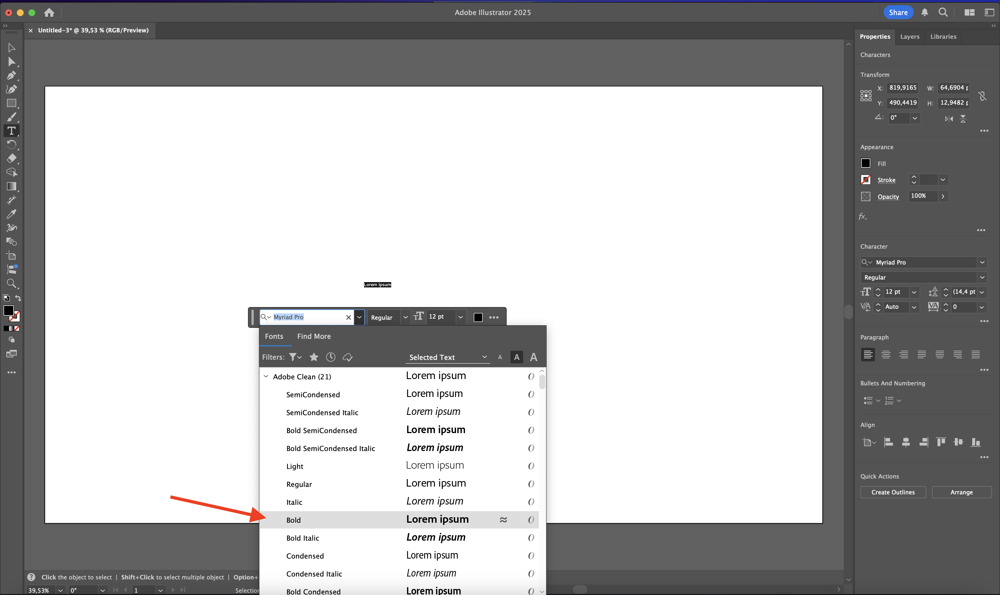
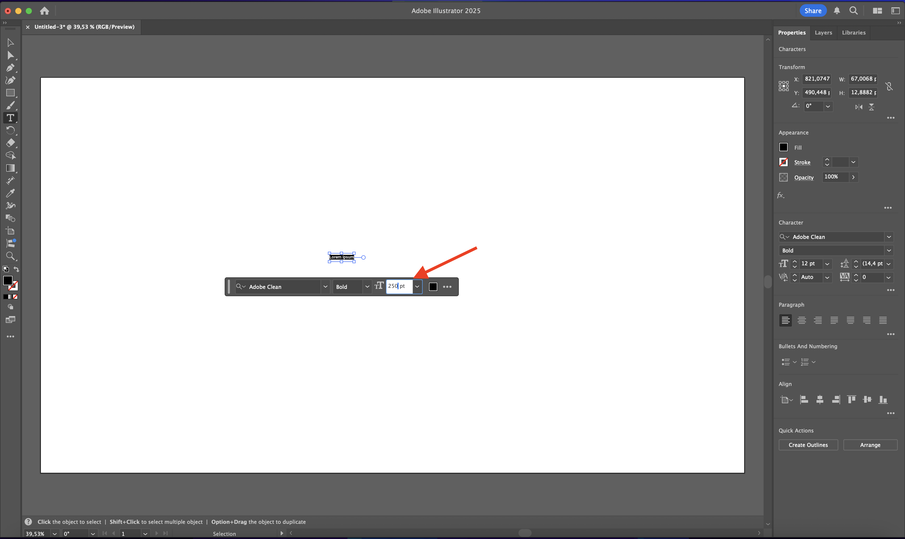
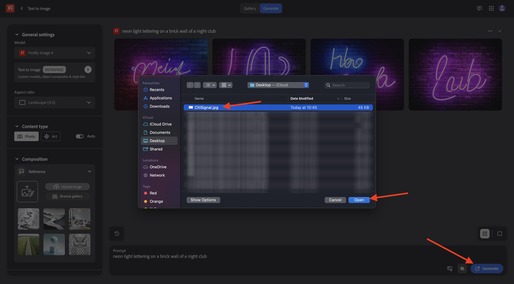
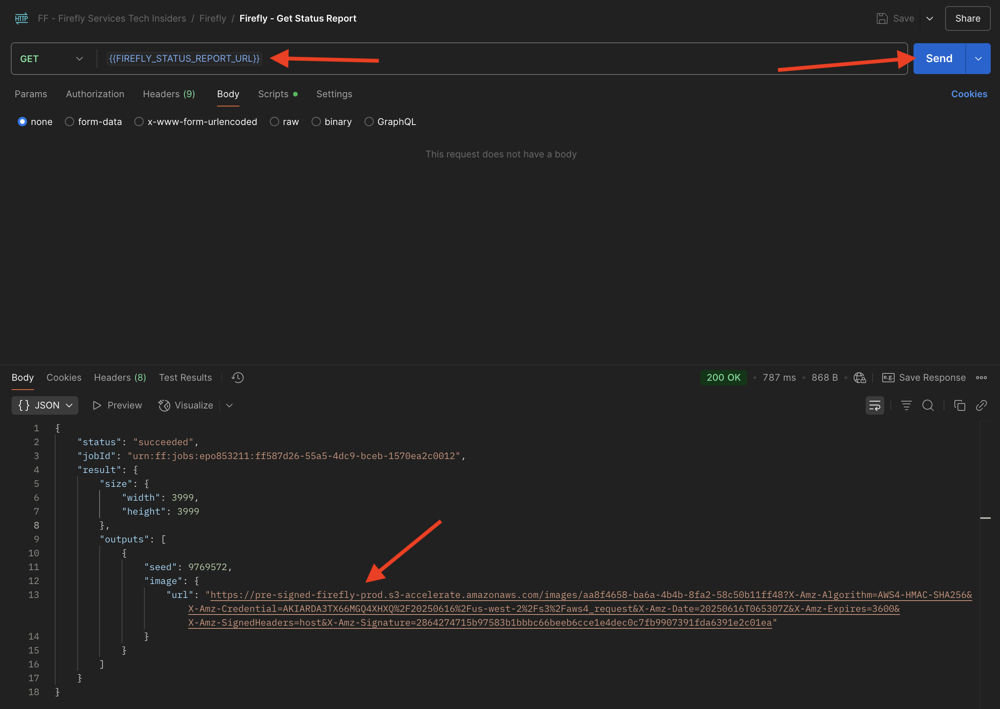

# 1.1.1 Introducción a Firefly Services

Aprenda a utilizar Postman y Adobe I/O para consultar las API de Adobe Firefly Services.

## 1.1.1.1 requisitos previos

Antes de continuar con este ejercicio, debes haber completado la configuración de [tu proyecto de Adobe I/O](./../../../modules/getting-started/gettingstarted/ex6.md), y también debes haber configurado una aplicación para interactuar con las API, como [Postman](./../../../modules/getting-started/gettingstarted/ex7.md) o [PostBuster](./../../../modules/getting-started/gettingstarted/ex8.md).

## 1.1.1.2 Explorar firefly.adobe.com - fase 1

Empecemos a explorar Adobe Firefly Services. Para la exploración, comience con un ejemplo de generación de imágenes de CitiSignal. El equipo de diseño de CitiSignal desea generar una versión en neón del nombre de la marca CitiSignal. Les gustaría usar Adobe Firefly Services para ello.

Lo primero que se necesita para lograrlo, es una versión en blanco y negro del nombre de la marca CitiSignal, algo que se ve así:


### 1.1.1.2.1 Crear su imagen de referencia de composición

Puede usar [esta imagen de muestra](./images/CitiSignal.jpg) o crear su propio texto para experimentar. Siga los siguientes pasos en Adobe Illustrator para crear su propio archivo de imagen. Si decide utilizar la imagen predefinida, omita la siguiente sección y vaya al paso **1.1.1.2.2 Genere la imagen** directamente.

Abra **Adobe Illustrator**. Haga clic en **Nuevo archivo**.


Seleccione **Web-Large de 1920 x 1080 px**. Haga clic en **Crear**.


Entonces deberías tener esto. Haga clic en el icono de texto **T**.


Entonces deberías tener esto.


Cambie el tipo de fuente a la fuente que desee, en este caso el tipo de fuente es **Adobe Clean Bold**.



Cambie el tamaño de fuente a un tamaño de su elección, en este caso **250 pt**.



Entonces deberías tener esto.


Cambie el texto como desee, en este caso **CitiSignal**.


Centra el texto en el archivo.


Vaya a **Archivo > Exportar > Guardar para la web (heredado)**


Entonces deberías tener esto. Haga clic en **Guardar**.


Asigne un nombre al archivo y guárdelo en el escritorio. Haga clic en **Guardar**.


### 1.1.1.2.2 Generar su imagen

Vaya a [https://firefly.adobe.com](https://firefly.adobe.com). Haz clic en el icono **perfil** y asegúrate de haber iniciado sesión en la **cuenta** correcta, que debería ser `--aepImsOrgName--`. Si es necesario, haga clic en **Cambiar perfil** para cambiar a esa cuenta.


Escriba la solicitud `neon light lettering on a brick wall of a night club`. Haga clic en **Generar**.


Entonces debería tener algo similar a esto. Estas imágenes aún no son útiles. En **Composición**, haga clic en **Cargar imagen**.


Seleccione la imagen que creó anteriormente, en este caso **CitiSignal.jpg**. Haga clic en **Abrir** y, a continuación, haga clic en **Generar**.



Entonces debería tener algo similar a esto. La aplicación de la referencia de composición aún no es buena. Para cambiar eso, cambie el control deslizante **Strength** al valor máximo. Vuelva a hacer clic en **Generar**.


Ahora tiene varias imágenes que muestran una versión en neón del nombre de la marca CitiSignal, que puede utilizar para iterar más.


Ahora ha aprendido a utilizar Firefly para solucionar un problema de diseño en cuestión de minutos.

## 1.1.1.3 Explorar firefly.adobe.com - fase 2

Vaya a [https://firefly.adobe.com/generate/image](https://firefly.adobe.com/generate/image). Entonces debería ver esto. Haga clic en la lista desplegable **Modelo**. Verá que hay 3 versiones disponibles de Adobe Firefly Services:

- Imagen de Firefly 3
- Imagen de Firefly 4
- Firefly Image 4 Ultra


>[!NOTE]
>
>Firefly Image 3 e Image 4 están disponibles para todos los que utilizan Adobe Firefly Services, mientras que Firefly Image 4 Ultra requiere una licencia de Firefly Pro.

Haga clic para seleccionar **Imagen de Firefly 3** para este ejercicio.


Escriba el mensaje `Horses in a field` y haga clic en **Generar**.


Entonces debería ver algo similar a esto.


A continuación, abre **Herramientas para desarrolladores** en tu navegador.


Entonces debería ver esto. Vaya a la ficha **Red**. A continuación, haga clic de nuevo en **Generar**.


Escriba el término de búsqueda **generate-async**. Debería ver una solicitud con el nombre **generate-async**. Selecciónelo y luego ve a **Carga** donde verás los detalles de la solicitud.


La solicitud que está viendo aquí es la solicitud que se envía al servidor back-end de Firefly Services. Contiene varios parámetros importantes:

- **prompt**: Este es su prompt, solicitando qué tipo de imagen debe generar Firefly

- **seed**: En esta solicitud, las semillas se generaron de forma aleatoria. Siempre que Firefly genera una imagen, comienza el proceso de forma predeterminada seleccionando un número aleatorio denominado semilla. Este número aleatorio contribuye a lo que hace que cada imagen sea única, lo que es genial cuando desea generar una amplia variedad de imágenes. Sin embargo, puede haber ocasiones en que desee generar imágenes similares entre sí en varias solicitudes. Por ejemplo, cuando Firefly genera una imagen que desea modificar con otras opciones de Firefly (como ajustes preestablecidos de estilo, imágenes de referencia, etc.), utilice la semilla de esa imagen en solicitudes HTTP futuras para limitar la aleatoriedad de imágenes futuras y centrarse en la imagen que desee.


Vuelva a consultar la interfaz de usuario. Cambie **Proporción de aspecto** a **Pantalla panorámica (16:9)**.


Desplácese hacia abajo hasta **Efectos**, vaya a **Temas** y seleccione un efecto como **Art Deco**.


Asegúrese de que **Herramientas para desarrolladores** aún esté abierto en el explorador. A continuación, haga clic en **Generar** e inspeccione la solicitud de red que se está enviando.


Al inspeccionar los detalles de la solicitud de red, ahora verá lo siguiente:

- **prompt** no ha cambiado en comparación con la solicitud anterior
- **semillas** han cambiado en comparación con la solicitud anterior
- **tamaño** ha cambiado, según el cambio en **Proporción de aspecto**.
- Se han agregado **estilos** y tiene una referencia al efecto **art_deco** que seleccionó


Para el siguiente ejercicio, tendrás que usar uno de los números **seed**. Anote un número semilla de su elección.

>[!NOTE]
>
>Los números semilla son números aleatorios que se eligen al hacer clic en **Generar**. Si desea tener una apariencia coherente en la imagen generada en varias solicitudes **Generate**, es importante recordar y especificar el **número semilla** que elija en solicitudes futuras.

En el siguiente ejercicio hará cosas similares con Firefly Services, pero utilizando la API en lugar de la interfaz de usuario. En este ejemplo, el número de semilla es **142194** para la primera imagen, que tiene 2 caballos mirándose unos a otros con sus cabezas mirando hacia otros.

## 1.1.1.4 Adobe I/O - access_token

En la colección **Adobe IO - OAuth**, seleccione la solicitud **POST - Obtener token de acceso** y seleccione **Enviar**. La respuesta debe contener un nuevo **accestoken**.


## 1.1.1.5 API de Firefly Services, Texto 2 Imagen, Imagen 3

Ahora que tiene un access_token válido y nuevo, está listo para enviar su primera solicitud a las API de Firefly Services.

Seleccione la solicitud **POST - Firefly - T2I V3** de la colección **FF - Firefly Services Tech Insiders**. Vaya a **Body** y verifique el indicador. Haga clic en **Enviar**.

La solicitud que está usando aquí es una solicitud **sincrónica**, la cual le proporciona una respuesta que contiene la imagen solicitada en unos segundos.

>[!NOTE]
>
>Con el lanzamiento de Firefly Image 4 y Image 4 Ultra, las solicitudes sincrónicas quedarán obsoletas y pasarán a ser solicitudes asincrónicas. Encontrará ejercicios sobre solicitudes asincrónicas más adelante en este tutorial.


Copie (o haga clic) en la dirección URL de la imagen de la respuesta y ábrala en el explorador web para ver la imagen.


Debería ver una imagen hermosa que represente a `horses in a field`.


En el **Cuerpo** de su solicitud **POST - Firefly - T2I V3**, agregue lo siguiente bajo el campo `"promptBiasingLocaleCode": "en-US"` y reemplace la variable `XXX` por uno de los números semilla que la interfaz de usuario de Firefly Services utilizó aleatoriamente. En este ejemplo, el número **seed** es `142194`.

```json
,
  "seeds": [
    XXX
  ]
```

Haga clic en **Enviar**. A continuación, recibirá una respuesta con una nueva imagen generada por Firefly Services. Abra la imagen para verla.


Entonces debería ver una nueva imagen con ligeras diferencias, basada en la **semilla** que se utilizó. La semilla `142194` tenía 2 caballos mirándose el uno al otro con sus cabezas mirando hacia el otro.


A continuación, en **Body** de su solicitud **POST - Firefly - T2I V3**, pegue el siguiente objeto **styles** debajo del objeto **seed**. Esto cambiará el estilo de la imagen generada a **art_deco**.

```json
,
  "contentClass": "art",
  "styles": {
    "presets": [
      "art_deco"
    ],
    "strength": 50
  }
```

Entonces deberías tener esto. Haga clic en **Enviar**.


Haga clic en la dirección URL de la imagen para abrirla.


La imagen ha cambiado un poco. Al aplicar ajustes preestablecidos de estilo, la imagen semilla ya no se aplica del mismo modo que antes. En general, con IA generativa, es muy difícil garantizar que la misma combinación de parámetros de entrada lleve a que se genere la misma imagen.


Elimine el código del objeto **seed** del **cuerpo** de su solicitud. Haga clic en **Enviar** y, a continuación, haga clic en la URL de la imagen que obtiene de la respuesta.

```json
,
  "seeds": [
    XXX
  ]
```


La imagen ha cambiado un poco de nuevo.


## 1.1.1.6 API de Firefly Services, Gen Expand

Seleccione la solicitud **POST - Firefly - Gen Expand** de la colección **FF - Firefly Services Tech Insiders** y vaya al **Cuerpo** de la solicitud.

- **size**: escriba la resolución que desee. El valor introducido aquí debe ser mayor que el tamaño original de la imagen y no puede ser superior a 3999.
- **image.source.url**: este campo necesita un vínculo a la imagen que debe expandirse. En este ejemplo, se utiliza una variable para hacer referencia a la imagen generada en el ejercicio anterior.

- **alineación horizontal**: Los valores aceptados son: `"center"`,`"left`, `"right"`.
- **alineación vertical**: Los valores aceptados son: `"center"`,`"top`, `"bottom"`.


Haga clic en la URL de la imagen que forma parte de la respuesta.



Ahora verá que la imagen generada en el ejercicio anterior se ha ampliado a la resolución de 3999x3999.


Al cambiar la alineación de la posición, la salida también será ligeramente diferente. En este ejemplo, la ubicación se cambia a **left, bottom**. Haga clic en **Enviar** y, a continuación, haga clic en para abrir la dirección URL de la imagen generada.


A continuación, debe ver que la imagen original se utiliza en una ubicación diferente, lo que influye en toda la imagen.


## 1.1.1.7 API de Firefly Services, imagen de texto 2, imagen 4 e imagen 4 Ultra

### 1.1.1.7.1 image4_standard

Seleccione la solicitud **POST - Firefly - T2I V4** de la colección **FF - Firefly Services Tech Insiders** y vaya a los **Encabezados** de la solicitud.

Verá que la dirección URL de la solicitud es diferente de la solicitud **API de Firefly Services, texto 2, imagen 3**, que era **https://firefly-api.adobe.io/v3/images/generate**. Esta dirección URL apunta a **https://firefly-api.adobe.io/v3/images/generate-async**. La adición de **-async** en la dirección URL significa que está usando el extremo asincrónico.

En las variables **Header** verá una nueva variable llamada **x-model-version**. Se trata de un encabezado obligatorio al interactuar con Firefly Image 4 e Image 4 Ultra. Para usar Firefly Image 4 o Image 4 Ultra al generar imágenes, el valor del encabezado debe establecerse en `image4_standard` o `image4_ultra`. En este ejemplo, se usa `image4_standard`.


Vaya a **Cuerpo** de la solicitud. Hay que ver que en el cuerpo se están solicitando 4 variaciones de imágenes. La solicitud no ha cambiado desde antes y sigue pidiendo que se generen **caballos en un campo**. Haga clic en **Enviar**


A continuación, obtendrá una respuesta inmediata. A diferencia de la solicitud sincrónica anterior que utilizó, esta respuesta no contiene direcciones URL de imagen de imágenes generadas. Contiene una dirección URL del informe de estado del trabajo que ha iniciado y contiene otra dirección URL que le permite cancelar el trabajo en ejecución.


Para comprobar el informe de estado del trabajo en ejecución, seleccione la solicitud **GET - Firefly - Obtener informe de estado** de la colección **FF - Firefly Services Tech Insiders**. Haga clic para abrirlo y luego haga clic en **Enviar**.


A continuación, verá el informe de estado del trabajo de generación de imágenes que acaba de iniciar. Compruebe el campo **status**, ya que se puede establecer en **running**, lo que significa que el trabajo aún no se ha completado. En este ejemplo, el estado del trabajo se establece en **correcto**, lo que significa que las imágenes solicitadas se han generado.


Desplácese un poco hacia abajo en la respuesta y verá un total de 4 variaciones de imágenes devueltas por Adobe Firefly Services. Haga clic en (o copie) la dirección URL de una de las imágenes y ábrala en el explorador.


Debería ver una imagen hiperrealista de **caballos en un campo**.


### 1.1.1.7.2 image4_ultra

Vuelva a la solicitud **POST - Firefly - T2I V4** de la colección **FF - Firefly Services Tech Insiders** y vaya a los **Encabezados** de la solicitud.

Cambie la variable **x-model-version** a `image4_ultra`. En este ejemplo, se usa `image4_standard`.


Vaya a **Cuerpo** de la solicitud. En el cuerpo, cambie el número de variaciones de imagen a 1 como con Firefly Image 4 Ultra, solo se puede generar 1 imagen al mismo tiempo. La solicitud no ha cambiado desde antes y sigue pidiendo que se generen **caballos en un campo**. Haga clic en **Enviar**


La respuesta de nuevo contiene una URL del informe de estado del trabajo que ha iniciado y otra URL que le permite cancelar el trabajo en ejecución.


Para comprobar el informe de estado del trabajo en ejecución, seleccione la solicitud **GET - Firefly - Obtener informe de estado** de la colección **FF - Firefly Services Tech Insiders**. Haga clic para abrirlo y luego haga clic en **Enviar**.


A continuación, verá el informe de estado del trabajo de generación de imágenes que acaba de iniciar. Compruebe el campo **status**, ya que se puede establecer en **running**, lo que significa que el trabajo aún no se ha completado. En este ejemplo, el estado del trabajo se establece en **correcto**, lo que significa que las imágenes solicitadas se han generado.


Debería ver una imagen hiperrealista de **caballos en un campo**.


## Pasos siguientes

Vaya a [Optimizar el proceso de Firefly mediante Microsoft Azure y las direcciones URL prefirmadas](./ex2.md){target="_blank"}

Volver a [Información general de Adobe Firefly Services](./firefly-services.md){target="_blank"}

Volver a [Todos los módulos](./../../../overview.md){target="_blank"}
