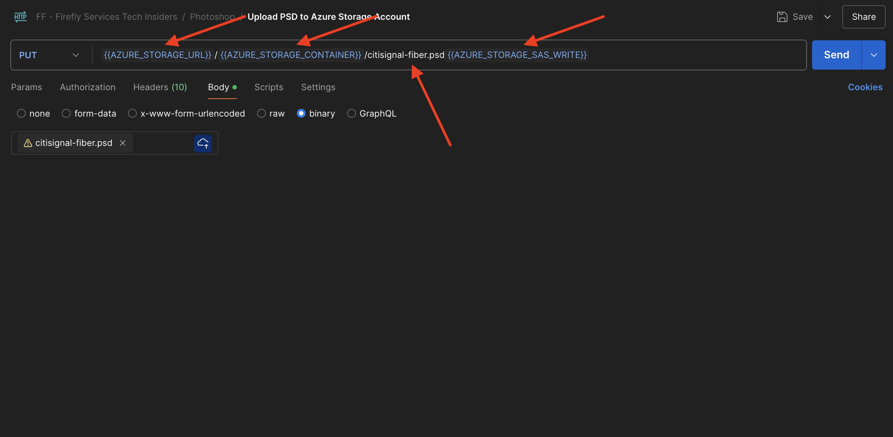
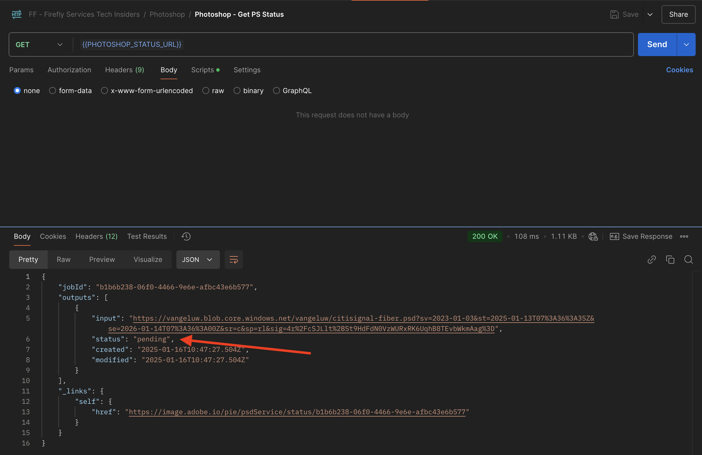

# 1.1.3 Uso de las API de Photoshop

Aprenda a trabajar con las API de Photoshop y Firefly Services.

## 1.1.3.1 requisitos previos

Antes de continuar con este ejercicio, debes haber completado la configuración de [tu proyecto de Adobe I/O](./../../../modules/getting-started/gettingstarted/ex6.md), y también debes haber configurado una aplicación para interactuar con las API, como [Postman](./../../../modules/getting-started/gettingstarted/ex7.md) o [PostBuster](./../../../modules/getting-started/gettingstarted/ex8.md).

## 1.1.3.2 Adobe I/O - access_token

En la colección **Adobe IO - OAuth**, seleccione la solicitud **POST - Obtener token de acceso** y seleccione **Enviar**. La respuesta debe contener un nuevo **accestoken**.


## 1.1.3.3: interactuar mediante programación con un archivo de PSD

Descargue [citisignal-fiber.psd](./../../../assets/ff/citisignal-fiber.psd){target="_blank"} en su escritorio.

Abra **citisignal-fiber.psd** en Photoshop.


En el panel **Capas**, el diseñador del archivo ha asignado un nombre único a cada capa. Puede ver la información de la capa abriendo el archivo PSD en Photoshop, pero también puede hacerlo mediante programación.

Enviemos su primera solicitud de API a las API de Photoshop.

### API de Photoshop: Hello World

A continuación, saludemos a las API de Photoshop para comprobar si todos los permisos y accesos están correctamente configurados.

En la colección **Photoshop**, abra la solicitud **Photoshop Hello (Autenticación de prueba).**. Seleccione **Enviar**.


Debería recibir la respuesta **Bienvenido a la API de Photoshop!**.


A continuación, para interactuar mediante programación con el archivo PSD **citisignal-fiber.psd**, debe cargarlo en su cuenta de almacenamiento. Puede hacerlo manualmente (arrastrándolo y soltándolo en el contenedor mediante el Explorador de almacenamiento de Azure), pero esta vez debe hacerlo a través de la API.

### Cargar PSD en Azure

En Postman, abra la solicitud **Cargar PSD a la cuenta de almacenamiento de Azure**. En el ejercicio anterior configuró estas variables de entorno en Postman, que ahora utilizará:

- `AZURE_STORAGE_URL`
- `AZURE_STORAGE_CONTAINER`
- `AZURE_STORAGE_SAS_READ`
- `AZURE_STORAGE_SAS_WRITE`

Como puede ver en la solicitud **Cargar PSD a la cuenta de almacenamiento de Azure**, la dirección URL está configurada para utilizar estas variables.



En **Cuerpo**, seleccione el archivo **citisignal-fiber.psd**.


La pantalla debería tener un aspecto similar al siguiente. Seleccione **Enviar**.


Debe recuperar esta respuesta vacía de Azure, lo que significa que el archivo se almacena en el contenedor de su cuenta de almacenamiento de Azure.


Si utiliza el Explorador de almacenamiento de Azure para ver el archivo, asegúrese de actualizar la carpeta.


### API de Photoshop: Obtener manifiesto

A continuación, debe obtener el archivo de manifiesto del archivo PSD.

En Postman, abra la solicitud **Photoshop - Obtener manifiesto de PSD**. Ir a **Cuerpo**.

El cuerpo debería tener un aspecto similar al siguiente:

```json
  {
    "inputs": [
      {
        "storage": "external",
        "href": "{{AZURE_STORAGE_URL}}/{{AZURE_STORAGE_CONTAINER}}/citisignal-fiber.psd{{AZURE_STORAGE_SAS_READ}}"
      }
    ],
    "options": {
      "thumbnails": {
        "type": "image/jpeg"
      }
    }
  }
```

Seleccione **Enviar**.

En la respuesta, ahora verá un vínculo. Como las operaciones en Photoshop a veces pueden tardar algún tiempo en completarse, Photoshop proporciona un archivo de estado como respuesta a la mayoría de las solicitudes entrantes. Para comprender lo que sucede con su solicitud, debe leer el archivo de estado.


Para leer el archivo de estado, abra la solicitud **Photoshop - Obtener estado de PS**. Puede ver que esta solicitud usa una variable como dirección URL, que es una variable establecida por la solicitud anterior que envió, **Photoshop - Obtener manifiesto de PSD**. Las variables se establecen en **Scripts** de cada solicitud. Seleccione **Enviar**.


La pantalla debería tener un aspecto similar al siguiente. Actualmente, el estado está establecido en **pendiente**, lo que significa que el proceso aún no ha finalizado.



Seleccione enviar un par de veces más en **Photoshop - Obtener estado de PS**, hasta que el estado cambie a **correcto**. Esto puede tardar un par de minutos.

Cuando la respuesta esté disponible, podrá ver que el archivo json contiene información sobre todas las capas del archivo PSD. Esta información es útil, ya que se pueden identificar cosas como el nombre o el ID de la capa.


Por ejemplo, busque el texto `2048x2048-cta`. La pantalla debería tener un aspecto similar al siguiente:


### API de Photoshop: reemplazo de SmartObject

A continuación, debe cambiar el fondo del archivo citisignal-fiber.psd utilizando la imagen que generó con Firefly en uno de los ejercicios anteriores.

En Postman, abra la solicitud **Photoshop - SmartObject Replace** y vaya a **Body**.

La pantalla debería tener un aspecto similar al siguiente:

- primero, se especifica un archivo de entrada: `citisignal-fiber.psd`
- segundo, se especifica la capa que se va a cambiar, con el nuevo archivo de fondo que se va a utilizar
- tercero, se especifica un archivo de salida: `citisignal-fiber-replacedbg.psd`

```json
  {
    "inputs": [
        {
            "storage": "azure",
            "href": "{{AZURE_STORAGE_URL}}/{{AZURE_STORAGE_CONTAINER}}/citisignal-fiber.psd{{AZURE_STORAGE_SAS_READ}}"
        }
    ],
    "options": {
        "layers": [
            {
                "name": "2048x2048-image",
                "input": {
                    "href": "{{FIREFLY_COMPLETED_ASSET_URL}}",
                    "storage": "external"
                }
            }
        ]
    },
    "outputs": [
        {
            "storage": "azure",
            "href": "{{AZURE_STORAGE_URL}}/{{AZURE_STORAGE_CONTAINER}}/citisignal-fiber-replacedbg.psd{{AZURE_STORAGE_SAS_WRITE}}",
            "type": "vnd.adobe.photoshop",
            "overwrite": true
        }
    ]
}
```

El nombre del archivo de salida es distinto porque no se desea reemplazar el archivo de entrada original.

Seleccione **Enviar**.


Al igual que antes, la respuesta contiene un vínculo que apunta al archivo de estado que realiza un seguimiento del progreso.


Para leer el archivo de estado, abre la solicitud **Photoshop - Obtener estado de PS** y selecciona **Enviar**. Si el estado no se establece en **correcto** inmediatamente, espere un par de segundos y, a continuación, seleccione **Enviar** de nuevo.

Seleccione la URL para descargar el archivo de salida.


Abra **citisignal-fiber-replacedbg.psd** después de descargar el archivo en el equipo. Debería ver que la imagen de fondo ha cambiado a una imagen similar como la siguiente:


También puede ver este archivo en el contenedor mediante el Explorador de almacenamiento de Azure.


### API de Photoshop: Cambiar texto

A continuación, debe cambiar el texto de call to action mediante las API.

En Postman, abra la solicitud **Photoshop - Cambiar texto** y vaya a **Cuerpo**.

La pantalla debería tener un aspecto similar al siguiente:

- en primer lugar, se especifica un archivo de entrada: `citisignal-fiber-replacedbg.psd`, que es el archivo generado en el paso anterior cuando cambió la imagen de fondo
- segundo, se especifica la capa que se va a cambiar, con el texto al que se va a cambiar
- tercero, se especifica un archivo de salida: `citisignal-fiber-changed-text.psd`

```json
  {
  "inputs": [
    {
      "storage": "external",
      "href": "{{AZURE_STORAGE_URL}}/{{AZURE_STORAGE_CONTAINER}}/citisignal-fiber-replacedbg.psd{{AZURE_STORAGE_SAS_READ}}"
    }
  ],
  "options": {
    "layers": [
      {
        "name": "2048x2048-cta",
        "text": {
          "content": "Get Fiber now!"
        }
      }
    ]
  },
  "outputs": [
    {
      "storage": "azure",
      "href": "{{AZURE_STORAGE_URL}}/{{AZURE_STORAGE_CONTAINER}}/citisignal-fiber-changed-text.psd{{AZURE_STORAGE_SAS_WRITE}}",
      "type": "vnd.adobe.photoshop",
      "overwrite": true
    }
  ]
}
```

El nombre del archivo de salida es distinto porque no se desea reemplazar el archivo de entrada original.

Seleccione **Enviar**.


Al igual que antes, la respuesta contiene un vínculo que apunta al archivo de estado que realiza un seguimiento del progreso.


Para leer el archivo de estado, abre la solicitud **Photoshop - Obtener estado de PS** y selecciona **Enviar**. Si el estado no se establece en **correcto** inmediatamente, espere un par de segundos y, a continuación, seleccione **Enviar** de nuevo.

Seleccione la URL para descargar el archivo de salida.


Abra **citisignal-fiber-changed-text.psd** después de descargar el archivo en el equipo. Debería ver que el marcador de posición del call to action se ha reemplazado con el texto **Obtener fibra ahora!**.


También puede ver este archivo en el contenedor mediante el Explorador de almacenamiento de Azure.


## Pasos siguientes

Ir a [API de modelos personalizados de Firefly](./ex4.md){target="_blank"}

Volver a [Información general de Adobe Firefly Services](./firefly-services.md){target="_blank"}

Volver a [Todos los módulos](./../../../overview.md){target="_blank"}