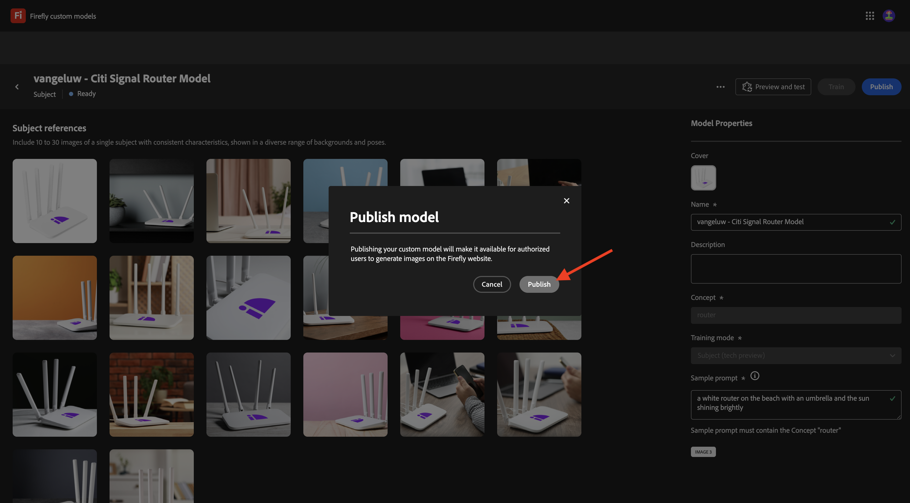

# API de modelos personalizados de Firefly 1.1.4

## 1.1.4.1 ¿Qué son los modelos personalizados de Firefly?

Con los modelos personalizados de Firefly, puede generar variaciones de imagen que se alineen con su marca mediante la función Texto a imagen. Al entrenar estos modelos con sus propias imágenes, puede generar contenido que refleje la identidad de su marca.
Transforme su estilo o tema para explorar nuevas ideas, visualizar diferentes entornos, generar contenido innovador y adaptar el contenido a segmentos específicos.

Con los modelos personalizados de Firefly puede...

- Crear ideas y conceptos de marca
- Producir temas de caracteres con estilos coherentes
- Cree estilos de marca coherentes para ampliar rápidamente las campañas

Para conseguirlo, los modelos personalizados de Firefly admiten:

- Modelos de asunto personalizados
- Modelos de estilo personalizados

### Modelos de asunto personalizados

Al entrenar modelos personalizados sobre un tema específico, ya sean objetos o caracteres, el objetivo es identificar las características esenciales del sujeto y ayudar al modelo a replicarlas en varios contextos y posiciones.

Busque imágenes con las siguientes características al entrenar un modelo de sujeto:

- Coherencia de objetos: proporcione imágenes de la misma marca y modelo que el sujeto, asegurándose al mismo tiempo de que el sujeto no se vea muy diferente en las imágenes. Evite mezclar varios colores y asegúrese de que haya un tema o motivo común entre las imágenes. Sin embargo, el sujeto puede variar entre escenas, poses, ropa y fondo.
- Foco del objeto: utiliza imágenes del sujeto enfocado de forma clara sin distracciones innecesarias. Mantenga el sujeto cerca del centro de la imagen y asegúrese de que ocupa al menos el 25% del área de la imagen.
- Contexto ambiental: Proporcionar imágenes del sujeto en diferentes vistas y contextos, mostrándolo en una variedad de condiciones de iluminación. Aunque se pueden utilizar imágenes con fondos blancos o transparentes, lo mejor es mezclarse también con entornos más complejos.
- Evitar otros objetos: Evite los elementos grandes en el fondo o asociados con el carácter. El modelo memoriza cualquier elemento de gran tamaño que se muestre en las imágenes y aparece en las imágenes generadas, de forma similar al mismo elemento del conjunto de datos de aprendizaje.

### Modelos de estilo personalizados

Los modelos personalizados formados en un estilo identificarán el aspecto de los recursos para generar imágenes similares cuando se le solicite.

Para entrenar un modelo de estilo efectivo:

- Proporcionar una estética similar: incluye imágenes que muestran varias escenas y objetos al mismo tiempo que mantienen la misma apariencia.
- Usar varias imágenes: utilice tantas imágenes como pueda para evitar que el modelo se centre demasiado en objetos o temas no deseados.
- Evite frases fijas: Un patrón fijo tiene un peso mayor que otras frases. Por ejemplo, si cada pie de ilustración contiene &quot;El fondo es negro sólido&quot; o &quot;estilos de dibujos animados bonitos&quot;, el modelo dependerá de esta frase y cualquier mensaje de prueba sin él no generará los resultados deseados.

## 1.1.4.2 Configurar el modelo personalizado

Vaya a [https://firefly.adobe.com/](https://firefly.adobe.com/). Haga clic en **Modelos personalizados**.

{zoomable="yes"}

Puede ver este mensaje. Si lo hace, haga clic en **Aceptar** para continuar.

{zoomable="yes"}

Entonces debería ver esto. Haga clic en **Entrenar un modelo**.

{zoomable="yes"}

Configure los campos siguientes:

- **Nombre**: use `--aepUserLdap-- - Citi Signal Router Model`
- **Modo de entrenamiento**: seleccione **Asunto (vista previa técnica)**
- **Concepto**: escriba `router`
- **Guardar en**: abre la lista desplegable y haz clic en **+ Crear nuevo proyecto**

{zoomable="yes"}

Asigne un nombre al nuevo proyecto: `--aepUserLdap-- - Custom Models`. Haga clic en **Crear**.

{zoomable="yes"}

Entonces debería ver esto. Haga clic en **Crear**.

{zoomable="yes"}

Ahora debe proporcionar las imágenes de referencia para que se pueda entrenar el modelo personalizado. Haz clic en **Seleccionar imágenes de tu equipo**.

{zoomable="yes"}

Descargue las imágenes de referencia [aquí](https://tech-insiders.s3.us-west-2.amazonaws.com/CitiSignal_router.zip). Descomprima el archivo de descarga, que le proporcionará esto.

{zoomable="yes"}

Vaya a la carpeta que contiene los archivos de imagen descargados. Seleccione todos y haga clic en **Abrir**.

{zoomable="yes"}

A continuación, verá que las imágenes se están cargando.

{zoomable="yes"}

Después de un par de minutos, las imágenes se cargan correctamente. Es posible que vea que algunas imágenes tienen un error, debido a que el pie de ilustración de la imagen no se ha generado o no es lo suficientemente largo. Revise cada imagen con un error e introduzca un pie de ilustración que cumpla los requisitos y describa la imagen.

{zoomable="yes"}

Una vez que todas las imágenes tengan subtítulos que cumplan los requisitos, deberá proporcionar un mensaje de ejemplo. Introduzca cualquier mensaje que utilice la palabra &quot;router&quot;. Una vez hecho eso, puede comenzar a entrenar su modelo. Haga clic en **Entrenar**.

{zoomable="yes"}

Entonces verá esto... El entrenamiento del modelo puede tardar entre 20 y 30 minutos o más.

{zoomable="yes"}

Después de 20-30 minutos, el modelo ya está entrenado y se puede publicar. Haga clic en **Publicar**.

{zoomable="yes"}

Vuelva a hacer clic en **Publicar**.

{zoomable="yes"}

Cerrar la ventana emergente **Compartir modelo personalizado**.

{zoomable="yes"}

## 1.1.4.3: use su modelo personalizado en la interfaz de usuario

Vaya a [https://firefly.adobe.com/cme/train](https://firefly.adobe.com/cme/train). Haga clic en el modelo personalizado para abrirlo.

{zoomable="yes"}

Haga clic en **Vista previa y prueba**.

{zoomable="yes"}

A continuación, verá el mensaje de ejemplo que escribió antes de ser ejecutado.

{zoomable="yes"}

## 1.1.4.4 Habilitar su modelo personalizado para la API de modelos personalizados de Firefly Services

Una vez que se ha formado el modelo personalizado, también se puede utilizar a través de la API. En el ejercicio 1.1.1 ya configuró su proyecto de Adobe I/O para interactuar con Firefly Services a través de la API.

Vaya a [https://firefly.adobe.com/cme/train](https://firefly.adobe.com/cme/train). Haga clic en el modelo personalizado para abrirlo.

{zoomable="yes"}

Haga clic en los 3 puntos **...** y, a continuación, haga clic en **Compartir**.

{zoomable="yes"}

Para acceder a un modelo personalizado de Firefly, el modelo personalizado debe compartirse en el **correo electrónico de cuenta técnica** de su proyecto de Adobe I/O.

Para recuperar su **correo electrónico técnico de la cuenta**, vaya a [https://developer.adobe.com/console/projects](https://developer.adobe.com/console/projects). Haga clic para abrir el proyecto, que se llama `--aepUserLdap-- One Adobe tutorial`.

{zoomable="yes"}

Haga clic en **Servidor a servidor de OAuth**.

{zoomable="yes"}

Haga clic para copiar el **correo electrónico técnico de la cuenta**.

{zoomable="yes"}

Pegue su **correo electrónico técnico de la cuenta** y haga clic en **Invitar a editar**.

{zoomable="yes"}

El **correo electrónico de cuenta técnica** debería poder acceder al modelo personalizado.

{zoomable="yes"}

## 1.1.4.5 interactuar con la API de modelos personalizados de Firefly Services

En el Ejercicio 1.1.1 Introducción a Firefly Services, descargó este archivo: [postman-ff.zip](./../../../assets/postman/postman-ff.zip) en el escritorio local y después importó esa colección en Postman.

Abra Postman y vaya a la carpeta **FF - API de modelos personalizados**.

{zoomable="yes"}

Abra la solicitud **1. FF - getCustomModels** y haga clic en **Enviar**.

{zoomable="yes"}

Debería ver el modelo personalizado que creó anteriormente, denominado `--aepUserLdap-- - Citi Signal Router Model`, como parte de la respuesta. El campo **assetId** es el identificador único del modelo personalizado, al que se hará referencia en la siguiente solicitud.

{zoomable="yes"}

Abra la solicitud **2. Generar imágenes asincrónicas**. En este ejemplo, solicitará que se generen 2 variaciones en función de su modelo personalizado. No dude en actualizar el mensaje que en este caso es `a white router on a volcano in Africa`.

Haga clic en **Enviar**.

{zoomable="yes"}

La respuesta contiene un campo **jobId**. El trabajo para generar estas 2 imágenes se está ejecutando y puede comprobar el estado utilizando la siguiente solicitud.

{zoomable="yes"}

Abra la solicitud **3. Obtenga el estado de CM** y haga clic en **Enviar**. A continuación, debería ver que el estado está configurado como en ejecución.

{zoomable="yes"}

Después de un par de minutos, haz clic de nuevo en **Enviar** para la solicitud **3. Obtener estado de CM**. Debería ver que el estado cambió a **correcto** y que debería ver dos direcciones URL de imagen como parte del resultado. Haga clic en para abrir ambos archivos.

{zoomable="yes"}

Esta es la primera imagen que se generó en este ejemplo.

{zoomable="yes"}

Esta es la segunda imagen que se generó en este ejemplo.

{zoomable="yes"}

Ahora ha completado este ejercicio.

## Pasos siguientes

Ir a [Resumen y beneficios](./summary.md){target="_blank"}

Volver a [Trabajar con las API de Photoshop](./ex3.md){target="_blank"}

Volver a [Información general de Adobe Firefly Services](./firefly-services.md){target="_blank"}
