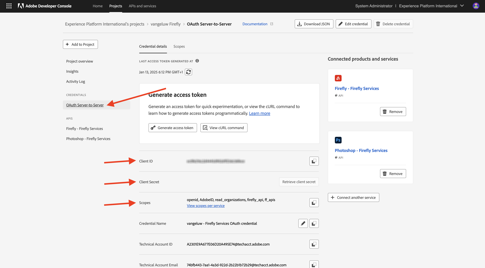
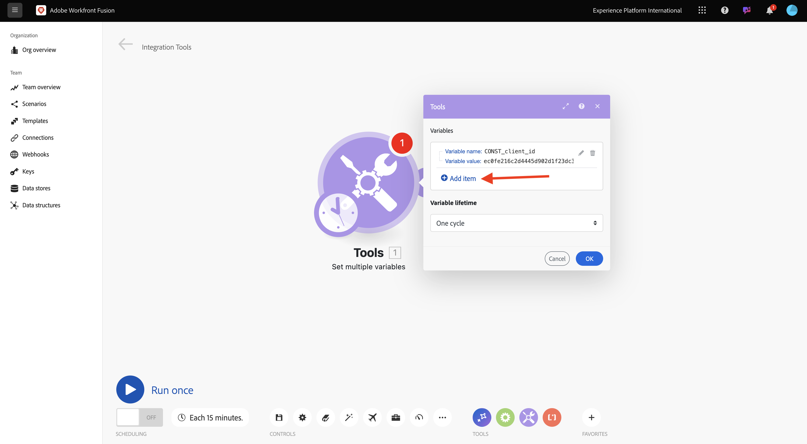
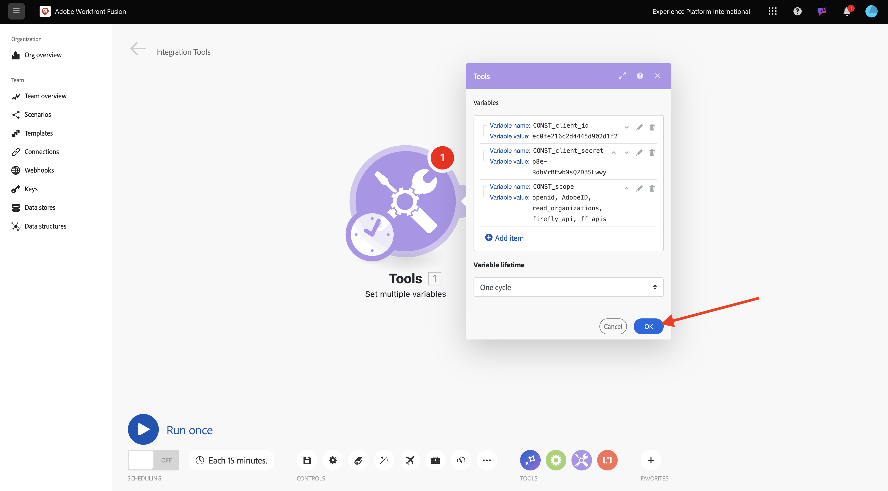
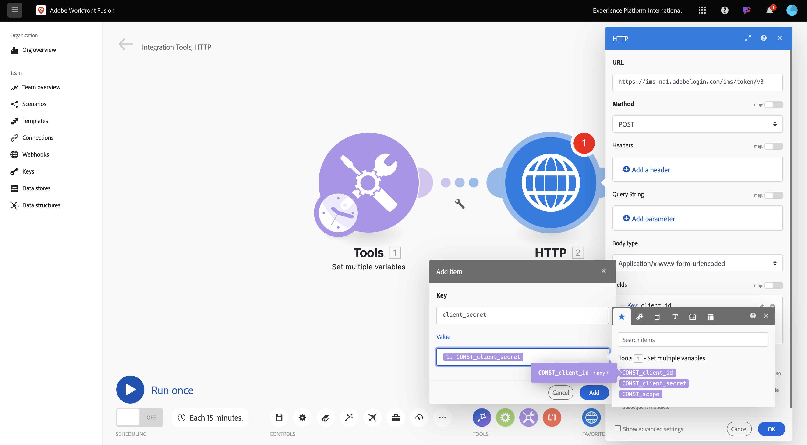
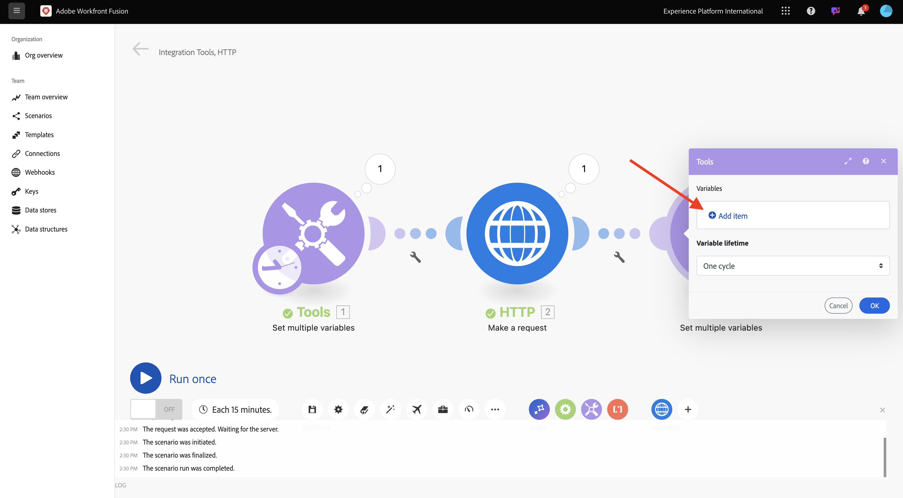

# 1.2.1 Introducción a Workfront Fusion

Aprenda a utilizar Workfront Fusion y Adobe I/O para consultar las API de Adobe Firefly Services.

## 1.2.1.1 Crear nuevo escenario

Vaya a [https://experience.adobe.com/](https://experience.adobe.com/){target="_blank"}. Abra **Workfront Fusion**.

Ir a **escenarios**.

Haga clic en el icono **+** para crear una carpeta nueva para su trabajo.

Asigne un nombre a la carpeta `--aepUserLdap--` y seleccione **Guardar**.

Seleccione su carpeta y luego seleccione **Crear nuevo escenario**.

Aparece un escenario vacío, seleccione **herramientas** y seleccione **Establecer múltiples variables**.

Mueva el icono **clock** al **Set multiple variables** que acaba de agregar.

La pantalla debería tener un aspecto similar al siguiente.

Haga clic con el botón derecho en el signo de interrogación y seleccione **Eliminar módulo**.

A continuación, haga clic con el botón derecho en **Establecer varias variables** y seleccione **Configuración**.

## 1.2.1.2 configurar autenticación de Adobe I/O

Ahora debe configurar las variables necesarias para autenticarse en Adobe I/O. En el ejercicio anterior creó un proyecto de Adobe I/O. Las variables de ese proyecto de Adobe I/O ahora deben definirse en Workfront Fusion.

Deben definirse las siguientes variables:

| Clave | Valor |
|:-------------:| :---------------:| 
| `CONST_client_id` | su ID de cliente del proyecto de Adobe I/O |
| `CONST_client_secret` | Secreto de cliente del proyecto de Adobe I/O |
| `CONST_scope` | Ámbito del proyecto de Adobe I/O |

Para encontrar estas variables, vaya a [https://developer.adobe.com/console/projects](https://developer.adobe.com/console/projects){target="_blank"} y abra el proyecto de Adobe I/O, que se llama `--aepUserLdap-- One Adobe tutorial`.

En su proyecto, seleccione **OAuth Server to-Server** para ver los valores de las claves anteriores.

Con las claves y los valores anteriores, puede configurar el objeto **Set multiple variables**. Seleccione **Agregar elemento**.

Escriba el **nombre de variable**: **CONST_client_id** y su **valor de variable**, seleccione **Agregar**.

Seleccione **Agregar elemento**.

Escriba **Nombre de variable**: **CONST_client_secret** y su **Valor de variable**, seleccione **Agregar**.

Seleccione **Agregar elemento**.

Escriba **Nombre de variable**: **CONST_scope** y su **valor de variable**, seleccione **Agregar**.

Seleccione **Aceptar**.

Pase el ratón sobre **Establecer varias variables** y seleccione el icono **+** grande para agregar otro módulo.

La pantalla debería tener un aspecto similar al siguiente.

En la barra de búsqueda, escriba **http**. Seleccione **HTTP** para abrirlo.

Seleccione **Realizar una solicitud**.

| Clave | Valor |
|:-------------:| :---------------:| 
| `URL` | `https://ims-na1.adobelogin.com/ims/token/v3` |
| `Method` | `POST` |
| `Body Type` | `x-www-form-urlencoded` |

Seleccione **Agregar elemento**.

Agregue elementos para cada uno de los siguientes valores:

| Clave | Valor |
|:-------------:| :---------------:| 
| `client_id` | su variable predefinida para `CONST_client_id` |
| `client_secret` | su variable predefinida para `CONST_client_secret` |
| `scope` | su variable predefinida para `CONST_scope` |
| `grant_type` | `client_credentials` |

Configuración de `client_id`:

Configuración de `client_secret`.

Configuración de `scope`.

Configuración de `grant_type`.

Desplácese hacia abajo y marque la casilla de **Respuesta de análisis**. Seleccione **Aceptar**.

La pantalla debería tener un aspecto similar al siguiente. Seleccionar **Ejecutar una vez**.

Una vez que se haya ejecutado el escenario, la pantalla debería tener este aspecto:

Seleccione el icono **signo de interrogación** en el objeto **Set multiple variables** para ver qué ocurrió cuando se ejecutó ese objeto.

Seleccione el icono **signo de interrogación** en el objeto **HTTP - Realice una solicitud** para ver qué ocurrió cuando se ejecutó ese objeto. En **OUTPUT**, vea el **token de acceso** devuelto por Adobe I/O.

Pase el ratón sobre **HTTP - Realice una solicitud** y seleccione el icono **+** para agregar otro módulo.

En la barra de búsqueda, busque `tools`. Seleccione **Herramientas**.

Seleccione **Establecer múltiples variables**.

Seleccione **Agregar elemento**.

Establezca **Nombre de variable** en `bearer_token`. Seleccione `access_token` como **valor de variable** dinámico. Seleccione **Agregar**.

La pantalla debería tener un aspecto similar al siguiente. Seleccione **Aceptar**.

Seleccione **Ejecutar una vez** de nuevo.

Una vez que se ejecute el escenario, seleccione el icono **signo de interrogación** en el último objeto **Set multiple variables**. Debería ver que access_token se está almacenando en la variable `bearer_token`.

A continuación, haga clic con el botón derecho en el primer objeto **Establecer varios valores** y seleccione **Cambiar nombre**.

Establezca el nombre en **Inicializar constantes**. Seleccione **Aceptar**.

Cambie el nombre del segundo objeto a **Autenticar en Adobe I/O**. Seleccione **Aceptar**.

Cambie el nombre del tercer objeto a **Set Bearer Token**. Seleccione **Aceptar**.

La pantalla debería tener un aspecto similar al siguiente:

A continuación, cambie el nombre de su escenario a `--aepUserLdap-- - Adobe I/O Authentication`.

Seleccione **Guardar**.

## Pasos siguientes

Vaya a [Usar las API de Adobe en Workfront Fusion](./ex2.md){target="_blank"}

Volver a [Automatización del flujo de trabajo de Creative con Workfront Fusion](./automation.md){target="_blank"}

Volver a [Todos los módulos](./../../../overview.md){target="_blank"}
