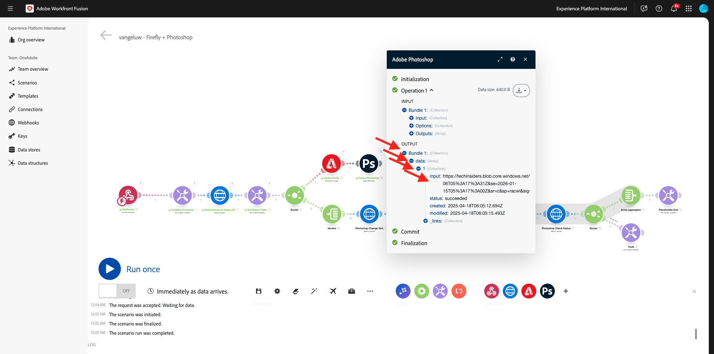
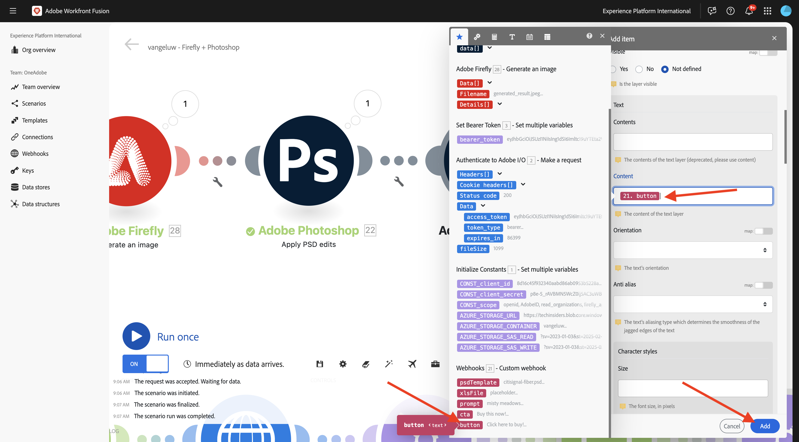

# 1.2.4 Automatización mediante conectores

Ahora empezará a utilizar los conectores predeterminados en Workfront Fusion para Photoshop y conectará la solicitud de Firefly Text-2-Image y las solicitudes de Photoshop en un escenario.

## 1.2.4.1 variables de actualización

Antes de continuar con la configuración del conector, es necesario agregar las siguientes variables al módulo **Inicializar constantes**.

- `AZURE_STORAGE_URL`
- `AZURE_STORAGE_CONTAINER`
- `AZURE_STORAGE_SAS_READ`
- `AZURE_STORAGE_SAS_WRITE`

Vuelva al primer nodo, seleccione **Inicializar constantes** y, a continuación, elija **Agregar elemento** para cada una de estas variables.


| Clave | Valor de ejemplo |
|:-------------:| :---------------:| 
| `AZURE_STORAGE_URL` | `https://vangeluw.blob.core.windows.net` |
| `AZURE_STORAGE_CONTAINER` | `vangeluw` |
| `AZURE_STORAGE_SAS_READ` | `?sv=2023-01-03&st=2025-01-13T07%3A36%3A35Z&se=2026-01-14T07%3A36%3A00Z&sr=c&sp=rl&sig=4r%2FcSJLlt%2BSt9HdFdN0VzWURxRK6UqhB8TEvbWkmAag%3D` |
| `AZURE_STORAGE_SAS_WRITE` | `?sv=2023-01-03&st=2025-01-13T17%3A21%3A09Z&se=2025-01-14T17%3A21%3A09Z&sr=c&sp=racwl&sig=FD4m0YyyqUj%2B5T8YyTFJDi55RiTDC9xKtLTgW0CShps%3D` |

Para encontrar las variables, vuelva a Postman y abra las **Variables de entorno**.


Copie estos valores en Workfront Fusion y añada un nuevo elemento para cada una de estas 4 variables.

La pantalla debería tener un aspecto similar al siguiente. Seleccione **Aceptar**.


## 1.2.4.2 Activar su escenario mediante un gancho web

Hasta ahora, ha ejecutado el escenario manualmente para probarlo. Actualicemos ahora su escenario con un webhook, para que pueda activarse desde un entorno externo.

Seleccione **+**, busque **webhook** y luego seleccione **Webhooks**.


Seleccione **webhook personalizado**.


Arrastre el módulo **Gancho web personalizado** al principio del escenario. A continuación, selecciona el icono **clock** y arrástralo al módulo **Custom Webhook**.


Entonces debería ver esto. A continuación, arrastre el punto rojo del primer módulo hacia el punto morado del segundo módulo.


Entonces debería ver esto. Newt, haz clic en el módulo **Gancho web personalizado**.


Haga clic en **Agregar**.


Establezca el **nombre del webhook** en `--aepUserLdap-- - Firefly + Photoshop Webhook`. Haga clic en **Guardar**.


La URL del gancho web ya está disponible. Haga clic en **Copiar dirección al portapapeles** para copiar la dirección URL.


Abra Postman y agregue una nueva carpeta a la colección **FF - Firefly Services Tech Insiders**.


Asigne un nombre a la carpeta `--aepUserLdap-- - Workfront Fusion`.


En la carpeta que acaba de crear, seleccione los 3 puntos **...** y seleccione **Agregar solicitud**.


Establece **Method type** en **POST** y pega la URL de tu webhook en la barra de direcciones.


Debe enviar un cuerpo personalizado para que los elementos de la variable se puedan proporcionar desde una fuente externa al escenario de Workfront Fusion.

Vaya a **Cuerpo** y seleccione **sin procesar**.


Pegue el texto siguiente en el cuerpo de la solicitud. Seleccione **Enviar**.

```json
{
    "psdTemplate": "citisignal-fiber.psd",
    "xlsFile": "placeholder",
    "prompt":"misty meadows",
    "cta": "Buy this now!",
    "button": "Click here to buy!"
}
```


Cuando vuelva a Workfront Fusion, aparecerá un mensaje en el gancho web personalizado que dice: **Determinado correctamente**.


## 1.2.4.3 Conector De Adobe Firefly

Haga clic en el icono **+** para agregar un módulo nuevo.


Escriba el término de búsqueda `Adobe Firefly` y seleccione **Adobe Firefly**.


Seleccione **Generar una imagen**.


Haga clic en el módulo **Adobe Firefly** para abrirlo y, a continuación, haga clic en **Agregar** para crear una nueva conexión.


Rellene los campos siguientes:

- **Nombre de conexión**: use `--aepUserLdap-- - Firefly connection`.
- **Entorno**: use **Producción**.
- **Tipo**: use **cuenta personal**.
- **ID de cliente**: copie el **ID de cliente** de su proyecto de Adobe I/O, que se llama `--aepUserLdap-- - One Adobe tutorial`.
- **Secreto de cliente**: copie el **Secreto de cliente** de su proyecto de Adobe I/O, que se llama `--aepUserLdap-- - One Adobe tutorial`.

Puedes encontrar los **ID de cliente** y el **Secreto de cliente** de tu proyecto Adobe I/O [aquí](https://developer.adobe.com/console/projects.){target="_blank"}.


Una vez que hayas rellenado todos los campos, haz clic en **Continuar**. La conexión se validará automáticamente.


A continuación, seleccione la variable **prompt** proporcionada al escenario por el **webhook personalizado** entrante.


Establezca **Versión de modelo** **prompt** en **image4 standard**. Haga clic en **Aceptar**.


Haga clic en **Guardar** para guardar los cambios y, a continuación, haga clic en **Ejecutar una vez** para probar la configuración.


Vaya a Postman, compruebe el mensaje de su solicitud y, a continuación, haga clic en **Enviar**.


Una vez que haya hecho clic en enviar, vuelva a Workfront Fusion y haga clic en el icono de burbuja del módulo **Adobe Firefly** para comprobar los detalles.


Vaya a **OUTPUT** para **Detalles** > **url** para encontrar la URL de la imagen generada por **Adobe Firefly**.


Copie la dirección URL y péguela en el explorador. Ahora debería ver una imagen que representa el mensaje que envió desde la solicitud de Postman, en este caso **misty meadows**.


## 1.2.4.2 Cambiar el fondo del archivo PSD

Ahora actualizará su escenario para hacerlo más inteligente mediante el uso de más conectores predeterminados. También conectará la salida de Firefly a Photoshop, de modo que la imagen de fondo del archivo de PSD cambie dinámicamente mediante la salida de la acción Generar imagen de Firefly.

Entonces debería ver esto. A continuación, pase el ratón sobre el módulo **Adobe Firefly** y haga clic en el icono **+**.


En el menú de búsqueda, escriba `Photoshop` y haga clic en la acción **Adobe Photoshop**.


Seleccione **Aplicar ediciones de PSD**.


Entonces debería ver esto. Haga clic en **Agregar** para agregar una nueva conexión a Adobe Photoshop.


Configure la conexión de la siguiente manera:

- Tipo de conexión: seleccionar **Adobe Photoshop (servidor a servidor)**
- Nombre de conexión: escriba `--aepUserLdap-- - Adobe I/O`
- ID de cliente: pegue su ID de cliente
- Secreto del cliente: pegue el secreto del cliente

Haga clic en **Continuar**.


Para encontrar tu **ID de cliente** y **Secreto de cliente**, ve a [https://developer.adobe.com/console/home](https://developer.adobe.com/console/home){target="_blank"} y abre tu proyecto de Adobe I/O, que se llama `--aepUserLdap-- One Adobe tutorial`. Vaya a **Servidor a servidor de OAuth** para encontrar su ID de cliente y Secreto de cliente. Copie esos valores y péguelos en la configuración de conexión de Workfront Fusion.


Después de hacer clic en **Continuar**, se mostrará brevemente una ventana emergente mientras se verifican sus credenciales. Una vez finalizado, debería ver esto.


Ahora debe introducir la ubicación del archivo PSD con el que desea que Fusion trabaje. Para **Storage**, seleccione **Azure** y para **Ubicación de archivo**, escriba `{{1.AZURE_STORAGE_URL}}/{{1.AZURE_STORAGE_CONTAINER}}/{{1.AZURE_STORAGE_SAS_READ}}`. Coloque el cursor junto al segundo `/`. A continuación, eche un vistazo a las variables disponibles y desplácese hacia abajo para encontrar la variable **psdTemplate**. Haga clic en la variable **psdTemplate** para seleccionarla.


Entonces debería ver esto.


Desplácese hacia abajo hasta que vea **Capas**. Haga clic en **Agregar elemento**.


Entonces debería ver esto. Ahora debe introducir el nombre de la capa en la plantilla de Photoshop PSD que se utiliza para el fondo del archivo.


En el archivo **citisignal-fiber.psd**, encontrará la capa que se usa para el fondo. En este ejemplo, esa capa se denomina **2048x2048-background**.


Pegue el nombre **2048x2048-background** en el diálogo de Workfront Fusion.


Desplácese hacia abajo hasta que vea **Entrada**. Ahora debe definir lo que debe insertarse en la capa de fondo. En este caso, debe seleccionar la salida del módulo **Adobe Firefly**, que contiene la imagen generada dinámicamente.

Para **Almacenamiento**, seleccione **Externo**. Para **Ubicación de archivo**, tendrá que copiar y pegar la variable `{{XX.details[].url}}` de la salida del módulo **Adobe Firefly**, pero tendrá que reemplazar **XX** en la variable por el número de secuencia del módulo **Adobe Firefly**, que en este ejemplo es **5**.


A continuación, desplácese hacia abajo hasta que vea **Editar**. Establezca **Edit** en **Yes** y establezca **Type** en **Layer**. Haga clic en **Agregar**.


Entonces debería ver esto. A continuación, debe definir el resultado de la acción. Haga clic en **Agregar elemento** en **resultados**.


Seleccione **Azure** para **Storage**, pegue este(a) `{{1.AZURE_STORAGE_URL}}/{{1.AZURE_STORAGE_CONTAINER}}/citisignal-fiber-replacedbg.psd{{1.AZURE_STORAGE_SAS_WRITE}}` en **Ubicación de archivo** y seleccione **vnd.adobe.photoshop** en **Type**. Haga clic para habilitar **Mostrar configuración avanzada**.


En **Configuración avanzada**, seleccione **Sí** para sobrescribir archivos con el mismo nombre.
Haga clic en **Agregar**.


Entonces deberías tener esto. Haga clic en **Aceptar**.


Haga clic en **Guardar** para guardar los cambios y, a continuación, haga clic en **Ejecutar una vez** para probar la configuración.


Vaya a Postman, compruebe el mensaje de su solicitud y, a continuación, haga clic en **Enviar**.


Entonces debería ver esto. Haga clic en la burbuja en el módulo **Adobe Photoshop - Aplicar ediciones de PSD**.


Ahora puede ver que un nuevo archivo de PSD se generó correctamente y se almacenó en su cuenta de almacenamiento de Microsoft Azure.



## 1.2.4.3 Cambiar las capas de texto del archivo PSD

A continuación, pase el ratón sobre el módulo **Adobe Photoshop - Aplicar ediciones de PSD** y haga clic en el icono **+**.


Seleccione **Adobe Photoshop**.


Seleccione **Editar capas de texto**.


Entonces debería ver esto. En primer lugar, seleccione la conexión de Adobe Photoshop que ya se configuró anteriormente y que debe llamarse `--aepUserLdap-- Adobe I/O`.


Para el **archivo de entrada**, seleccione **Azure** para **almacenamiento de archivos de entrada** y asegúrese de seleccionar la salida de la solicitud anterior, **Adobe Photoshop - Aplicar ediciones de PSD**, que puede definir de esta manera: ``{{XX.data[].`_links`.renditions[].href}}`` (reemplace XX por el número de secuencia del módulo anterior Adobe Photoshop - Aplicar ediciones de PSD).

A continuación, haga clic en **+Agregar elemento** en **Capas** para empezar a agregar las capas de texto que deben actualizarse.


Hay dos cambios que se deben realizar, el texto de CTA y el texto del botón del archivo **citisignal-fiber.psd** deben actualizarse.

Para encontrar los nombres de las capas, abra el archivo **citisignal-fiber.psd**. En el archivo, verá que la capa que contiene call to action se llama **2048x2048-cta**.


En el archivo **citisignal-fiber.psd**, también notará que la capa que contiene el call to action se llama **2048x2048-button-text**.


Primero debe configurar los cambios que deben ocurrir en la capa **2048x2048-cta**. Escriba el nombre **2048x2048-cta** en **Nombre** en el cuadro de diálogo.


Desplácese hacia abajo hasta que vea **Texto** > **Contenido**. Seleccione la variable **cta** de la carga útil de webhook. Haga clic en **Agregar**.


Entonces debería ver esto. Haga clic en **+Agregar elemento** en **Capas** para empezar a agregar la siguiente capa de texto que necesite actualizarse.


Escriba el nombre **2048x2048-button-text** en **Nombre** en el cuadro de diálogo.


Desplácese hacia abajo hasta que vea **Texto** > **Contenido**. Seleccione la variable **button** de la carga útil de webhook. Haga clic en **Agregar**.



Entonces debería ver esto.


Desplácese hacia abajo hasta que vea **Salida**. Para **Almacenamiento**, seleccione **Azure**. Para **ubicación de archivo**, ingrese la siguiente ubicación. Tenga en cuenta la adición de la variable `{{timestamp}}` al nombre de archivo que se utiliza para garantizar que cada archivo generado tenga un nombre único. Además, establezca **Type** en **vnd.adobe.photoshop**.

`{{1.AZURE_STORAGE_URL}}/{{1.AZURE_STORAGE_CONTAINER}}/citisignal-fiber-changed-text-{{timestamp}}.psd{{1.AZURE_STORAGE_SAS_WRITE}}`

Establezca **Type** en **vnd.adobe.photoshop**. Haga clic en **Aceptar**.


Haga clic en **Guardar** para guardar los cambios.


## 1.2.4.4 respuesta de webhook

Después de aplicar estos cambios a su archivo Photoshop, debe configurar una **respuesta de webhook** que se devolverá a la aplicación que haya activado este escenario.

Pase el ratón sobre el módulo **Adobe Photoshop - Editar capas de texto** y haga clic en el icono **+**.


Busque `webhooks` y seleccione **Webhook**.


Seleccione **Respuesta de webhook**.


Entonces debería ver esto. Pegue la siguiente carga útil en **Cuerpo**.

```json
{
    "newPsdTemplate": ""
}
```


Copie y pegue la variable `{{XX.data[]._links.renditions[].href}}` y reemplace **XX** por el número de secuencia del último módulo **Adobe Photoshop - Editar capas de texto**, que en este caso es **7**.


Habilite la casilla de verificación para **Mostrar configuración avanzada** y luego haga clic en **Agregar elemento**.


En el campo **Clave**, escriba `Content-Type`. En el campo **Valor**, escriba `application/json`. Haga clic en **Agregar**.


Entonces deberías tener esto. Haga clic en **Aceptar**.


Haga clic en **Alinear automáticamente**.


Entonces debería ver esto. Haga clic en **Guardar** para guardar los cambios y, a continuación, haga clic en **Ejecutar una vez** para probar el escenario.


Vuelva a Postman y haga clic en **Enviar**. La solicitud que se está usando aquí es **prados brumosos**.


A continuación, se activará el escenario y, pasado un tiempo, se mostrará una respuesta en Postman que contenga la URL del archivo PSD recién creado.


Como recordatorio: una vez que el escenario se haya ejecutado en Workfront Fusion, podrá ver información sobre cada módulo haciendo clic en la burbuja situada encima de cada módulo.


Con el Explorador de almacenamiento de Azure, puede buscar y abrir el archivo de PSD recién creado haciendo doble clic en él en el Explorador de almacenamiento de Azure.


El archivo debería tener este aspecto, con el fondo reemplazado por un fondo con **prados empañados**.


Si vuelve a ejecutar el escenario y, a continuación, envía una nueva solicitud desde Postman con un mensaje diferente, verá lo fácil y reutilizable que se ha vuelto su escenario. En este ejemplo, el nuevo indicador que se está usando es **desierto soleado**.


Y un par de minutos después, se ha generado un nuevo archivo PSD con un nuevo fondo.


## Próximos pasos

Vaya a [1.2.3 Frame.io y Workfront Fusion](./ex3.md){target="_blank"}

Volver a [Automatización del flujo de trabajo de Creative con Workfront Fusion](./automation.md){target="_blank"}

Volver a [Todos los módulos](./../../../overview.md){target="_blank"}
