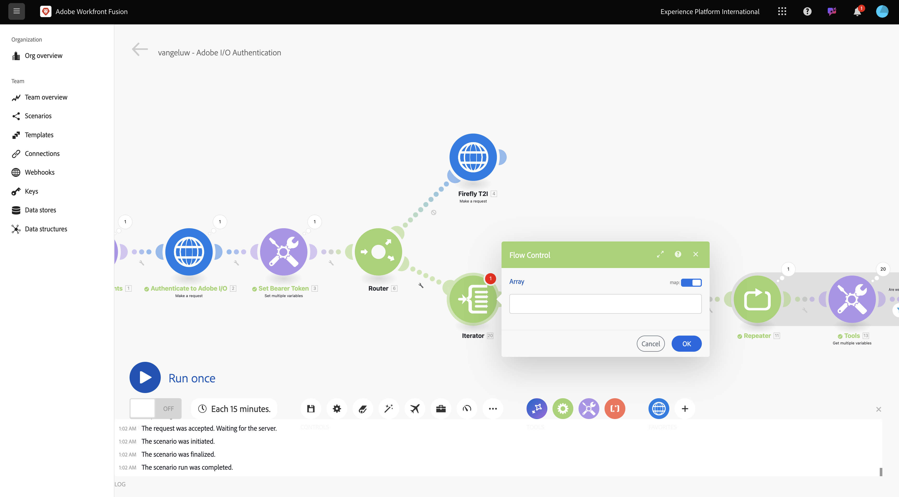
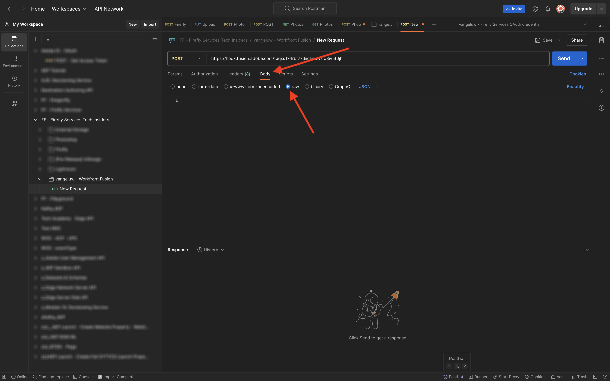
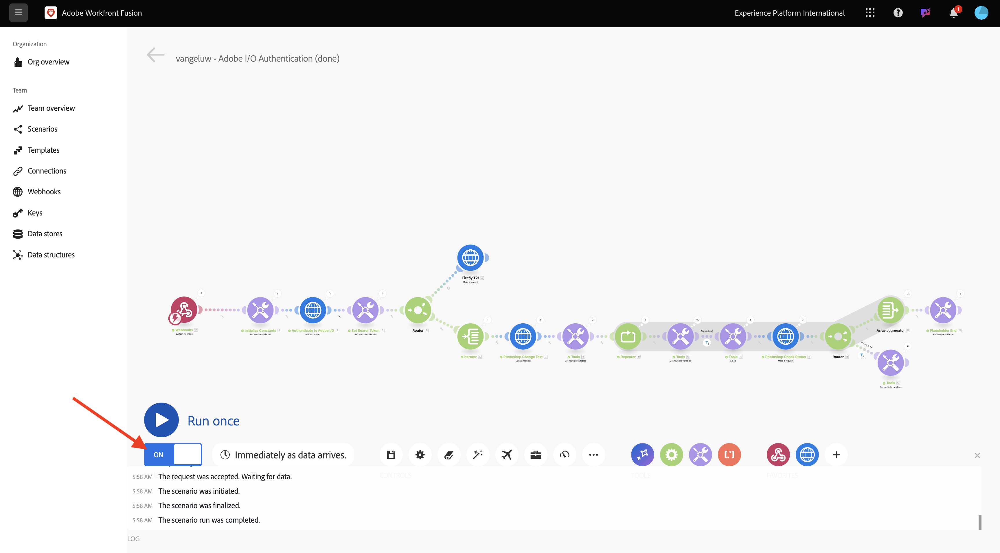

# 1.2.3 Automatización de procesos con Workfront Fusion

Aprenda a automatizar los procesos con Workfront Fusion.

## 1.2.3.1 iterando en varios valores

El escenario debería tener este aspecto:


Hasta ahora, ha cambiado el texto de un archivo Photoshop por un valor estático. Para escalar y automatizar los flujos de trabajo de creación de contenido, es necesario iterar una lista de valores e insertar dichos valores de forma dinámica en el archivo Photoshop. En los pasos siguientes, agregará un deseo de repetir valores en el escenario existente.

Entre el nodo **Router** y el nodo **Photoshop Change Text**, seleccione el icono **wrench** y seleccione **Add a module**.


Busque `flow` y seleccione **Control de flujo**.


Seleccione **Iterador**.


La pantalla debería tener un aspecto similar al siguiente:



Aunque es posible leer archivos de entrada como los archivos CSV, por ahora debe utilizar una versión básica de un archivo CSV definiendo una cadena de texto y dividiendo ese archivo de texto.

Puede encontrar la función **split** seleccionando el icono **T**, donde verá todas las funciones disponibles para manipular los valores de texto. Seleccione la función **split** y debería ver esto.


La función split espera una matriz de valores antes del punto y coma y espera que especifique el separador después del punto y coma. Para este prueba, debe usar una matriz simple con 2 campos, **Comprar ahora** y **Haga clic aquí**, y el separador a usar es **,**.

Introduzca esto en el **campo Matriz** reemplazando la función de división **actualmente vacía**: `{{split("Buy now, Click here "; ",")}}`. Seleccione **OK**.


Seleccione **Texto de cambio de Photoshop** para agregar algunas variables en lugar de valores estáticos para los campos de entrada y salida.


En **Solicitud contenido**, está el texto **Haga clic aquí**. Este texto debe ser reemplazado por los valores provenientes de su matriz.


Eliminar el texto **Haga clic aquí** y sustitúyalo seleccionando el Valor de variable **** en el **nodo Iterador**. Esto garantiza que el texto del botón del Photoshop documento se actualice de forma dinámica.


También debe actualizar el nombre de archivo usado para escribir el archivo en su cuenta de almacenamiento de Azure. Si el nombre del archivo es estático, cada nueva iteración simplemente sobrescribe el archivo anterior y, como tal, pierde los archivos personalizados. El nombre de archivo estático actual es **citisignal-fiber-changed-text.psd**, y ahora necesita actualizarlo.

Coloque el cursor detrás de la palabra `text`.


En primer lugar, agregue un guion `-` y, a continuación, seleccione el valor **Posición de pedido del paquete**. Esto garantiza que para la primera iteración, Workfront Fusion agregue `-1` al nombre del archivo, para la segunda iteración `-2`, etc. Seleccione **Aceptar**.


Guarde el escenario y seleccione **Ejecutar una vez**.


Una vez que se haya ejecutado el escenario, vuelva al Explorador de almacenamiento de Azure y actualice la carpeta. Luego debería ver los 2 archivos recién creados.


Descargue y abra cada archivo. Debe escribir varios textos en los botones. Este es el archivo `citisignal-fiber-changed-text-1.psd`.


Este es el archivo `citisignal-fiber-changed-text-2.psd`.


## 1.2.3.2 Activar su escenario mediante un gancho web

Hasta ahora, ha ejecutado el escenario manualmente para probarlo. Actualicemos ahora su escenario con un webhook, para que pueda activarse desde un entorno externo.

Seleccione **+**, busque **webhook** y luego seleccione **Webhooks**.


Seleccione **webhook personalizado**.

Arrastre y conecte el nodo **Gancho web personalizado** para que se conecte al primer nodo del lienzo, que se llama **Inicializar constantes**.


Seleccione el nodo **webhook personalizado**. A continuación, seleccione **Agregar**.


Definir **nombre de webhook** en `--aepUserLdap-- - Tutorial 1.2`.


Marque la casilla de **Obtener encabezados de solicitud**. Seleccione **Guardar**.


La URL del gancho web ya está disponible. Copie la dirección URL.


Abra Postman y agregue una nueva carpeta a la colección **FF - Firefly Services Tech Insiders**.


Asigne un nombre a la carpeta `--aepUserLdap-- - Workfront Fusion`.


En la carpeta que acaba de crear, seleccione los 3 puntos **...** y seleccione **Agregar solicitud**.


Establece **Method type** en **POST** y pega la URL de tu webhook en la barra de direcciones.


Debe enviar un cuerpo personalizado para que los elementos de la variable se puedan proporcionar desde una fuente externa al escenario de Workfront Fusion.

Vaya a **Cuerpo** y seleccione **sin procesar**.



Pegue el texto siguiente en el cuerpo de la solicitud. Seleccione **Enviar**.

```json
{
	"psdTemplate": "placeholder",
	"xlsFile": "placeholder"
}
```


Cuando vuelva a Workfront Fusion, aparecerá un mensaje en el gancho web personalizado que dice: **Determinado correctamente**.


Seleccione **Guardar** y luego **Ejecutar una vez**. Tu escenario ahora estará activo, pero no se ejecutará hasta que vuelvas a seleccionar **Enviar** en Postman.


En Postman, seleccione **Enviar** de nuevo.


Su escenario se volverá a ejecutar y creará los dos archivos igual que antes.


Cambie el nombre de su solicitud de cartero a `POST - Send Request to Workfront Fusion Webhook`.


Ahora debe inicio utilizando la variable **psdTemplate**. En lugar de codificar la ubicación del archivo de entrada en el **nodo Cambiar texto** de Photoshop, utilizará el variable entrante del solicitud del cartero.

Abra el **nodo Cambiar texto** Photoshop y vaya a **Solicitar contenido**. Seleccione el nombre **de archivo codificado citisignal-fiber.psd** debajo **de entradas** y elimínelo.


Seleccione la variable **psdTemplate**. Seleccione **Aceptar** y, a continuación, guarde su escenario.


Seleccione **ON** para activar su escenario. Su escenario se está ejecutando sin interrupciones.



De nuevo en Postman, ingrese el nombre de archivo `citisignal-fiber.psd` como valor para la variable **psdTemplate** y seleccione **Send** nuevamente para ejecutar su escenario nuevamente.


Al especificar el plantilla PSD como un variable proporcionado por un sistema externo, ahora ha creado un escenario reutilizable.

Ahora ha completado este ejercicio.

## Pasos siguientes

Vaya a la automatización de [1.2.4 mediante conectores](./ex4.md){target="_blank"}

Volver a [Creative automatización del flujo de trabajo con Workfront Fusion](./automation.md){target="_blank"}

Volver a [Todos los módulos](./../../../overview.md){target="_blank"}
