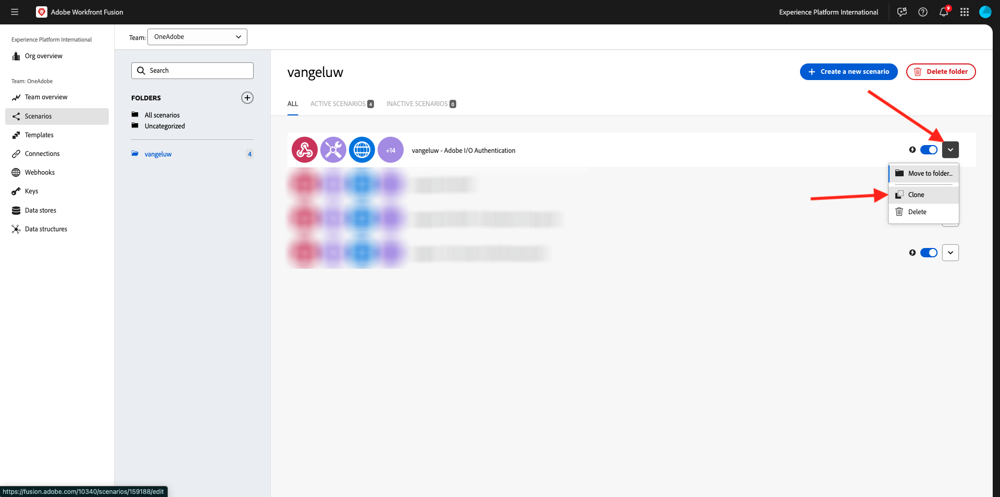
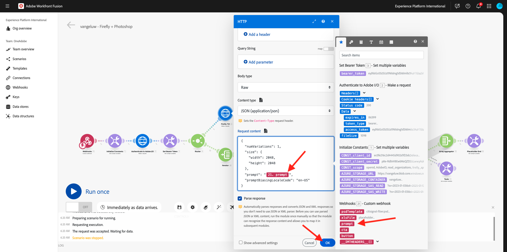
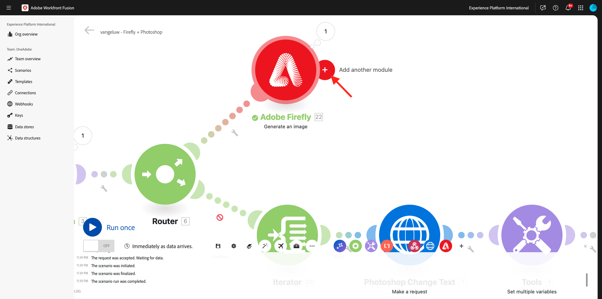
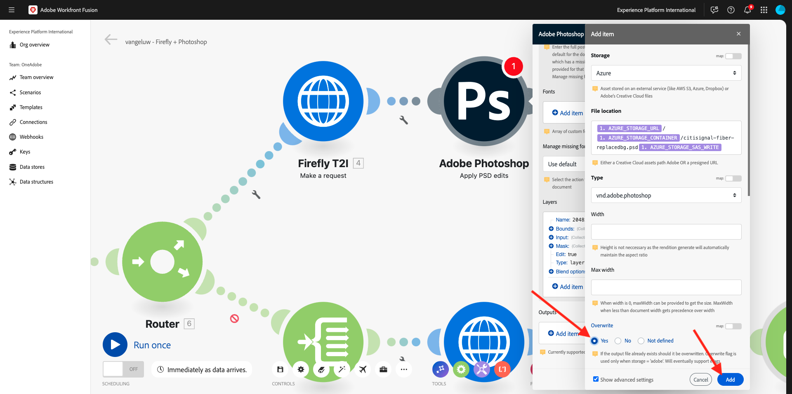
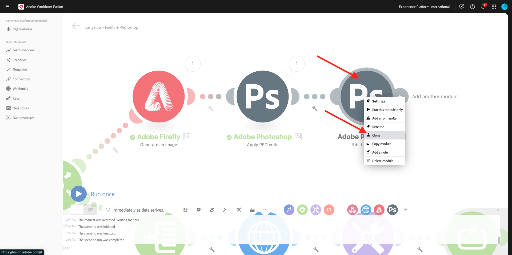
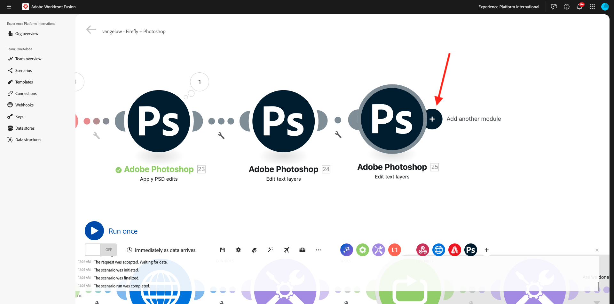
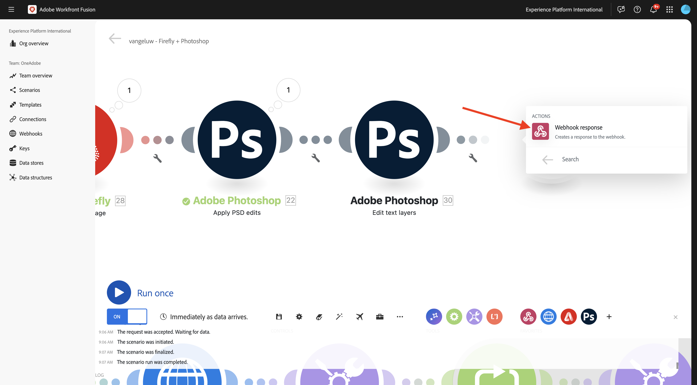

# 1.2.4 Automatización mediante conectores

Ahora empezará a utilizar los conectores predeterminados en Workfront Fusion para Photoshop y conectará la solicitud de Firefly Text-2-Image y las solicitudes de Photoshop en un escenario.

## 1.2.4.1 duplicar y preparar su escenario

En el menú de la izquierda, vaya a **Escenarios** y seleccione la carpeta `--aepUserLdap--`. Debería ver el escenario que creó anteriormente, que se llama `--aepUSerLdap-- - Adobe I/O Authentication`.


Haga clic en la flecha para abrir el menú desplegable y seleccione **Clonar**.



Establezca **Name** del escenario clonado en `--aepUserLdap-- - Firefly + Photoshop` y seleccione el **equipo de destino** adecuado. Haga clic en **Agregar** para agregar un nuevo enlace web.


Establezca el **nombre del webhook** en `--aepUserLdap-- - Firefly + Photoshop Webhook`. Haga clic en **Guardar**.


Entonces debería ver esto. Haga clic en **Guardar**.


Entonces debería ver esto. Haga clic en el nodo **Webhook**.


Haga clic en **Copiar dirección al portapapeles** y, a continuación, haga clic en **Volver a determinar la estructura de datos**.


Abra Postman. Añada una nueva solicitud en la misma carpeta que estaba utilizando antes.


Asegúrese de que se aplica la siguiente configuración:

- Nombre de solicitud: `POST - Send Request to Workfront Fusion Webhook Firefly + Photoshop`
- Tipo de solicitud: `POST`
- Solicitar URL: pegue la URL que ha copiado del webhook de su Workfront Fusion Scenario.

Vaya a **Cuerpo** y establezca **Tipo de cuerpo** en **sin procesar** - **JSON**. Pegue la siguiente carga útil en **Body**.

```json
{
    "psdTemplate": "citisignal-fiber.psd",
    "xlsFile": "placeholder",
    "prompt":"misty meadows",
    "cta": "Buy this now!",
    "button": "Click here to buy!"
}
```

Esta nueva carga útil garantizará que toda la información de la variable se proporcione desde fuera del escenario en lugar de estar codificada en el escenario. En un escenario empresarial, una organización necesita que un escenario se defina de forma reutilizable, lo que significa que se deben proporcionar varias variables como variables de entrada en lugar de tenerlas codificadas en el escenario.

Entonces deberías tener esto. Haga clic en **Enviar**.


El webhook de Workfront Fusion sigue esperando la entrada.


Una vez que hayas hecho clic en **Enviar**, el mensaje debería cambiar a **Determinado correctamente**. Haga clic en **Aceptar**.


## 1.2.4.2 Actualizar nodo T2I de Firefly

Haga clic en el nodo **Firefly T2I**. Entonces debería ver esto. La petición de datos de esta solicitud estaba previamente codificada para **caballos en un campo**. Ahora eliminará ese texto codificado y lo reemplazará por un campo proveniente del webhook.


Quite el texto **horse en un campo** y reemplácelo por la variable **prompt** que se encuentra en las variables **Webhook**. Haga clic en **Aceptar** para guardar los cambios.



## 1.2.4.2 Cambiar el fondo del archivo PSD

Ahora actualizará su escenario para hacerlo más inteligente mediante el uso de conectores predeterminados. También conectará la salida de Firefly a Photoshop, de modo que la imagen de fondo del archivo de PSD cambie dinámicamente mediante la salida de la acción Generar imagen de Firefly.

En el ejercicio anterior, deshabilitó la ruta **Firefly T2I**. Ahora debería deshacer eso. Haga clic en el icono **stop** para habilitar de nuevo la ruta.


Verá que el icono **stop** desaparece. A continuación, haga clic en el icono **llave inglesa** en la otra ruta hacia la configuración del ejercicio anterior y seleccione **Deshabilitar ruta**.


Entonces debería ver esto. A continuación, pase el ratón sobre el nodo **Firefly T2I** y haga clic en el icono **+**.



En el menú de búsqueda, escribe `Photoshop` y luego haz clic en la acción **Adobe Photoshop**.


Seleccione **Aplicar ediciones de PSD**.


Entonces debería ver esto. Haga clic en **Agregar** para agregar una nueva conexión a Adobe Photoshop.


Configure la conexión de la siguiente manera:

- Tipo de conexión: seleccionar **Adobe Photoshop (servidor a servidor)**
- Nombre de conexión: escriba `--aepUserLdap-- - Adobe IO`
- ID de cliente: pegue su ID de cliente
- Secreto del cliente: pegue el secreto del cliente

Haga clic en **Continuar**.


Para encontrar tu **ID de cliente** y **Secreto de cliente**, ve a [https://developer.adobe.com/console/home](https://developer.adobe.com/console/home){target="_blank"} y abre tu proyecto de Adobe I/O, que se llama `--aepUserLdap-- One Adobe tutorial`. Vaya a **Servidor a servidor de OAuth** para encontrar su ID de cliente y Secreto de cliente. Copie esos valores y péguelos en la configuración de conexión de Workfront Fusion.


Después de hacer clic en **Continuar**, se mostrará brevemente una ventana emergente mientras se verifican sus credenciales. Una vez finalizado, debería ver esto.


Ahora debe introducir la ubicación del archivo PSD con el que desea que Fusion trabaje. Para **Storage**, seleccione **Azure** y para **Ubicación de archivo**, escriba `{{1.AZURE_STORAGE_URL}}/{{1.AZURE_STORAGE_CONTAINER}}/{{1.AZURE_STORAGE_SAS_READ}}`. Coloque el cursor junto al segundo `/`. A continuación, eche un vistazo a las variables disponibles y desplácese hacia abajo para encontrar la variable **psdTemplate**. Haga clic en la variable **psdTemplate** para seleccionarla.


Entonces debería ver esto.


Desplácese hacia abajo hasta que vea **Capas**. Haga clic en **Agregar elemento**.


Entonces debería ver esto. Ahora debe introducir el nombre de la capa en la plantilla de Photoshop PSD que se utiliza para el fondo del archivo.


En el archivo **citisignal-fiber.psd**, encontrará la capa que se usa para el fondo. En este ejemplo, esa capa se denomina **2048x2048-background**.


Pegue el nombre **2048x2048-background** en el diálogo de Workfront Fusion.


Desplácese hacia abajo hasta que vea **Entrada**. Ahora debe definir lo que debe insertarse en la capa de fondo. En este caso, es necesario seleccionar la salida del objeto Firefly T2I, que contiene la imagen generada dinámicamente.

Para **Almacenamiento**, seleccione **Externo**. Para **ubicación de archivos**, busque y busque la variable `data.outputs[].image.url` en la salida de la solicitud **Firefly T2I**.


A continuación, desplácese hacia abajo hasta que vea **Editar**. Establezca **Edit** en **Yes** y establezca **Type** en **Layer**. Haga clic en **Agregar**.


Entonces debería ver esto. A continuación, debe definir el resultado de la acción. Haga clic en **Agregar elemento** en **resultados**.


Seleccione **Azure** para **Storage**, pegue este(a) `{{1.AZURE_STORAGE_URL}}/{{1.AZURE_STORAGE_CONTAINER}}/citisignal-fiber-replacedbg.psd{{1.AZURE_STORAGE_SAS_WRITE}}` en **Ubicación de archivo** y seleccione **vnd.adobe.photoshop** en **Type**. Haga clic para habilitar **Mostrar configuración avanzada**.


En **Configuración avanzada**, seleccione **Sí** para sobrescribir archivos con el mismo nombre.
Haga clic en **Agregar**.



Entonces deberías tener esto. Haga clic en **Aceptar**.


## 1.2.4.3 Cambiar las capas de texto del archivo PSD

### Texto de la llamada a la acción

A continuación, pase el ratón sobre el nodo **Adobe Photoshop - Apply PSD edits** y haga clic en el icono **+**.


Seleccione **Adobe Photoshop**.


Seleccione **Editar capas de texto**.


Entonces debería ver esto. En primer lugar, seleccione la conexión de Adobe Photoshop que ya se configuró anteriormente y que debe llamarse `--aepUserLdap-- Adobe IO`.

Ahora necesita definir la ubicación del **archivo de entrada**, que es el resultado del paso anterior y en **Capas**, debe escribir el **Nombre** de la capa de texto que desea cambiar.


Para el **archivo de entrada**, seleccione **Azure** para **almacenamiento de archivos de entrada** y asegúrese de seleccionar la salida de la solicitud anterior, **Adobe Photoshop - Aplicar ediciones de PSD**, que puede tomar desde aquí: `data[]._links.renditions[].href`


Abra el archivo **citisignal-fiber.psd**. En el archivo, verá que la capa que contiene la llamada a la acción se llama **2048x2048-cta**.


Escriba el nombre **2048x2048-cta** en **Nombre** en el cuadro de diálogo.


Desplácese hacia abajo hasta que vea **Texto** > **Contenido**. Seleccione la variable **cta** de la carga útil de webhook.


Desplácese hacia abajo hasta que vea **Salida**. Para **Almacenamiento**, seleccione **Azure**. Para **ubicación de archivo**, ingrese la siguiente ubicación. Tenga en cuenta la adición de la variable `{{timestamp}}` al nombre de archivo que se utiliza para garantizar que cada archivo generado tenga un nombre único. Además, establezca **Type** en **vnd.adobe.photoshop**. Haga clic en **Aceptar**.

`{{1.AZURE_STORAGE_URL}}/{{1.AZURE_STORAGE_CONTAINER}}/citisignal-fiber-changed-text-{{timestamp}}.psd{{1.AZURE_STORAGE_SAS_WRITE}}`


### Texto del botón

Haga clic con el botón derecho en el nodo que acaba de crear y seleccione **Clonar**. Esto creará un segundo objeto similar.



Entonces debería ver esto. En primer lugar, seleccione la conexión de Adobe Photoshop que ya se configuró anteriormente y que debe llamarse `--aepUserLdap-- Adobe IO`.

Ahora necesita definir la ubicación del **archivo de entrada**, que es el resultado del paso anterior y en **Capas**, debe escribir el **Nombre** de la capa de texto que desea cambiar.


Para el **archivo de entrada**, seleccione **Azure** para **almacenamiento de archivos de entrada** y asegúrese de seleccionar el resultado de la solicitud anterior, **Adobe Photoshop - Editar capas de texto**, que puede tomar desde aquí: `data[]._links.renditions[].href`

Abra el archivo **citisignal-fiber.psd**. En el archivo, verá que la capa que contiene la llamada a la acción se llama **2048x2048-button-text**.


Escriba el nombre **2048x2048-cta** en **Nombre** en el cuadro de diálogo.


Desplácese hacia abajo hasta que vea **Texto** > **Contenido**. Seleccione la variable **cta** de la carga útil de webhook.


Desplácese hacia abajo hasta que vea **Salida**. Para **Almacenamiento**, seleccione **Azure**. Para **ubicación de archivo**, ingrese la siguiente ubicación. Tenga en cuenta la adición de la variable `{{timestamp}}` al nombre de archivo que se utiliza para garantizar que cada archivo generado tenga un nombre único. Además, establezca **Type** en **vnd.adobe.photoshop**. Haga clic en **Aceptar**.

`{{1.AZURE_STORAGE_URL}}/{{1.AZURE_STORAGE_CONTAINER}}/citisignal-fiber-changed-text-{{timestamp}}.psd{{1.AZURE_STORAGE_SAS_WRITE}}`


Haga clic en **Guardar** para guardar los cambios.


## 1.2.4.4 respuesta de webhook

Después de aplicar estos cambios a su archivo Photoshop, debe configurar una **respuesta de webhook** que se devolverá a la aplicación que haya activado este escenario.

Pase el ratón sobre el nodo **Adobe Photoshop - Editar capas de texto** y haga clic en el icono **+**.



Busque **webhook** y seleccione **Webhook**.


Seleccione **Respuesta de webhook**.



Entonces debería ver esto. Pegue la siguiente carga útil en **Cuerpo**.

```json
{
    "newPsdTemplate": ""
}
```


Seleccione la ruta de acceso `data[]._links.renditions[].href` de la salida de la solicitud anterior. Habilite la casilla de verificación para **Mostrar configuración avanzada** y luego haga clic en **Agregar elemento**.


En el campo **Clave**, escriba `Content-Type`. En el campo **Valor**, escriba `application/json`. Haga clic en **Guardar**.


Entonces deberías tener esto. Haga clic en **Aceptar**.


Haga clic en **Alinear automáticamente**.


Entonces debería ver esto. Haga clic en **Ejecutar una vez**.


Vuelva a Postman y haga clic en **Enviar**. La solicitud que se está usando aquí es **prados brumosos**.


A continuación, se activará el escenario y, pasado un tiempo, se mostrará una respuesta en Postman que contenga la URL del archivo PSD recién creado.


Como recordatorio: una vez que el escenario se haya ejecutado en Workfront Fusion, podrá ver información sobre cada nodo haciendo clic en la burbuja situada encima de cada nodo.


Con el Explorador de almacenamiento de Azure, puede buscar y abrir el archivo de PSD recién creado haciendo doble clic en él en el Explorador de almacenamiento de Azure.


El archivo debería tener este aspecto, con el fondo reemplazado por un fondo con **prados empañados**.


Si vuelve a ejecutar el escenario y, a continuación, envía una nueva solicitud desde Postman con un mensaje diferente, verá lo fácil y reutilizable que se ha vuelto su escenario. En este ejemplo, el nuevo indicador que se está usando es **desierto soleado**.


Y un par de minutos después, se ha generado un nuevo archivo PSD con un nuevo fondo.


## Pasos siguientes

Vaya a [Resumen y ventajas de la automatización de servicios de Firefly](./summary.md){target="_blank"}

Volver a [Automatizar servicios de Adobe Firefly](./automation.md){target="_blank"}

Volver a [Todos los módulos](./../../../overview.md){target="_blank"}
