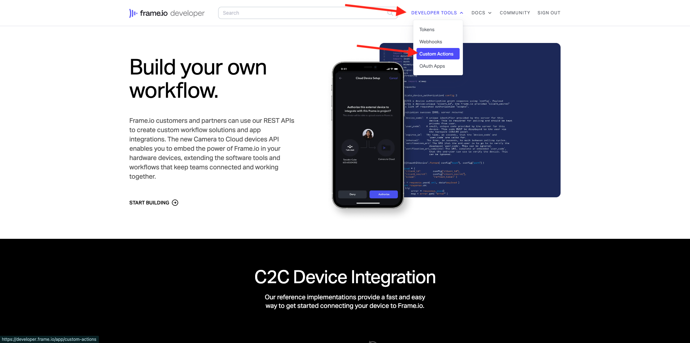

# 1.2.5 E/S de cuadro y Workfront Fusion

En el ejercicio anterior configuró el escenario `--aepUserLdap-- - Firefly + Photoshop` y configuró un webhook entrante para almacenar en déclencheur el escenario, así como una respuesta de webhook cuando el escenario se haya completado correctamente. A continuación, utilizó Postman para almacenar en déclencheur ese escenario. Postman es una buena herramienta de prueba, pero en un escenario empresarial real los usuarios empresariales no utilizarían Postman para almacenar en déclencheur un escenario. En su lugar, utilizarían otra aplicación y esperarían que otra aplicación activara un escenario en Workfront Fusion. En este ejercicio, eso es exactamente lo que va a hacer con Frame I/O.

## 1.2.5.1 accediendo a E/S de fotograma

>[!NOTE]
>
>Para completar correctamente este ejercicio, debe ser un usuario administrador en su cuenta de Frame I/O. El siguiente ejercicio se creó para Frame I/O V3 y se actualizará en una fase posterior para Frame I/O V4.

Vaya a [https://app.frame.io/projects](https://app.frame.io/projects).

Haga clic en el icono **+** para crear su propio proyecto en E/S de fotogramas.

Escriba el nombre `--aepUserLdap--` y haga clic en **Crear proyecto**.

A continuación, verá su proyecto en el menú de la izquierda.
En uno de los ejercicios anteriores, descargó [citisignal-fiber.psd](./../../../assets/ff/citisignal-fiber.psd){target="_blank"} a su escritorio. Seleccione ese archivo y, a continuación, arrástrelo y suéltelo en la carpeta del proyecto que acaba de crear.

## 1.2.5.2 E/S de Workfront Fusion y Frame

En el ejercicio anterior creó el escenario `--aepUserLdap-- - Firefly + Photoshop`, que comenzó con un webhook personalizado y terminó con una respuesta de webhook. El uso de los webhooks fue entonces probado usando Postman, pero obviamente, el punto de tal escenario es ser llamado por una aplicación externa. Como se ha indicado anteriormente, Frame I/O será ese ejercicio, pero entre Frame I/O y `--aepUserLdap-- - Firefly + Photoshop` se necesita otro escenario de Workfront Fusion. ahora configurará ese escenario.

En el menú de la izquierda, vaya a **Escenarios** y seleccione su carpeta `--aepUserLdap--`. Haga clic Crear **un escenario** nuevo.

Utilice el nombre `--aepUserLdap-- - Frame IO Custom Action`.

Haga clic en **objeto de signo de interrogación** en el lienzo. Escriba el texto `webhook` en el cuadro de búsqueda y haga clic en **Webhooks**.

Haga clic en **webhook personalizado**.

Haga clic en **Agregar** para crear una nueva URL de enlace web.

Para el **nombre del webhook**, use `--aepUserLdap-- - Frame IO Custom Action Webhook`. Haga clic en **Guardar**.

Entonces debería ver esto. Deje esta pantalla abierta y sin tocar, ya que la necesitará en un paso siguiente. Tendrás que copiar el URL de webhook en un siguiente paso, haciendo clic en **Copiar dirección a portapapeles**.

Vaya a [https://developer.frame.io/](https://developer.frame.io/). Haga clic en **HERRAMIENTAS PARA DESARROLLADORES** y, a continuación, elija **Acciones personalizadas**.

Haga clic en **Crear una acción personalizada**.

Introduzca los siguientes valores:

- **NOMBRE:** use `vangeluw - Frame IO Custom Action Fusion`
- **DESCRIPCIÓN:** uso `vangeluw - Frame IO Custom Action Fusion`
- **EVENTO:** use `fusion.tutorial`.
- **URL**: introduzca el URL del webhook que acaba de crear en Workfront Fusion
- **EQUIPO**: seleccione el equipo de E/S de fotogramas adecuado, en este caso **Un tutorial de Adobe**.

Haga clic en **Enviar**.

Entonces debería ver esto.

Regrese a [https://app.frame.io/projects](https://app.frame.io/projects). Actualizar el Página.

Después de haber actualizado la página, haga clic en los 3 puntos **...** del recurso **citisignal-fiber.psd**. A continuación, debería ver la acción personalizada que creó anteriormente en el menú que se muestra. Haga clic en la acción personalizada `vangeluw - Frame IO Custom Action Fusion`.

Debería ver un **de éxito similar.** elemento emergente. Esta ventana emergente es el resultado de la comunicación entre E/S de marco y Workfront Fusion.

Vuelva a cambiar la pantalla a Workfront Fusion. **En el objeto Webhook personalizado aparecerá Determinado** correctamente. Haga clic en **Aceptar**.

Haga clic en **Ejecutar una vez** para habilitar el modo de prueba y vuelva a probar la comunicación con Frame I/O.

Vuelva a Frame I/O y haga clic de nuevo en la acción personalizada `vangeluw - Frame IO Custom Action Fusion`.

Cambie la pantalla a Workfront Fusion. Ahora debería ver una marca de verificación verde y una burbuja que muestre **1**. Haga clic en la burbuja para ver los detalles.

La vista detallada de la burbuja muestra los datos recibidos desde E/S de fotograma. Debe ver varios ID de. Por ejemplo, el campo **resource.id** muestra el ID único en E/S de fotograma del recurso **citisignal-fiber.psd**

Ahora que se ha establecido la comunicación entre Frame I/O y Workfront Fusion, puede continuar con la configuración.

## 1.2.5.3 que proporciona una respuesta de formulario personalizada a Frame I/O.

## Pasos siguientes

Ir a [1.2.6 E/S de fotogramas para Fusion a Recursos AEM](./ex6.md){target="_blank"}

Volver a [Automatización del flujo de trabajo de Creative con Workfront Fusion](./automation.md){target="_blank"}

Volver a [Todos los módulos](./../../../overview.md){target="_blank"}

