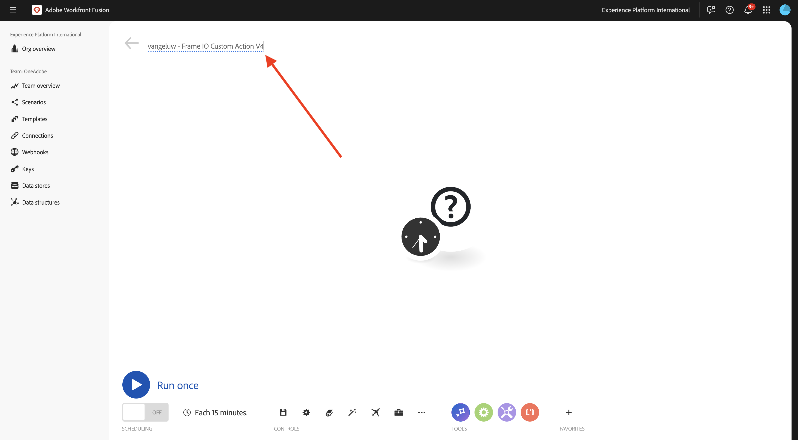
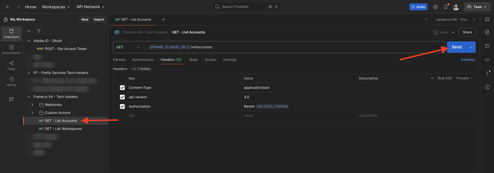
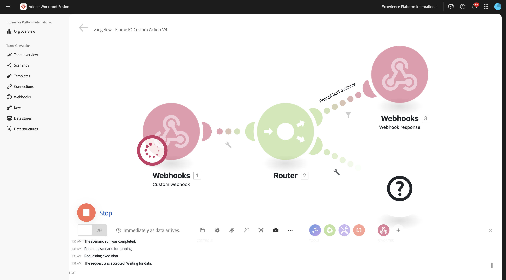
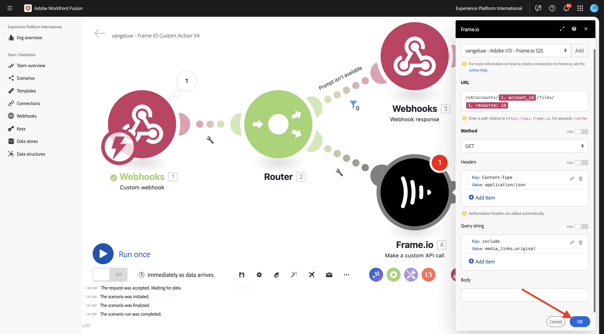
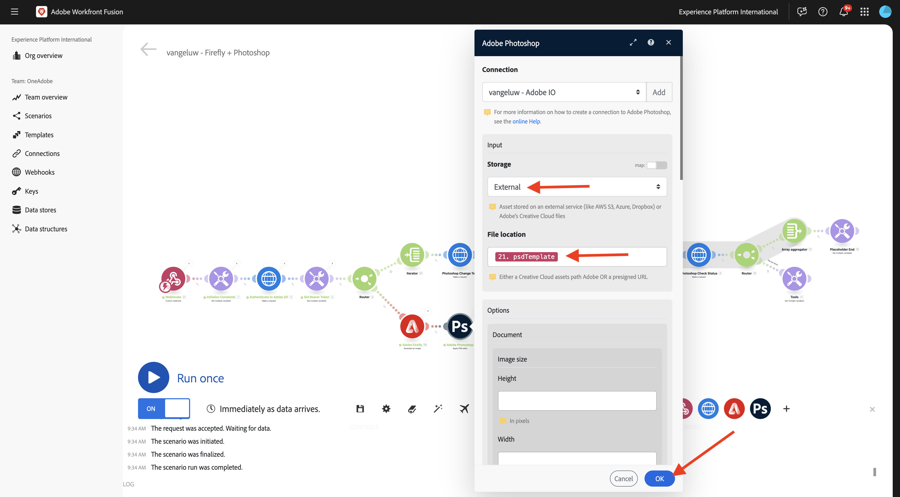

# 1.2.3 Frame.io y Workfront Fusion

En el ejercicio anterior configuró el escenario `--aepUserLdap-- - Firefly + Photoshop` y configuró un webhook entrante para almacenar en déclencheur el escenario, así como una respuesta de webhook cuando el escenario se haya completado correctamente. A continuación, utilizó Postman para almacenar en déclencheur ese escenario. Postman es una buena herramienta de prueba, pero en un escenario empresarial real los usuarios empresariales no utilizarían Postman para almacenar en déclencheur un escenario. En su lugar, utilizarían otra aplicación y esperarían que otra aplicación activara un escenario en Workfront Fusion. En este ejercicio, eso es exactamente lo que hará con Frame.io.

>[!NOTE]
>
>Este ejercicio se ha creado para Frame.io V4. Algunas de las siguientes capacidades utilizadas en el ejercicio están actualmente en formato alfa y no están disponibles en general todavía.

## 1.2.3.1 requisitos previos

Antes de continuar con este ejercicio, debes haber completado la configuración de [tu proyecto de Adobe I/O](./../../../modules/getting-started/gettingstarted/ex6.md), incluyendo la adición de la API **Frame.io** a tu proyecto de Adobe I/O, y también debes haber configurado una aplicación para interactuar con las API, como [Postman](./../../../modules/getting-started/gettingstarted/ex7.md) o [PostBuster](./../../../modules/getting-started/gettingstarted/ex8.md).

## 1.2.3.2 accediendo a Frame.io

Vaya a [https://next.frame.io/](https://next.frame.io/){target="_blank"}.


Haga clic en el icono de instancia para comprobar en qué instancia ha iniciado sesión. Elija la instancia a la que se le ha concedido acceso, que debe ser `--aepImsOrgName--`.

Haga clic en **+ Nuevo proyecto** para crear su propio proyecto en Frame.io.


Seleccione la plantilla **En blanco** y, a continuación, escriba el nombre `--aepUserLdap--` para el proyecto. Haga clic en **Crear nuevo proyecto**.


A continuación, verá el proyecto en el menú de la izquierda. Haga clic en el icono **+** y luego seleccione **Nueva carpeta**.


Escriba el nombre `CitiSignal Fiber Campaign` y haga doble clic en la carpeta para abrirla.


Haga clic en **Cargar**.


En uno de los ejercicios anteriores, descargó [citisignal-fiber.psd](./../../../assets/ff/citisignal-fiber.psd){target="_blank"}. Seleccione ese archivo y haga clic en **Abrir**.


El archivo **citisignal-fiber.psd** estará disponible en la carpeta recién creada.


## 1.2.3.3 Workfront Fusion y Frame.io

En el ejercicio anterior creó el escenario `--aepUserLdap-- - Firefly + Photoshop`, que comenzó con un webhook personalizado y terminó con una respuesta de webhook. El uso de los webhooks fue entonces probado usando Postman, pero obviamente, el punto de tal escenario es ser llamado por una aplicación externa. Como se ha indicado anteriormente, Frame.io será ese ejercicio, pero entre Frame.io y `--aepUserLdap-- - Firefly + Photoshop` se necesita otro escenario de Workfront Fusion. ahora configurará ese escenario.

Vaya a [https://experience.adobe.com/](https://experience.adobe.com/){target="_blank"}. Abra **Workfront Fusion**.


En el menú de la izquierda, vaya a **Escenarios** y seleccione la carpeta `--aepUserLdap--`. Haga clic en **Crear un nuevo escenario**.


Use el nombre `--aepUserLdap-- - Frame IO Custom Action V4`.



Haga clic en **objeto de signo de interrogación** en el lienzo. Escriba el texto `webhook` en el cuadro de búsqueda y haga clic en **Webhooks**.


Haga clic en **webhook personalizado**.


Haga clic en **Agregar** para crear una nueva URL de enlace web.


Para el **nombre del webhook**, use `--aepUserLdap-- - Frame IO Custom Action Webhook`. Haga clic en **Guardar**.


Entonces debería ver esto. Deje esta pantalla abierta y sin tocar, ya que la necesitará en un paso siguiente. En un paso siguiente, tendrás que copiar la URL del webhook, haciendo clic en **Copiar dirección al portapapeles**.


## API de acciones personalizadas de 1.2.3.4 Frame.io V4

Vaya a Postman y abra la solicitud **POST - Obtener token de acceso** en la colección **Adobe IO - OAuth**. Compruebe el campo **ámbito** en **Parámetros**. El campo **ámbito** debe incluir el ámbito `frame.s2s.all`. Si falta, por favor, añádalo. A continuación, haga clic en **Enviar** para solicitar un nuevo **token de acceso**.


A continuación, abra la solicitud **GET - Enumerar cuentas** en la colección **Frame.io V4 - Perspectivas técnicas**. Haga clic en **Enviar**.



Debería ver una respuesta similar que contenga una o más cuentas. Revise la respuesta y busque el campo **id** para la cuenta de Frame.io V4 que está usando. Puede encontrar el nombre de la cuenta en la interfaz de usuario de Frame.io V4:


Copie el valor del campo **id**.


En el menú de la izquierda, ve a **Entornos** y selecciona el entorno que estás usando. Busque la variable **`FRAME_IO_ACCOUNT_ID`** y pegue el **id** que obtuvo de la solicitud anterior en las columnas **Valor inicial** y **Valor actual**. Haga clic en **Guardar**.


En el menú de la izquierda, vuelva a **Colecciones**. Abra la solicitud **GET - Enumerar espacios de trabajo** en la colección **Frame.io V4 - Perspectivas técnicas**. Haga clic en **Enviar**.


Debería ver una respuesta similar que contenga una o más cuentas. Revise la respuesta y busque el campo **id** para la Workspace Frame.io V4 que está utilizando. Copie el valor del campo **id**.


En el menú de la izquierda, ve a **Entornos** y selecciona el entorno que estás usando. Busque la variable **`FRAME_IO_WORKSPACE_ID`** y pegue el **id** que obtuvo de la solicitud anterior en las columnas **Valor inicial** y **Valor actual**. Haga clic en **Guardar**.


En el menú de la izquierda, vuelva a **Colecciones**. Abra la solicitud **POST - Crear acción personalizada** en la colección **Frame.io V4 - Perspectivas técnicas**, en la carpeta **Acciones personalizadas**.

Vaya a **Cuerpo** de la solicitud. Cambie el campo **name** a `--aepUserLdap--  - Frame.io Custom Action V4` y luego cambie el campo **url** al valor de la URL del webhook que copió de Workfront Fusion.

Haga clic en **Enviar**.


Se ha creado la acción personalizada Frame.io V4.


Vuelva a [https://next.frame.io/](https://next.frame.io/){target="_blank"} y vaya a la carpeta **CitiSignal Fiber Campaign** que creó en su proyecto `--aepUserLdap--`. Actualice la página.


Después de haber actualizado la página, haga clic en los 3 puntos **...** del recurso **citisignal-fiber.psd** y abra el menú **Acciones personalizadas**. A continuación, debería ver la acción personalizada que creó anteriormente en el menú que se muestra. Haga clic en la acción personalizada `--aepUserLdap-- - Frame IO Custom Action Fusion V4`.


Debería ver una ventana emergente **Acción personalizada** similar. Esta ventana emergente es el resultado de la comunicación entre Frame.io y Workfront Fusion.


Vuelva a cambiar la pantalla a Workfront Fusion. Ahora debería ver **Determinado correctamente** en el objeto Webhook personalizado. Haga clic en **Aceptar**.


Haga clic en **Ejecutar una vez** para habilitar el modo de prueba y vuelva a probar la comunicación con Frame.io.


Vuelva a Frame.io y haga clic de nuevo en la acción personalizada `--aepUserLdap-- - Frame IO Custom Action Fusion V4`.


Cambie la pantalla a Workfront Fusion. Ahora debería ver una marca de verificación verde y una burbuja que muestre **1**. Haga clic en la burbuja para ver los detalles.


La vista detallada de la burbuja muestra los datos recibidos de Frame.io. Debe ver varios ID de. Por ejemplo, el campo **resource.id** muestra el ID único en Frame.io del recurso **citisignal-fiber.psd**.


Ahora que se ha establecido la comunicación entre Frame.io y Workfront Fusion, puede continuar con la configuración.

## 1.2.3.5 que proporciona una respuesta de formulario personalizada a Frame.io

Cuando se invoca la acción personalizada en Frame.io, Frame.io espera recibir una respuesta de Workfront Fusion. Si piensa en el escenario que creó en el ejercicio anterior, se requieren varias variables para actualizar el archivo PSD estándar de Photoshop. Estas variables se definen en la carga útil utilizada:

```json
{
    "psdTemplate": "citisignal-fiber.psd",
    "xlsFile": "placeholder",
    "prompt":"misty meadows",
    "cta": "Buy this now!",
    "button": "Click here to buy!"
}
```

Así que para que el escenario `--aepUserLdap-- - Firefly + Photoshop` se ejecute correctamente, se necesitan campos como **prompt**, **cta**, **button** y **psdTemplate**.

Los tres primeros campos, **prompt**, **cta**, **button**, requieren la entrada del usuario que debe recopilarse en Frame.io cuando el usuario invoca la acción personalizada. Por lo tanto, lo primero que debe hacerse dentro de Workfront Fusion es comprobar si estas variables están disponibles o no y, en caso contrario, Workfront Fusion debe responder a Frame.io solicitando que se introduzcan dichas variables. La manera de conseguirlo es utilizando un formulario en Frame.io.

Vuelva a Workfront Fusion y abra su escenario `--aepUserLdap-- - Frame IO Custom Action`. Pase el ratón sobre el objeto **webhook personalizado** y haga clic en el icono **+** para agregar otro módulo.


Busque `Flow Control` y haga clic en **Control de flujo**.


Haga clic para seleccionar **enrutador**.


Entonces debería ver esto.


¿Desea hacer clic en **?** objeto y luego haga clic para seleccionar **Webhooks**.


Seleccione **Respuesta de webhook**.


Entonces debería ver esto.


Copie el siguiente código JSON y péguelo en el campo **Cuerpo**.


```json
{
  "title": "What do you want Firefly to generate?",
  "description": "Enter your Firefly prompt.",
  "fields": [
    {
      "type": "text",
      "label": "Prompt",
      "name": "Prompt",
      "value": ""
    },
    {
      "type": "text",
      "label": "CTA Text",
      "name": "CTA Text",
      "value": ""
    },
    {
      "type": "text",
      "label": "Button Text",
      "name": "Button Text",
      "value": ""
    }
  ]
}
```

Haga clic en el icono para limpiar y embellecer el código JSON. A continuación, haga clic en **Aceptar**.


Haga clic en **Guardar** para guardar los cambios.


A continuación, debe configurar un filtro para asegurarse de que esta ruta del escenario solo se ejecute cuando no haya ninguna solicitud disponible. Haz clic en el icono **llave inglesa** y, a continuación, selecciona **Configurar un filtro**.


Configure los campos siguientes:

- **Etiqueta**: use `Prompt isn't available`.
- **Condición**: use `{{1.data.Prompt}}`.
- **Operadores básicos**: seleccione **No existe**.

>[!NOTE]
>
>Las variables de Workfront Fusion se pueden especificar manualmente con esta sintaxis: `{{1.data.Prompt}}`. El número de la variable hace referencia al módulo en el escenario. En este ejemplo, puede ver que el primer módulo del escenario se llama **Webhooks** y tiene un número de secuencia de **1**. Esto significa que la variable `{{1.data.Prompt}}` tendrá acceso al campo **data.Prompt** desde el módulo con el número de secuencia 1. Los números de secuencia a veces pueden ser diferentes, por lo que debe prestar atención al copiar/pegar estas variables y comprobar siempre que el número de secuencia utilizado sea el correcto.

Haga clic en **Aceptar**.


Entonces debería ver esto. Primero haz clic en el icono **Guardar** y luego haz clic en **Ejecutar una vez** para probar el escenario.


Entonces debería ver esto.


Vuelva a Frame.io y haga clic en la acción personalizada `--aepUserLdap-- - Frame IO Custom Action Fusion` en el recurso **citisignal-fiber.psd** de nuevo.


Ahora debería ver un mensaje dentro de Frame.io. No rellene los campos aún y no envíe el formulario aún. Este mensaje se muestra a partir de la respuesta de Workfront Fusion que acaba de configurar.


Vuelva a Workfront Fusion y haga clic en la burbuja del módulo **Respuesta de webhook**. Verá que en **INPUT**, verá el cuerpo que contiene la carga útil JSON para el formulario. Haga clic en **Ejecutar una vez** de nuevo.


Debería volver a ver esto.



Vuelva a Frame.io y rellene los campos como se indica.

- **Aviso**: rayos láser futuristas que recorren el espacio
- **CTA**: ¡Viaje en el tiempo ahora!
- **Texto de botón**: ¡Sube a bordo!

Haga clic en **Enviar**.


A continuación, debería ver una ventana emergente en Frame.io con este aspecto.


Vuelva a Workfront Fusion y haga clic en la burbuja del módulo **Gancho web personalizado**. En la operación 1, en **OUTPUT**, ahora puede ver un nuevo objeto **data** que contiene campos como **Button Text**, **CTA Text** y **Prompt**. Con estas variables de entrada de usuario disponibles en su escenario, tiene suficiente para continuar con la configuración.


## 1.2.3.6 Recuperar ubicación de archivo de Frame.io

Como se mencionó anteriormente, se necesitan campos como **prompt**, **cta**, **button** y **psdTemplate** para que este escenario funcione. Los primeros 3 campos ya están disponibles, pero falta la **psdTemplate** que se va a usar. **psdTemplate** hará referencia a una ubicación Frame.io, ya que el archivo **citisignal-fiber.psd** está hospedado en Frame.io. Para recuperar la ubicación de ese archivo, debe configurar y utilizar la conexión Frame.io en Workfront Fusion.

Vuelva a Workfront Fusion y abra su escenario `--aepUserLdap-- - Frame IO Custom Action V4`. ¿Desea pasar el ratón sobre **?Módulo**, haga clic en el icono **+** para agregar otro módulo y buscar `frame`. Haga clic en **Frame.io**.


Haga clic en **Frame.io**.


Haga clic en **Realizar una llamada de API personalizada**.


Para utilizar la conexión Frame.io, primero debe configurarla. Haga clic en **Agregar** para hacerlo.


Seleccione **Tipo de conexión** **Servidor IMS al servidor** e introduzca el nombre `--aepUserLdap-- - Adobe I/O - Frame.io S2S`.


A continuación, debe ingresar **ID de cliente** y **Secreto de cliente** del proyecto de Adobe I/O que configuró como parte del módulo **Introducción**. Puedes encontrar los **ID de cliente** y el **Secreto de cliente** de tu proyecto Adobe I/O [aquí](https://developer.adobe.com/console/projects.){target="_blank"}.


Vuelva a su escenario en Workfront Fusion. Pegue los valores de **Client ID** y **Client Secret** en su campo respectivo en la ventana de configuración de conexión. Haga clic en **Continuar**. Workfront Fusion probará su conexión a partir de ahora.


Si la conexión se probó correctamente, aparecerá automáticamente en **Conexión**. Ahora tiene una conexión correcta y debe finalizar la configuración para obtener todos los detalles del recurso de Frame.io, incluida la ubicación del archivo. Para ello, debe usar el **ID de recurso**.


Frame.io comparte el campo **Resource ID** con Workfront Fusion como parte de la comunicación inicial de **gancho web personalizado** y se puede encontrar en el campo **resource.id**.

Para la configuración del módulo **Frame.io: realice una llamada de API personalizada**, use la dirección URL: `/v4/accounts/{{1.account_id}}/files/{{1.resource.id}}`.

>[!NOTE]
>
>Las variables de Workfront Fusion se pueden especificar manualmente con esta sintaxis: `{{1.account_id}}` y `{{1.resource.id}}`. El número de la variable hace referencia al módulo en el escenario. En este ejemplo, puede ver que el primer módulo del escenario se llama **Webhooks** y tiene un número de secuencia de **1**. Esto significa que las variables `{{1.account_id}}` y `{{1.resource.id}}` tendrán acceso a ese campo desde el módulo con el número de secuencia 1. Los números de secuencia a veces pueden ser diferentes, por lo que debe prestar atención al copiar/pegar estas variables y comprobar siempre que el número de secuencia utilizado sea el correcto.

A continuación, haga clic en **+ Agregar elemento** en **Cadena de consulta**.


Escriba estos valores y haga clic en **Agregar**.

| Clave | Valor |
|:-------------:| :---------------:| 
| `include` | `media_links.original` |


Ahora debería tener esto. Haga clic en **Aceptar**.



A continuación, debe configurar un filtro para asegurarse de que esta ruta del escenario solo se ejecute cuando no haya ninguna solicitud disponible. Haz clic en el icono **llave inglesa** y, a continuación, selecciona **Configurar un filtro**.


Configure los campos siguientes:

- **Etiqueta**: use `Prompt is available`.
- **Condición**: use `{{1.data.Prompt}}`.
- **Operadores básicos**: seleccione **Existe**.

>[!NOTE]
>
>Las variables de Workfront Fusion se pueden especificar manualmente con esta sintaxis: `{{1.data.Prompt}}`. El número de la variable hace referencia al módulo en el escenario. En este ejemplo, puede ver que el primer módulo del escenario se llama **Webhooks** y tiene un número de secuencia de **1**. Esto significa que la variable `{{1.data.Prompt}}` tendrá acceso al campo **data.Prompt** desde el módulo con el número de secuencia 1. Los números de secuencia a veces pueden ser diferentes, por lo que debe prestar atención al copiar/pegar estas variables y comprobar siempre que el número de secuencia utilizado sea el correcto.

Haga clic en **Aceptar**.


Ahora debería ver esto. Guarde los cambios y haga clic en **Ejecutar una vez** para probar el escenario.


Vuelva a Frame.io y haga clic en la acción personalizada `--aepUserLdap-- - Frame IO Custom Action Fusion V4` en el recurso **citisignal-fiber.psd** de nuevo.


Ahora debería ver un mensaje dentro de Frame.io. No rellene los campos aún y no envíe el formulario aún. Este mensaje se muestra a partir de la respuesta de Workfront Fusion que acaba de configurar.


Cambie a Workfront Fusion. Haga clic en **Ejecutar una vez** de nuevo.


Vuelva a Frame.io y rellene los campos como se indica. Haga clic en **Enviar**.

- **Aviso**: rayos láser futuristas que recorren el espacio
- **CTA**: ¡Viaje en el tiempo ahora!
- **Texto de botón**: ¡Sube a bordo!


Vuelva a Workfront Fusion y haga clic en la burbuja del módulo **Frame.io: realice una llamada de API personalizada**.


En **SALIDA** > **Cuerpo** > **datos**, ahora puede ver muchos metadatos sobre el recurso específico **citisignal-fiber.psd**.


La información específica necesaria para este caso de uso es la dirección URL de ubicación del archivo **citisignal-fiber.psd**, que puede encontrar desplazándose hacia abajo hasta el campo **media_links** > **Original** > **download_url**.


Ahora tiene disponible toda la información (**prompt**, **cta**, **button** y **psdTemplate**) necesaria para que este caso de uso funcione.

## 1.2.3.7 Invocar escenario de Workfront

En el ejercicio anterior configuró el escenario `--aepUserLdap-- - Firefly + Photoshop`. Ahora debe realizar un cambio menor en ese escenario.

Abra el escenario `--aepUserLdap-- - Firefly + Photoshop` en otra pestaña y haga clic en el primer módulo **Adobe Photoshop - Aplicar ediciones de PSD**. Ahora debería ver que el archivo de entrada está configurado para utilizar una ubicación dinámica en Microsoft Azure. Dado que, para este caso de uso, el archivo de entrada ya no se almacena en Microsoft Azure, sino que utiliza el almacenamiento Frame.io, debe cambiar esta configuración.


Cambie **Storage** a **External** y cambie **File location** para usar únicamente la variable **psdTemplate** que se toma del módulo **Custom Webhook** entrante. Haga clic en **Aceptar** y, a continuación, haga clic en **Guardar** para guardar los cambios.



Haga clic en el módulo **Gancho web personalizado** y, a continuación, haga clic en **Copiar dirección al portapapeles**. Debe copiar la dirección URL, ya que deberá utilizarla en el otro escenario.


Vuelva a su escenario `--aepUserLdap-- - Frame IO Custom Action V4`. Pase el ratón sobre el módulo **Frame.io - Realizar una llamada de API personalizada** y haga clic en el icono **+**.


Escriba `http` y haga clic en **HTTP**.


Seleccione **Realizar una solicitud**.


Pegue la dirección URL del webhook personalizado en el campo **URL**. Establezca el **Método** en **POST**.


Establezca **Body type** en **Raw** y **Content type** en **JSON (application/json)**.
Pegue la siguiente carga útil JSON en el campo **Solicitar contenido** y active la casilla de verificación para **Analizar respuesta**.

```json
{
    "psdTemplate": "citisignal-fiber.psd",
    "xlsFile": "placeholder",
    "prompt":"misty meadows",
    "cta": "Buy this now!",
    "button": "Click here to buy!"
}
```

Ahora tiene una carga útil estática configurada, pero debe volverse dinámica mediante las variables recopiladas anteriormente.


Para el campo **psdTemplate**, reemplace la variable estática **citisignal-fiber.psd** por la variable **`Body > data > media_links > original > download_url`**.


Para los campos **prompt**, **cta** y **button**, reemplace las variables estáticas por las variables dinámicas que se insertaron en el escenario mediante la solicitud entrante de webhook desde Frame.io, que son los campos **data.Prompt**, **data.CTA Text** y **data.Button Text**.

Además, habilite la casilla de verificación para **Analizar respuesta**.

Haga clic en **Aceptar**.


Haga clic en **Guardar** para guardar los cambios.


## 1.2.3.8 Guardar nuevo recurso en Frame.io

Una vez que se haya invocado el otro escenario de Workfront Fusion, el resultado será una nueva plantilla de Photoshop PSD disponible. Ese archivo PSD debe almacenarse de nuevo en Frame.io, que es el último paso en este escenario.

Pase el ratón sobre el módulo **HTTP - Make a request** y haga clic en el icono **+**.


Seleccione **Frame.io**.


Seleccione **Realizar una llamada de API personalizada**.


La conexión de Frame.io se seleccionará automáticamente.


Para la configuración del módulo **Frame.io: realice una llamada de API personalizada**, use la dirección URL: `/v4/accounts/{{1.account_id}}/folders/{{4.body.data.parent_id}}/files/remote_upload`.

>[!NOTE]
>
>Como se ha indicado anteriormente, las variables de Workfront Fusion se pueden especificar manualmente con esta sintaxis: `{{1.account_id}}` y `{{4.body.data.parent_id}}`. El número de la variable hace referencia al módulo en el escenario.
>En este ejemplo, puede ver que el primer módulo del escenario se llama **Webhooks** y tiene un número de secuencia de **1**. Esto significa que la variable `{{1.account_id}}` accederá a ese campo desde el módulo con el número de secuencia 1.
>En este ejemplo, puede ver que el cuarto módulo del escenario se llama **Frame.io - Realizar una llamada de API personalizada** y tiene un número de secuencia de **4**. Esto significa que la variable `{{4.body.data.parent_id}}` accederá a ese campo desde el módulo con el número de secuencia 4.
>Si los números de secuencia de los módulos son diferentes, deberá actualizar las variables en la URL anterior para que se vinculen al módulo correcto.


Cambie el campo **Method** a **POST**.

Copie y pegue el siguiente fragmento JSON en el campo **Cuerpo**.

```json
{
  "data": {
    "name": "citisignal-fiber-{{timestamp}}.psd",
    "source_url": "{{6.data.newPsdTemplate}}"
  }
}
```

>[!NOTE]
>
>Las variables de Workfront Fusion se pueden especificar manualmente con esta sintaxis: `{{6.data.newPsdTemplate}}`. El número de la variable hace referencia al módulo en el escenario. En este ejemplo, puede ver que el sexto módulo del escenario se llama **HTTP - Realizar una solicitud** y tiene un número de secuencia de **6**. Esto significa que la variable `{{6.data.newPsdTemplate}}` tendrá acceso al campo **data.newPsdTemplate** desde el módulo con el número de secuencia 6.
>Si los números de secuencia del módulo son diferentes, deberá actualizar la variable en la URL anterior para que esté vinculada al módulo correcto.

Haga clic en **Aceptar**.


Haga clic en **Guardar** para guardar los cambios.


## 1.2.3.9: pruebe su caso de uso de extremo a extremo

Haga clic en **Ejecutar una vez** en su escenario `--aepUserLdap-- - Frame IO Custom Action`.


Vuelva a Frame.io y haga clic en la acción personalizada `--aepUserLdap-- - Frame IO Custom Action Fusion V4` en el recurso **citisignal-fiber.psd** de nuevo.


Ahora debería ver un mensaje dentro de Frame.io. No rellene los campos aún y no envíe el formulario aún. Este mensaje se muestra a partir de la respuesta de Workfront Fusion que acaba de configurar.


Cambie a Workfront Fusion. Haga clic en **Ejecutar una vez** en su escenario `--aepUserLdap-- - Frame IO Custom Action V4`.


En Workfront Fusion, abra el escenario `--aepUserLdap-- - Firefly + Photoshop` y haga clic en **Ejecutar una vez** en ese escenario.


Vuelva a Frame.io y rellene los campos como se indica. Haga clic en **Enviar**.

- **Aviso**: rayos láser futuristas que recorren el espacio
- **CTA**: ¡Viaje en el tiempo ahora!
- **Texto de botón**: ¡Sube a bordo!


Después de 1-2 minutos, debería ver un nuevo recurso que aparece automáticamente en Frame.io. Haga doble clic en el nuevo recurso para abrirlo.


Ahora puede ver claramente que todas las variables de entrada del usuario se han aplicado automáticamente.


Ahora ha completado correctamente este ejercicio.

## Próximos pasos

Ir a [1.2.6 Frame.io para Fusion para AEM Assets](./ex6.md){target="_blank"}

Volver a [Automatización del flujo de trabajo de Creative con Workfront Fusion](./automation.md){target="_blank"}

Volver a [Todos los módulos](./../../../overview.md){target="_blank"}

