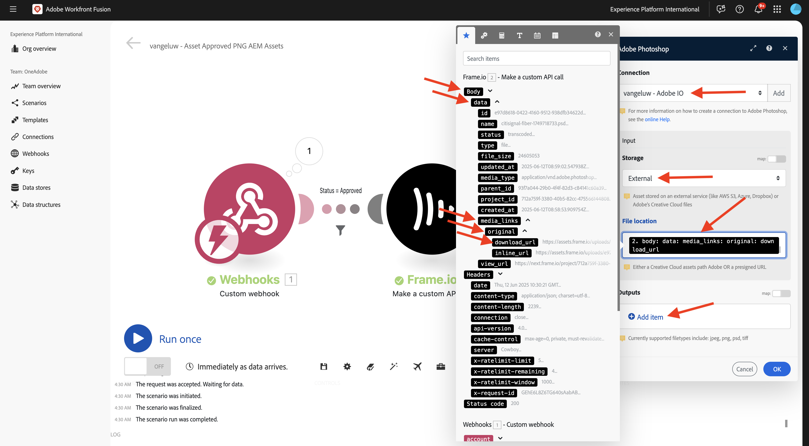
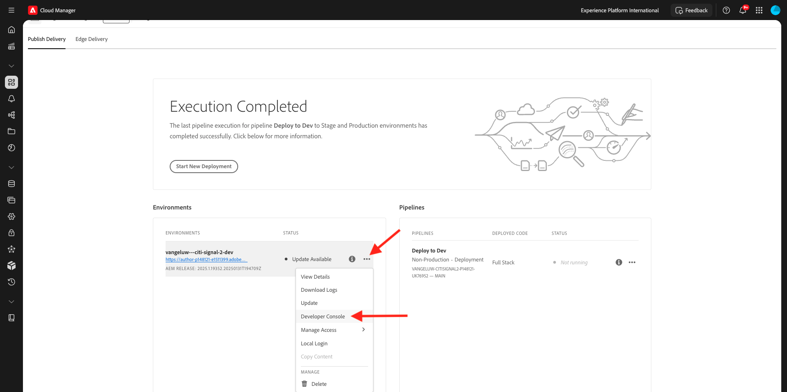
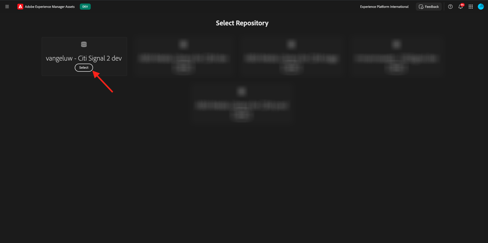

# 1.2.6 E/S de cuadro a Workfront Fusion para AEM Assets

>[!IMPORTANT]
>
>Para completar este ejercicio, debe tener acceso a un entorno de trabajo de AEM Assets y autores de CS. Si sigue el ejercicio [Adobe Experience Manager Cloud Service &amp; Edge Delivery Services](./../../../modules/asset-mgmt/module2.1/aemcs.md){target="_blank"}, tendrá acceso a dicho entorno.

>[!IMPORTANT]
>
>Si ha configurado anteriormente un programa de AEM Assets CS con un entorno de creación, es posible que la zona protegida de AEM CS esté en hibernación. Dado que la dehibernación de una zona protegida de este tipo tarda de 10 a 15 minutos, sería aconsejable iniciar el proceso de dehibernación ahora para no quedarse atascado más adelante.

En el ejercicio anterior configuró un escenario que genera automáticamente variaciones de un archivo PSD de Adobe Photoshop utilizando Adobe Firefly, las API de Photoshop y Workfront Fusion. El resultado de ese escenario fue un nuevo archivo PSD de Photoshop.

Los equipos empresariales, sin embargo, no necesitan un archivo PSD, sino un archivo PNG o un archivo JPG. En este ejercicio, configurará una nueva automatización que dará como resultado la generación de un archivo PNG una vez aprobado el recurso en E/S de fotograma y que el archivo PNG se almacenará automáticamente en AEM Assets.

## 1.2.6.1 Crear un nuevo escenario

Vaya a [https://experience.adobe.com/](https://experience.adobe.com/){target="_blank"}. Abra **Workfront Fusion**.

En el menú de la izquierda, vaya a **Escenarios** y seleccione la carpeta `--aepUserLdap--`. Haga clic en **Crear un nuevo escenario**.

Use el nombre `--aepUserLdap-- - Asset Approved PNG AEM Assets`. A continuación, haga clic en **?Módulo**, escriba el término de búsqueda `webhook` y haga clic en **Webhooks**.

Haga clic en **webhook personalizado**.

Haga clic en **Agregar** para crear un nuevo enlace web.

Use el nombre `--aepUserLdap-- - Frame.io Webhook`. Haga clic en **Guardar**.

Entonces debería ver esto. Haga clic en **Copiar dirección al portapapeles**.

## 1.2.6.2 Configurar webhook en Frame.io

Vaya a [https://developer.frame.io/](https://developer.frame.io/){target="_blank"}. Haga clic en **HERRAMIENTAS PARA DESARROLLADORES** y, a continuación, elija **Acciones personalizadas**.

Haga clic en **Crear un webhook**.

Introduzca los siguientes valores:

- **NOMBRE**: use `--aepUserLdap-- - Asset Labels Updated`
- **URL**: introduzca la URL del webhook que acaba de crear en Workfront Fusion
- **EQUIPO**: seleccione el equipo Frame.io apropiado, en este caso **Un tutorial de Adobe**.

Desplácese hacia abajo y habilite la casilla que está junto a **Etiquetas de recursos - actualizado**. Haga clic en **Enviar**.

Entonces debería ver esto.

Vaya a [https://app.frame.io/projects](https://app.frame.io/projects){target="_blank"} y luego a la carpeta que creó anteriormente, que debería llamarse `--aepUserLdap--`. Haga doble clic para abrir el recurso creado en el ejercicio anterior.

Entonces deberías ver algo como esto. Haga clic en el campo **Sin estado** y cambie el estado a **En curso**.

Cambie a Workfront Fusion. Ahora debería ver que la conexión se ha **determinado correctamente**.

Haga clic en **Guardar** para guardar los cambios y, a continuación, haga clic en **Ejecutar una vez** para realizar una prueba rápida.

Cambie a Frame.io, haga clic en el campo **En curso** y cambie el estado a **Necesita revisión**.

Vuelva a Workfront Fusion y haga clic en la burbuja del módulo **Gancho web personalizado**.

La vista detallada de la burbuja muestra los datos recibidos de Frame.io. Debe ver varios ID de. Por ejemplo, el campo **resource.id** muestra el ID único en Frame.io del recurso **citisignal-fiber.psd**.

## 1.2.6.3: obtener detalles de recursos de Frame.io

Ahora que la comunicación entre Frame.io y Workfront Fusion se ha establecido a través de un webhook personalizado, debería obtener más detalles sobre el recurso para el que se actualizó la etiqueta de estado. Para ello, utilizará una vez más el conector Frame.io en Workfront Fusion, de forma similar al ejercicio anterior.

¿Desea hacer clic en **?** módulo e introduzca el término de búsqueda `frame`. Haga clic en **Frame.io**.

Haga clic en **Frame.io (heredado)**.

Haga clic en **Obtener un recurso**.

Compruebe que la conexión está establecida en la misma conexión que creó en el ejercicio anterior, que debe llamarse `--aepUserLdap-- - Frame.io Token`.

A continuación, debe proporcionar **Asset ID**. Frame.io comparte el **ID de recurso** con Workfront Fusion como parte de la comunicación inicial de **gancho web personalizado**. Se puede encontrar en el campo **resource.id**. Seleccione **resource.id** y haga clic en **Aceptar**.

Haga clic en **Guardar** para guardar los cambios y, a continuación, haga clic en **Ejecutar una vez** para probar la configuración.

Cambie a Frame.io y haga clic en el campo **Necesita revisión** y cambie el estado a **En curso**.

Vuelva a Workfront Fusion y haga clic en la burbuja del módulo **Frame.io - Obtener un recurso**. Debería ver una descripción general similar.

En los detalles del recurso proporcionados por Frame.io, puede encontrar un campo denominado **Label** que está establecido en **in_progress**. Más adelante tendrá que utilizar ese campo para configurar un filtro.

## 1.2.6.4 convertir a PNG

Pase el ratón sobre el módulo **Frame.io - Obtener un recurso** y haga clic en el icono **+**.

Escriba el término de búsqueda `photoshop` y haga clic en **Adobe Photoshop**.

Haga clic en **Convertir formato de imagen**.

Compruebe que el campo **Conexión** está usando la conexión creada anteriormente, que se llama `--aepUserLdap-- - Adobe IO`.

En **Entrada**, establezca el campo **Almacenamiento** en **Externo** y la **Ubicación de archivo** para usar la variable **Original** que devuelve el módulo **Frame.io - Obtener un recurso**.

A continuación, haga clic en **Agregar elemento** en **Salidas**.

Para la configuración de **Output**, establezca el campo **Storage** en **Fusion internal storage** y el **Type** en **image/png**. Haga clic en **Guardar**.

Haga clic en **Aceptar**.

Haga clic en **Guardar** para guardar los cambios.

A continuación, debe configurar un filtro para asegurarse de que solo se procese un archivo PNG en el caso de los recursos que tengan un estado **Aprobado**. Para ello, haga clic en el icono **Wrench** entre los módulos **Frame.io - Obtener un recurso** y **Adobe Photoshop - Convertir formato de imagen** y, a continuación, seleccione **Configurar un filtro**.

Configure los campos siguientes:

- **Etiqueta**: use `Is Asset Approved`.
- **Condición**: seleccione el campo **Etiqueta** de la respuesta del módulo **Frame.io - Obtener un recurso**.
- **Operadores básicos**: seleccione **Igual a**.
- **Valor**: `approved`.

Haga clic en **Aceptar**.

Haga clic en **Guardar** para guardar los cambios y, a continuación, haga clic en **Ejecutar una vez** para probar la configuración.

Vuelva a Frame.io, haga clic en el campo **En curso** y cambie el estado a **Aprobado**.

Vuelva a Workfront Fusion. Ahora debería ver que todos los módulos de su escenario se han ejecutado correctamente. Haga clic en la burbuja en el módulo **Adobe Photoshop - Convertir formato de imagen**.

En los detalles de la ejecución del módulo **Adobe Photoshop - Convert image format**, puede ver que ahora se generó un archivo PNG. El siguiente paso es almacenar ese archivo en AEM Assets CS.

## 1.2.6.5 Almacenar PNG en AEM Assets CS

Pase el ratón sobre el módulo **Adobe Photoshop - Convertir formato de imagen** y haga clic en el icono **+**.

Escriba el término de búsqueda `aem` y seleccione **AEM Assets**.

Haga clic en **Cargar un recurso**.

Ahora debe configurar la conexión con AEM Assets CS. Haga clic en **Agregar**.

Utilice la siguiente configuración:

- **Tipo de conexión**: **AEM Assets as a Cloud Service**.
- **Nombre de conexión**: `--aepUserLdap-- AEM Assets CS`.
- **URL de instancia**: copie la URL de instancia del entorno de autor de AEM Assets CS, que debería tener el aspecto siguiente: `https://author-pXXXXX-eXXXXXXX.adobeaemcloud.com`.
- **Opciones de relleno de detalles de acceso**: seleccione **Proporcionar JSON**.

Ahora necesita proporcionar las **credenciales de la cuenta técnica en formato JSON**. Para ello, hay que seguir una serie de pasos a seguir mediante AEM Cloud Manager. Mientras lo hace, mantenga esta pantalla abierta.

Vaya a [https://my.cloudmanager.adobe.com](https://my.cloudmanager.adobe.com){target="_blank"}. La organización que debe seleccionar es `--aepImsOrgName--`. Entonces verás algo como esto. Haga clic para abrir el programa, que debe tener el nombre `--aepUserLdap-- - Citi Signal`.

Haga clic en los 3 puntos **...** y seleccione **Developer Console**.

Haga clic en **Iniciar sesión con Adobe**.

Luego se le redirige a **Developer Console**. Haga clic en **Crear nueva cuenta técnica**.

Entonces deberías ver algo como esto. Copie la carga útil JSON completa en el portapapeles.

Vuelva a Workfront Fusion y pegue la carga útil JSON completa en el campo **Credenciales de cuenta técnica en formato JSON**. Haga clic en **Continuar**.

La conexión se validará y, cuando se realice correctamente, la conexión se seleccionará automáticamente en el módulo AEM Assets. Lo siguiente que hay que hacer es configurar una carpeta. Como parte del ejercicio, debe crear una nueva carpeta dedicada.

Para crear una nueva carpeta dedicada, ve a [https://experience.adobe.com](https://experience.adobe.com/){target="_blank"}. Asegúrese de que esté seleccionada la instancia correcta de Experience Cloud, que debería ser `--aepImsOrgName--`. A continuación, haga clic en **Experience Manager Assets**.

Haga clic en **Seleccionar** en el entorno de AEM Assets CS, que debería llamarse `--aepUserLdap-- - Citi Signal dev`.

Vaya a **Assets** y haga clic en **Crear carpeta**.

Escriba el nombre `--aepUserLdap-- - Frame.io PNG` y haga clic en **Crear**.

A continuación, se crea la carpeta.

Vuelva a Workfront Fusion, haga clic **Haga clic aquí para elegir la carpeta** y, a continuación, elija la carpeta `--aepUserLdap-- - Frame.io PNG`.

Compruebe que el destino esté establecido en `--aepUserLdap-- - Frame.io PNG`. A continuación, en **Archivo Source**, seleccione **Mapa**.

En **Nombre de archivo**, elija la variable `{{3.filenames[]}}`.

En **Datos**, elija la variable `{{3.files[]}}`.

>[!NOTE]
>
>Las variables de Workfront Fusion se pueden especificar manualmente con esta sintaxis: `{{3.filenames[]}}`. El número de la variable hace referencia al módulo en el escenario. En este ejemplo, puede ver que el tercer módulo del escenario se llama **Adobe Photoshop - Convertir formato de imagen** y tiene un número de secuencia de **3**. Esto significa que la variable `{{3.filenames[]}}` tendrá acceso al campo **filenames[]** desde el módulo con el número de secuencia 3. Los números de secuencia a veces pueden ser diferentes, por lo que debe prestar atención al copiar/pegar estas variables y comprobar siempre que el número de secuencia utilizado sea el correcto.

Haga clic en **Aceptar**.

Haga clic en **Guardar** para guardar los cambios.

A continuación, debe establecer permisos específicos para la cuenta técnica que acaba de crear. Cuando se creó la cuenta en **Developer Console** en **Cloud Manager**, se le otorgaron derechos de acceso de **Lectura**, pero para este caso de uso, se requieren derechos de acceso de **Escritura**. Para ello, vaya al entorno de AEM CS Author.

Vaya a [https://my.cloudmanager.adobe.com](https://my.cloudmanager.adobe.com){target="_blank"}. La organización que debe seleccionar es `--aepImsOrgName--`. Haga clic para abrir el programa, que debe tener el nombre `--aepUserLdap-- - Citi Signal`. Entonces verás algo como esto. Haga clic en la URL del autor.

Haga clic en **Iniciar sesión con Adobe**.

Vaya a **Configuración** > **Seguridad** > **Usuarios**.

Haga clic en para abrir la cuenta de usuario de Technical Account.

Vaya a **Grupos** y agregue este usuario de cuenta técnica al grupo **Usuarios DAM**.

Haga clic en **Guardar y cerrar**.

Vuelva a Workfront Fusion. Haga clic en **Ejecutar una vez** para probar el escenario.

Cambie a Frame.io y asegúrese de que el estado del recurso se cambie a **Aprobado** de nuevo.

>[!NOTE]
>
>Es posible que tenga que cambiarlo primero a **En curso** o **Necesita revisión**, para luego volver a cambiarlo a **Aprobado**.

Su escenario de Workfront Fusion se activará y debería completarse correctamente. Al ver la información de la burbuja en el módulo **AEM Assets**, ya puede ver que el archivo PNG se almacenó correctamente en AEM Assets CS.

Vuelva a AEM Assets CS y abra la carpeta `--aepUserLdap-- - Frame.io PNG`. Ahora debería ver el archivo PNG generado como parte del escenario de Workfront Fusion. Haga doble clic para abrir el archivo.

Ahora puede ver más detalles sobre los metadatos del archivo PNG generado.

Ahora ha completado correctamente este ejercicio.

## Pasos siguientes

Vaya a [Resumen y ventajas de la automatización del flujo de trabajo de Creative con Workfront Fusion](./summary.md){target="_blank"}

Volver a [Automatización del flujo de trabajo de Creative con Workfront Fusion](./automation.md){target="_blank"}

Volver a [Todos los módulos](./../../../overview.md){target="_blank"}
