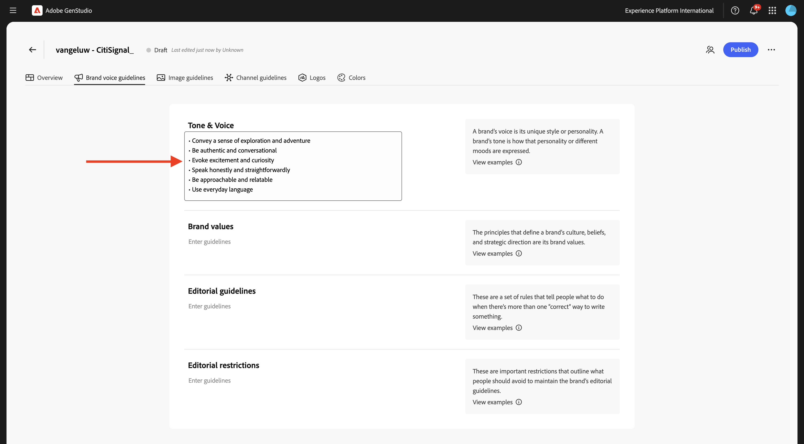

# 1.3.1 Configuración: marca

Vaya a [https://experience.adobe.com/](https://experience.adobe.com/){target="_blank"}. Abra **GenStudio**.


Entonces debería ver esto.


Lo primero que debe hacer para utilizar GenStudio for Performance Marketing es configurar su marca. Haga clic en el icono **Marcas**.


Haga clic en **+ Agregar marca**.


Escriba el nombre `--aepUserLdap-- - CitiSignal` de su marca. Seleccione **Agregar manualmente** y haga clic en **Agregar marca**.


## 1.3.1.1 colores

Entonces debería ver esto. Haga clic en **Colores**.


Haga clic en **+ Agregar color**.


Hay 4 colores diferentes para añadir:

- `#8821F4`
- `#14161A`
- `#EEEEEE`
- `#FF006C`

Escriba el código hexadecimal del color `#8821F4`. Haga clic en **Agregar**.


Haga clic en **+ Agregar color**.


Escriba el código hexadecimal del color `#14161A`. Haga clic en **Agregar**.


Haga clic en **+ Agregar color**.


Escriba el código hexadecimal del color `#EEEEEE `. Haga clic en **Agregar**.


Haga clic en **+ Agregar color**.


Escriba el código hexadecimal del color `#FF006C `. Haga clic en **Agregar**.


Ahora debería tener esto.


## 1.3.1.2 logotipos

Descargue el archivo [CitiSignal-GSPeM-assets.zip](../../../assets/gspem/CitiSignal-GSPeM-assets.zip) en su escritorio y descomprímalo.


A continuación, vaya a **Logotipos**. Haga clic en **+ Agregar logotipo**.


Haga clic en **Examinar**.


Vaya a la carpeta **CitiSignal-GSPeM-assets** > **logos** y seleccione estos archivos. Haga clic en **Abrir**.


Entonces deberías tener esto. Haga clic en **Agregar logotipos**.


Entonces deberías tener esto.


## 1.3.1.3 directrices de voz de marca

A continuación, vaya a **Directrices de marca**.


Para **Tono y voz**, use lo siguiente:

```
• Convey a sense of exploration and adventure
• Be authentic and conversational
• Evoke excitement and curiosity
• Speak honestly and straightforwardly
• Be approachable and relatable
• Use everyday language
```



Para **valores de marca**, use esto:

```
• Inspirational
• Sustainability
• Quality
• Durability
• Functionality
• Reliability
• Community-oriented
• Be inclusive and welcome diversity
• Encourage active lifestyles
• Promote discovery
```


Para **directrices editoriales**, use lo siguiente:

```
• Keep sentences concise and impactful
• Use active voice
• Lists, bullets, and series should be consistent — either they all start with a noun, or they all start with a verb
• Use serial commas
```


Para **restricciones editoriales**, use lo siguiente:

```
• Avoid activity-specific jargon unless it’s widely adopted
• Avoid promoting the skill level or experience level of the user of our outdoor equipment
• Avoid technical language or jargon
```


## 1.3.1.4 directrices de imagen

A continuación, vaya a **Directrices de imágenes**.


Definir **Tipo de contenido** en **Arte** y para **Descripción**, usar esto:

```
Capture candid, unposed shots of real people and futuristic animals engaging with technology in their daily lives to convey authenticity and relatability.
```


Para **Composición**, use esto:

```
Focus on the experiences, speed and emotions of using technology, rather than just the products themselves.
```


Para **Entorno**, use esto:

```
Highlight futuristic, clean, and professional settings that reflect innovation and connectivity.
```


Para **Color**, use esto:

```
Use a palette inspired by technology, including sleek metallics, cool purple and blue, and neutral tones.
```


Para **Iluminación**, use esto:

```
Utilize bright, natural lighting to create a welcoming and dynamic atmosphere.
```


Para **Mood**, usa esto:

```
Each image should evoke a feeling of speed, innovation and being part of the future.
```


Para **restricciones**, use esto:

```
Avoid cluttered or busy backgrounds that detract from the main subject.
```


## Directrices de canal 1.3.1.4

A continuación, vaya a **Directrices de canal**.


Para **correo electrónico**, use los siguientes valores:

- **General**

```
• Use simple, short sentences
• Be clear and concise
• Invoke a sense of adventure and exploration
```

- **Línea de asunto**

```
• Limit to less than 8 words
• Provide specific details about what’s inside the email
• Use sentence case
• Do not use end punctuation
```

- **Encabezado previo**

```
• Limit to less than 80 characters
• Provide specific details about what’s inside the email
• Use sentence case
• Use ending punctuation
```

- **Titular**

```
• Limit to less than 12 words
• Generate excitement through compelling and exciting statements
• Use sentence case
```

- **Subtítulo**: dejar vacío por ahora

- **Cuerpo**

```
• Limit to less than 120 words
• Use bullet points for lists containing more than 3 items
• Use between 0 to 4 headings within the body to separate main ideas
• Use sentence case
• Use ending punctuation
```

- **Call-to-action (CTA)**

```
• Limit to between 1 to 3 short words
• Limit to less than 20 characters
• Use an action-oriented verb as the first word and intended action the end-user should take
• Avoid ending punctuation
• Use title case
```


Para **anuncios Meta**, use los siguientes valores:

- **General**

```
• Use simple, short sentences
• Be clear and concise
• Invoke a sense of adventure and exploration
• Make product names prominent
• Use community-building concepts and language
```

- **Titular**

```
• Limit  to less than 8 words
• Limit to less than 27 characters
• Make it clear what action the reader should take
• Use sentence case
• Avoid ending punctuation
```

- **Cuerpo**

```
• Limit to less than 125 characters
• Use sentence case
• Use ending punctuation
```

- **En texto de imagen**: dejar vacío por ahora


Para **titulares y anuncios en pantalla**, use los siguientes valores:

- **General**

```
• Make readers feel inspired, interested, and sure of the next step
• Avoid word repetition
• Make product names prominent
```

- **Titular**

```
• Clearly state the main benefit of the offer
• Use sentence case
• Use ending punctuation
• Limit to less than 60 characters
```

- **Subtítulo**: dejar vacío por ahora

- **Cuerpo**

```
• Communicate the benefits of clicking into the offer
• Use sentence case
• Use ending punctuation
```

- **Call-to-action (CTA)**

```
• Limit to between 1 to 3 short words
• Limit to less than 20 characters
• Use an action-oriented verb as the first word
• Use title case
• Avoid ending punctuation
```


Para **LinkedIn**, use los siguientes valores:

- **General**: dejar vacío por ahora

- **Titular**: dejar vacío por ahora

- **Descripción**: dejar vacío por ahora

- **Texto introductorio**: dejar vacío por ahora

- **En texto de imagen**: dejar vacío por ahora


Finalmente, ve a **Información general**. Ahora puede ver una descripción general de todo lo que ha configurado. Hay una última cosa que hacer. Haga clic en **+ Agregar** en **Cuándo usar esta marca**.


Escriba el siguiente texto y haga clic en **Guardar cambios**.

```
This is the default brand for CitiSignal marketing campaign. Use the CitiSignal brand for all brand and product campaigns that don't require specific guidelines.
```


Haga clic en **Publicar**.


Vuelva a hacer clic en **Publicar**.


Su marca ya está publicada y esta marca se puede utilizar para crear contenido de marca. Haga clic en **Finalizado**.


## Pasos siguientes

Ir a [Configuración: personalidades, productos y plantillas](./ex2.md){target="_blank"}

Volver a [GenStudio for Performance Marketing](./genstudio.md){target="_blank"}

Volver a [Todos los módulos](./../../../overview.md){target="_blank"}
