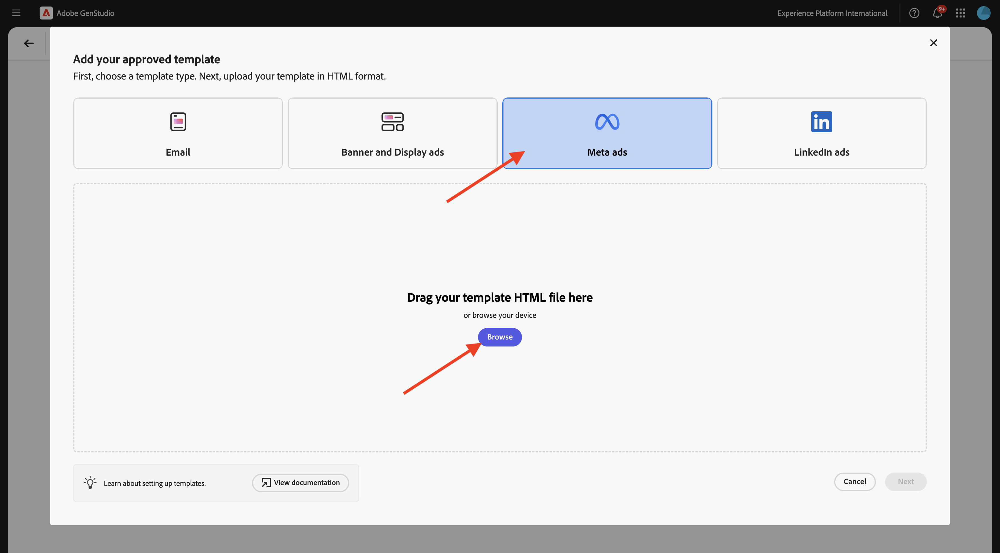
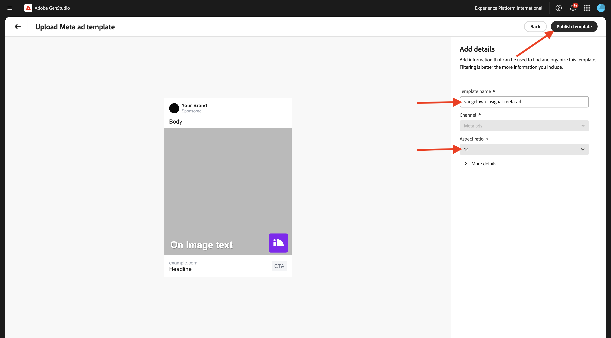
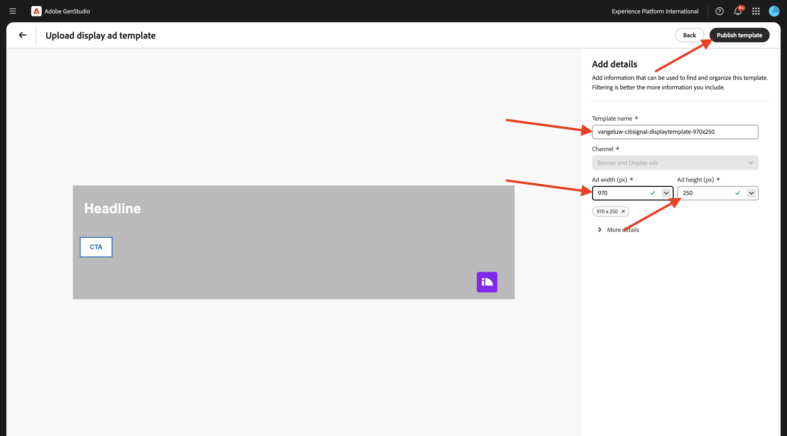

# 1.3.2 Configuración: personalidades, productos y plantillas

Vaya a [https://experience.adobe.com/](https://experience.adobe.com/){target="_blank"}. Abra **GenStudio**.


## 1.3.2.1 productos

Los productos de GenStudio for Performance Marketing aprovechan una comprensión profunda de las especificaciones del producto, las ventajas y los factores de diferenciación para generar contenido impactante.

Los productos abarcan todos los elementos de un producto específico, como imágenes, descripciones y propuestas de valor, para crear una representación de marca coherente. Al aprovechar la tecnología de IA avanzada de Adobe, las directrices de GenStudio for Performance Marketing (marcas, productos y personas) trabajan juntas para generar contenido atractivo que muestre los puntos fuertes de sus productos y garantice la coherencia en todos los mensajes.

Para empezar a crear sus propios productos, haga clic en los 3 puntos **...** y, a continuación, seleccione **Productos**.


Haga clic en **+ Agregar producto**.


Seleccione **Agregar manualmente** y haga clic en **Continuar**.


Entonces debería ver esto.


Para el nombre del producto, use `--aepUserLdap-- - CitiSignal Mobile Flex Plan`.

Para el campo **Descripción**, use lo siguiente:

```
CitiSignal Mobile Flex is a next-gen 5G mobile plan that adapts to your lifestyle. Choose from Unlimited, Family Share, or Data Saver tiers, with optional add-ons like international roaming, hotspot tethering, and SmartFamily™ parental controls. All plans include priority access to CitiSignal’s 5G UltraWide network and seamless integration with CitiSignal Fiber for unified billing, shared data pools, and SmartSwitch™ connectivity. 
```

Para el campo **Propuesta de valor**, use esto:

```
A mobile plan that flexes with your life—fast, fair, and fully connected to your world.
```

Para el campo **Preferencias de mensajería**, use lo siguiente:

```
Remote Professionals: “Work from anywhere with a mobile plan that’s as flexible as your schedule.”
Online Gamers: “Unlimited 5G. No throttling. Just pure performance—on the go.”
Smart Home Families: “One plan. One bill. One less thing to worry about.”
```

La configuración del producto debería ser similar a la siguiente. Haga clic en el icono **atrás**.


Haga clic en **+ Agregar producto**.


Seleccione **Agregar manualmente** y haga clic en **Continuar**.


Entonces debería ver esto.


Para el nombre del producto, use `--aepUserLdap-- - CitiSignal Fiber Max`.

Para el campo **Descripción**, use lo siguiente:

```
CitiSignal Fiber Max is our premium residential internet plan, engineered for households that demand uncompromising speed, stability, and coverage. With symmetrical speeds up to 2 Gbps, it’s ideal for remote professionals juggling Zoom calls and cloud apps, gamers chasing millisecond precision, and families running dozens of smart devices. The plan includes a Wi-Fi 6E router, optional mesh extenders for whole-home coverage, and proactive network monitoring. 
```

Para el campo **Propuesta de valor**, use esto:

```
Power your work, play, and home with the fastest, most reliable fiber internet—built for the way you live today and tomorrow.
```

Para el campo **Preferencias de mensajería**, use lo siguiente:

```
Remote Professionals: “Stay connected, stay productive—no matter how many meetings or megabytes your day demands.”
Online Gamers: “Zero lag. Zero mercy. Dominate with 2 Gbps fiber and ultra-low ping.”
Smart Home Families: “Every room. Every device. Always on. Welcome to whole-home harmony.”
```

La configuración del producto debería ser similar a la siguiente. Haga clic en el icono **atrás**.


Entonces debería ver los 2 productos que configuró.


## 1.3.2.2 personalidades

Las personas ofrecen una representación auténtica de los segmentos de sus clientes, incluida su información, intereses, puntos problemáticos, preferencias y rasgos de comportamiento.

GenStudio for Performance Marketing aprovecha el poder de las directrices (marcas, productos y personas) y la tecnología de IA generativa de Adobe para depurar contenido de marketing personalizado para sus clientes objetivo&#x200B;

Para empezar a crear tus personalidades, haz clic en los 3 puntos **...** y luego selecciona **personalidades**.


Haga clic en **+ Agregar persona**.


Seleccione **Agregar manualmente** y haga clic en **Continuar**.


Entonces debería ver esto.


Para el nombre de persona, use `--aepUserLdap-- - Smart Home Families`.

Para el campo **Descripción**, use lo siguiente:

```
These are tech-forward households with multiple connected devices—smart TVs, thermostats, security systems, voice assistants, and more. They value convenience, automation, and seamless connectivity across the home. They often have children and are concerned about online safety, parental controls, and whole-home coverage.
```

Para el campo **Preferencias de mensajería**, use lo siguiente:

```
Friendly, family-oriented tone
Visuals showing whole-home coverage and device compatibility
Messaging that highlights security, parental controls, and easy setup
Bundled offers (e.g., mesh Wi-Fi, smart home consultations)
How-to content or setup guides for non-tech-savvy users
```

La configuración de persona debería tener este aspecto. Haga clic en el icono **atrás**.


Haga clic en **+ Agregar persona**.


Seleccione **Agregar manualmente** y haga clic en **Continuar**.


Entonces debería ver esto.


Para el nombre de persona, use `--aepUserLdap-- - Online Gamers`.

Para el campo **Descripción**, use lo siguiente:

```
This persona includes competitive and casual gamers who demand ultra-fast, low-latency internet. They often stream gameplay, participate in multiplayer matches, and use voice chat platforms. They are highly sensitive to lag, jitter, and packet loss, and they’re vocal about their experiences online. Many are early adopters of new tech and value performance above all else.
```

Para el campo **Preferencias de mensajería**, use lo siguiente:

```
Bold, energetic tone with gaming lingo
Metrics like ping time, jitter, and upload/download speeds
Visuals showing latency improvements or side-by-side comparisons
Endorsements from gaming influencers or esports teams
Promotions tied to gaming platforms or bundles (e.g., free months of Xbox Game Pass)
```

La configuración de persona debería tener este aspecto. Haga clic en el icono **atrás**.


Haga clic en **+ Agregar persona**.


Seleccione **Agregar manualmente** y haga clic en **Continuar**.


Entonces debería ver esto.


Para el nombre de persona, use `--aepUserLdap-- - Remote Professionals`.

Para el campo **Descripción**, use lo siguiente:

```
These are knowledge workers, freelancers, consultants, and hybrid employees who rely on a stable, high-speed internet connection to maintain productivity from home. Their workdays are filled with video calls, cloud-based collaboration, and large file transfers. They often use multiple devices simultaneously and expect seamless performance across all of them. Many are tech-savvy and value proactive customer support and service transparency.
```

Para el campo **Preferencias de mensajería**, use lo siguiente:

```
Clear, professional tone with a focus on productivity and reliability
Testimonials or case studies from similar professionals
Visuals like speed comparison charts and uptime guarantees
Emphasis on 24/7 support and service-level agreements
Messaging that highlights “work-from-anywhere” flexibility
```

La configuración de persona debería tener este aspecto. Haga clic en el icono **atrás**.


A continuación, debería ver las 3 personalidades que ha configurado.


## 1.3.2.3 plantillas

GenStudio for Performance Marketing permite a los creadores de contenido producir rápidamente contenido de marketing coherente de la marca mediante plantillas. Una plantilla reduce significativamente el tiempo y el esfuerzo necesarios para generar contenido nuevo al proporcionar un punto de partida que incluye diseños y elementos de diseño preconfigurados.

Aunque GenStudio for Performance Marketing no admite la creación directa de plantillas dentro de la aplicación, puede diseñar y preparar fácilmente plantillas con herramientas de diseño populares, como Adobe InDesign, Illustrator o Express. Una vez completado el diseño, puede adaptarlo para utilizarlo en GenStudio for Performance Marketing. En este ejercicio, importará varias plantillas predefinidas en GenStudio for Performance Marketing.

En el ejercicio anterior, descargó el archivo [CitiSignal-GSPeM-assets.zip](../../../assets/gspem/CitiSignal-GSPeM-assets.zip) en su escritorio y lo descomprimió. Esa carpeta contiene 4 plantillas de ejemplo que ahora debe importar en GenStudio.


Vaya a **Contenido** > **Plantillas**. Haga clic en **+ Agregar plantilla**.


Seleccione **Meta ads** y haga clic en **Examinar**.



En la carpeta que contiene los **archivos CitiSignal-GSPeM-assets** descargados, vaya a la carpeta **templates**. Seleccione el archivo **citisignal-meta-ad.html** y haga clic en **Abrir**.


Entonces debería ver esto. Haga clic en **Next**.


Haga clic en **Next**.


Use esto para el campo **Nombre de plantilla**:
`--aepUserLdap---citisignal-meta-ad` y establecer la relación de aspecto en **1:1**. Haga clic en **Publicar plantilla**.



La plantilla se ha guardado y está disponible en la biblioteca de plantillas.


Haga clic en **+ Agregar plantilla**.


Seleccione **Titular y anuncios en pantalla** y luego haga clic en **Examinar**.


En la carpeta que contiene los **archivos CitiSignal-GSPeM-assets** descargados, vaya a la carpeta **templates**. Seleccione el archivo **citisignal-displaytemplate-300x250.html** y haga clic en **Abrir**.


Entonces debería ver esto. Haga clic en **Next**.


Haga clic en **Next**.


Use esto para el campo **Nombre de plantilla**:
`--aepUserLdap---citisignal-displaytemplate-300x250` y establezca **Anchura del anuncio** y **Altura del anuncio** en **300x250**. Haga clic en **Publicar plantilla**.


La plantilla se ha guardado y está disponible en la biblioteca de plantillas.


Haga clic en **+ Agregar plantilla**.


Seleccione **Titular y anuncios en pantalla** y luego haga clic en **Examinar**.


En la carpeta que contiene los **archivos CitiSignal-GSPeM-assets** descargados, vaya a la carpeta **templates**. Seleccione el archivo **citisignal-displaytemplate-300x600.html** y haga clic en **Abrir**.


Entonces debería ver esto. Haga clic en **Next**.


Haga clic en **Next**.


Use esto para el campo **Nombre de plantilla**:
`--aepUserLdap---citisignal-displaytemplate-300x600` y establezca **Anchura del anuncio** y **Altura del anuncio** en **300x600**. Haga clic en **Publicar plantilla**.


La plantilla se ha guardado y está disponible en la biblioteca de plantillas.


Haga clic en **+ Agregar plantilla**.


Seleccione **Titular y anuncios en pantalla** y luego haga clic en **Examinar**.


En la carpeta que contiene los **archivos CitiSignal-GSPeM-assets** descargados, vaya a la carpeta **templates**. Seleccione el archivo **citisignal-displaytemplate-970x250.html** y haga clic en **Abrir**.


Entonces debería ver esto. Haga clic en **Next**.


Haga clic en **Next**.


Use esto para el campo **Nombre de plantilla**:
`--aepUserLdap---citisignal-displaytemplate-970x250` y establezca **Anchura del anuncio** y **Altura del anuncio** en **970x250**. Haga clic en **Publicar plantilla**.



La plantilla se ha guardado y está disponible en la biblioteca de plantillas.


Ya ha configurado las plantillas que necesita para el siguiente ejercicio.

## Pasos siguientes

Vaya a [Activación de campaña para Meta](./ex3.md){target="_blank"}

Volver a [GenStudio for Performance Marketing](./genstudio.md){target="_blank"}

Volver a [Todos los módulos](./../../../overview.md){target="_blank"}
