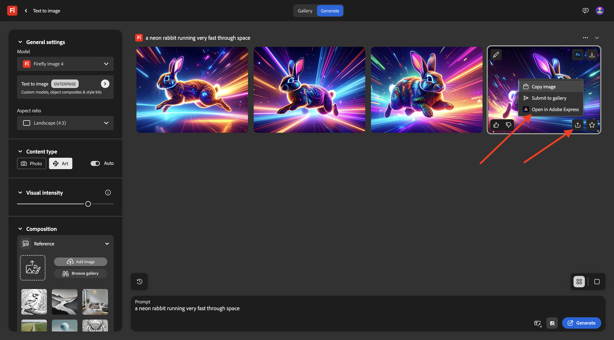
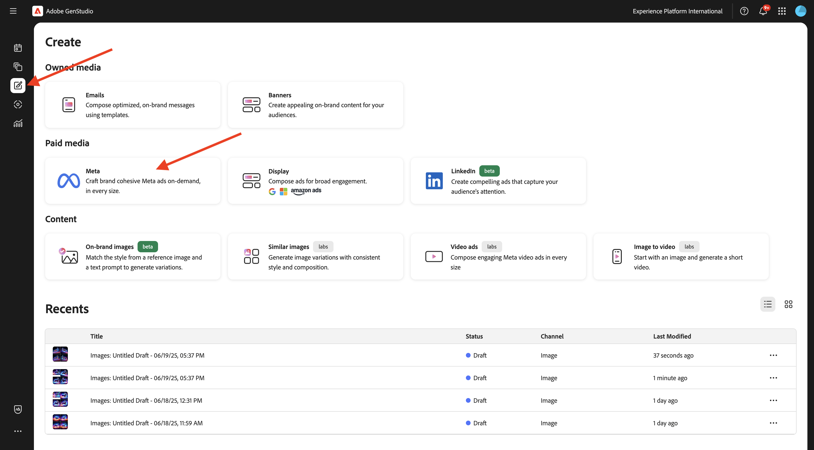
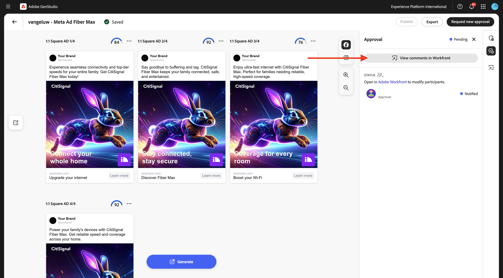
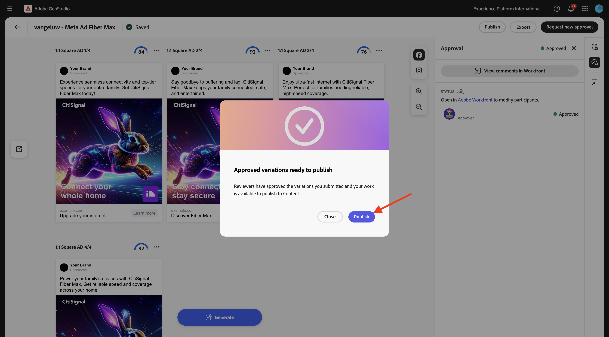
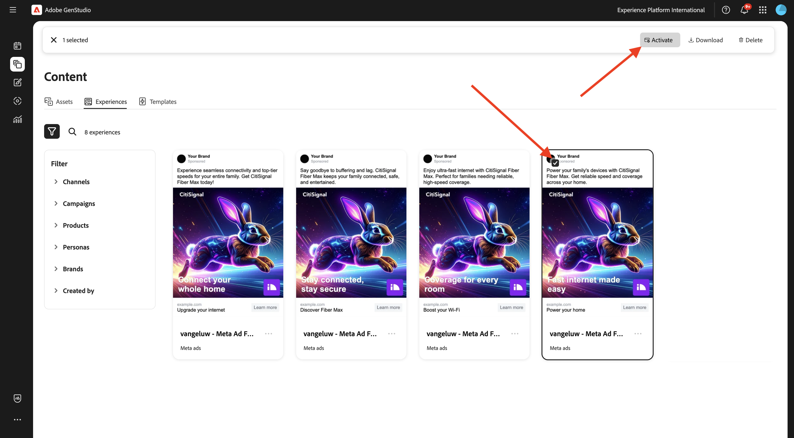
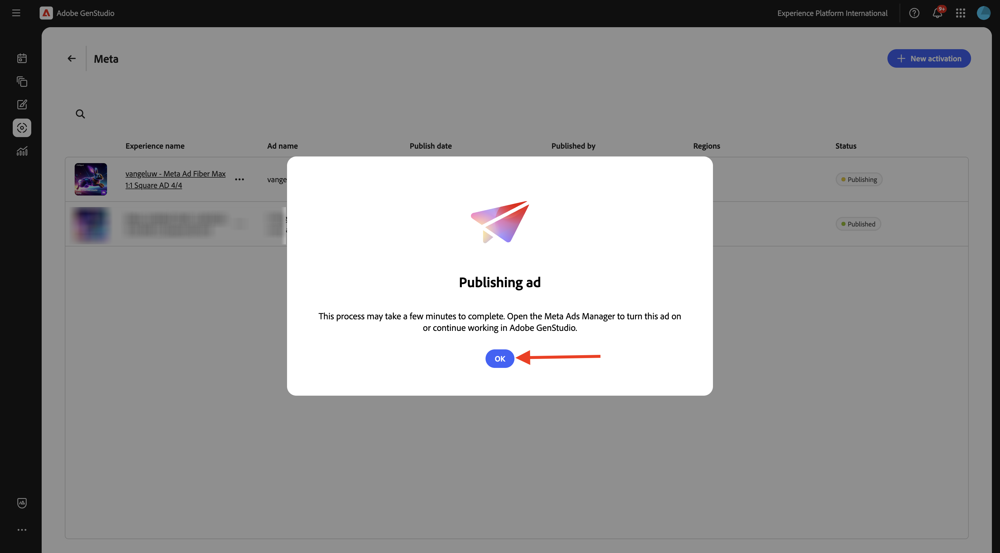

# 1.3.3 Activación de Campaign en Meta

>[!IMPORTANT]
>
>Para completar este ejercicio, debe tener acceso a un entorno de trabajo de AEM Assets CS Author con AEM Assets Content Hub habilitado.
>
>Hay dos opciones que se deben tener en cuenta:
>
>- Si asiste al taller de habilitación técnica de GenStudio para CSC, sus instructores han creado un entorno de autor de CSC para AEM Assets para usted. Por favor, compruebe con ellos cuál es el nombre y cómo proceder.
>
>- Si está siguiendo la ruta completa del tutorial de One Adobe, vaya al ejercicio [Adobe Experience Manager Cloud Service &amp; Edge Delivery Services](./../../../modules/asset-mgmt/module2.1/aemcs.md){target="_blank"}. Siga las instrucciones allí y tendrá acceso a dicho entorno.

>[!IMPORTANT]
>
>Para ejecutar todos los pasos de este ejercicio, debe tener acceso a un entorno de Adobe Workfront existente y, en ese entorno, debe haber creado un proyecto y un flujo de trabajo de aprobación. Si sigue el ejercicio [Administración del flujo de trabajo con Adobe Workfront](./../../../modules/workflow-planning/module1.2/workfront.md){target="_blank"}, tendrá disponible la configuración necesaria.

>[!IMPORTANT]
>
>Si ha configurado anteriormente un programa de AEM Assets CS con un entorno de Author y AEM Assets, puede ser que la zona protegida de AEM CS haya hibernado. Dado que la dehibernación de una zona protegida de este tipo tarda de 10 a 15 minutos, sería aconsejable iniciar el proceso de dehibernación ahora para que no tenga que esperar más adelante.

## 1.3.3.1 Crear campaña

En **GenStudio for Performance Marketing**, ve a **Campañas** en el menú de la izquierda. Haga clic en **+ Agregar campaña**.


Luego debería ver una descripción general de la campaña vacía.


Para el nombre de campo, use `--aepUserLdap-- - CitiSignal Fiber Launch Campaign`.

Para el campo **Descripción**, use el siguiente texto.

```
The CitiSignal Fiber Launch campaign introduces CitiSignal’s flagship fiber internet service—CitiSignal Fiber Max—to key residential markets. This campaign is designed to build awareness, drive sign-ups, and establish CitiSignal as the go-to provider for ultra-fast, reliable, and future-ready internet. The campaign will highlight the product’s benefits for remote professionals, online gamers, and smart home families, using persona-driven messaging across digital and physical channels.
```

Para el campo **Objetivo**, use el siguiente texto.

```
Generate brand awareness in target regions
Drive early sign-ups and pre-orders for CitiSignal Fiber Max
Position CitiSignal as a premium, customer-first fiber internet provider
Educate consumers on the benefits of fiber over cable or DSL
```

Para el campo **Mensajería de clave**, usa el siguiente texto.

```
Supporting Points:
Symmetrical speeds up to 2 Gbps
Whole-home Wi-Fi 6E coverage
99.99% uptime guarantee
24/7 concierge support
No data caps or throttling
 Channels:
Digital Advertising: Google Display, YouTube pre-roll, Meta (Facebook/Instagram), TikTok (for gamers)
Email Marketing: Persona-segmented drip campaigns
Social Media: Organic and paid posts with testimonials, speed demos, and influencer partnerships
Out-of-Home (OOH): Billboards, transit ads in suburban commuter corridors
Local Events: Pop-up booths at tech expos, family festivals, and gaming tournaments
Direct Mail: Personalized flyers with QR codes for early sign-up discounts
 
Target Regions:
Primary Launch Markets:
Denver Metro Area, CO
Austin, TX
Raleigh-Durham, NC
Salt Lake City, UT
Demographic Focus:
Suburban neighborhoods with high remote work density
Areas with high smart home adoption
Zip codes with underserved or dissatisfied cable customers
```

Entonces debería tener esto:


Desplácese hacia abajo para ver más campos:


Para el campo **Iniciar**, establézcalo en la fecha de hoy.

Para el campo **Fin**, establézcalo en una fecha dentro de 1 mes.

Para el campo **Estado**, establézcalo en **Activo**.

Para el campo **Canales**, configúrelo en **Meta**, **Correo electrónico**, **Medios de pago**, **Pantalla**.

Para el campo **Regiones**, seleccione una región de su elección.

Para el campo del campo **Referencias** > **Productos**: elija el producto `--aepUserLdap-- - CitiSignal Fiber Max`.

**Referencias** > **Personas**: elija las personalidades `--aepUserLdap-- - Remote Professionals`, `--aepUserLdap-- - Online Gamers`, `--aepUserLdap-- - Smart Home Families`

Debería ver lo siguiente:


Su campaña ya está lista. Haga clic en la **flecha** para regresar.


A continuación, verá su campaña en la lista. Haga clic en el icono de vista de calendario para cambiar la vista al calendario de campañas.


Luego debería ver un calendario de campañas que dé una idea más visual de qué campañas están activas en cada momento.


## 1.3.3.2 Configuración de conexión a Meta

>[!IMPORTANT]
>
>Para configurar la conexión a Meta, debe tener una cuenta de usuario de Meta disponible y esa cuenta de usuario debe agregarse a una cuenta de Meta Business.

Para configurar la conexión con Meta, haga clic en los 3 puntos **...** y seleccione **Configuración**.


Haga clic en **Conectar** para **Meta Ads**.


Inicie sesión con su cuenta de Meta. Haga clic en **Continuar**.


Si su cuenta está vinculada a una cuenta empresarial de Meta, podrá seleccionar el portafolio empresarial que se ha configurado en Meta.


Una vez establecida correctamente la conexión, haga clic en la línea que dice **X cuentas conectadas**.


A continuación, debería ver los detalles de la cuenta empresarial de Meta conectada a GenStudio for Performance Marketing.


## 1.3.3.3 Crear nuevo recurso

Vaya a [https://firefly.adobe.com/](https://firefly.adobe.com/){target="_blank"}. Escriba el mensaje `a neon rabbit running very fast through space` y haga clic en **Generar**.


A continuación, verá varias imágenes que se generan. Elige la imagen que más te guste, haz clic en el icono **Compartir** de la imagen y luego selecciona **Abrir en Adobe Express**.



A continuación, verá que la imagen que acaba de generar está disponible en Adobe Express para editarla. Ahora debe añadir el logotipo de CitiSignal en la imagen. Para ello, ve a **Marcas**.


Debería ver la plantilla de marca CitiSignal que creó en GenStudio for Performance Marketing en Adobe Express. Haga clic para seleccionar la plantilla de marca que debe tener el nombre `--aepUserLdap-- - CitiSignal`.


Vaya a **Logotipos** y haga clic en el logotipo **blanco** de Citisignal para colocarlo en la imagen.


Coloque el logotipo de CitiSignal en la parte superior de la imagen, no demasiado lejos del centro.


A continuación, haga clic en **Compartir**.


Seleccionar **AEM Assets**.


Haga clic en **Seleccionar carpeta**. Cambie el nombre del recurso a `--aepUserLdap-- - neon rabbit`.


Seleccione el repositorio de AEM Assets CS, que debe tener el nombre `--aepUserLdap-- - CitiSignal` y, a continuación, seleccione la carpeta `--aepUserLdap-- - CitiSignal Fiber Campaign`. Haga clic en **Seleccionar**.


Entonces debería ver esto. Haga clic en **Cargar 1 recurso**. La imagen se cargará en AEM Assets CS.


Vaya a [https://experience.adobe.com/](https://experience.adobe.com/){target="_blank"}. Abra **Experience Manager Assets**.


Seleccione el entorno de AEM Assets CS, que debería llamarse `--aepUserLdap-- - CitiSignal dev`.


Vaya a **Assets** y haga doble clic en la carpeta `--aepUserLdap-- - CitiSignal Fiber Campaign`.


Entonces debería ver algo similar a esto. Haga doble clic en la imagen `--aepUserLdap-- - neon rabbit`.


Se mostrará la imagen `--aepUserLdap-- - neon rabbit`. Cambie **Status** a **Approved** y luego haga clic en **Guardar**

>[!IMPORTANT]
>
>Si el estado de una imagen no se establece en **Aprobada**, la imagen no será visible en GenStudio for Performance Marketing. En GenStudio for Performance Marketing solo se puede acceder a los recursos aprobados.


Cambie a GenStudio for Performance Marketing. En el menú de la izquierda, ve a **Assets** y selecciona tu repositorio de AEM Assets CS, que debería llamarse `--aepUserLdap-- - CitiSignal`. A continuación, verá que la imagen que acaba de crear y aprobar está disponible en GenStudio for Performance Marketing.


## 1.3.3.4 Crear y aprobar anuncio de Meta

En el menú de la izquierda, ve a **Crear**. Seleccione **Meta**.



Seleccione la plantilla **Meta ad** que importó anteriormente, que se llama `--aepUserLdap---citisignal-meta-ad`. Haga clic en **Usar**.


Entonces debería ver esto. Cambie el nombre de su anuncio a `--aepUserLdap-- - Meta Ad Fiber Max`.

En **Parámetros**, seleccione las siguientes opciones:

- **Marca**: `--aepUserLdap-- - CitiSignal`
- **Idioma**: `English (US)`
- **Persona**: `--aepUserLdap-- - Smart Home Families`
- **Producto**: `--aepUserLdap-- - CitiSignal Fiber Max`

Haga clic en **Seleccionar del contenido**.


Seleccione el recurso `--aepUserLdap-- - neon rabbit.png`. Haga clic en **Usar**.


Escriba el mensaje `focus on lightning fast internet for big families` y haga clic en **Generar**.


Entonces deberías ver algo como esto. Sus anuncios ya están listos para revisarse y aprobarse. Para ello, haga clic en **Solicitar aprobación**, que se conectará a Adobe Workfront.


Seleccione el proyecto de Adobe Workfront, que debe tener el nombre `--aepUserLdap-- - CitiSignal Fiber Launch`. Escriba su propia dirección de correo electrónico en **Invitar a personas** y asegúrese de que su rol esté establecido en **Aprobador**.


También puede utilizar un flujo de trabajo de aprobación existente en Adobe Workfront. Para ello, haga clic en **Usar plantilla** y seleccione la plantilla `--aepuserLdap-- - Approval Workflow`. Haga clic en **Enviar**.


Haga clic en **Ver comentarios en Workfront**, ahora se le enviará a la interfaz de usuario de Adobe Workfront Proof.



En la IU de Adobe Workfront Proof, haga clic en **Tomar decisión**.


Seleccione **Aprobado** y haga clic en **Tomar decisión**.


Haga clic en **Publicar**.



Seleccione su campaña `--aepUserLdap-- - CitiSignal Fiber Launch Campaign` y haga clic en **Publicar**.


Haga clic en **Abrir en el contenido**.


Los cuatro anuncios de Meta ya están disponibles en **Contenido** > **Experiencias**.


## 1.3.3.5 Publicar anuncio en Meta

Seleccione uno de los anuncios y haga clic en **Activar**.



Elija un **Call to action** de la lista e introduzca una URL de ejemplo. Haga clic en **Next**.


Seleccione la cuenta de Meta, la página de Facebook vinculada, Meta Campaign y el conjunto de anuncios de Meta.

Asigne un nombre a la adición, use `--aepUserLdap-- Fiber Max Ad`.

Haga clic en **Next**.


Haga clic en **Publicar**.


Haga clic en **Aceptar**.



El estado del anuncio ahora se establece en **Publicación**, lo cual puede tardar un par de minutos.


Después de un par de minutos, el estado del anuncio cambiará a **Publicado**. Esto significa que el anuncio se ha enviado desde GenStudio for Performance Marketing a Meta. ¡No significa que el anuncio ya se haya publicado en Meta! Todavía hay que seguir una serie de pasos en la cuenta empresarial de Meta para tomar el anuncio y publicarlo para que pueda ser visto por los usuarios en las distintas plataformas de Meta.

Haga clic en **Ver detalles**.


Haz clic en **Abrir**, que te llevará a tu cuenta de Meta Business.

>[!IMPORTANT]
>
>Si no tiene acceso a la cuenta empresarial de Meta conectada a su entorno, no podrá visualizar este anuncio en Meta.


A continuación, se muestra una descripción general del anuncio que acaba de crear, pero ahora en Meta.


Ahora ha completado este ejercicio.

## Pasos siguientes

Ir a [Resumen y beneficios](./summary.md){target="_blank"}

Volver a [GenStudio for Performance Marketing](./genstudio.md){target="_blank"}

Volver a [Todos los módulos](./../../../overview.md){target="_blank"}
