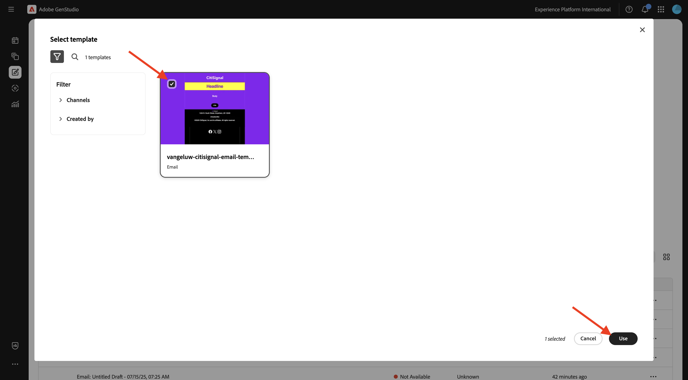
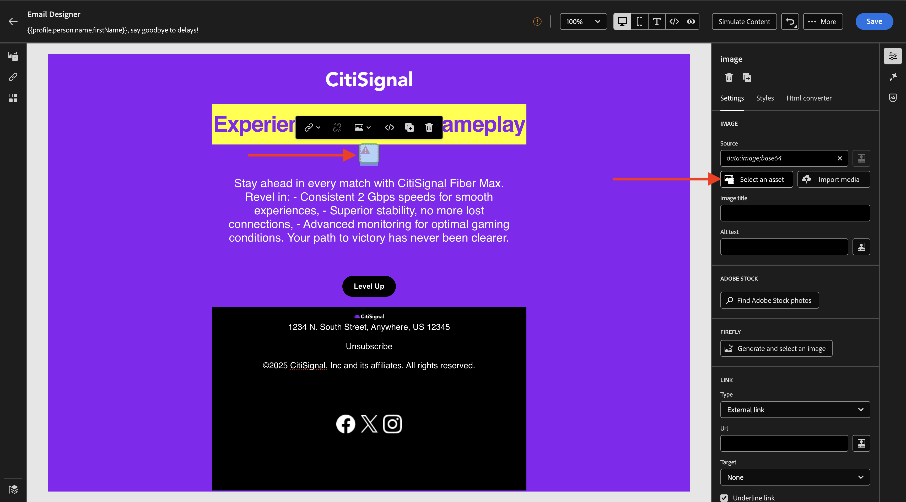

# 1.3.4 Crear experiencia de correo electrónico para AJO

>[!IMPORTANT]
>
>Para completar este ejercicio, debe tener acceso a un entorno de Adobe Journey Optimizer que esté aprovisionado para la integración con GenStudio for Performance Marketing, que actualmente está en fase beta.

>[!IMPORTANT]
>
>Para ejecutar todos los pasos de este ejercicio, debe tener acceso a un entorno de Adobe Workfront existente y, en ese entorno, debe haber creado un proyecto y un flujo de trabajo de aprobación. Si sigue el ejercicio [Administración del flujo de trabajo con Adobe Workfront](./../../../modules/asset-mgmt/module2.2/workfront.md){target="_blank"}, tendrá disponible la configuración necesaria.

## 1.3.4.1 Crear y aprobar experiencia de correo electrónico

En el menú de la izquierda, ve a **Crear**. Seleccione **Correo electrónico**.


Seleccione la plantilla **Email** que importó anteriormente, que se llama `--aepUserLdap---citisignal-email-template`. Haga clic en **Usar**.



Entonces debería ver esto. Cambie el nombre de su anuncio a `--aepUserLdap-- - Email Online Gamers Fiber Max`.


En **Parámetros**, seleccione las siguientes opciones:

- **Marca**: `--aepUserLdap-- - CitiSignal`
- **Idioma**: `English (US)`
- **Persona**: `--aepUserLdap-- - Smart Home Families`
- **Producto**: `--aepUserLdap-- - CitiSignal Fiber Max`

Haga clic en **Seleccionar del contenido**.


Seleccione el recurso `--aepUserLdap-- - neon rabbit.png`. Haga clic en **Usar**.


Escriba el mensaje `convince online gamers to start playing online multiplayer games using CitiSignal internet` y haga clic en **Generar**.


Debería ver algo así, con 4 variaciones de correo electrónico generadas. La vista predeterminada muestra la vista **móvil**. Para cambiar a la vista de escritorio, haga clic en el icono **equipo**.


Para cada correo electrónico, se calcula automáticamente una puntuación de conformidad. Haga clic en la puntuación para ver más detalles.


Haga clic en **Ver y corregir problemas**.


Puede ver más detalles sobre lo que puede hacer para optimizar la puntuación de complicaciones.


A continuación, haga clic en **Solicitar aprobación**, que se conectará a Adobe Workfront.


Seleccione el proyecto de Adobe Workfront, que debe tener el nombre `--aepUserLdap-- - CitiSignal Fiber Launch`. Escriba su propia dirección de correo electrónico en **Invitar a personas** y asegúrese de que su rol esté establecido en **Aprobador**.


También puede utilizar un flujo de trabajo de aprobación existente en Adobe Workfront. Para ello, haga clic en **Usar plantilla** y seleccione la plantilla `--aepuserLdap-- - Approval Workflow`. Haga clic en **Enviar**.


Haga clic en **Ver comentarios en Workfront**, ahora se le enviará a la interfaz de usuario de Adobe Workfront Proof.


En la IU de Adobe Workfront Proof, haga clic en **Tomar decisión**.


Seleccione **Aprobado** y haga clic en **Tomar decisión**.


Haga clic en **Publicar**.


Seleccione su campaña `--aepUserLdap-- - CitiSignal Fiber Launch Campaign` y haga clic en **Publicar**.


Haga clic en **Abrir en el contenido**.


Las 4 experiencias de correo electrónico ya están disponibles en **Contenido** > **Experiencias**.


## 1.3.4.2 Crear una campaña en AJO

Inicie sesión en Adobe Journey Optimizer en [Adobe Experience Cloud](https://experience.adobe.com). Haga clic en **Journey Optimizer**.


Se le redirigirá a la vista **Inicio** en Journey Optimizer. Primero, asegúrese de que está usando la zona protegida correcta. La zona protegida que se va a usar se llama `--aepSandboxName--`. Estará en la vista **Inicio** de su zona protegida `--aepSandboxName--`.


Ahora creará una campaña. A diferencia del recorrido basado en eventos del ejercicio anterior, que se basa en eventos de experiencia entrantes o entradas o salidas de audiencia para almacenar en déclencheur un recorrido para un cliente específico, las campañas se dirigen a una audiencia completa una vez con contenido único como boletines informativos, promociones únicas o información genérica, o periódicamente con contenido similar enviado de forma regular como, por ejemplo, campañas de cumpleaños y recordatorios.

En el menú, ve a **Campañas** y haz clic en **Crear campaña**.


Seleccione **Programado - Marketing** y haga clic en **Crear**.


En la pantalla de creación de campañas, configure lo siguiente:

- **Nombre**: `--aepUserLdap--  - Online Gamers CitiSignal Fiber Max`.
- **Descripción**: Campaña de fibra para jugadores en línea

Haga clic en **Acciones**.


Haga clic en **+ Agregar acción** y luego seleccione **Correo electrónico**.


A continuación, seleccione una **configuración de correo electrónico** existente y haga clic en **Editar contenido**.


Entonces verá esto... Para la **línea de asunto**, use esto:

```
{{profile.person.name.firstName}}, say goodbye to delays!
```

A continuación, haga clic en **Editar contenido**.


Haga clic en **Importar HTML**.


A continuación, haga clic en el botón de **Adobe GenStudio for Performance Marketing**.


A continuación, debería ver una ventana emergente que muestra todas las experiencias de correo electrónico publicadas en GenStudio for Performance Marketing. Seleccione una de las experiencias de correo electrónico disponibles y haga clic en **Usar**.


Seleccione su propio repositorio de AEM Assets CS, que debería llamarse `--aepUserLdap-- - CitiSignal dev`, y haga clic en **Importar**.


Entonces debería ver esto. Seleccione el botón de imagen que falta y haga clic en **Seleccionar un recurso**.



Vaya a la carpeta que se parece a esta, empezando por **GenStudio.zip.....** y seleccione la imagen `--aepUserLdap-- - neon rabbit.png`. Seleccionar **Seleccionar**


Entonces debería ver esto.


Desplácese hacia abajo hasta el pie de página, seleccione la palabra **Cancelar suscripción** y haga clic en el icono **vínculo**.


Establezca **Type** en **Exclusión/baja externa** y establezca la dirección URL en `https://techinsiders.org/unsubscribe.html` (no se permite tener una dirección URL en blanco para el vínculo de cancelación de suscripción).

Haga clic en **Guardar** y luego haga clic en la **flecha** en la esquina superior izquierda de la pantalla para volver a la configuración de la campaña.


Ir a **Audiencia**.


Haga clic en **Seleccionar audiencia**.


Seleccione la audiencia de la lista de suscripción para jugadores en línea, que debe llamarse `--aepUserLdap--_SL_Interest_Online_Gaming`. Haga clic en **Guardar**.


Haga clic en **Revisar para activar**.


Si la configuración de tu campaña no tiene problemas, podrás hacer clic en **Activar**.


La campaña se activará, lo que tarda un par de minutos.


Después de un par de minutos, la campaña está activa y el correo electrónico se enviará a la lista de suscripción seleccionada.


Ahora ha completado este ejercicio.

## Pasos siguientes

Ir a [Resumen y beneficios](./summary.md){target="_blank"}

Volver a [GenStudio for Performance Marketing](./genstudio.md){target="_blank"}

Volver a [Todos los módulos](./../../../overview.md){target="_blank"}
