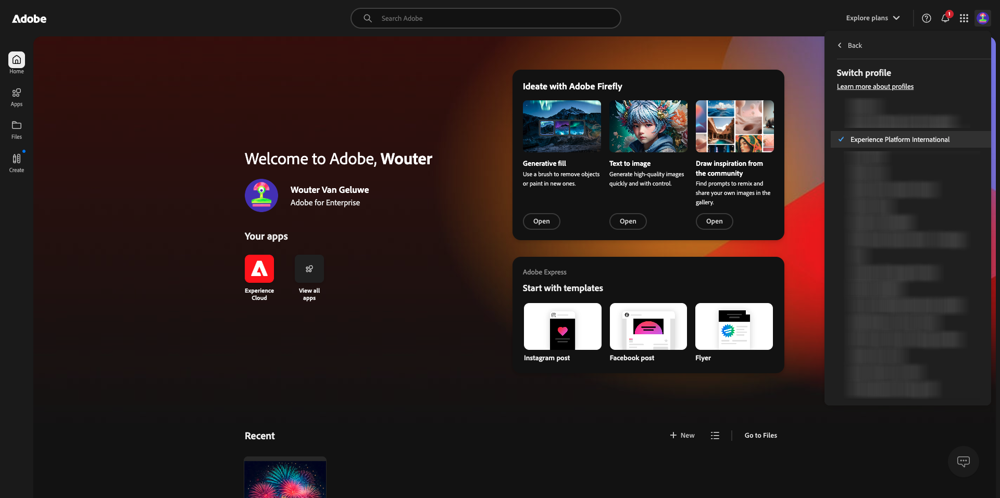
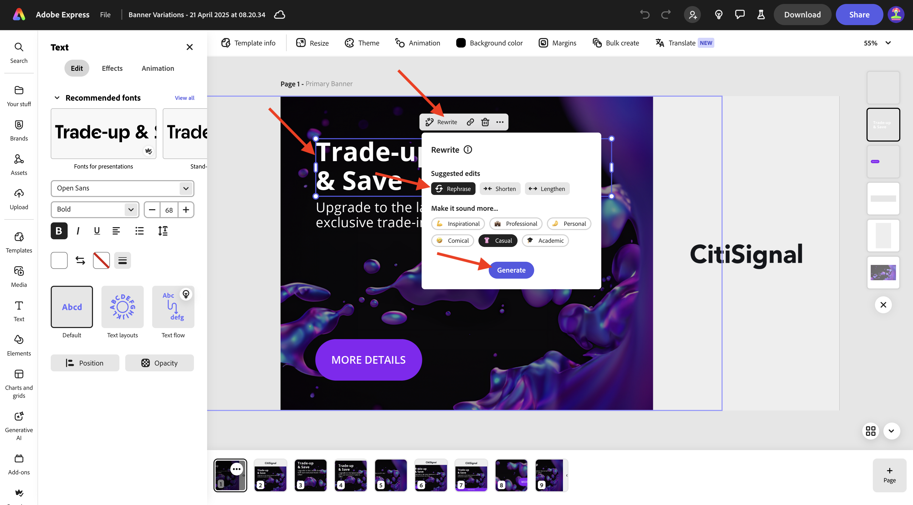
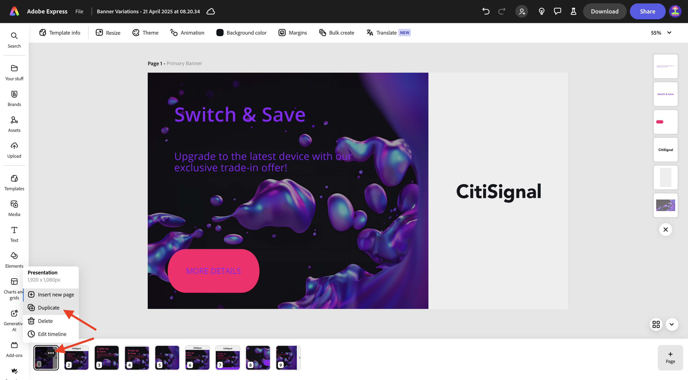
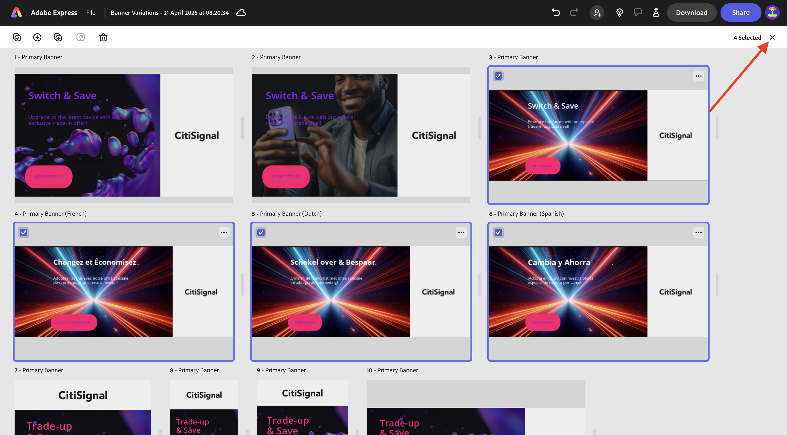

# 1.4.1 Introducción a Adobe Express

## 1.4.1.1 iniciando sesión en Adobe Express

Abra una nueva ventana del explorador de incógnito y vaya a [https://www.adobe.com/home](https://www.adobe.com/home){target="_blank"}. Inicie sesión con su **cuenta de empresa o escuela** y luego seleccione la cuenta **`--aepImsOrgName--`**.

Adobe Express está disponible como parte de las licencias de su organización. Para asegurarse de que tiene acceso a Adobe Express, debe comprobar que ha iniciado sesión en la organización correcta. Para ello, haga clic en el icono **perfil** y verifique qué cuenta está activa. La cuenta que debe usar se llama `--aepImsOrgName--`.

Haga clic en **Cambiar perfil** para cambiar de cuenta.

Elija la cuenta correcta en el menú, en este caso **Experience Platform International** (pero esa puede ser una organización diferente para usted).

Una vez que la cuenta correcta esté activa, ve a **Aplicaciones** y haz clic en **Comenzar** en la tarjeta de **Adobe Express**.

Ahora ha iniciado sesión en **Adobe Express**.

## 1.4.1.2 Introducción a partir de una plantilla de marca

En Adobe Express, ve a **Marcas**. Es probable que la biblioteca de plantillas de marca esté vacía en este momento. CitiSignal ha definido una plantilla de marca anteriormente y ahora debe reutilizar esa plantilla existente.

Para ello, vaya a [https://www.adobe.com/files/link/1c2f92cf-17bc-4d11-6031-dbd251e6cb57](https://www.adobe.com/files/link/1c2f92cf-17bc-4d11-6031-dbd251e6cb57).

Entonces debería ver esto. Haga clic en los 3 puntos **...**.

Seleccione **Hacer una copia**.

Después de aproximadamente un minuto, debería ver un mensaje que confirme que ha realizado una copia personal de la plantilla de marca.

Vuelva a Adobe Express, a **Marcas** y actualice la página. Ahora debería ver la plantilla de marca **CitiSignal (Telco)**. Haga clic para abrir la plantilla de marca **CitiSignal (Telco)**.

A continuación, debería ver una biblioteca de recursos como logotipos, fuentes, colores, plantillas, etc.

Vaya a **Plantillas rápidas** y haga clic para abrir la plantilla **Variaciones del titular**.

Haga clic en **Iniciar un nuevo archivo**.

Entonces debería ver esto.

Haz clic en el cuadro de texto que dice **Cambiar y guardar**. A continuación, selecciona **Reescribir**, elige un estilo y haz clic en **Generar**.

Elija una variación y haga clic en **Reemplazar**.

A continuación, debería ver el texto actualizado.

A continuación, haga clic en el texto **MÁS INFORMACIÓN**.

Seleccione **Efectos**.

Vaya a **Forma** y haga clic en **Ver todo**.

Haga clic en el botón **ajustar**. Cambie **Tamaño de forma** y haga clic en el botón de color.

Cambie el color eligiendo otro color del **tema de color CitiSignal**.

A continuación, debería ver el botón cambiado.

A continuación, ve a **Marcas** y haz clic en **Aplicar marca**. A continuación, debería ver el cambio de aspecto de la imagen.

Tenga en cuenta que también puede detallar la configuración de **Aplicar marca** haciendo clic en el icono de **engranaje**.

A continuación, haga clic en los 3 puntos **...** de la imagen en la que está trabajando y, a continuación, haga clic en **Duplicar**.

Debería ver una imagen nueva e idéntica. Haga clic en la capa de fondo situada en el lado derecho de la pantalla.

>[!IMPORTANT]
>
>Para completar este ejercicio, debe tener acceso a un entorno de trabajo de AEM Assets y autores de CS. Si sigue el ejercicio [Adobe Experience Manager Cloud Service &amp; Edge Delivery Services](./../../../modules/asset-mgmt/module2.1/aemcs.md){target="_blank"}, tendrá acceso a dicho entorno.

Vaya a **Assets** en el menú de la izquierda, seleccione su repositorio de AEM Assets CS que debería llamarse `--aepUserLdap-- - CitiSignal dev`. A continuación, vaya a la carpeta **citisignal**.

Seleccione la imagen **homepage-hero-1.png**. Entonces debería ver el cambio de la capa de fondo.

Seleccione el cuadro de texto como se indica y haga clic en **Reescribir**. Seleccione **Reformular** y, a continuación, seleccione un estilo específico. Haga clic en **Generar**.

Seleccione una variante y haga clic en **Reemplazar**.

Entonces debería ver esto. A continuación, haga clic en los 3 puntos **...** de la página en la parte inferior de la página y haga clic en **Duplicar**.

En la imagen recién creada, ve a **media** y haz clic en **Generar imagen**.

Seleccione **Horizontal (4:3)**.

Escriba el mensaje `laser beams running through space` y haga clic en **Generar**.

A continuación, debería ver una imagen generada por Adobe Firefly. Tenga en cuenta que la capa en la que se generó la imagen está en la parte superior.

Mueva hacia abajo la imagen recién generada y colóquela justo encima de la capa de fondo anterior.

Elimine la capa de fondo anterior haciendo clic en ella y seleccionando **Eliminar**.

Ajuste la imagen para que cubra todo el lienzo.

Seleccione el cuadro de texto **Cambiar y guardar** para cambiar el color de la fuente a **blanco**.

Cambie el color de la fuente a **blanco**.

Seleccione el otro cuadro de texto para cambiar también el color de la fuente a **blanco**.

Cambie el color de la fuente a **blanco**.

A continuación, haga clic en **Cambiar tamaño** e introduzca una resolución personalizada de **2600** x **1080**. Asegúrese de que la casilla de verificación de **Expandir imagen** esté marcada. Haga clic en **Cambiar tamaño**.

Entonces debería ver esto.

Después de un par de minutos, verá algunas variaciones nuevas de la imagen. Elija uno y luego haga clic en **Conservar**.

Entonces debería ver esto.

Mueva y ajuste la imagen para que ocupe todo el espacio disponible.

A continuación, haga clic en **Traducir**.

Elija algunos idiomas, como **francés**, **holandés** y **español**. Asegúrese de que solo está seleccionada la página específica en la que está trabajando, que en este caso es **Página 3**. Haga clic en **Traducir**.

A continuación, se generan las traducciones.

Debería ver una serie de páginas nuevas que se están creando. Haga clic en el icono **cerrar**.

Compruebe las traducciones y cámbielas si es necesario, como en este ejemplo en el que la traducción no es óptima.

Actualice el texto según sea necesario.

Sus recursos ya están listos.

## Pasos siguientes

Ir a [Animación y vídeo en Adobe Express](./ex2.md){target="_blank"}

Volver a [Adobe Express y Adobe Experience Cloud](./express.md){target="_blank"}

Volver a [Todos los módulos](./../../../overview.md){target="_blank"}
