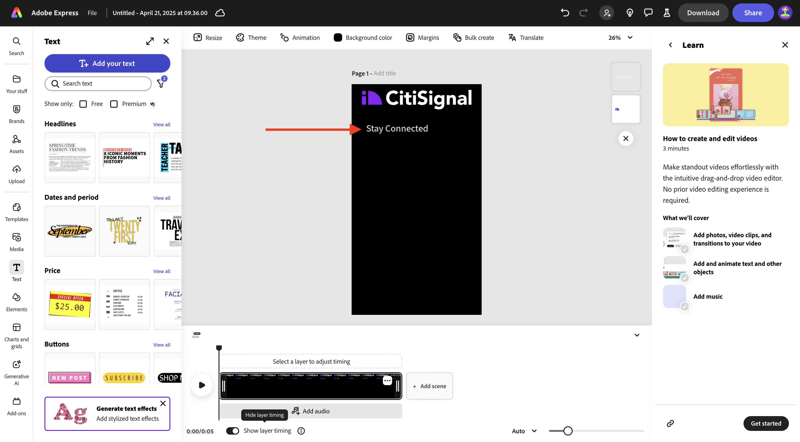
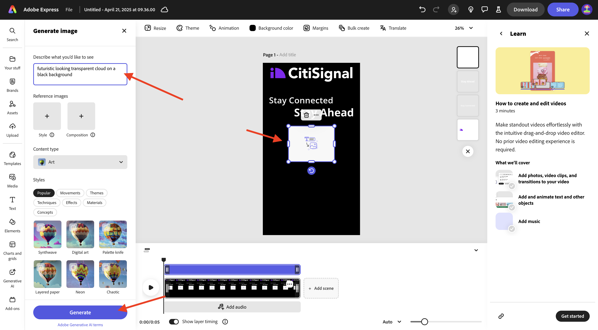
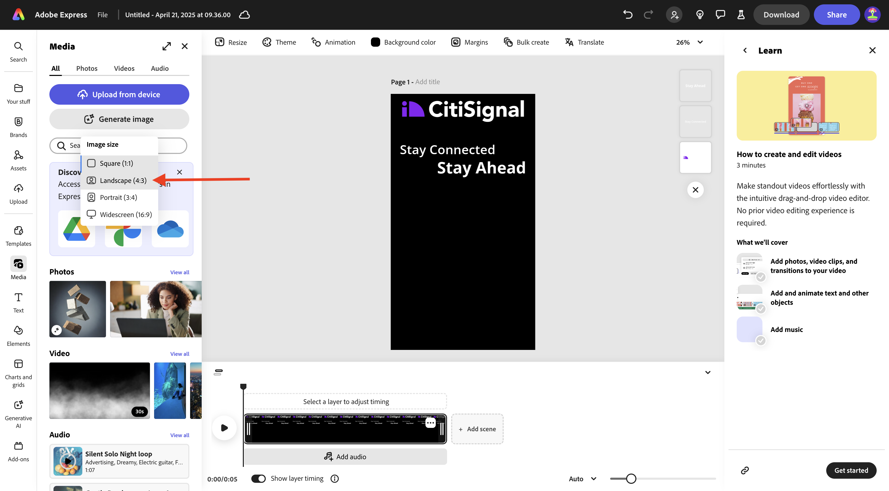
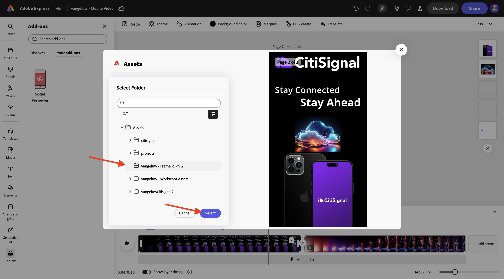
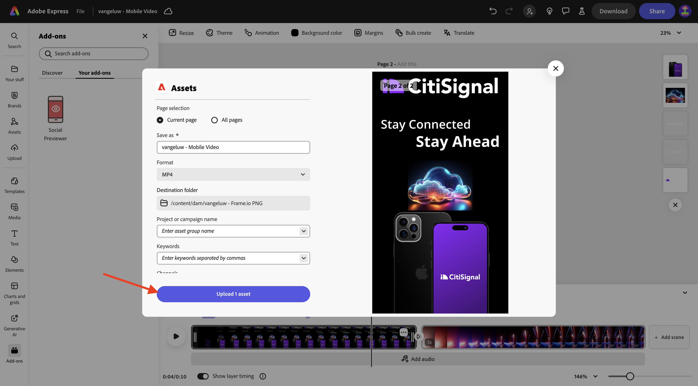

# 1.4.2 Animación y vídeo en Adobe Express

Antes de comenzar este ejercicio, descargue los recursos necesarios de [https://tech-insiders.s3.us-west-2.amazonaws.com/one-adobe/Adobe_Express.zip](https://tech-insiders.s3.us-west-2.amazonaws.com/one-adobe/Adobe_Express.zip){target="_blank"} y descomprímalo en el escritorio.

## 1.4.2.1 Crear un vídeo

Vaya a [https://new.express.adobe.com/](https://new.express.adobe.com/){target="_blank"}. Haga clic en el icono **+** para crear una nueva **imagen**.

Vaya a **Vídeo** y, a continuación, seleccione **Vídeo móvil**.

Entonces debería ver esto.

Seleccione **Color de fondo** y luego elija **negro**.

A continuación, debe agregar el logotipo **CitiSignal**. Vaya a **Marcas** y seleccione el logotipo blanco de CitiSignal. Haga clic en los 3 puntos **...** y seleccione **Lugar**.

Centre el logotipo de CitiSignal en la parte superior de la imagen.

Vaya a **Texto** y luego seleccione **Agregar el texto**.

Escriba el texto `Stay Connected` y coloque el cuadro de texto en una ubicación similar a la que se muestra en la siguiente imagen.

Vaya a **Texto** y luego seleccione **Agregar el texto**. Escriba el texto `Stay Ahead`.

Coloque el cuadro de texto en una ubicación similar a la que se muestra en la siguiente imagen.

Seleccione el primer cuadro de texto con el texto **Permanecer conectado**. Vaya a **Marcas**, a **Fuentes**. Haga clic en los 3 puntos **...** de la primera fuente y haga clic en **Aplicar**.

Seleccione el segundo cuadro de texto con el texto **Permanecer delante**. Vaya a **Marcas**, a **Fuentes**. Haga clic en los 3 puntos **...** de la tercera fuente y haga clic en **Aplicar**.

Entonces debería ver esto. Vaya a **Medios** y seleccione **Generar imagen**.

Escriba el mensaje `futuristic looking transparent cloud on a black background` y haga clic en **Generar**.

Seleccione **Horizontal (4:3)**.

Entonces debería ver esto. Elija una de las variaciones.

Centrar la imagen generada. Vaya a **Medios** y haga clic en **Cargar desde el dispositivo**.

Vaya al escritorio, a la carpeta **Adobe_Express** que contiene los recursos que descargó anteriormente. Seleccione el archivo **CitiSignalPhoneLogo.png** y haga clic en **Abrir**.

Entonces debería ver esto.

Arrastre la imagen hacia abajo para que tenga un aspecto similar al de la siguiente imagen.

Cambie el nombre del proyecto a `--aepUserLdap-- - Mobile Video`.

Vaya a **Animación** y haga clic en la animación **Glide**.

Haga clic en el icono **reproducir** para probar la animación.

Seleccione el cuadro de texto **Manténgase al frente**.

Ajuste el control deslizante de la cronología del cuadro de texto **Manténgase al frente** para que se inicie a mitad de camino.

Seleccione el logotipo **CitiSignal**.

Abra la configuración detallada de la acción **Diapositiva** y cambie la duración a 2,5 s.

A continuación, haga clic en **Descargar**. Seleccione **Formato de archivo** **MP4** y establezca **Resolución de vídeo** en **1080p**. Haga clic en **Descargar**.

El archivo de vídeo se generará y se descargará en el equipo. El primer vídeo ya está listo.

## 1.4.2.2 Agregar a su vídeo

Cierre la vista **Cronología**.

Haga clic en los 3 puntos **...** y seleccione **Duplicado**.

A continuación, se generará una nueva página. Haga clic en **Editar escala de tiempo** para comenzar a trabajar con la nueva página.

Haga clic en **+ Agregar escena**.

Debería ver una nueva escena que se está añadiendo.

Vaya al escritorio, a la carpeta **Adobe_Express** que contiene los recursos que descargó anteriormente. Seleccione el archivo **`AdobeStock_648887461_trimmed.mp4`** y haga clic en **Abrir**.

A continuación, el archivo de vídeo se agregará a la nueva escena.

Haz clic en el medio entre las dos escenas y, a continuación, selecciona **Agregar transición**.

Haga clic en **Sumergir en negro**.

Cambie **Duration** a 2 segundos. No dude en hacer clic en el botón **reproducir** para probar su transición.

Vaya a **Texto** y haga clic en **Agregar el texto**.

Escriba el texto `with lightning fast speed from CitiSignal`. Centrar el texto haciendo clic en **Alinear al centro**.

Cambie el tamaño de fuente a **60**.

## 1.4.2.3 usar complementos en Adobe Express

Vaya a **Complementos** y busque el complemento **Previsor social**.

Haga clic en **+ Agregar** para agregar el complemento.

Seleccione el complemento **Previsor social** y haga clic en la opción de vista previa de **Publicación de Instagram**. Ahora puede previsualizar fácilmente el aspecto que tendrá su publicación en las plataformas de medios sociales más comunes.

## 1.4.2.4 Crear una nueva plantilla en Adobe Express

A continuación, haga clic en el botón **Compartir** y seleccione **Crear una plantilla**.

Use el nombre `--aepUserLdap-- - Mobile Video`, seleccione la marca **CitiSignal (Telco)** y haga clic en **Guardar plantilla**.

La plantilla de vídeo ahora se guarda en la plantilla de marca.

## 1.4.2.5 Guarde el vídeo en AEM Assets CS

Vuelva a hacer clic en **Compartir** y, a continuación, seleccione **Guardar en la nube**. Seleccionar **AEM Assets**.

Seleccione la **página actual**. Use el nombre `--aepUserLdap-- - Mobile Video` y haga clic en **Seleccionar carpeta**.

Seleccione la carpeta **`--aepUserLdap-- - Frame.io PNG`** y haga clic en **Seleccionar**.

Haga clic en **Cargar 1 recurso**.

Vaya a [https://experience.adobe.com/](https://experience.adobe.com/){target="_blank"} y haga clic en **Experience Manager Assets**.

Seleccione el entorno de AEM Assets CS, que debería llamarse `--aepUserLdap-- - Citi Signal dev`.

En **Assets**, vaya a la carpeta **`--aepUserLdap-- - Frame.io PNG`**. Haga doble clic en el recurso **`--aepUserLdap-- - Mobile Video`** para abrirlo.

El vídeo que se creó en Adobe Express ya está disponible en Adobe Experience Manager Assets.

## Pasos siguientes

Vaya a [Crear Assets de forma masiva en Adobe Express](./ex3.md){target="_blank"}

Volver a [Adobe Express y Adobe Experience Cloud](./express.md){target="_blank"}

Volver a [Todos los módulos](./../../../overview.md){target="_blank"}
