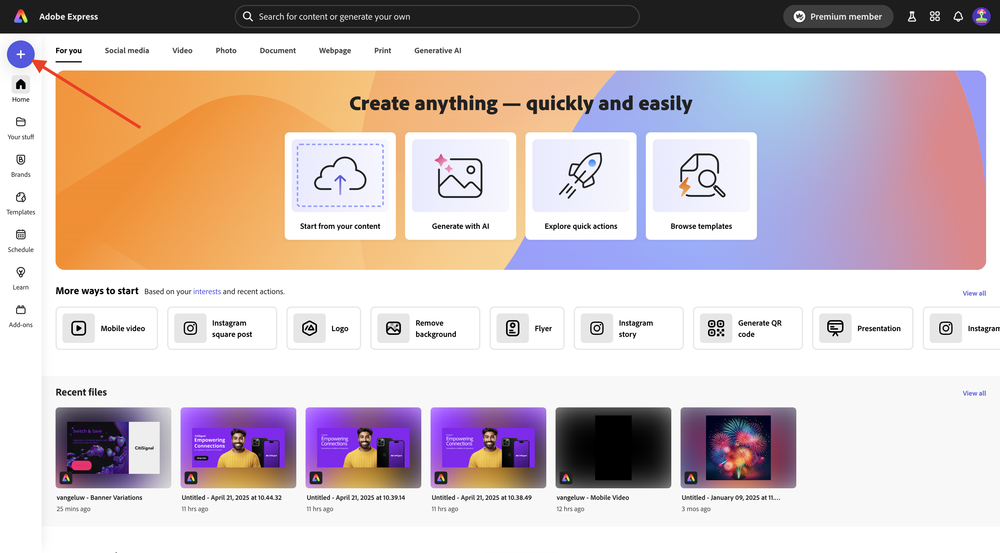
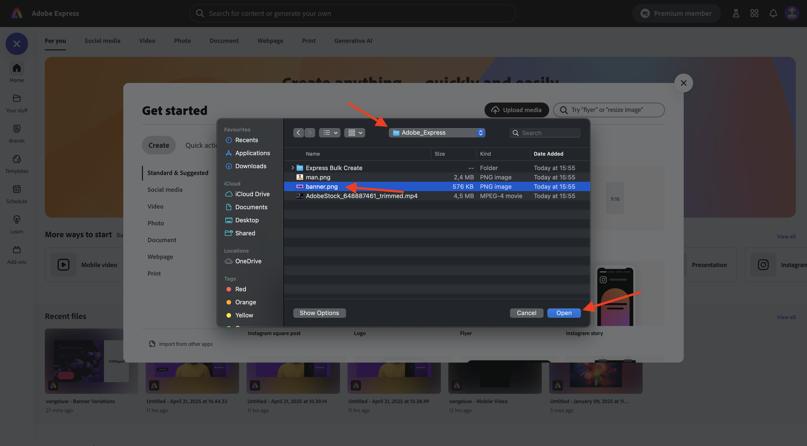
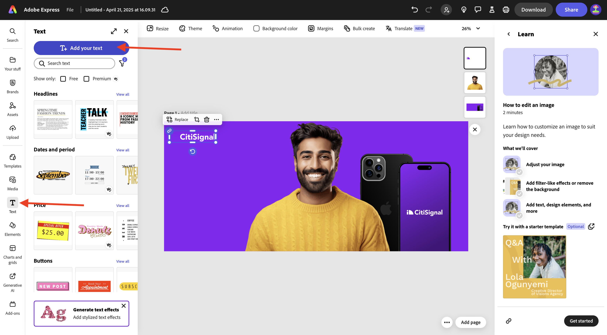
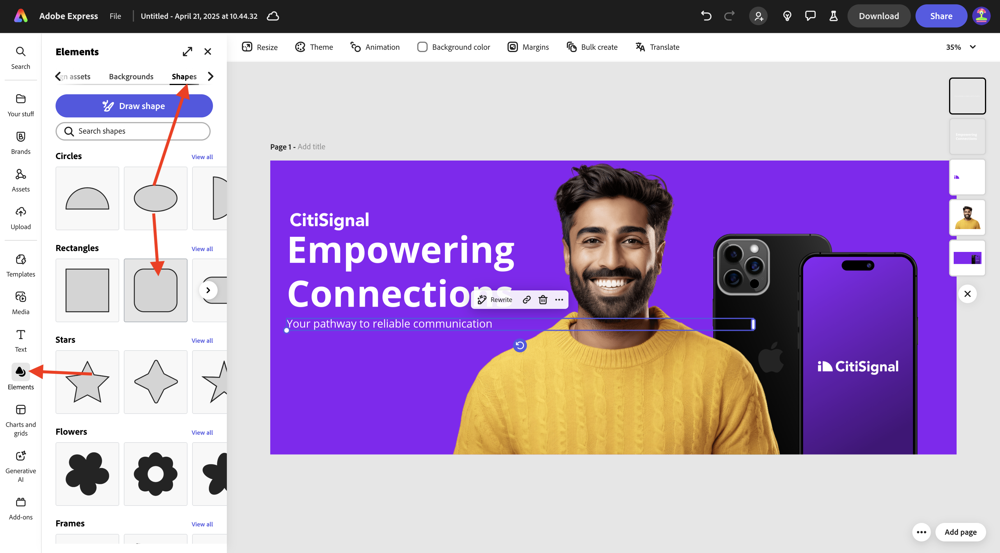
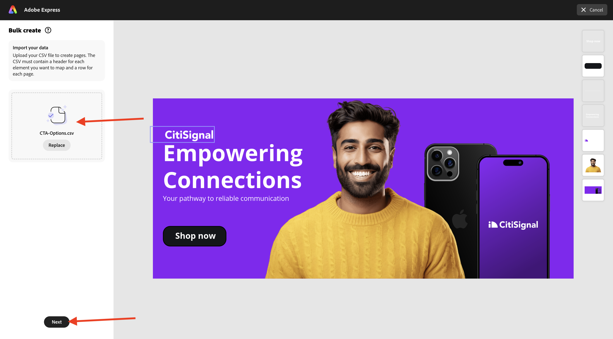
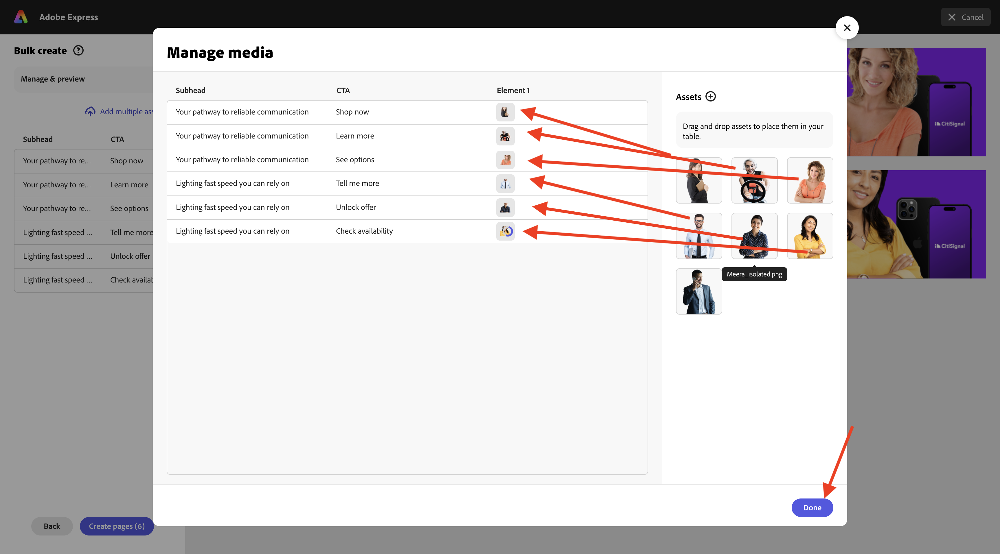

# 1.4.3 Creación masiva de Assets en Adobe Express

Antes de comenzar este ejercicio, descargue los recursos necesarios de [https://tech-insiders.s3.us-west-2.amazonaws.com/one-adobe/Adobe_Express.zip](https://tech-insiders.s3.us-west-2.amazonaws.com/one-adobe/Adobe_Express.zip){target="_blank"} y descomprímalo en el escritorio.

## 1.4.3.1 Crear su recurso básico

Vaya a [https://new.express.adobe.com/](https://new.express.adobe.com/){target="_blank"}. Haga clic en el icono **+** para crear una nueva **imagen**.

Seleccione **Fotografía** y, a continuación, elija **Cargar medios**.

Vaya al escritorio, a la carpeta **Adobe_Express** que contiene los recursos que descargó anteriormente. Seleccione el archivo **banner.png** y haga clic en **Abrir**.

Entonces debería ver esto. Seleccione **Editar imagen**.

A continuación, ve a **Medios** y selecciona **Cargar imagen**. Vaya al escritorio, a la carpeta **Adobe_Express** que contiene los recursos que descargó anteriormente. Seleccione el archivo **man.png** y haga clic en **Abrir**.

Entonces debería ver esto.

A continuación, debe agregar el logotipo **CitiSignal**. Vaya a **Marcas** y seleccione el logotipo blanco de CitiSignal. Haga clic en los 3 puntos **...** y seleccione **Lugar**.

Ajuste la ubicación de la imagen del logotipo de CitiSignal para reflejar la misma posición en la imagen siguiente.

Vaya a **Texto** y haga clic en **Agregar el texto**.

En el nuevo cuadro de texto, agregue el texto `Empowering Connections`. Arrastre el cuadro de texto a una ubicación similar a la que se muestra en la siguiente imagen. A continuación, ve a **Marcas**, a **Fuentes**. Haga clic en los 3 puntos **...** de la tercera fuente y haga clic en **Aplicar**.

A continuación, cambie el color de la fuente a **blanco**.

Vuelve a **Texto** y haz clic en **Agregar tu texto**.

En el cuadro de texto nuevo, escriba el texto `Your pathway to reliable communication`. Ajuste la ubicación del cuadro de texto para que esté debajo del cuadro de texto anterior, de forma similar a la imagen de abajo.

Vaya a **Marcas**, a **Fuentes** y haga clic en los 3 puntos **...** de la segunda fuente. A continuación, haga clic en **Aplicar**.

Entonces deberías tener esto. A continuación, vaya a **Elements**, **Shapes** y haga clic en la forma de rectángulo redondeado.

A continuación, tendrá una nueva forma rectangular redondeada en la imagen. Ajuste el tamaño y la ubicación para que parezca un botón. A continuación, cambie el color del rectángulo redondeado a **negro**.

Vuelve a **Texto** y haz clic en **Agregar tu texto**.

Escriba el texto `Shop now` en el nuevo cuadro de texto y cambie la ubicación del cuadro de texto para que se centre en el botón. Vaya a **Marcas**, a **Fuentes** y haga clic en los 3 puntos **...** de la tercera fuente. A continuación, haga clic en **Aplicar**.

Entonces debería ver esto.

## 1.4.3.2 creación masiva en Adobe Express

A continuación, haga clic en **Crear** de forma masiva.

Entonces debería ver esto. Haga clic en **examinar**.

Vaya a su escritorio, a la carpeta **Express Bulk Create** en la carpeta **Adobe_Express** que contiene los recursos que descargó anteriormente. Seleccione el archivo **CTA-options.csv** y haga clic en **Abrir**.

Entonces debería ver esto. Haga clic en **Next**.

Haga clic en **Conectar elemento**.

Seleccione el cuadro de texto que contiene el texto **Su ruta a una comunicación confiable**. A continuación, haga clic en el botón **Elemento 1** y vincúlelo a un campo del archivo CSV, en este caso, el campo **Subhead**.

A continuación, seleccione el cuadro de texto que contiene el texto **Comprar ahora**.

A continuación, haga clic en el botón **Elemento 1** y vincúlelo a un campo del archivo CSV, en este caso, el campo **CTA**.

Entonces debería ver esto. A continuación, haga clic en la imagen de la persona.

Haga clic en el botón **Elemento 1**.

Entonces verá esta ventana emergente. Haga clic en **examinar**.

Vaya a su escritorio, a la carpeta **Express Bulk Create** en la carpeta **Adobe_Express** que contiene los recursos que descargó anteriormente. Seleccione entre 6 y 7 archivos de imagen y haga clic en **Abrir**.

Entonces verá esto... Arrastre y suelte una imagen diferente en cada variación del recurso. Haga clic en **Listo**

A continuación, verá las variaciones de la imagen que se está generando. Haga clic en **Crear páginas**.

Las variaciones ya están listas y puede inspeccionar cada una de ellas individualmente para revisarlas y validarlas.

Ahora ha completado este ejercicio.

## Pasos siguientes

Ir a [Resumen y beneficios](./summary.md){target="_blank"}

Volver a [Adobe Express y Adobe Experience Cloud](./express.md){target="_blank"}

Volver a [Todos los módulos](./../../../overview.md){target="_blank"}