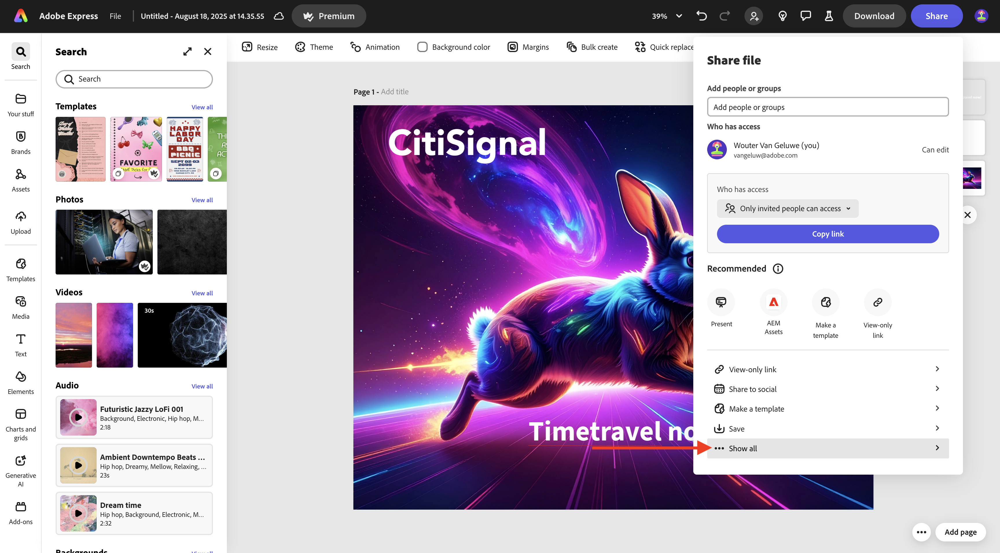
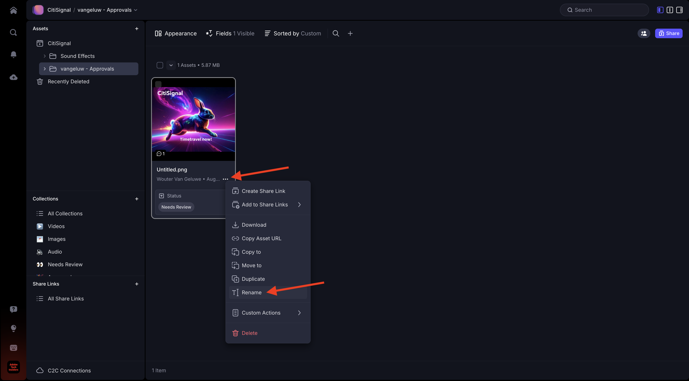
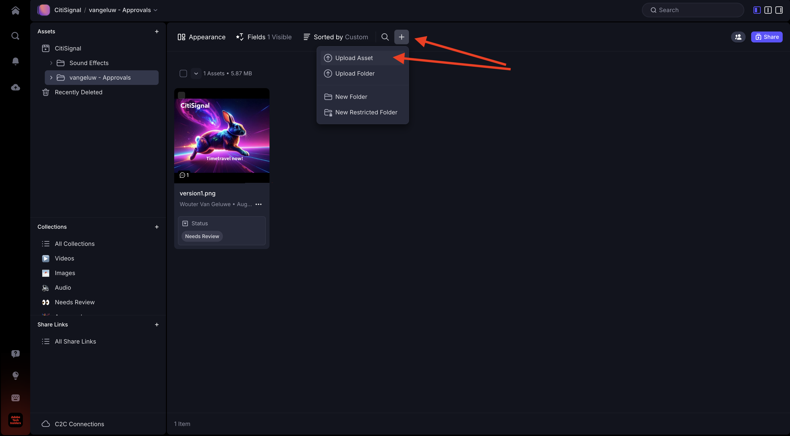

# 1.5.2 Aprobaciones con Frame.io

>[!NOTE]
>
> La siguiente captura de pantalla muestra un entorno específico que se está utilizando. Cuando revise este tutorial, es muy probable que su entorno tenga un nombre diferente. Cuando se registró en este tutorial, se le proporcionaron los detalles del entorno que debe utilizar, siga esas instrucciones.

Para avanzar por el flujo de trabajo de aprobaciones en Frame.io, necesita tener un recurso. En este ejercicio, comenzará creando ese recurso usted mismo con Adobe Firefly y Adobe Express. Una vez que tenga el recurso, lo cargará en Frame.io y, finalmente, lo aprobará.

## 1.5.2.1 Crear recurso con Adobe Firefly Services y Adobe Express

Vaya a [https://firefly.adobe.com/](https://firefly.adobe.com/){target="_blank"}. Escriba el mensaje `a neon rabbit running very fast through space` y haga clic en **Generar**.

A continuación, verá varias imágenes que se generan. Elige la imagen que más te guste, haz clic en el icono **Compartir** de la imagen y luego selecciona **Abrir en Adobe Express**.

A continuación, verá que la imagen que acaba de generar está disponible en Adobe Express para editarla. Ahora debe añadir el logotipo de CitiSignal en la imagen. Para ello, ve a **Marcas**.

Luego debería ver una plantilla de marca CitiSignal. que se haya creado en GenStudio for Performance Marketing, aparecen en Adobe Express. Haga clic para seleccionar una plantilla de marca que tenga `CitiSignal` en su nombre.

Vaya a **Logotipos** y haga clic en el logotipo **blanco** de Citisignal para colocarlo en la imagen.

Coloque el logotipo de CitiSignal en la parte superior de la imagen, no demasiado lejos del centro.

Ir a **Texto**.

Haz clic en **Agregar tu texto**.

Escriba el texto `Timetravel now!`, cambie el color y el tamaño de fuente, establezca el texto en **Negrita** para que tenga una imagen similar a esta.

A continuación, haga clic en **Compartir**.

Haga clic en **... Mostrar todo**.

Desplácese hacia abajo y seleccione **Descargar**.

Haga clic en **Descargar**.

Luego tendrá el recurso en el equipo local.

## 1.5.2.2: apruebe su recurso en Frame.io

Vaya a [https://next.frame.io/](https://next.frame.io/). Asegúrese de haber iniciado sesión en el entorno `--aepImsOrgName--`.

Si no ha iniciado sesión en el entorno derecho, haga clic en el logotipo de en la esquina inferior izquierda y haga clic en para seleccionar el entorno que necesita utilizar.

Vaya a su área de trabajo, que debe llamarse `--aepUserLdap--` y luego abra la carpeta **CitiSignal**. Haga clic en el icono **+** y luego seleccione **Nueva carpeta**.

Asigne un nombre a la carpeta `--aepUserLdap-- - Approvals`. Haga doble clic en la carpeta para abrirla.

A continuación, cargue en esta carpeta el archivo que creó en el ejercicio anterior. Haga clic en **Cargar**.

Seleccione el archivo y haga clic en **Abrir**.

Entonces deberías tener esto. Haga doble clic para abrir el archivo.

Active el icono para dejar un comentario anclado.

Escriba un comentario, como `Change CTA to "Get on board now!"`. Haz clic en el icono **enviar** para compartir tu comentario.

Entonces deberías tener esto. Vaya a **Campos**.

En el campo **Estado**, cambie el estado a **Necesita revisión**.

Entonces deberías tener esto. Vuelva a la carpeta haciendo clic en la flecha para volver.

Haga clic en los 3 puntos **...** y seleccione **Cambiar nombre**.

Cambie el nombre de archivo a `version1.png`.

## 1.5.2.3 Realizar cambios de diseño en Adobe Express

Vaya a [https://new.express.adobe.com/your-stuff/files](https://new.express.adobe.com/your-stuff/files) y abra de nuevo la imagen que creó anteriormente.

Cambie el texto de CTA a `Get On Board Now!`.

Haga clic en **Compartir** y, a continuación, seleccione **Descargar**.

Haga clic en **Descargar**.

A continuación, se descargará una nueva imagen en el equipo local. Cambie el nombre del archivo a `version2.png`.

## 1.5.2.4 Aprobar versión2 en Frame.io

En su carpeta en Frame.io, haga clic en el icono **+** y seleccione **Cargar recurso**.

Seleccione el archivo **version2.png** y haga clic en **Abrir**.

A continuación, arrastre el archivo **version2.png** sobre el archivo **version1.png**. Esta acción habilitará el apilamiento de versiones en Frame.io.

Entonces debería ver esto.

Haga clic en los 3 puntos **...** de la imagen y, a continuación, seleccione **Comparar versiones**.

Debería ver esta vista de comparación que muestra ambas versiones del archivo. Vaya a **Campos**.

Cambie el campo **Status** a **Approved**.

Entonces deberías tener esto. Haga clic en el icono de flecha para volver a la vista de carpetas.

Haga clic en los 3 puntos **...** y seleccione **Descargar** en caso de que desee utilizar este archivo en otra aplicación.

## Pasos siguientes

[1.5.3 Frame.io y Premiere Pro](./ex3.md){target="_blank"}

Vuelva a [Optimizar el flujo de trabajo con Frame.io](./frameio.md){target="_blank"}

Volver a [Todos los módulos](./../../../overview.md){target="_blank"}
