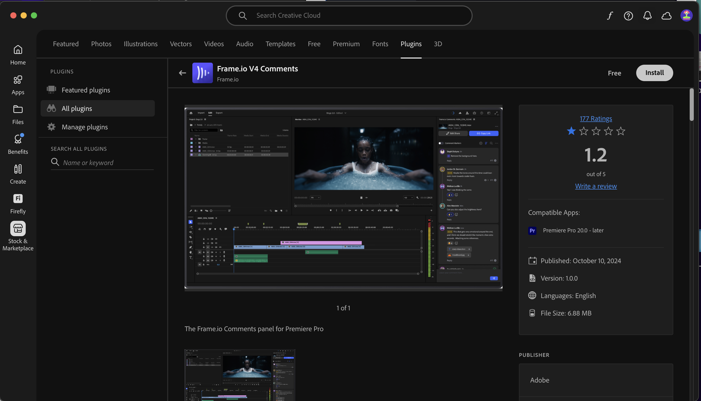

# 1.5.3 Frame.io y Premiere Pro

>[!NOTE]
>
> La siguiente captura de pantalla muestra un entorno específico que se está utilizando. Cuando revise este tutorial, es muy probable que su entorno tenga un nombre diferente. Cuando se registró en este tutorial, se le proporcionaron los detalles del entorno que debe utilizar, siga esas instrucciones.

Vaya a [https://next.frame.io/](https://next.frame.io/). Asegúrese de haber iniciado sesión en el entorno `--aepImsOrgName--`.

Si no ha iniciado sesión en el entorno derecho, haga clic en el logotipo de en la esquina inferior izquierda y haga clic en para seleccionar el entorno que necesita utilizar.

## 1.5.3.1 Configuración de Adobe Premiere Pro Beta

Ya ha instalado Adobe Premiere Pro Beta como parte del módulo Introducción. Para utilizar Frame.io en combinación con Adobe Premiere Pro Beta, puede utilizar el complemento desarrollado para esta integración.

Abra la aplicación de Creative Cloud y busque `frame.io`.

Desplácese hacia abajo en los resultados de búsqueda para encontrar el complemento **Frame.io V4 Comments**. Haga clic en ella.

Entonces debería ver esto. Haga clic en **Instalar**.

Si Adobe Premiere Pro Beta está abierto, primero tendrá que **cerrarlo** para poder instalar el complemento.

Haga clic en **OK**. El complemento se está instalando.

Una vez instalado el complemento, abra Adobe Premiere Pro Beta en el equipo.

## Pasos siguientes

Ir a [Resumen y beneficios](./summary.md){target="_blank"}

Vuelva a [Optimizar el flujo de trabajo con Frame.io](./frameio.md){target="_blank"}

Volver a [Todos los módulos](./../../../overview.md){target="_blank"}
