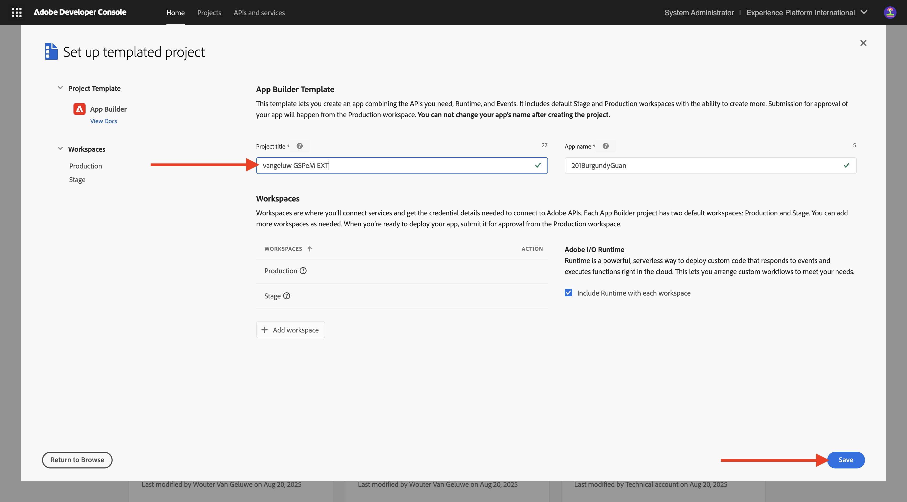
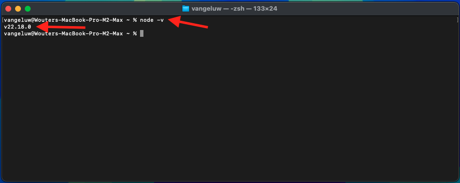

# 1.6.1 Adobe IO y App Builder

## 1.6.1.1 Crear su proyecto de Adobe I/O

Vaya a [https://developer.adobe.com/console/home](https://developer.adobe.com/console/home){target="_blank"}.

Asegúrese de seleccionar la instancia correcta en la esquina superior derecha de la pantalla. Su instancia es `--aepImsOrgName--`.

>[!NOTE]
>
> La siguiente captura de pantalla muestra una organización específica seleccionada. Cuando vaya a través de este tutorial, es muy probable que su organización tenga un nombre diferente. Cuando se registró en este tutorial, se le proporcionaron los detalles del entorno que debe utilizar, siga esas instrucciones.

A continuación, seleccione **Crear proyecto a partir de la plantilla**.

Seleccione **App Builder**.

Escriba el nombre `--aepUserLdap-- GSPeM EXT`. Haga clic en **Guardar**.

Entonces deberías ver algo como esto.

## 1.6.1.2 Configurar su entorno de desarrollo

Para crear, enviar e implementar su aplicación extensible, su entorno de desarrollo local en su equipo debe tener instaladas las siguientes aplicaciones y paquetes:

- Node.js (versión 20.x o superior)
- npm (empaquetado con Node.js)
- Interfaz de línea de comandos (CLI) de Adobe Developer

Si estas aplicaciones o paquetes aún no están instalados en el equipo, siga estos pasos.

### Node.js y npm

Vaya a [https://nodejs.org/en/download](https://nodejs.org/en/download). Debería ver esto, con una serie de comandos de terminal que deben ejecutarse para tener instalados Node.js y npm. Los comandos que se muestran aquí son aplicables a MacBook.

En primer lugar, abra una nueva ventana de terminal. Pegue y ejecute el comando mencionado en la línea 2 de la captura de pantalla:

`curl -o- https://raw.githubusercontent.com/nvm-sh/nvm/v0.40.3/install.sh | bash`

A continuación, ejecute el comando en la línea 5 de la captura de pantalla:

`\. "$HOME/.nvm/nvm.sh"`

Después de ejecutar ambos comandos correctamente, ejecute este comando:

`node -v`

Debería ver el número de versión que se devuelve.

A continuación, ejecute este comando:

`npm -v`

Debería ver el número de versión que se devuelve.

Si los dos últimos comandos devolvieron correctamente un número de versión, la configuración de estas dos funciones se realizará correctamente.

### Interfaz de línea de comandos (CLI) de Adobe Developer

Para instalar la interfaz de línea de comandos (CLI) de Adobe Developer, ejecute el siguiente comando en una ventana de terminal:

`npm install -g @adobe/aio-cli`

La ejecución de este comando puede tardar un par de minutos. El resultado final debería ser similar al siguiente:

La interfaz de línea de comandos (CLI) de Adobe Developer ahora también se ha instalado correctamente.

Ahora ha configurado los elementos básicos para poder ejecutar un proyecto de App Builder.

## Pasos siguientes

Vaya a [Crear su AWS S3 &#x200B;](./ex2.md){target="_blank"}

Volver a [GenStudio for Performance Marketing - Extensibilidad](./genstudioext.md){target="_blank"}

Volver a [Todos los módulos](./../../../overview.md){target="_blank"}
