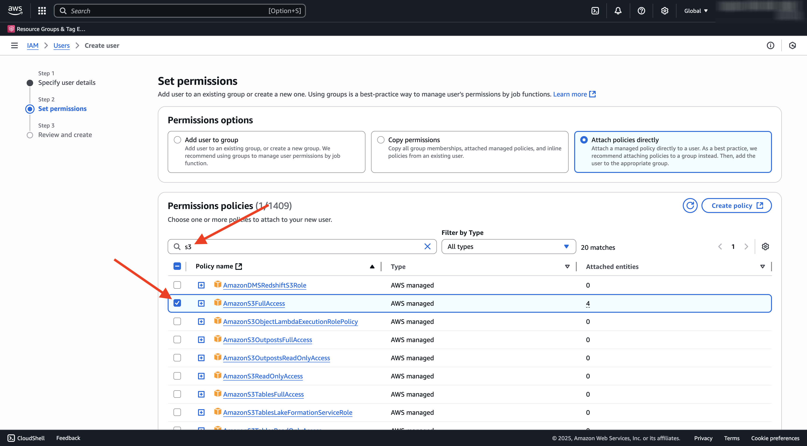
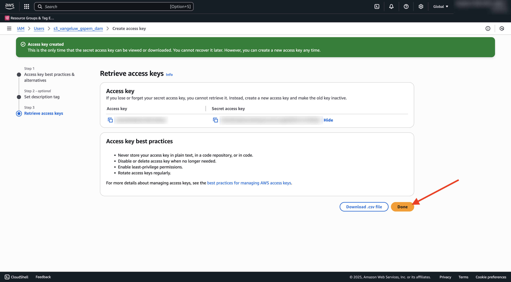
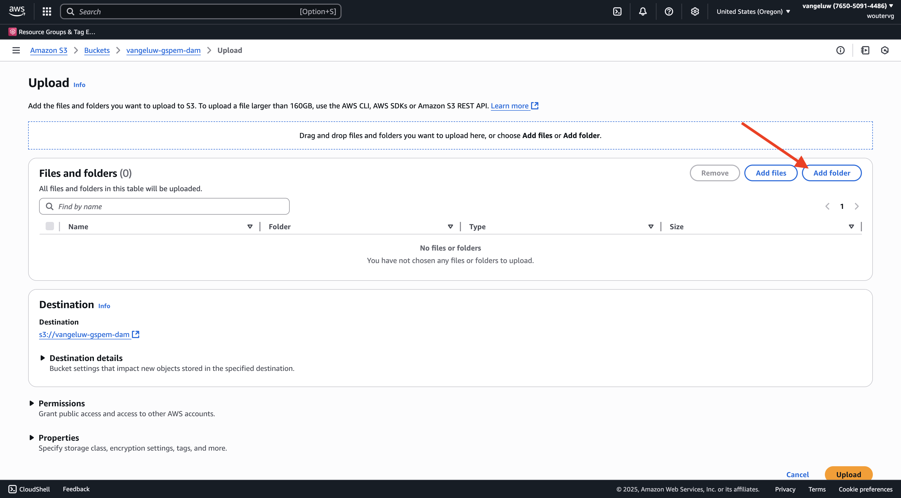

# 1.6.2 Crear el contenedor de AWS S3

## 1.6.2.1 Crear su S3 bucket

Vaya a [https://console.aws.amazon.com](https://console.aws.amazon.com) e inicie sesión.

>[!NOTE]
>
>Si todavía no tiene una cuenta de AWS, cree una nueva cuenta de AWS con su dirección de correo electrónico personal.

Después de iniciar sesión, se le redirigirá a **AWS Management Console**.

En la barra de búsqueda, busque **s3**. Haga clic en el primer resultado de búsqueda: **S3 - Almacenamiento escalable en la nube**.

Luego verá la página principal de **Amazon S3**. Haga clic en **Crear cubo**.

En la pantalla **Crear cubo**, use el nombre `--aepUserLdap---gspem-dam`.

Mantenga el resto de configuraciones predeterminadas tal cual. Desplácese hacia abajo y haga clic en **Crear cubo**.

A continuación, verá que se está creando su contenedor y se redirigirá a la página principal de Amazon S3.

## Definición de permisos para acceder al compartimento de S3

El siguiente paso es configurar el acceso a su S3 bucket.

Para ello, vaya a [https://console.aws.amazon.com/iam/home](https://console.aws.amazon.com/iam/home).

El acceso a los recursos de AWS está controlado por Identity and Access Management (IAM) de Amazon.

Ahora verá esta página.

En el menú de la izquierda, haga clic en **Usuarios**. Luego verá la pantalla **Usuarios**. Haga clic en **Crear usuario**.

A continuación, configure el usuario:

- Nombre de usuario: use `s3_--aepUserLdap--_gspem_dam`

Haga clic en **Next**.

Entonces verá esta pantalla de permisos. Haga clic en **Adjuntar directivas directamente**.

Escriba el término de búsqueda **s3** para ver todas las directivas de S3 relacionadas. Seleccione la directiva **AmazonS3FullAccess**. Desplácese hacia abajo y haga clic en **Siguiente**.

Revise la configuración. Haga clic en **Crear usuario**.

Entonces verá esto... Haga clic en **Ver usuario**.

Haga clic en **Credenciales de seguridad** y luego haga clic en **Crear clave de acceso**.

Seleccione **Aplicación que se ejecuta fuera de AWS**. Desplácese hacia abajo y haga clic en **Siguiente**.

Haga clic en **Crear clave de acceso**

Entonces verá esto... Haz clic en **Mostrar** para ver tu clave de acceso secreta:

Tu **clave secreta de acceso** se está mostrando.

>[!IMPORTANT]
>
>Almacene sus credenciales en un archivo de texto en su equipo.
>
> - Id. de clave de acceso: ...
> - Clave de acceso secreta: ...
>
> Una vez que hagas clic en **Listo**, nunca volverás a ver tus credenciales.

Haga clic en **Finalizado**.

Ahora ha creado correctamente un contenedor de AWS S3 y ha creado un usuario con permisos para acceder a este contenedor.

## 1.6.2.2 Cargar Assets en el contenedor de S3

En la barra de búsqueda, busque **s3**. Haga clic en el primer resultado de búsqueda: **S3 - Almacenamiento escalable en la nube**.

Haga clic para abrir el contenedor de S3 recién creado, que debe llamarse `--aepUserLdap---gspem-dam`.

Haga clic en **Cargar**.

Entonces debería ver esto.

Puede descargar los archivos de imagen de CitiSignal [aquí](./../../asset-mgmt/module2.2/images/CitiSignal_Neon_Rabbit.zip){target="_blank"}.

Exporte los archivos al escritorio.

Tome los 2 archivos de imágenes de esa carpeta y suéltelos en la ventana de carga del compartimento S3. Haga clic en **Cargar**.

Entonces debería ver esto. El contenedor S3, los archivos de imagen y el usuario de IAM ya están listos para su uso en la aplicación DAM externa.

## Pasos siguientes

Vaya a [Crear su aplicación DAM externa](./ex3.md){target="_blank"}

Volver a [GenStudio for Performance Marketing - Extensibilidad](./genstudioext.md){target="_blank"}

Volver a [Todos los módulos](./../../../overview.md){target="_blank"}
