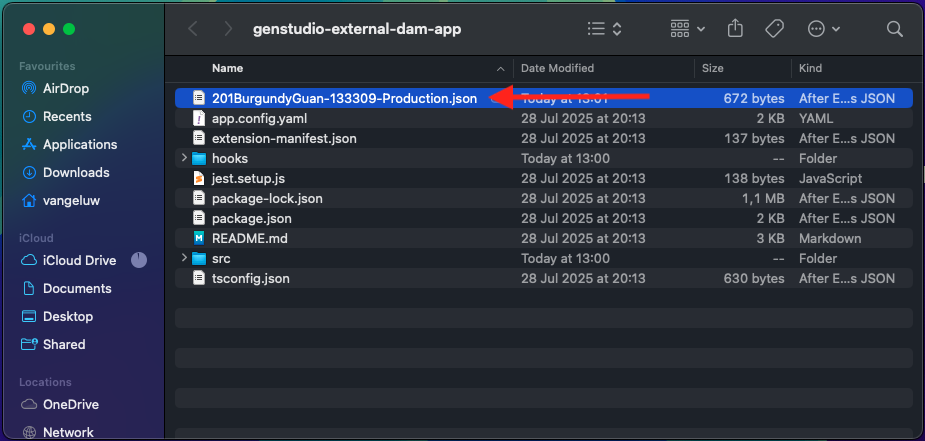
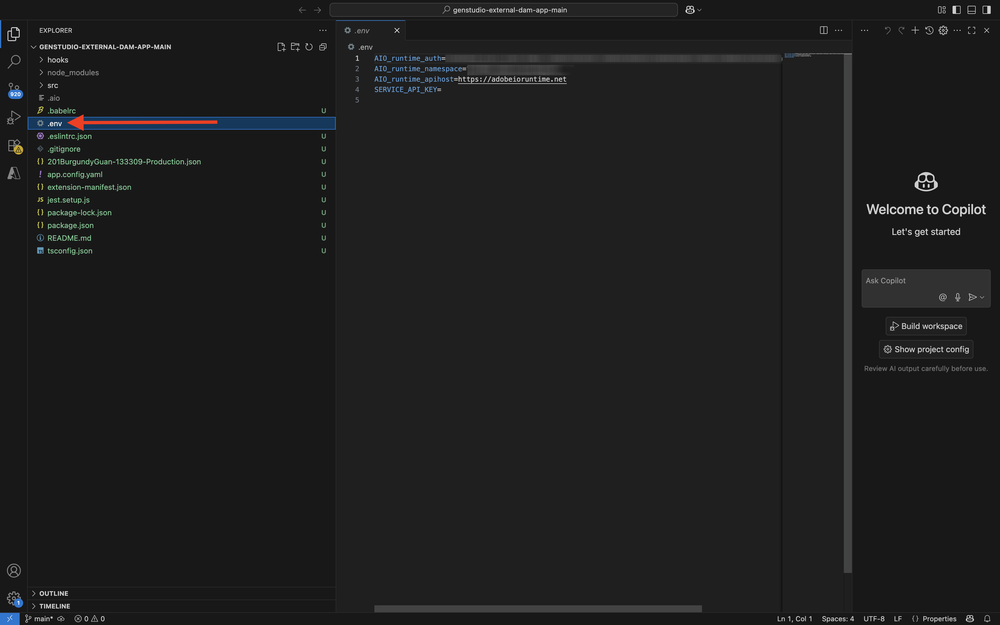
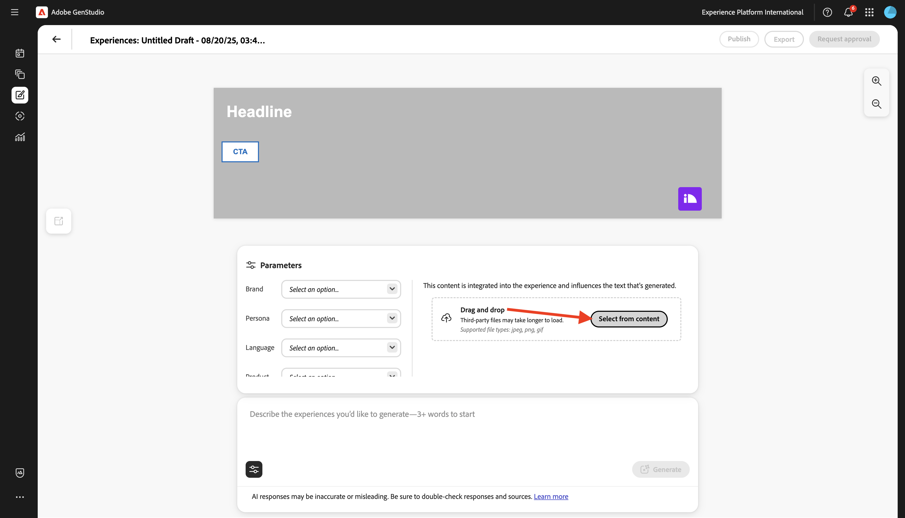
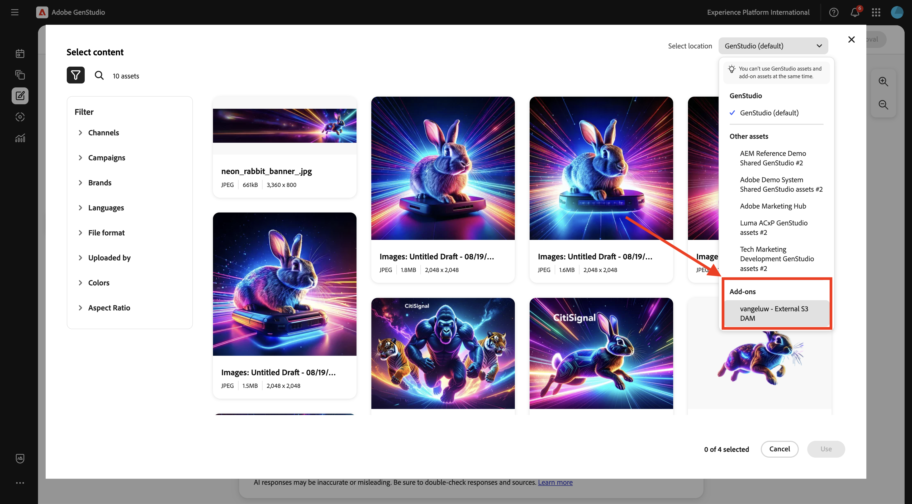

# 1.6.3 Creación e implementación de la aplicación DAM externa

## 1.6.3.1 descargar archivos de aplicación de ejemplo

Vaya a [https://github.com/woutervangeluwe/genstudio-external-dam-app](https://github.com/woutervangeluwe/genstudio-external-dam-app). Haga clic en **Código** y, a continuación, seleccione **Descargar ZIP**.


Desempaquete el archivo zip en su escritorio.


## 1.6.3.2 Configurar la interfaz de línea de comandos de Adobe Developer

Haga clic con el botón derecho en la carpeta **genstudio-external-dam-app-main** y seleccione **Nuevo terminal en la carpeta**.


Entonces debería ver esto. Escriba el comando `aio login`. Este comando se redireccionará al explorador y se espera que inicie sesión.


Después de iniciar sesión correctamente, debería ver esto en el explorador.


A continuación, el explorador redireccionará de nuevo a la ventana de terminal. Debería ver un mensaje que indique **Inicio de sesión correcto** y un token largo que devuelve el explorador.


El siguiente paso es configurar la instancia y el proyecto de Adobe IO que utilizará para la aplicación DAM externa.

Para ello, debe descargar un archivo del proyecto de Adobe IO que configuró anteriormente.

Vaya a [https://developer.adobe.com/console/home](https://developer.adobe.com/console/home){target="_blank"} y abra el proyecto que creó anteriormente, que se llama `--aepUserLdap-- GSPeM EXT`. Abra el área de trabajo **Producción**.


Haga clic en **Descargar todo**. Esto descargará un archivo JSON.


Copie el archivo JSON del directorio **Descargas** en el directorio raíz de la aplicación DAM externa.



Vuelve a la ventana de tu terminal. Escriba el comando `aio app use XXX-YYY-Production.json`.

>[!NOTE]
>
>Debe cambiar el nombre del archivo en el comando anterior para que coincida con el nombre del archivo.

Una vez ejecutado el comando, la aplicación DAM externa se conectará al proyecto de Adobe IO con App Builder que creó anteriormente.


## 1.6.3.3 Instalar GenStudio Extensibility SDK

A continuación, debe instalar **GenStudio Extensibility SDK**. Puede encontrar más detalles sobre SDK aquí: [https://github.com/adobe/genstudio-extensibility-sdk](https://github.com/adobe/genstudio-extensibility-sdk).

Para instalar SDK, ejecute este comando en la ventana de terminal:

`npm install @adobe/genstudio-extensibility-sdk`


Después de un par de minutos, se instalará SDK.


## 1.6.3.4: revise la aplicación DAM externa en Visual Studio Code.

Abra Código de Visual Studio. Haga clic en **Abrir...** para abrir una carpeta.


Seleccione la carpeta **genstudio-external-dam-app-main** que contiene la aplicación que descargó anteriormente. Haga clic en **Abrir**.


Haga clic para abrir el archivo **.env**.



El archivo **.env** se creó mediante el comando `aio app use` que ejecutó en el paso anterior y contiene la información necesaria para conectarse al proyecto de Adobe IO con App Builder.


Ahora necesita agregar los siguientes detalles al archivo **.env**, para que la aplicación DAM externa pueda conectarse al contenedor de AWS S3 que creó anteriormente.

```
AWS_ACCESS_KEY_ID=
AWS_SECRET_ACCESS_KEY=
AWS_REGION=
AWS_BUCKET_NAME=
```

Los campos **`AWS_ACCESS_KEY_ID`** y **`AWS_SECRET_ACCESS_KEY`** estaban disponibles después de crear el usuario de IAM en el ejercicio anterior. Se le pidió que los anotara, ahora puede copiar los valores.


El campo **`AWS_REGION`** se puede tomar de la vista de inicio de AWS S3, junto al nombre del contenedor. En este ejemplo, la región es **us-west-2**.


El campo **`AWS_BUCKET_NAME`** debe ser `--aepUserLdap---gspem-dam`.

Esta información le permite actualizar los valores de cada una de estas variables.

```
AWS_ACCESS_KEY_ID=XXX
AWS_SECRET_ACCESS_KEY=YYY
AWS_REGION=us-west-2
AWS_BUCKET_NAME=--aepUserLdap---gspem-dam
```

Ahora debería pegar este texto en el archivo `.env`. No olvide guardar los cambios.


A continuación, vuelve a la ventana de tu terminal. Ejecute este comando:

`export $(grep -v '^#' .env | xargs)`


Por último, debe cambiar la etiqueta que se mostrará dentro de GenStudio for Performance Marketing para poder distinguir la aplicación DAM externa de otras integraciones. Para ello, abra el archivo **Constants.ts** que puede encontrar explorando en profundidad en el explorador **src/genstudiopem > web-src > src**.

La línea 14 debe cambiarse a

`export const extensionLabel: string = "--aepUserLdap-- - External S3 DAM";`

No olvide guardar los cambios.


## 1.6.3.5 Ejecute su aplicación DAM externa

En la ventana de terminal, ejecute el comando `aio app run`. Debería ver esto después de 1-2 minutos.

>[!NOTE]
>
>Cuando ejecuta `aio app run` por primera vez, es posible que se le redirija al explorador para aceptar un nuevo certificado. Si esto sucede, acepte el certificado y podrá continuar con los pasos siguientes.


Ya ha confirmado que la aplicación se está ejecutando. El siguiente paso es implementarlo.

En primer lugar, presione **CTRL+C** para evitar que la aplicación se ejecute. A continuación, escriba el comando `aio app deploy`. Este comando implementará el código en Adobe IO.

Como resultado, recibirá una dirección URL similar para acceder a la aplicación implementada:

`https://133309-201burgundyguan.adobeio-static.net/index.html`


Para hacer pruebas, ahora puede usar esa dirección URL como parámetro de cadena de consulta agregando `?ext=` como prefijo a la dirección URL anterior. Esto da como resultado este parámetro de cadena de consulta:

`?ext=https://133309-201burgundyguan.adobeio-static.net/index.html`

Vaya a [https://experience.adobe.com/genstudio/create](https://experience.adobe.com/genstudio/create).


A continuación, agregue el parámetro de cadena de consulta justo antes de **#**. La nueva dirección URL debería tener este aspecto:

`https://experience.adobe.com/?ext=https://133309-201burgundyguan.adobeio-static.net/index.html#/@experienceplatform/genstudio/create`

La página se cargará normalmente. Haga clic en **Banners** para empezar a crear un nuevo banner.


Seleccione una plantilla y haga clic en **Usar**.


Haga clic en **Seleccionar del contenido**.



A continuación, debe poder seleccionar el DAM externo, que debe llamarse `--aepUserLdap-- - External S3 DAM`, de la lista desplegable.



Entonces debería ver esto. Seleccione la imagen **neon_rabbit_banner.jpg** y haga clic en **Usar**.


Ahora ha seleccionado una imagen de la DAM externa ejecutándose en un compartimento de S3. Con la imagen seleccionada, ahora puede seguir el flujo de trabajo normal como se documenta en el ejercicio [1.3.3.4 Crear y aprobar metadatos ](./../module1.3/ex3.md#create--approve-meta-ad).


Al realizar cambios en el código en el equipo local, deberá volver a implementar la aplicación. Cuando vuelva a implementar, utilice este comando de terminal:

`aio app deploy --force-build --force-deploy`


La aplicación ya está lista para publicarse.

## Pasos siguientes

Vaya a [Publicar su aplicación en privado](./ex4.md){target="_blank"}

Volver a [GenStudio for Performance Marketing - Extensibilidad](./genstudioext.md){target="_blank"}

Volver a [Todos los módulos](./../../../overview.md){target="_blank"}
