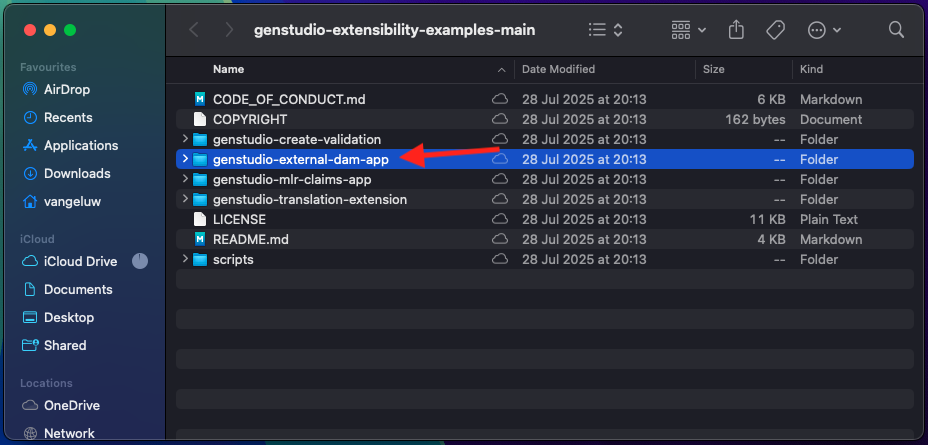

# 1.6.3 Crear su aplicación DAM externa

## 1.6.3.1 descargar archivos de aplicación de ejemplo

Vaya a [https://github.com/adobe/genstudio-extensibility-examples](https://github.com/adobe/genstudio-extensibility-examples). Haga clic en **Código** y, a continuación, seleccione **Descargar ZIP**.


Desempaquete el archivo zip en su escritorio.


Abra la carpeta **genstudio-extensibility-samples-main**. Verá varias aplicaciones de ejemplo. El que es de interés para este ejercicio es **genstudio-external-dam-app**.

Copie ese directorio y péguelo en el escritorio.



Ahora debería tener esto en el escritorio:


Para los próximos ejercicios, solo usará la carpeta **genstudio-external-dam-app**.

## 1.6.3.2 Configurar la interfaz de línea de comandos de Adobe Developer

Haga clic con el botón derecho en la carpeta **genstudio-external-dam-app** y seleccione **Nuevo terminal en la carpeta**.


Entonces debería ver esto. Escriba el comando `aio login`. Este comando se redireccionará al explorador y se espera que inicie sesión.


Después de iniciar sesión correctamente, debería ver esto en el explorador.


A continuación, el explorador redireccionará de nuevo a la ventana de terminal. Debería ver un mensaje que indique **Inicio de sesión correcto** y un token largo que devuelve el explorador.


El siguiente paso es configurar la instancia y el proyecto de Adobe IO que utilizará para la aplicación DAM externa.

Para ello, debe descargar un archivo del proyecto de Adobe IO que configuró anteriormente.

Vaya a [https://developer.adobe.com/console/home](https://developer.adobe.com/console/home){target="_blank"} y abra el proyecto que creó anteriormente, que se llama `--aepUserLdap-- GSPeM EXT`. Abra el área de trabajo **Producción**.


Haga clic en **Descargar todo**. Esto descargará un archivo JSON.


Copie el archivo JSON del directorio **Descargas** en el directorio raíz de la aplicación DAM externa.


Vuelve a la ventana de tu terminal. Escriba el comando `aio app use XXX-YYY-Production.json`.

>[!NOTE]
>
>Debe cambiar el nombre del archivo para que coincida con el nombre del archivo.

Una vez ejecutado el comando, la aplicación DAM externa se conectará al proyecto de Adobe IO con App Builder que creó anteriormente.


## 1.6.3.3 Instalar GenStudio Extensibility SDK

A continuación, debe instalar **GenStudio Extensibility SDK**. Puede encontrar más detalles sobre SDK aquí: [https://github.com/adobe/genstudio-extensibility-sdk](https://github.com/adobe/genstudio-extensibility-sdk).

Para instalar SDK, ejecute este comando en la ventana de terminal:

`npm install @adobe/genstudio-extensibility-sdk`


Después de un par de minutos, se instalará SDK.


## 1.6.3.4: revise la aplicación DAM externa en Visual Studio Code.

Abra Código de Visual Studio. Haga clic en **Abrir...** para abrir una carpeta.


Seleccione la carpeta **genstudio-external-dam-app** que contiene la aplicación que descargó anteriormente.


Haga clic para abrir el archivo **.env**.


El archivo **.env** se creó mediante el comando `aio app use` que ejecutó en el paso anterior y contiene la información necesaria para conectarse al proyecto de Adobe IO con App Builder.


Ahora debe crear dos archivos nuevos en la raíz de la carpeta:

- `.env.dev`. Haga clic en el botón **Nuevo archivo** y luego ingrese el nombre de archivo `.env.dev`.


- `.env.prod`.  Haga clic en el botón **Nuevo archivo** y luego ingrese el nombre de archivo `.env.prod`.


Estos archivos contendrán las credenciales necesarias para conectarse al bloque de AWS S3 que creó anteriormente.

```
AWS_ACCESS_KEY_ID=
AWS_SECRET_ACCESS_KEY=
AWS_REGION=
AWS_BUCKET_NAME=
```

Los campos **AWS_ACCESS_KEY_ID** y **AWS_SECRET_ACCESS_KEY** estaban disponibles después de crear el usuario de IAM en el ejercicio anterior. Se le pidió que los anotara, ahora puede copiar los valores.


El campo **AWS_REGION** se puede tomar de la vista Inicio de AWS S3, junto al nombre del contenedor. En este ejemplo, la región es **us-west-2**.


El campo **AWS_BUCKET_NAME** debe ser `--aepUserLdap---gspem-dam`.

Esta información le permite actualizar los valores de cada una de estas variables.

```
AWS_ACCESS_KEY_ID=XXX
AWS_SECRET_ACCESS_KEY=YYY
AWS_REGION=us-west-2
AWS_BUCKET_NAME=--aepUserLdap---gspem-dam
```

Ahora debería pegar este texto en ambos archivos, `.env.dev` y `.env.prod`. No olvide guardar los cambios.


A continuación, vuelve a la ventana de tu terminal. Ejecute este comando:

`export $(grep -v '^#' .env.dev | xargs)`


## 1.6.3.5 Ejecute su aplicación DAM externa

En la ventana de terminal, ejecute el comando `aio app run`. Debería ver esto después de 1-2 minutos.


## Pasos siguientes

Vaya a [Implementar el código y publicar la aplicación en privado](./ex4.md){target="_blank"}

Volver a [GenStudio for Performance Marketing - Extensibilidad](./genstudioext.md){target="_blank"}

Volver a [Todos los módulos](./../../../overview.md){target="_blank"}
