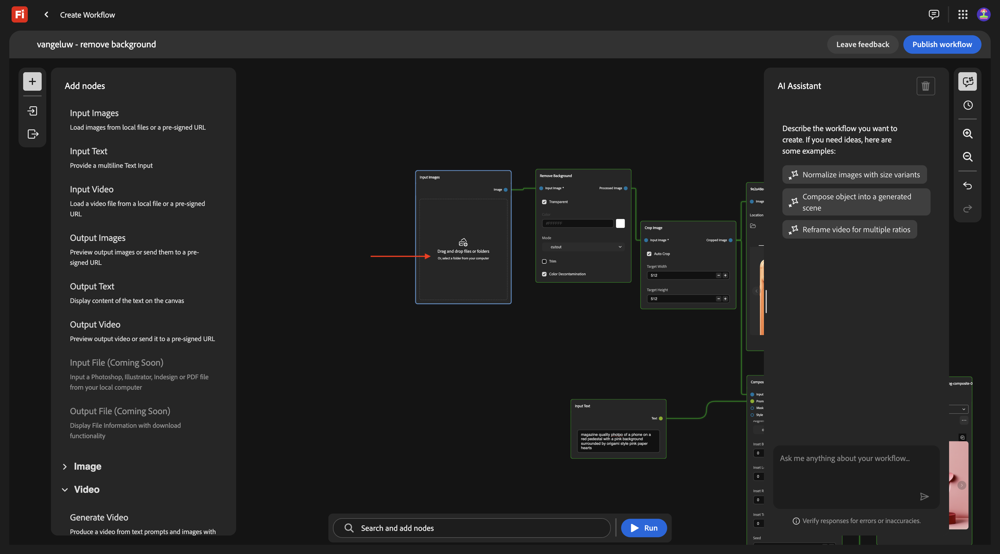
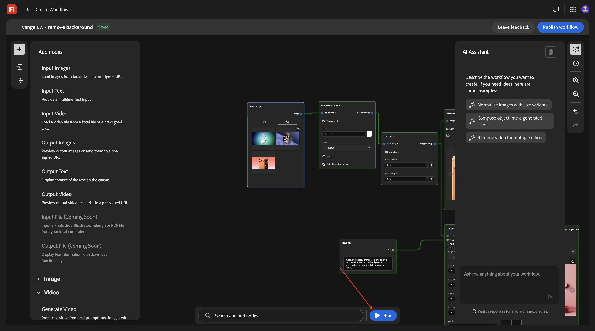
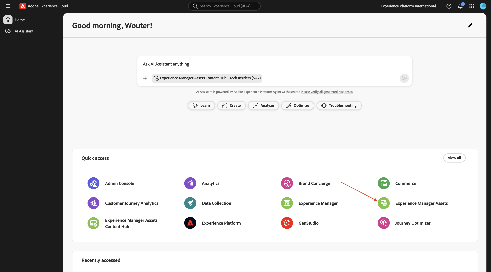
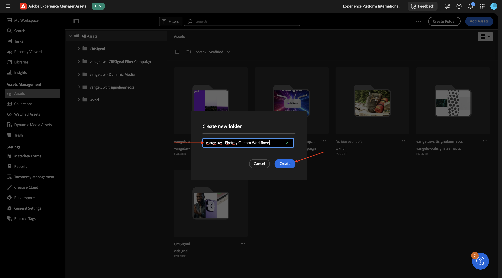
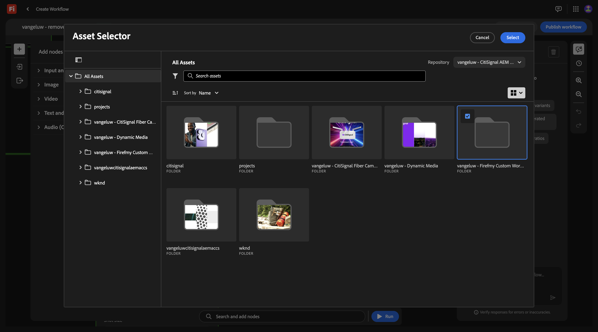
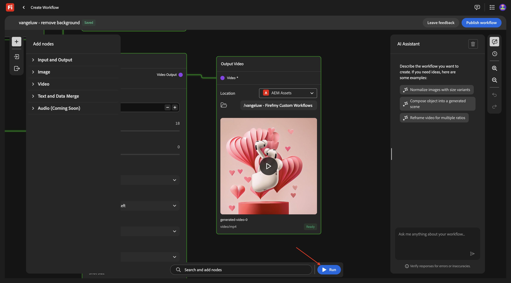

# 1.7.1 Introducción a Firefly Creative Production for Enterprise

Vaya a [https://firefly.adobe.com](https://firefly.adobe.com). Haga clic en el icono de perfil en la esquina superior derecha y verifique que ha seleccionado la instancia correcta, que debe ser `--aepImsOrgName--`.

Ir a **Producción**.

Entonces debería ver esto. Haga clic en **Crear flujo de trabajo (beta)**.

## 1.7.1.1 Quitar fondo

Para conocer Firefly Creative Production for Enterprise, ahora implementará un caso de uso básico que se centra en eliminar el fondo de una imagen específica.

Cambie el nombre de su flujo de trabajo a `vangeluw - remove background`.

Abrir la **imagen**

Seleccione **Quitar fondo** y, a continuación, arrastre y suelte este nodo en el lienzo.

Ahora necesita conectar un nodo de imagen de entrada y un nodo de imagen de salida al **Quitar fondo**.

Desplácese hacia arriba y vaya a **Entrada y salida**. Haga clic en el nodo **Imágenes de entrada** y arrástrelo al lienzo.

Entonces deberías tener esto. Conecte el nodo **Imágenes de entrada** al nodo **Quitar fondo** pasando el puntero sobre el punto azul que hay junto a **Imagen** en el nodo **Imágenes de entrada** y dibujando una línea hacia el punto azul que hay junto a **Imagen de entrada** en el nodo **Quitar fondo**.

Entonces deberías tener esto. A continuación, haga clic en el nodo **Imágenes de salida** y arrástrelo al lienzo.

Entonces deberías tener esto. Conecte el nodo **Quitar fondo** al nodo **Imágenes de salida** pasando el puntero sobre el punto azul junto a **Imagen de salida** en el nodo **Quitar fondo** y dibujando una línea hacia el punto azul junto a **Imagen** en el nodo **Imágenes de salida**.

Entonces deberías tener esto.

El flujo de trabajo básico ya está listo para probarse. Descargue la imagen [phone.png](./assets/phone.png) en su escritorio.

Vuelva al flujo de trabajo. Haga clic en el área **Arrastrar y soltar** del nodo **Imágenes de entrada**.

Seleccione el archivo **phone.png**. Haga clic en **Abrir**.

Entonces debería ver esto. Haga clic en **Ejecutar**.

Después de 1-2 minutos, debería ver este resultado.

## 1.7.1.2 Quitar fondo + Recortar

Ahora debería agregar un nodo **Crop** al lienzo. En el menú, ve a **Imagen** y desplázate hacia abajo para encontrar **Recortar**. Arrástrela al lienzo.

Coloque el nodo **Crop** entre el nodo **Remove Background** y el nodo **Output Image**.

Ahora necesita quitar la conexión entre el nodo **Remove Background** y el nodo **Output Image**. Para ello, haga doble clic en la línea entre ambos nodos.

Entonces deberías tener esto. Conecte el nodo **Remove Background** al nodo **Crop** y, a continuación, conecte el nodo **Crop** al nodo **Output Image**.

Marque la casilla de verificación para **Recorte automático** y luego podrá probar el flujo de trabajo haciendo clic en **Ejecutar**.

Después de 1-2 minutos, debería ver esto, que muestra una imagen con una resolución diferente ahora.

## 1.7.1.3 Quitar fondo + Recortar + Imagen compuesta

En el menú, en **Imagen**, seleccione un nodo de **imágenes compuestas (2D)** y arrástrelo al lienzo.

Agregue una segunda conexión al nodo **Recortar**, conectando el punto azul junto a **Imagen recortada** al punto azul junto a **Imagen de entrada** en el nodo **Imágenes compuestas (2D)**.

En el menú, en **Entrada y salida**, seleccione un nodo **Texto de entrada** y arrástrelo al lienzo.

Conecte el punto verde al lado de **Texto** en el nodo **Texto de entrada** al punto verde al lado de **Preguntar** en el nodo **Imágenes compuestas (2D)**.

Entonces deberías tener esto. Escriba la siguiente solicitud en el nodo **Texto de entrada**.

`magazine quality photo of a phone on a red pedestal with a pink background surrounded by origami style pink paper hearts`

En el menú, en **Entrada y salida**, seleccione un nodo **Imágenes de salida** y arrástrelo al lienzo.

Conecte el punto azul al lado de la **imagen compuesta** en el nodo **Imágenes compuestas (2D)** al punto azul al lado de la **imagen de entrada** en el nodo **Imagen de salida**.

Haga clic en **Ejecutar**.

Después de un par de minutos, debería ver algo como esto, que muestra su imagen original en una composición basada en el indicador proporcionado, en una resolución específica.

## 1.7.1.4 Quitar fondo + Recortar + Imagen compuesta + Generar vídeo

En el menú, ve a **Vídeo**. Seleccione el nodo **Generar vídeo** y arrástrelo al lienzo.

Conecte el punto azul junto a la **imagen compuesta** del nodo **Imágenes compuestas (2D)** al punto azul junto a la **imagen de entrada** del nodo **Generar vídeo**.

En el menú, vaya a **Entrada y salida**. Seleccione el nodo **Texto de entrada** y arrástrelo al lienzo.

Conecte el punto verde al lado de **Texto** en el nodo **Texto de entrada** al punto verde al lado de **Mensaje** del nodo **Generar vídeo**.

Escriba la solicitud `background hearts fluttering` en el nodo **Texto de entrada**.

En el menú, vaya a **Entrada y salida**. Seleccione el nodo **Vídeo de salida** y arrástrelo al lienzo.

Conecte el punto morado al lado de **Salida de vídeo** del nodo **Generar vídeo** al punto morado al lado de **Vídeo** en el nodo **Vídeo de salida**.

Haga clic en **Ejecutar**.

Después de un par de vídeos, debería ver esto que muestra un vídeo basado en la combinación de la imagen proporcionada y el mensaje.

## Escala 1.7.1.5

Ahora ha hecho esto para 1 imagen. Ahora vamos a utilizar este flujo de trabajo, pero para varias imágenes.

Descargue estas imágenes en su escritorio:

- [watch.jpg](./assets/watch.jpg)
- [aerópodos.jpg](./assets/airpods.jpg)

En el flujo de trabajo, vuelva al primer nodo, **Imágenes de entrada**. Quitar la imagen seleccionada actualmente.

Haga clic en el área **Arrastrar y soltar**.

Seleccione las 3 imágenes que ha descargado. Haga clic en **Abrir**.

Entonces debería ver esto. haga clic en **Ejecutar**.

Después de varios minutos, debería ver una salida similar, con 3 imágenes generadas y 3 vídeos.

## Almacenar 1.7.1.5 en AEM Assets CS

En este ejercicio, almacenará los recursos creados como parte del flujo de trabajo personalizado en AEM Assets CS.

Primero debe crear una carpeta nueva en el entorno de AEM Assets CS.

Para ello, vaya a [https://experience.adobe.com](https://experience.adobe.com). Haga clic para abrir **Experience Manager Assets**.

Seleccione el entorno de AEM Assets CS, que debería llamarse `--aepUserLdap-- - CitiSignal AEM + ACCS`.

Vaya a **Assets** y haga clic en **Crear carpeta**.

Escriba el nombre: `--aepUserLdap-- - Firefly Creative Production for Enterprise`. Haga clic en **Crear**.

Vuelva al flujo de trabajo personalizado y vaya al nodo **Output Images**. Haga clic en **Predeterminado** y, a continuación, seleccione **AEM Assets**.

Debería ver esta ventana emergente. Seleccione el repositorio de AEM Assets CS y, a continuación, seleccione la carpeta que acaba de crear, que debe tener el nombre: `--aepUserLdap-- - Firefly Creative Production for Enterprise`. Haga clic en **Seleccionar**.

Vaya al nodo **Output Video**. Haga clic en **Predeterminado** y, a continuación, seleccione **AEM Assets**.

Debería ver esta ventana emergente. Seleccione el repositorio de AEM Assets CS y, a continuación, seleccione la carpeta que acaba de crear, que debe tener el nombre: `--aepUserLdap-- - Firefly Creative Production for Enterprise`. Haga clic en **Seleccionar**.

Entonces deberías tener esto. Haga clic en **Ejecutar**.

Después de un par de minutos, debería ver que los recursos creados están disponibles en la carpeta en AEM Assets CS.

Vuelva al flujo de trabajo. Haga clic en **Publicar**.

Entonces debería ver esto.

El flujo de trabajo se ha publicado y ahora se puede ejecutar mediante programación como parte del siguiente ejercicio.

## Pasos siguientes

Ir a [1.7.2 Ejecutar el flujo de trabajo personalizado mediante programación](./ex2.md){target="_blank"}

Volver a [Firefly Creative Production for Enterprise](./workflowbuilder.md){target="_blank"}

Volver a [Todos los módulos](./../../../overview.md){target="_blank"}
