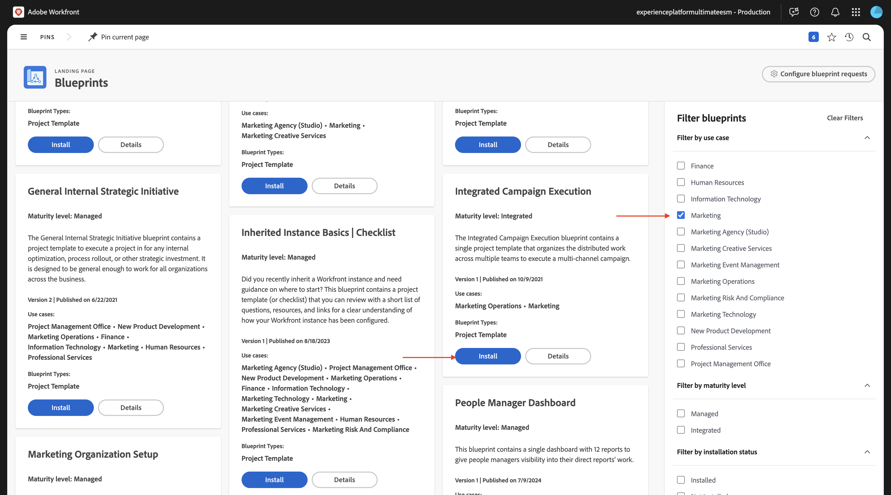
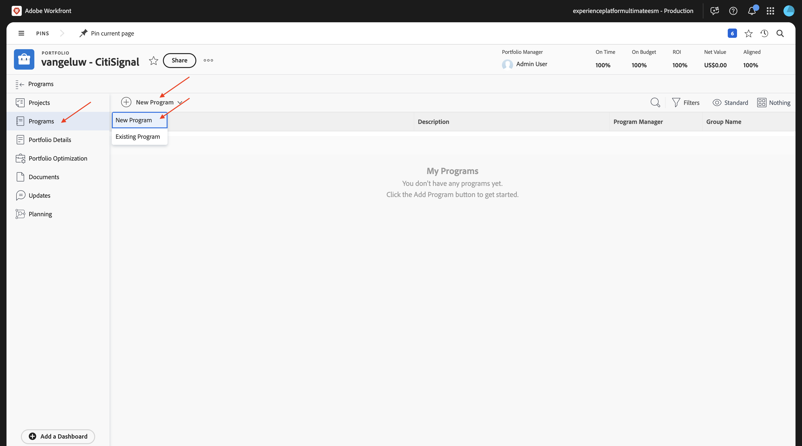
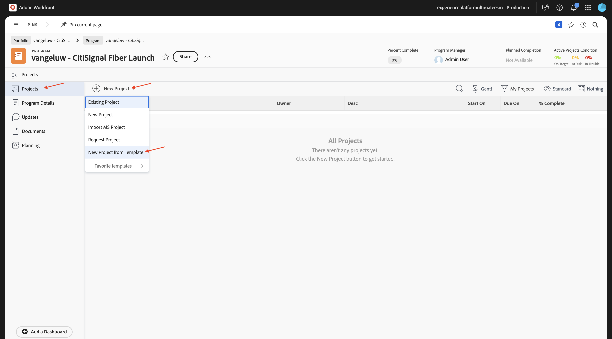
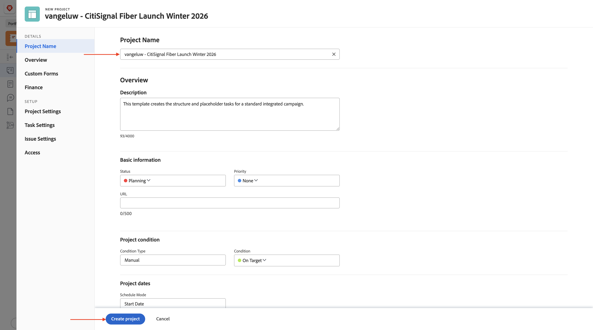
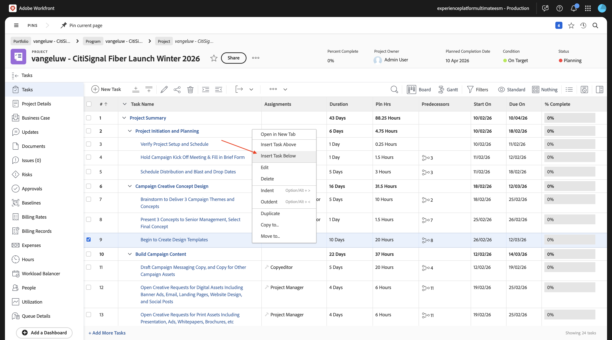
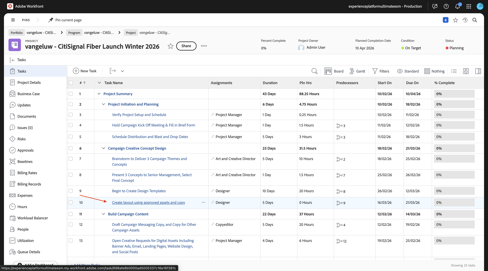
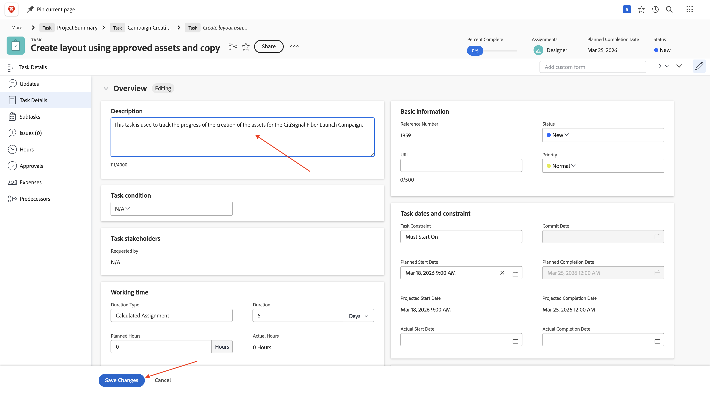
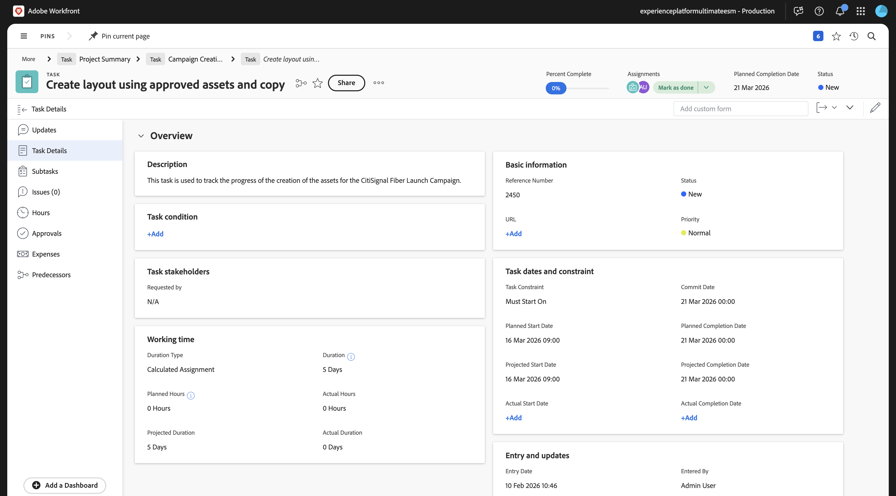
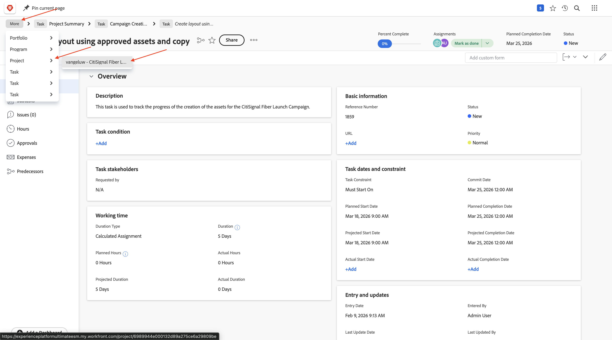

# 1.8.1 Introducción a Workfront, Frame.io y ESM

## 1.8.1.1 terminología de flujo de trabajo de Workfront

A continuación se muestran los objetos y conceptos principales de Workfront:

| Nombre | Última actualización |
| ---------------------- | ------------ |
| Portafolio | Colección de proyectos que tienen características unificadoras. Estos proyectos suelen competir por los mismos recursos, presupuesto o franja horaria. |
| Programa | Un subconjunto dentro de un portafolio, donde proyectos similares pueden agruparse para lograr un beneficio bien definido. |
| Proyecto | Una gran cantidad de trabajo que debe completarse dentro de un marco de tiempo específico y debe utilizar un presupuesto y un número de recursos específicos. Para hacerlo manejable, se divide el proyecto en una serie de tareas. Completar todas las tareas significa la finalización del proyecto. |
| Plantilla de proyecto | Puede utilizar plantillas de proyecto para capturar la mayoría de los procesos, la información y la configuración repetibles asociados con los proyectos de su organización. Después de crear las plantillas, puede adjuntarlas a proyectos existentes o puede utilizarlas para crear nuevos proyectos. |
| Tarea | Una actividad que debe realizarse como paso hacia el logro de un objetivo final (completar el proyecto). Las tareas nunca pueden existir de forma independiente. Siempre son parte de un proyecto. |
| Asignación | Usuario, rol o equipo asignado a un problema o tarea. Los proyectos, portafolios o programas no pueden tener asignaciones. |
| Documento/versión | Cualquier archivo adjunto a un objeto dentro de Workfront. Cada vez que se carga el mismo documento en el mismo objeto, se le asigna un número de versión. Los usuarios pueden ver y cambiar varias opciones de una versión anterior de un documento. |
| Aprobación | Un elemento de trabajo determinado, como una tarea, un documento o una plantilla de horas, puede requerir que un supervisor u otro usuario firme el elemento de trabajo. Este proceso de desactivación se denomina aprobación. |

Vaya a [https://experience.adobe.com/](https://experience.adobe.com/){target="_blank"}. Haga clic para abrir **Workfront**.

Entonces verá esto...

## 1.8.1.2 Habilitar modelo de Workfront

En el siguiente paso, creará un nuevo proyecto con una plantilla. Adobe Workfront proporciona una serie de modelos disponibles que solo requieren activarse.

Para el caso de uso de CitiSignal, el modelo **Ejecución de campaña integrada** es el que necesita usar.

Para instalar ese modelo, abra el menú y seleccione **Modelos**.

Seleccione el filtro **Marketing** y desplácese hacia abajo para encontrar el modelo **Ejecución de campaña integrada**. Haga clic en **Instalar**.

Haga clic en **Continuar**.

Cambie **Nombre de plantilla de proyecto** por `--aepUserLdap-- - Integrated Campaign Execution`.

Haga clic en **Instalar modelo**.

Después de un par de minutos, se instalará el modelo.

## 1.8.1.3 Crear un nuevo proyecto

Abra el **menú** y vaya a **Portafolios**.

Haga clic en **+ Nuevo Portfolio**.

Escriba el nombre del portafolio `--aepUserLdap-- - CitiSignal`.

Vaya a **Programas** y haga clic en **+ Nuevo programa**. Seleccione **Nuevo programa**.

Escriba el nombre del programa: `--aepUserLdap-- - CitiSignal Fiber Launch`.

En su programa, vaya a **Proyectos**. Haga clic en **+ Nuevo proyecto** y, a continuación, seleccione **Nuevo proyecto de la plantilla**.

Seleccione la plantilla `--aepUserLdap-- - Integrated Campaign Execution` y haga clic en **Usar plantilla**.

Entonces debería ver esto. Cambie el nombre a `--aepUserLdap-- - CitiSignal Fiber Launch Winter 2026` y haga clic en **Crear proyecto**.

El proyecto se ha creado. Vaya a **Detalles del proyecto**.

Vaya a **Detalles del proyecto**. Haga clic para seleccionar el texto actual bajo **Descripción**.

Definir la descripción en `The CitiSignal Fiber Launch project is used to plan the upcoming launch of CitiSignal Fiber.`

Haga clic en **Guardar cambios**.

El proyecto está listo para utilizarse.

Las tareas y dependencias del proyecto se han creado en función de la plantilla elegida y se ha establecido como. propietario del proyecto. El estado del proyecto se ha establecido en **Planificación**. Puede cambiar el estado del proyecto seleccionando otro valor en la lista.

## 1.8.1.4 vista de proyecto en Frame.io

Vaya a [https://next.frame.io/](https://next.frame.io/){target="_blank"}. Inicie sesión y seleccione la instancia que desea utilizar en este ejemplo **Experience Platform International ESM**. Verá que ya existe una carpeta en Frame.io para el proyecto que acaba de crear. La carpeta recibe el nombre del proyecto que escribió anteriormente.

Esta es una función de Enterprise Storage Management, una solución de almacenamiento basada en la nube que sirve como repositorio central de recursos en los productos empresariales de Adobe, incluidos Workfront y Frame.io.

Entre las ventajas clave del almacenamiento empresarial de Adobe se incluyen:

- Capa de almacenamiento unificada para recursos creativos y de administración de trabajo
- Permisos centralizados a través del sistema Adobe Identity Management (IMS) para el control de acceso seguro
- Visibilidad completa de los recursos en Workfront y Frame.io
- Almacenamiento escalable y administración de cuotas para las necesidades empresariales

## 1.8.1.5 Crear una nueva tarea

Vuelva a Workfront. Vaya a **Tareas**, pase el ratón sobre la tarea **Comenzar a crear plantillas de diseño** y haga clic en los 3 puntos **...**.

Seleccione la opción **Insertar tarea debajo**.

Escriba este nombre para la tarea: `Create layout using approved assets and copy`.

Establezca el campo **Asignaciones** en el rol **Designer**.
Establezca el campo **Duration** en **5 días**.
Establezca el predecesor del campo en **9**.
Escriba una fecha para los campos **Comenzar en** y **Vencimiento en** (la fecha de inicio de esta tarea debe programarse después de la fecha de finalización de la tarea anterior).

Haga clic en otro lugar de la pantalla para guardar la nueva tarea.

Entonces debería ver esto. Haga clic en la tarea para abrirla.

Vaya a **Detalles de la tarea** y establezca el campo **Descripción** en: `This task is used to track the progress of the creation of the assets for the CitiSignal Fiber Launch Campaign.`

Haga clic en **Guardar cambios**.

Entonces debería ver esto. Haga clic en el campo **Asignaciones** y seleccione **Asignármelo**.

Haga clic en **Guardar**.

Haga clic en **Trabajar en ello**.

Entonces debería ver esto.

Como parte de esta tarea, es necesario crear un nuevo recurso. En el siguiente paso, primero debe proporcionar imágenes de referencia en Workfront para que el diseñador sepa lo que se espera. A continuación, cambiará a la función de Designer y creará ese recurso con Adobe Express.

## 1.8.1.6 Cargar imágenes de referencia

Descargue las imágenes de referencia [aquí](./assets/reference_images.zip) a su escritorio y descomprima.

En Workfront, vaya al nivel **Proyecto**.

Vaya a **Documentos**, haga clic en **+ Agregar nuevo** y, a continuación, seleccione **Documento**.

Vaya a la carpeta que descargó y que contiene las imágenes de referencia. Seleccione todas las imágenes y haga clic en **Abrir**.

Después de un par de minutos, todas las imágenes se cargarán y adjuntarán al proyecto.

Una vez colocadas las imágenes de referencia, el diseñador puede crear el nuevo recurso para esta campaña.

## Pasos siguientes

Siguiente paso: [Crear un nuevo recurso, revisarlo y aprobarlo](./ex2.md){target="_blank"}

Volver a [Revisión y aprobación unificadas con Workfront, Frame.io y Enterprise Storage Management](./esm.md){target="_blank"}

Volver a [Todos los módulos](./../../../overview.md){target="_blank"}
