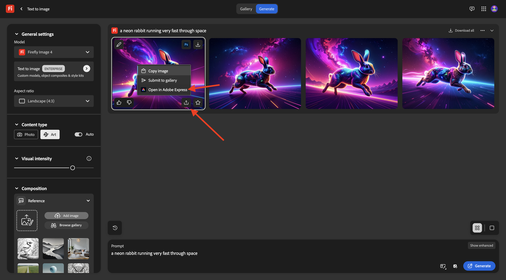
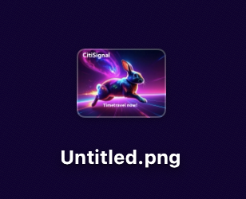
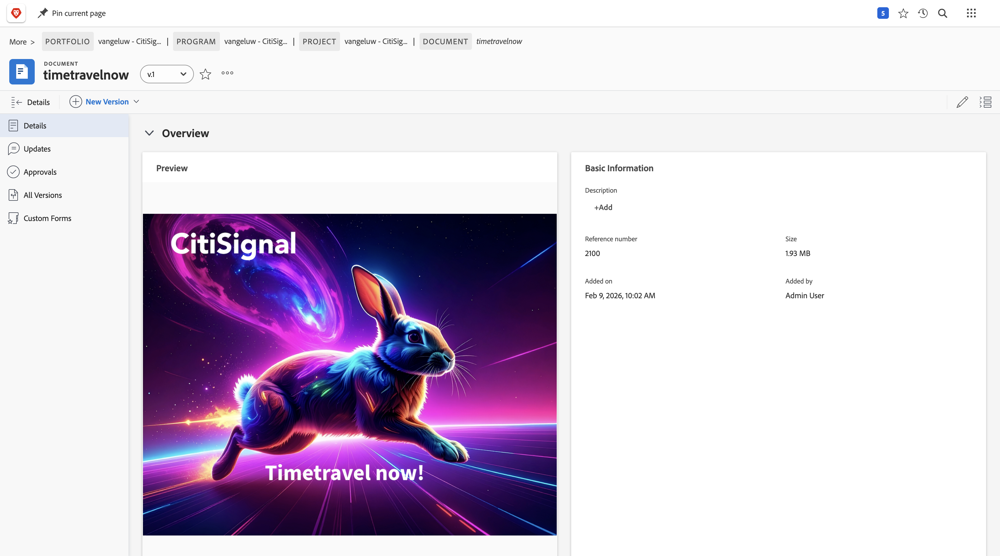
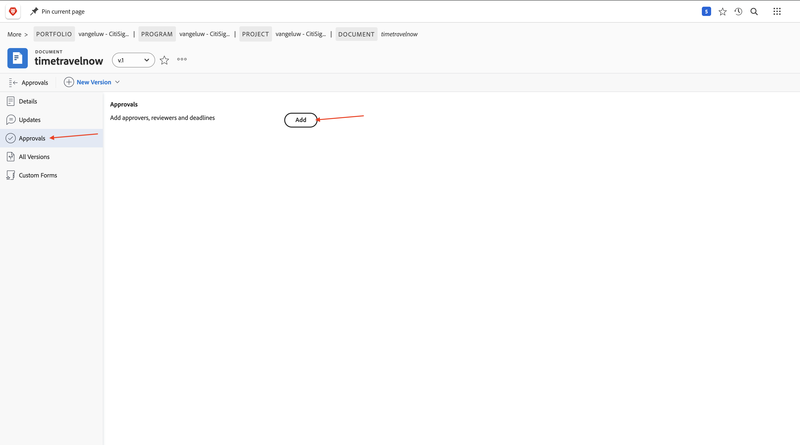

# 1.8.2 Crear un nuevo recurso, revisarlo y aprobarlo

## 1.8.2.1 Verificar imágenes de referencia en Frame.io

Vaya a [https://next.frame.io/](https://next.frame.io/){target="_blank"}. Haga clic en para abrir la carpeta del proyecto.

Ahora debería ver todas las imágenes de referencia que se proporcionaron en Workfront. El diseñador ahora tiene acceso a todos los archivos que se cargaron en Workfront, en un entorno seguro, automáticamente.

Haga clic en **+** y luego seleccione **Nueva carpeta**.

Escriba el nombre: `Final Deliverables` y pulse **entrar**. Esta carpeta se utilizará para cargar el documento final que creará DesignerL

## 1.8.2.2: crear un nuevo recurso con Adobe Firefly y Adobe Express

>[!NOTE]
>
>Si prefiere no crear el nuevo recurso usted mismo, puede descargar la versión finalizada [aquí](./images/timetravelnow.png).

Vaya a [https://firefly.adobe.com/](https://firefly.adobe.com/){target="_blank"}. Escriba el mensaje `a neon rabbit running very fast through space` y haga clic en **Generar**.

A continuación, verá varias imágenes que se generan. Elige la imagen que más te guste, haz clic en el icono **Compartir** de la imagen y luego selecciona **Abrir en Adobe Express**.

A continuación, verá que la imagen que acaba de generar está disponible en Adobe Express para editarla. Ahora debe añadir el logotipo de CitiSignal en la imagen. Para ello, ve a **Marcas**.

Luego debería ver una plantilla de marca CitiSignal. que se haya creado en GenStudio for Performance Marketing, aparecen en Adobe Express. Haga clic para seleccionar una plantilla de marca que tenga `CitiSignal` en su nombre.

Vaya a **Logotipos** y haga clic en el logotipo **blanco** de Citisignal para colocarlo en la imagen.

Coloque el logotipo de CitiSignal en la parte superior de la imagen, no demasiado lejos del centro.

Ir a **Texto**.

Haz clic en **Agregar tu texto**.

Escriba el texto `Timetravel now!`, cambie el color y el tamaño de fuente, establezca el texto en **Negrita** para que tenga una imagen similar a esta.

A continuación, haga clic en **Compartir**.

Haga clic en **... Mostrar todo**.

Desplácese hacia abajo y seleccione **Descargar**.

Haga clic en **Descargar**.

Luego tendrá el recurso en el equipo local.

Cambie el nombre del archivo a `timetravelnow.png`.

## 1.8.2.3: revise el recurso en Frame.io

Vuelva a [https://next.frame.io/](https://next.frame.io/){target="_blank"} y abra la carpeta de su proyecto.

Haga clic en **Cargar**.

Seleccione el archivo **timetravelnow.png** y haga clic en **Abrir**.

Entonces debería ver esto.

Cambie el estado a **Necesita revisión** y, a continuación, haga doble clic en la imagen para abrirla.

Etiquete uno de los revisores del entorno y agregue un mensaje como: `ready for your feedback on this one`.

El revisor puede realizar comentarios para realizar cambios o confirmar que tiene buen aspecto.

## 1.8.2.4 Consulte el recurso en Workfront

Mientras el equipo de diseño está iterando en el recurso que está creando, el administrador de proyectos de Workfront puede seguir lo que sucede. Vuelva a Workfront. Actualice la página.

Ahora verá la carpeta creada en Frame.io en Workfront. Haga clic en él para abrirlo.

Entonces debería ver esto. Pase el ratón sobre el archivo **timetravelnow.png** y haga clic en **Detalles del documento**.

Como jefe de proyecto, ahora puede ver la versión actual de esa imagen para saber qué está sucediendo y en qué se está trabajando activamente. Haga clic en **Abrir en Frame.io**.

A continuación, se abrirá una nueva ventana en la que se mostrará el recurso en Frame.io.

## 1.8.2.5 aprobar el recurso

En Workfront, ve a **Aprobaciones** y haz clic en **Agregar**.

Agréguese como aprobador y haga clic en **Enviar solicitud**.

Entonces debería ver esto. Haga clic en **Abrir revisión**, que le llevará a Frame.io.

En Frame.io, puede ver todos los comentarios y revisar el recurso. Haga clic para abrir el campo **Su decisión**.

Seleccione **Aprobado**.

Vuelva a Workfront y actualice la página. Ahora verá que el estado aquí también ha cambiado. El recurso está aprobado y se puede utilizar para la entrega y la activación a continuación.

## Pasos siguientes

Volver a [Revisión y aprobación unificadas con Workfront, Frame.io y Enterprise Storage Management](./esm.md){target="_blank"}

Volver a [Todos los módulos](./../../../overview.md){target="_blank"}
