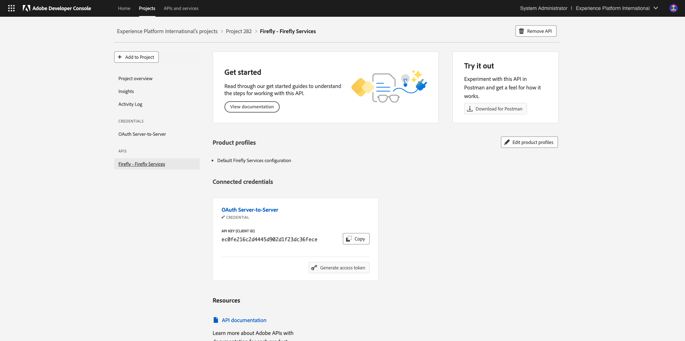
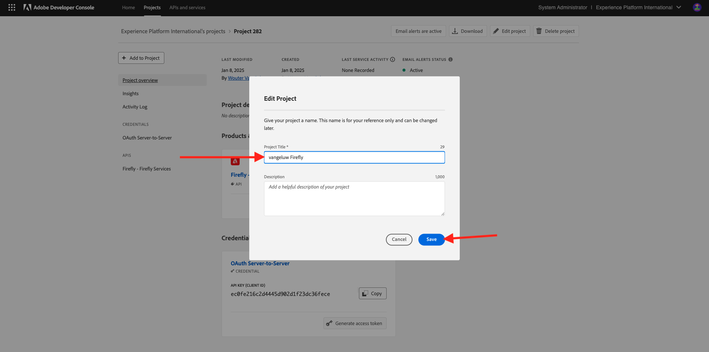

# 1.1.1 Introducción a los servicios de Firefly

En este ejercicio, utilizará Postman y Adobe I/O para consultar las API de servicios de Adobe Firefly.

## Configuración del proyecto de Adobe I/O

En este ejercicio utilizará Adobe I/O de forma bastante intensiva para consultar las API de servicios de Firefly. Siga los siguientes pasos para configurar el Adobe I/O.

Ir a [https://developer.adobe.com/console/home](https://developer.adobe.com/console/home)

Asegúrese de seleccionar la instancia correcta en la esquina superior derecha de la pantalla. Su instancia es `--aepImsOrgName--`. Haga clic en **Crear nuevo proyecto**.

Seleccione **+ Agregar al proyecto** y seleccione **API**.

A continuación, verá esto:

Seleccione **Creative Cloud** y haga clic en **Firefly - Servicios de Firefly**. Haga clic en **Next**.

Ahora va a ver esto. Proporcione un nombre para su credencial: `--aepUserLdap-- - Firefly Services OAuth credential`. Haga clic en **Next**.

A continuación, debe seleccionar un perfil de producto que defina qué permisos están disponibles para esta integración.

Seleccione el perfil **Configuración predeterminada de los servicios de Firefly**.

Haga clic en **Guardar API configurada**.

La integración de Adobe I/O ya está lista.

Haga clic en el botón **Descargar para Postman** y, a continuación, haga clic en **Servidor OAuth** para descargar un entorno de Postman.

Su proyecto de IO tiene actualmente un nombre genérico. Debe asignar un nombre descriptivo a la integración. Haga clic en **Proyecto X** (o nombre similar) como se indica

Haga clic en **Editar proyecto**.

Escriba un nombre para la integración: `--aepUserLdap-- Firefly`.

Haga clic en **Guardar**.

La configuración de la integración de Adobe I/O ha finalizado.

## Autenticación de Postman en el Adobe I/O

Vaya a [https://www.postman.com/downloads/](https://www.postman.com/downloads/).

Descargue e instale la versión correspondiente de Postman para su sistema operativo.

Después de la instalación de Postman, inicie la aplicación.

En Postman, hay 2 conceptos: entornos y colecciones.

- El archivo de entorno contiene todas las variables de entorno que son más o menos coherentes. En el entorno, encontrará elementos como la organización IMS de su entorno de Adobe, junto con credenciales de seguridad como el ID de cliente y otros. El archivo de entorno es el que descargó durante la configuración del Adobe I/O en el ejercicio anterior, con el siguiente nombre: **`oauth_server_to_server.postman_environment.json`**.

- La colección contiene una serie de solicitudes de API que puede utilizar. Utilizaremos 2 colecciones
   - 1 colección para la autenticación en el Adobe I/O
   - 1 Colección para los ejercicios de este módulo

Descargue el archivo [postman.zip](./../../../assets/postman/postman-ff.zip) en su escritorio local.

En este archivo **postman.zip** encontrará los siguientes archivos:

- `Adobe IO - OAuth.postman_collection.json`
- `FF - Firefly Services Tech Insiders.postman_collection.json`

Descomprima el archivo **postman-ff.zip** y almacene estos 2 archivos en una carpeta de su equipo de escritorio, junto con el entorno de Postman descargado de la Adobe I/O, que es el archivo `oauth_server_to_server.postman_environment.json`. Debe tener estos 3 archivos en esa carpeta:

Vuelva a Postman. Haga clic en **Importar**.

Haga clic en **archivos**.

Vaya a la carpeta del escritorio en la que extrajo los dos archivos descargados. Seleccione estos tres archivos al mismo tiempo y haga clic en **Abrir**.

Después de hacer clic en **Abrir**, Postman le mostrará una descripción general del entorno y las colecciones que está a punto de importar. Haga clic en **Importar**.

Ahora tiene todo lo que necesita en Postman para empezar a interactuar con Servicios de Firefly a través de las API.

Lo primero que debe hacer es asegurarse de que está autenticado correctamente. Para autenticarse, debe solicitar un token de acceso.

Asegúrese de haber seleccionado el entorno correcto antes de ejecutar cualquier solicitud. Puede comprobar el Entorno seleccionado actualmente comprobando la lista desplegable Entorno en la esquina superior derecha.

El entorno seleccionado debe tener un nombre similar a este, `--aepUserLdap-- Firefly Services OAuth Credential`.

El entorno y las colecciones de Postman ya están configurados y funcionan. Ahora puede autenticarse desde Postman en el Adobe I/O.

En la colección **E/S de Adobe - OAuth**, seleccione la solicitud con el nombre **POST - Obtener token de acceso**. Verá que en **Params** se hace referencia a 2 variables, `API_KEY` y `CLIENT_SECRET`. Estas variables se toman del entorno seleccionado, `--aepUserLdap-- Firefly Services OAuth Credential`.

Haga clic en **Enviar**.

Después de hacer clic en **Enviar**, verás una respuesta en la sección **Cuerpo** de Postman:

Si la configuración se ha realizado correctamente, debería ver una respuesta similar que contenga la siguiente información:

| Clave | Valor |
|:-------------:| :---------------:| 
| token_type | **portador** |
| access_token | **KeyJhbGciOiJSU...** |
| expires_in | **86399** |

El Adobe I/O le ha proporcionado un token de **bearer**, con un valor específico (el token de acceso muy largo) y un período de caducidad.

El token que hemos recibido ahora es válido durante 24 horas. Esto significa que, después de 24 horas, si desea utilizar Postman para autenticarse en el Adobe I/O, deberá generar un nuevo token ejecutando esta solicitud de nuevo.

## API de servicios de Firefly, imagen de texto 2

Ahora puede continuar y enviar su primera solicitud a las API de servicios de Firefly.

En la colección **FF - Firefly Services Tech Insiders**, seleccione la solicitud con el nombre **POST - Firefly - T2I V3**. En la sección **Body**, verá un mensaje predeterminado que dice `Horses in a field`. Haga clic en **Enviar** para que los servicios de Firefly generen esa imagen.

Verá una respuesta similar, que contiene una dirección URL con imagen. Copie la dirección URL de la imagen y ábrala en el explorador web.

Ahora verá una hermosa imagen que representa a `horses in a field`.

Siéntase libre de jugar con la solicitud de API antes de continuar con el siguiente ejercicio.

Paso siguiente: [1.1.2 Optimizar el proceso de Firefly mediante Microsoft Azure y las direcciones URL prefirmadas](./ex2.md)

[Volver al módulo 1.1](./firefly-services.md)

[Volver a todos los módulos](./../../../overview.md)
