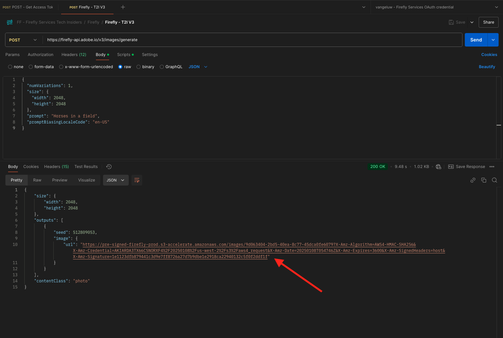

# 1.1.1 Introducción a Firefly Services

Aprenda a utilizar Postman y Adobe I/O para consultar las API de servicios de Adobe Firefly.

## 1.1.1.1 Requisitos previos

Antes de continuar con este ejercicio, debes haber completado la configuración de [tu proyecto de Adobe I/O](./../../../modules/getting-started/gettingstarted/ex6.md), y también debes haber configurado una aplicación para interactuar con las API, como [Postman](./../../../modules/getting-started/gettingstarted/ex7.md) o [PostBuster](./../../../modules/getting-started/gettingstarted/ex8.md).

## 1.1.1.2 Adobe I/O: access_token

En la colección **Adobe IO - OAuth**, seleccione la solicitud **POST - Obtener token de acceso** y seleccione **Enviar**. La respuesta debe contener un nuevo **accestoken**.

{zoomable="yes"}

## 1.1.1.3 API de servicios de Firefly, imagen de texto 2

Ahora que tiene un access_token válido y nuevo, está listo para enviar su primera solicitud a las API de servicios de Firefly.

Seleccione la solicitud **POST - Firefly - T2I V3** de la colección **FF - Firefly Services Tech Insiders**.

{zoomable="yes"}

Copie la dirección URL de la imagen de la respuesta y ábrala en el explorador web para ver la imagen.

{zoomable="yes"}

Debería ver una imagen hermosa que represente a `horses in a field`.

{zoomable="yes"}

Siéntase libre de jugar con la solicitud de API antes de continuar con el siguiente ejercicio.

## Pasos siguientes

Vaya a [Optimizar el proceso de Firefly mediante Microsoft Azure y las direcciones URL prefirmadas](./ex2.md){target="_blank"}

Volver a [Información general sobre los servicios de Adobe Firefly](./firefly-services.md){target="_blank"}

Volver a [Todos los módulos](./../../../overview.md){target="_blank"}
