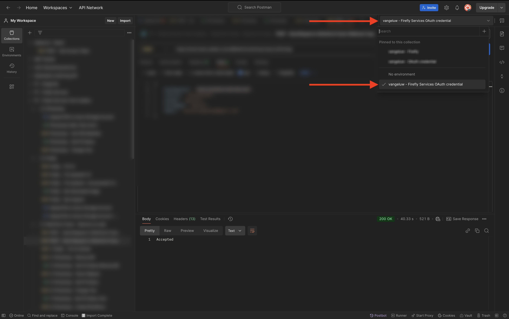

# Introducción a Servicios de Firefly

Aprenda a utilizar Postman y Adobe I/O para consultar las API de servicios de Adobe Firefly.

## Configuración del proyecto de Adobe I/O

En este ejercicio, el Adobe I/O se utiliza para consultar las API de servicios de Firefly. Siga estos pasos para configurar el Adobe I/O.

1. Vaya a [https://developer.adobe.com/console/home](https://developer.adobe.com/console/home){target="_blank"}.

1. Asegúrese de seleccionar la instancia correcta en la esquina superior derecha de la pantalla. Su instancia es `--aepImsOrgName--`. A continuación, seleccione **Crear nuevo proyecto**.

1. Seleccione **+ Agregar al proyecto** y elija **API**.

La pantalla debería tener un aspecto similar al siguiente.

1. Seleccione **Creative Cloud**, elija **Firefly - Servicios de Firefly** y luego seleccione **Siguiente**.

1. Proporcione un nombre para su credencial: `--aepUserLdap-- - Firefly Services OAuth credential`y seleccione **Siguiente**.

1. Seleccione el perfil predeterminado **Configuración predeterminada de los servicios de Firefly** y seleccione **Guardar la API configurada**.

La integración de Adobe I/O ya está lista.

## Descargar el entorno de Postman

1. Seleccione **Descargar para Postman** y, a continuación, elija **Servidor a servidor de OAuth** para descargar un entorno de Postman.

1. Seleccione el nombre del proyecto.

1. Seleccione **Editar proyecto**.

1. Escriba un nombre descriptivo para la integración: `--aepUserLdap-- Firefly`y seleccione **Guardar**.

La configuración de la integración de Adobe I/O ha finalizado.

## Autenticación de Postman en el Adobe I/O

1. Descargue e instale la versión correspondiente de Postman para su sistema operativo en [Descargas de Postman](https://www.postman.com/downloads/){target="_blank"}.

1. Inicie la aplicación.

En Postman, hay 2 conceptos: entornos y colecciones.

- El archivo de entorno contiene todas las variables de entorno que son más o menos coherentes. En el entorno, encontrará elementos como la organización IMS de su entorno de Adobe, junto con credenciales de seguridad como el ID de cliente y otros. El archivo de entorno se descargó anteriormente durante la configuración de Adobe I/O y se llama **`oauth_server_to_server.postman_environment.json`**.

- La colección contiene una serie de solicitudes de API que puede utilizar. Utilizaremos 2 colecciones
   - 1 colección para la autenticación en el Adobe I/O
   - 1 Colección para los ejercicios de este módulo

1. Descargue [postman.zip](./../../../assets/postman/postman-ff.zip) en su escritorio local.

En **postman.zip** archivo se encuentran los siguientes archivos:

    - `Adobe IO - OAuth.postman_collection.json`
    - `FF - Perspectivas técnicas de servicios de Firefly.postman_collection.json`

1. Descomprima **postman-ff.zip** y almacene los dos archivos siguientes en una carpeta de su escritorio:
- IO de Adobe: OAuth.postman_collection.json
- FF - Firefly Services Tech Insiders.postman_collection.json
- oauth_server_to_server.postman_environment.json

1. En Postman, seleccione **Importar**.

1. Seleccionar **archivos**.

1. Elige los tres archivos de la carpeta, luego selecciona **Abrir** e **Importar**.

Ahora tiene todo lo que necesita en Postman para empezar a interactuar con Servicios de Firefly a través de las API.

## Solicitar un token de acceso

A continuación, para asegurarse de que está correctamente autenticado, debe solicitar un token de acceso.

1. Asegúrese de que ha seleccionado el entorno correcto antes de ejecutar cualquier solicitud comprobando la lista desplegable Entorno en la esquina superior derecha. El entorno seleccionado debe tener un nombre similar a este, `--aepUserLdap-- Firefly Services OAuth Credential`.

El entorno seleccionado debe tener un nombre similar a este, `--aepUserLdap-- Firefly Services OAuth Credential`.

Ahora que el entorno y las colecciones de Postman están configurados y funcionan, puede autenticarse desde Postman al Adobe I/O.

1. En la colección **E/S de Adobe - OAuth**, seleccione la solicitud **POST - Obtener token de acceso** y seleccione **Enviar**.

Observe que en **Parámetros de consulta** se hace referencia a dos variables: `API_KEY` y `CLIENT_SECRET`. Estas variables se toman del entorno seleccionado, `--aepUserLdap-- Firefly Services OAuth Credential`.

Si se ejecuta correctamente, aparecerá una respuesta que contiene un token de portador, un token de acceso y una ventana de caducidad en la sección **Body** de Postman.

Debería ver una respuesta similar que contenga la siguiente información:

| Clave | Valor |
|:-------------:| :---------------:| 
| token_type | **portador** |
| access_token | **KeyJhbGciOiJSU...** |
| expires_in | **86399** |

El Adobe I/O **bearer-token** tiene un valor específico (el access_token muy largo) y un período de caducidad, y ahora es válido por 24 horas. Esto significa que, después de 24 horas, si desea utilizar Postman para autenticarse en el Adobe I/O, deberá generar un nuevo token ejecutando esta solicitud de nuevo.

## API de servicios de Firefly, imagen de texto 2

Ahora está listo para enviar su primera solicitud a las API de servicios de Firefly.

1. Seleccione la solicitud **POST - Firefly - T2I V3** de la colección **FF - Insiders técnicos de servicios de Firefly**.

1. Copie la dirección URL de la imagen de la respuesta y ábrala en el explorador web para ver la imagen.

Debería ver una imagen hermosa que represente a `horses in a field`.

Siéntase libre de jugar con la solicitud de API antes de continuar con el siguiente ejercicio.

## Pasos siguientes

Vaya a [Optimizar el proceso de Firefly con Microsoft Azure y las direcciones URL prefirmadas](./ex2.md){target="_blank"}

Volver a [Información general sobre los servicios de Adobe Firefly](./firefly-services.md){target="_blank"}

Volver a [Todos los módulos](./../../../overview.md){target="_blank"}
