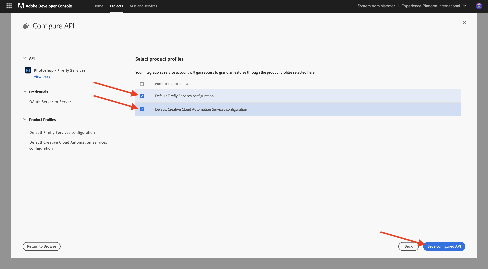
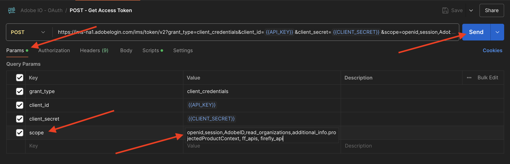

# 1.1.3 Uso de las API de Photoshop

Aprenda a trabajar con las API de Photoshop y los servicios de Firefly.

## 1.1.3.1 Actualizar la integración de Adobe I/O

1. Vaya a [https://developer.adobe.com/console/home](https://developer.adobe.com/console/home){target="_blank"}.


1. Vaya a **Proyectos** y seleccione el proyecto que creó en el ejercicio anterior, que se llama `--aepUserLdap-- Firefly`.


1. Seleccione **+ Agregar al proyecto** y luego seleccione **API**.


1. Seleccione **Creative Cloud** y elija **Photoshop - Servicios de Firefly**. Seleccione **Siguiente**.


1. Seleccione **Siguiente**.


A continuación, debe seleccionar un perfil de producto que defina qué permisos están disponibles para esta integración.

1. Seleccione **Configuración predeterminada de servicios de Firefly** y **Configuración predeterminada de servicios de automatización de Creative Cloud**.

1. Seleccione **Guardar la API configurada**.



El proyecto de Adobe I/O ahora se ha actualizado para que funcione con las API de Photoshop y de Servicios de Firefly.


## 1.1.3.2 Interactuar mediante programación con un archivo de PSD

>[!IMPORTANT]
>
>Si eres un empleado de Adobe, sigue las instrucciones aquí para usar [PostBuster](./../../../postbuster.md).

1. Descargue [citisignal-fiber.psd](./../../../assets/ff/citisignal-fiber.psd){target="_blank"} en su escritorio.

1. Abra **citisignal-fiber.psd** en Photoshop.


En el panel **Capas**, el diseñador del archivo ha asignado un nombre único a cada capa. Puede ver la información de la capa abriendo el archivo PSD en Photoshop, pero también puede hacerlo mediante programación.

Enviemos su primera solicitud de API a las API de Photoshop.

1. En Postman, antes de enviar solicitudes de API a Photoshop, debe autenticarse en el Adobe I/O. Abra la solicitud anterior con el nombre **POST - Obtener token de acceso**.

1. Vaya a **Params** y compruebe que el parámetro **Scope** esté configurado correctamente. El **valor** de **ámbito** debe tener este aspecto:

`openid,session,AdobeID,read_organizations,additional_info.projectedProductContext, ff_apis, firefly_api`

1. Seleccione **Enviar**.



Ahora tiene un token de acceso válido para interactuar con las API de Photoshop.


### API de Photoshop: Hello World

A continuación, saludemos a las API de Photoshop para comprobar si todos los permisos y accesos están correctamente configurados.

1. En la colección **Photoshop**, abra la solicitud **Photoshop Hello (Autenticación de prueba).**. Seleccione **Enviar**.


Debería recibir la respuesta **Bienvenido a la API de Photoshop!**.


A continuación, para interactuar mediante programación con el archivo PSD **citisignal-fiber.psd**, debe cargarlo en su cuenta de almacenamiento. Puede hacerlo manualmente (arrastrándolo y soltándolo en el contenedor mediante el Explorador de almacenamiento de Azure), pero esta vez debe hacerlo a través de la API.

### Cargar PSD en Azure

1. En Postman, abra la solicitud **Cargar PSD a la cuenta de almacenamiento de Azure**. En el ejercicio anterior configuró estas variables de entorno en Postman, que ahora utilizará:

- `AZURE_STORAGE_URL`
- `AZURE_STORAGE_CONTAINER`
- `AZURE_STORAGE_SAS_READ`
- `AZURE_STORAGE_SAS_WRITE`

Como puede ver en la solicitud **Cargar PSD a la cuenta de almacenamiento de Azure**, la dirección URL está configurada para utilizar estas variables.


1. En **Cuerpo**, seleccione el archivo **citisignal-fiber.psd**.


1. La pantalla debería tener un aspecto similar al siguiente. Seleccione **Enviar**.


Debe recuperar esta respuesta vacía de Azure, lo que significa que el archivo se almacena en el contenedor de su cuenta de almacenamiento de Azure.


Si utiliza el Explorador de almacenamiento de Azure para ver el archivo, asegúrese de actualizar la carpeta.


### API de Photoshop: Obtener manifiesto

A continuación, debe obtener el archivo de manifiesto del archivo de PSD.

1. En Postman, abra la solicitud **Photoshop - Obtener manifiesto del PSD**. Ir a **Cuerpo**.

El cuerpo debería tener un aspecto similar al siguiente:

```json
{
  "inputs": [
    {
      "storage": "external",
      "href": "{{AZURE_STORAGE_URL}}/{{AZURE_STORAGE_CONTAINER}}/citisignal-fiber.psd{{AZURE_STORAGE_SAS_READ}}"
    }
  ],
  "options": {
    "thumbnails": {
      "type": "image/jpeg"
    }
  }
}
```

1. Seleccione **Enviar**.

En la respuesta, ahora verá un vínculo. Como las operaciones en Photoshop a veces pueden tardar algún tiempo en completarse, Photoshop proporciona un archivo de estado como respuesta a la mayoría de las solicitudes entrantes. Para comprender lo que sucede con su solicitud, debe leer el archivo de estado.


1. Para leer el archivo de estado, abra la solicitud **Photoshop - Obtener estado de PS**. Puede ver que esta solicitud usa una variable como dirección URL, que es una variable establecida por la solicitud anterior que envió, **Photoshop - Obtener manifiesto del PSD**. Las variables se establecen en **Scripts** de cada solicitud. Seleccione **Enviar**.


La pantalla debería tener un aspecto similar al siguiente. Actualmente, el estado está establecido en **pendiente**, lo que significa que el proceso aún no ha finalizado.


1. Seleccione enviar un par de veces más en **Photoshop - Obtener estado de PS**, hasta que el estado cambie a **correcto**. Esto puede tardar un par de minutos.

Cuando la respuesta está disponible, puede ver que el archivo json contiene información sobre todas las capas del archivo PSD. Esta información es útil, ya que se pueden identificar cosas como el nombre o el ID de la capa.


Por ejemplo, busque el texto `2048x2048-cta`. La pantalla debería tener un aspecto similar al siguiente:


### API de Photoshop: Cambiar texto

A continuación, debe cambiar el texto de la llamada a la acción mediante las API.

1. En Postman, abra la solicitud **Photoshop - Cambiar texto** y vaya a **Cuerpo**.

La pantalla debería tener un aspecto similar al siguiente:

- primero, se especifica un archivo de entrada: `citisignal-fiber.psd`
- segundo, se especifica la capa que se va a cambiar, con el texto al que se va a cambiar
- tercero, se especifica un archivo de salida: `citisignal-fiber-changed-text.psd`

```json
{
  "inputs": [
    {
      "storage": "external",
      "href": "{{AZURE_STORAGE_URL}}/{{AZURE_STORAGE_CONTAINER}}/citisignal-fiber.psd{{AZURE_STORAGE_SAS_READ}}"
    }
  ],
  "options": {
    "layers": [
      {
        "name": "2048x2048-cta",
        "text": {
          "content": "Get Fiber now!"
        }
      }
    ]
  },
  "outputs": [
    {
      "storage": "azure",
      "href": "{{AZURE_STORAGE_URL}}/{{AZURE_STORAGE_CONTAINER}}/citisignal-fiber-changed-text.psd{{AZURE_STORAGE_SAS_WRITE}}",
      "type": "vnd.adobe.photoshop",
      "overwrite": true
    }
  ]
}
```

El nombre del archivo de salida es distinto porque no se desea reemplazar el archivo de entrada original.

1. Seleccione **Enviar**.


Al igual que antes, la respuesta contiene un vínculo que apunta al archivo de estado que realiza un seguimiento del progreso.


1. Para leer el archivo de estado, abre la solicitud **Photoshop - Obtener estado de PS** y selecciona **Enviar**. Si el estado no se establece en **correcto** inmediatamente, espere un par de segundos y, a continuación, seleccione **Enviar** de nuevo.

1. Seleccione la URL para descargar el archivo de salida.


1. Abra **citisignal-fiber-changed-text.psd** después de descargar el archivo en el equipo. Debería ver que el marcador de posición de la llamada a la acción se ha reemplazado con el texto **Obtener fibra ahora!**.


También puede ver este archivo en el contenedor mediante el Explorador de almacenamiento de Azure.


## Pasos siguientes

Ir a [API de modelos personalizados de Firefly](./ex4.md){target="_blank"}

Volver a [Información general sobre los servicios de Adobe Firefly](./firefly-services.md){target="_blank"}

Volver a [Todos los módulos](./../../../overview.md){target="_blank"}