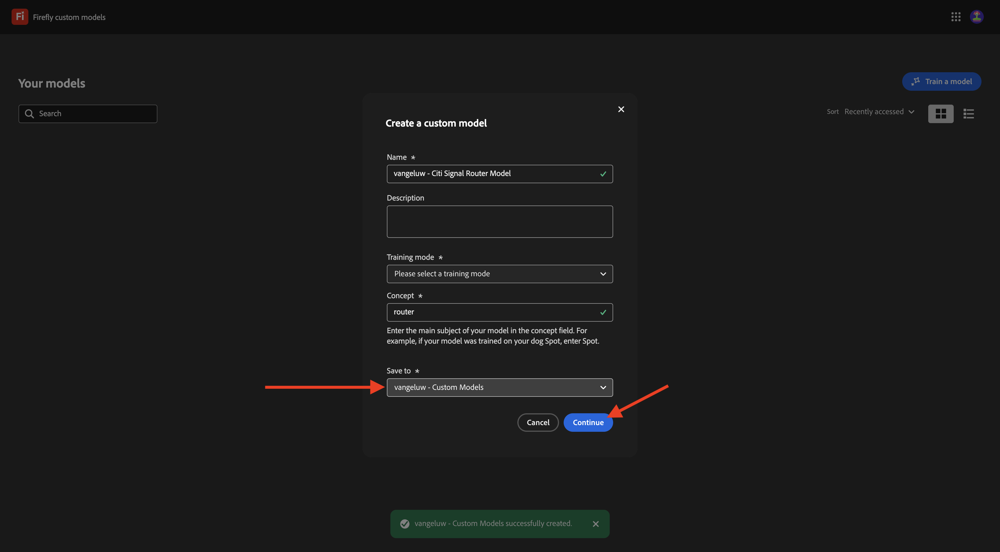

# Modelos personalizados de Firefly 1.1.4

Vaya a [https://firefly.adobe.com](https://firefly.adobe.com). Vaya a **Modelos personalizados**.

**Acepto** las condiciones de uso de los modelos personalizados de Firefly.

Haga clic en **Entrenar un modelo**.

Use el nombre `--aepUserLdap-- - CitiSignal Router Model`. Seleccione **Estilo** y haga clic en **+ Crear nuevo proyecto**.

Use el nombre `--aepUserLdap-- - CitiSignal Custom Model`. Haga clic en **Crear**.

Haga clic en **Continuar**.

Haz clic en **Seleccionar imágenes de tu equipo**.

Puede utilizar estos recursos. Descárguelos en su ordenador y extraiga el archivo zip en una carpeta de su escritorio.

Seleccione todas las imágenes y haga clic en **Abrir**.

Las imágenes se cargarán. Esto puede tardar un poco.

Ahora ha completado este ejercicio.

Siguiente paso: [Resumen y beneficios](./summary.md)

[Volver al módulo 1.1](./firefly-services.md)

[Volver a todos los módulos](./../../../overview.md)
