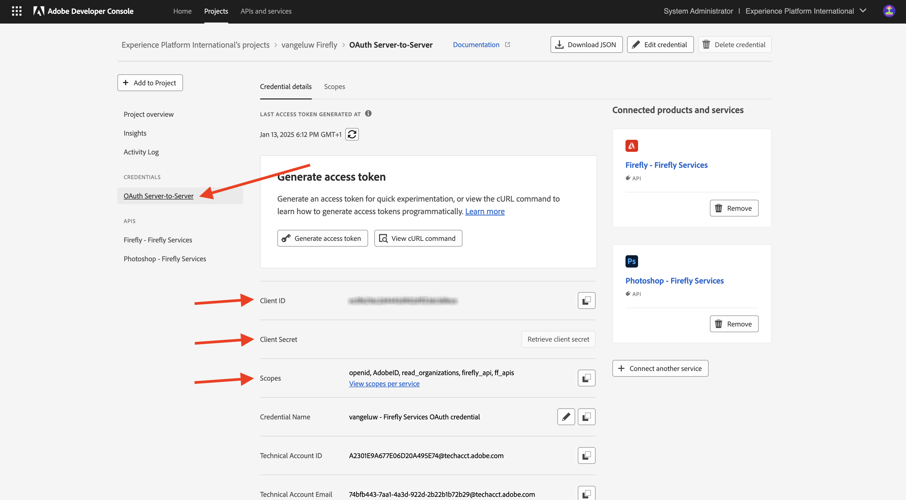
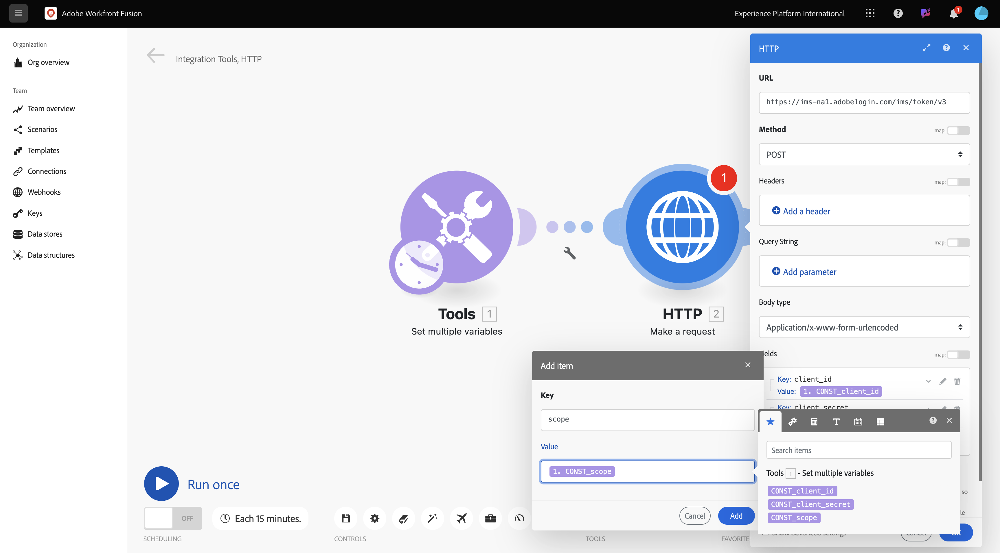

# 1.2.1 Introducción a Workfront Fusion

En este ejercicio, utilizará Workfront Fusion y Adobe I/O para consultar las API de los servicios de Adobe Firefly.

## 1.2.1.1 Crear nuevo escenario

Vaya a [https://experience.adobe.com/](https://experience.adobe.com/). Haga clic para abrir **Workfront Fusion**.

Entonces debería ver esto. Ir a **escenarios**.

Haga clic en **Crear nuevo escenario**.

A continuación, verá un escenario vacío. Haga clic en el icono **herramientas** y seleccione **Establecer varias variables**.

Ahora necesita mover el icono **clock** al **Set multiple variables** que acaba de agregar.

Entonces verá esto...

A continuación, haga clic con el botón derecho en el signo de interrogación y seleccione **Eliminar módulo**.

A continuación, haga clic con el botón derecho en el objeto **Set multiple variables** y seleccione **Settings**.

## 1.2.1.2 Configuración de la autenticación de Adobe I/O

Ahora debe configurar las variables necesarias para autenticarse con el Adobe I/O. En el ejercicio anterior creó un proyecto de Adobe I/O. Las variables de ese proyecto de Adobe I/O ahora deben definirse en Workfront Fusion.

Deben definirse las siguientes variables:

| Clave | Valor |
|:-------------:| :---------------:| 
| `CONST_client_id` | su ID de cliente del proyecto de Adobe I/O |
| `CONST_client_secret` | Secreto del cliente del proyecto de Adobe I/O |
| `CONST_scope` | Ámbito del proyecto de Adobe I/O |

Puede encontrar estas variables yendo a [https://developer.adobe.com/console/projects](https://developer.adobe.com/console/projects) y abriendo su proyecto de Adobe I/O, que se llama `--aepUserLdap-- Firefly`.

En el proyecto, haga clic en **Servidor OAuth** para ver los valores de las claves anteriores.

Con las claves y los valores anteriores, puede configurar el objeto **Set multiple variables**. Haga clic en **Agregar elemento**.

Escriba el **nombre de variable**: **CONST_client_id** y su **valor de variable**, haga clic en **Agregar**.

Haga clic en **Agregar elemento**.

Escriba el **nombre de variable**: **CONST_client_secret** y su **valor de variable**, haga clic en **Agregar**.

Haga clic en **Agregar elemento**.

Escriba el **nombre de variable**: **Ámbito_CONST** y su **valor de variable**, haga clic en **Agregar**.

Haga clic en **Aceptar**.

Pase el ratón sobre su objeto **Set multiple variables** y haga clic en el icono **+** para agregar otro módulo.

Entonces debería ver esto.

En la barra de búsqueda, escriba **http**. Seleccione **HTTP** para abrirlo.

y luego selecciona **Realizar una solicitud**.

| Clave | Valor |
|:-------------:| :---------------:| 
| `URL` | `https://ims-na1.adobelogin.com/ims/token/v3` |
| `Method` | `POST` |
| `Body Type` | `x-www-form-urlencoded` |

Haga clic en **Agregar elemento**.

Agregue elementos para cada uno de los siguientes valores:

| Clave | Valor |
|:-------------:| :---------------:| 
| `client_id` | su variable predefinida para `CONST_client_id` |
| `client_secret` | su variable predefinida para `CONST_client_secret` |
| `scope` | su variable predefinida para `CONST_scope` |
| `grant_type` | `client_credentials` |

Configuración de `client_id`.

Configuración de `client_secret`.

Configuración de `scope`.

Configuración de `grant_type`.

Información general de configuración. Desplácese hacia abajo y marque la casilla de verificación de **Analizar respuesta**. Haga clic en **Aceptar**.

Entonces debería ver esto. Haga clic en **Ejecutar una vez**.

Una vez ejecutado el escenario, debería ver esto.

Haga clic en el icono **signo de interrogación** en el objeto **Establecer varias variables** para ver qué ocurrió cuando se ejecutó ese objeto.

Haga clic en el icono **signo de interrogación** en el objeto **HTTP - Realizar una solicitud** para ver qué ocurrió cuando se ejecutó ese objeto. En **OUTPUT**, verá que el Adobe I/O devuelve el **token de acceso**.

Pase el ratón sobre el objeto **HTTP - Make a request** y haga clic en el icono **+** para agregar otro módulo.

En la barra de búsqueda, busque `tools`. Seleccione **Herramientas**.

Seleccione **Establecer múltiples variables**.

Seleccione **Agregar elemento**.

Establezca **Variable name** en `bearer_token`. Seleccione `access_token` como **valor de variable** dinámico. Seleccionar **Agregar**.

Entonces deberías tener esto. Haga clic en **Aceptar**.

Haga clic en **Ejecutar una vez** de nuevo.

Una vez que se haya ejecutado el escenario, haga clic en el icono **signo de interrogación** en el último objeto **Set multiple variables**. Luego debería ver que access_token se está almacenando en la variable `bearer_token`.

A continuación, haga clic con el botón derecho en el primer objeto **Establecer varios valores** y seleccione **Cambiar nombre**.

Establezca el nombre en **Inicializar constantes**. Haga clic en **Aceptar**.

Cambie el nombre del segundo objeto y establezca el nombre en **Autenticar en el Adobe I/O**. Haga clic en **Aceptar**.

Cambie el nombre del tercer objeto y establezca el nombre en **Set Bearer Token**. Haga clic en **Aceptar**.

Entonces deberías tener esto.

A continuación, cambie el nombre de su escenario a `--aepUSerLdap-- - Adobe I/O Authentication`.

Haga clic en **Guardar**.

Siguiente paso: [1.2.2 Usar API de Adobe en Workfront Fusion](./ex2.md)

[Volver al módulo 1.2](./automation.md)

[Volver a todos los módulos](./../../../overview.md)
