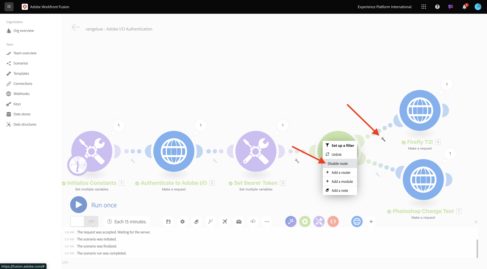
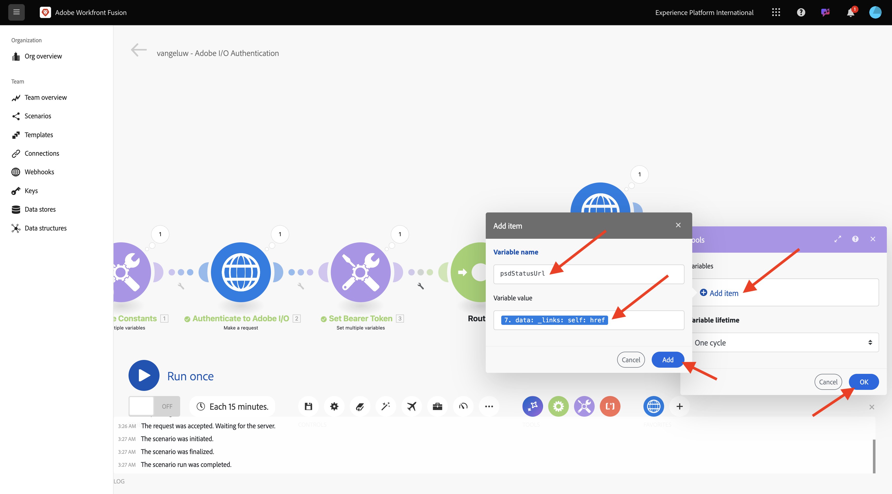
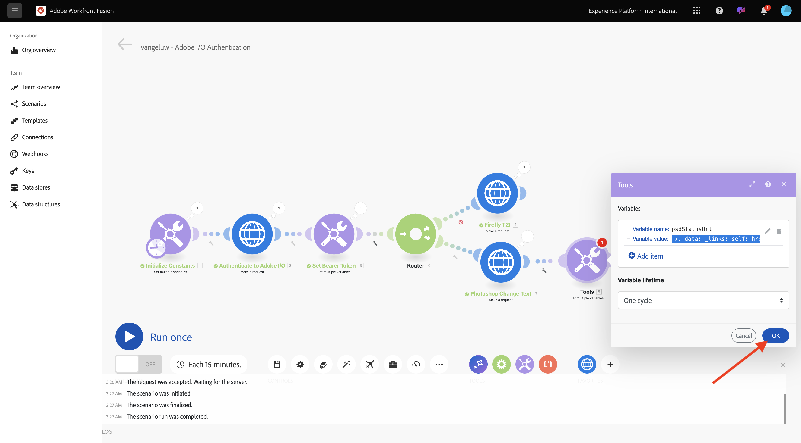
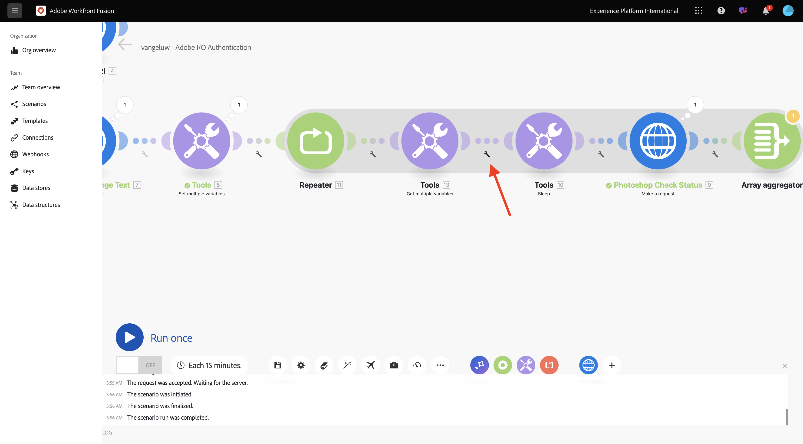
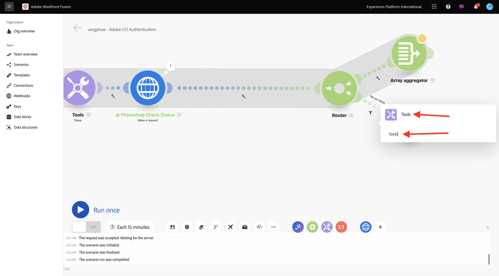

# Uso de las API de Adobe en Workfront Fusion

Aprenda a utilizar las API de Adobe en Workfront Fusion.

## Uso de la API Texto a imagen del Firefly con Workfront Fusion

1. Pase el ratón sobre el segundo nodo **Set multiple variables** y seleccione **+** para agregar otro módulo.


1. Busque **http** y seleccione **HTTP**.


1. Seleccione **Realizar una solicitud**.


1. Seleccione estas variables:

- **URL**: `https://firefly-api.adobe.io/v3/images/generate`
- **Método**: `POST`

1. Seleccione **Agregar un encabezado**.


1. Introduzca los siguientes encabezados:

| Clave | Valor |
|:-------------:| :---------------:| 
| `x-api-key` | su variable almacenada para `CONST_client_id` |
| `Authorization` | `Bearer ` + su variable almacenada para `bearer_token` |
| `Content-Type` | `application/json` |
| `Accept` | `*/*` |

1. Escriba los detalles de `x-api-key`. Seleccione **Agregar**.


1. Seleccione **Agregar un encabezado**.


1. Escriba los detalles de `Authorization`. Seleccione **Agregar**.


1. Seleccione **Agregar un encabezado**. Escriba los detalles de `Content-Type`. Seleccione **Agregar**.


1. Seleccione **Agregar un encabezado**. Escriba los detalles de `Accept`. Seleccione **Agregar**.


1. Establezca **Body type** en **Raw**. Para **Content type**, seleccione **JSON (application/json)**.


1. Pegue esta carga en el campo **Solicitar contenido**.

```json
{
  "numVariations": 1,
  "size": {
    "width": 2048,
    "height": 2048
  },
  "prompt": "Horses in a field",
  "promptBiasingLocaleCode": "en-US"
}
```

1. Marque la casilla de **Respuesta de análisis**. Seleccione **Aceptar**.


1. Seleccionar **Ejecutar una vez**.


La pantalla debería tener un aspecto similar al siguiente.


1. ¿Desea seleccionar **?Icono** en el cuarto nodo, HTTP, para ver la respuesta. Debería ver un archivo de imagen en la respuesta.


1. Copie la dirección URL de la imagen y ábrala en una ventana del explorador. La pantalla debería tener un aspecto similar al siguiente:


1. Haga clic con el botón derecho en **HTTP** y cambie el nombre a **Firefly T2I**.


1. Seleccione **Guardar** para guardar los cambios.


## Uso de la API de Photoshop con Workfront Fusion

1. Seleccione **wrench** entre los nodos **Set Bearer Token** y **Firefly T2I**. Seleccione **Agregar un enrutador**.


1. Haga clic con el botón derecho en el objeto **Firefly T2I** y seleccione **Clonar**.


1. Arrastre y suelte el objeto clonado cerca del objeto **Router**; se conecta automáticamente al **Router**. La pantalla debería tener un aspecto similar al siguiente:


Ahora tiene una copia idéntica basada en la solicitud HTTP **Firefly T2I**. Algunas de las configuraciones de la solicitud HTTP **Firefly T2I** son similares a las que necesita para interactuar con la **API de Photoshop**, que ahorra tiempo. Ahora solo debe cambiar las variables que no son las mismas, como la dirección URL de solicitud y la carga útil.

1. Cambie **URL** a `https://image.adobe.io/pie/psdService/text`.


1. Reemplazar **contenido de solicitud** por la siguiente carga útil:

```json
{
  "inputs": [
    {
      "storage": "external",
      "href": "{{AZURE_STORAGE_URL}}/{{AZURE_STORAGE_CONTAINER}}/citisignal-fiber.psd{{AZURE_STORAGE_SAS_READ}}"
    }
  ],
  "options": {
    "layers": [
      {
        "name": "2048x2048-button-text",
        "text": {
          "content": "Click here"
        }
      },
      {
        "name": "2048x2048-cta",
        "text": {
          "content": "Buy this stuff"
        }
      }
    ]
  },
  "outputs": [
    {
      "storage": "azure",
      "href": "{{AZURE_STORAGE_URL}}/{{AZURE_STORAGE_CONTAINER}}/citisignal-fiber-changed-text.psd{{AZURE_STORAGE_SAS_WRITE}}",
      "type": "vnd.adobe.photoshop",
      "overwrite": true
    }
  ]
}
```


Para que este **contenido de solicitud** funcione correctamente, faltan algunas variables:

- `AZURE_STORAGE_URL`
- `AZURE_STORAGE_CONTAINER`
- `AZURE_STORAGE_SAS_READ`
- `AZURE_STORAGE_SAS_WRITE`

1. Vuelva al primer nodo, seleccione **Inicializar constantes** y, a continuación, elija **Agregar elemento** para cada una de estas variables.


| Clave | Valor de ejemplo |
|:-------------:| :---------------:| 
| `AZURE_STORAGE_URL` | `https://vangeluw.blob.core.windows.net` |
| `AZURE_STORAGE_CONTAINER` | `vangeluw` |
| `AZURE_STORAGE_SAS_READ` | `?sv=2023-01-03&st=2025-01-13T07%3A36%3A35Z&se=2026-01-14T07%3A36%3A00Z&sr=c&sp=rl&sig=4r%2FcSJLlt%2BSt9HdFdN0VzWURxRK6UqhB8TEvbWkmAag%3D` |
| `AZURE_STORAGE_SAS_WRITE` | `?sv=2023-01-03&st=2025-01-13T17%3A21%3A09Z&se=2025-01-14T17%3A21%3A09Z&sr=c&sp=racwl&sig=FD4m0YyyqUj%2B5T8YyTFJDi55RiTDC9xKtLTgW0CShps%3D` |

Para encontrar las variables, vuelva a Postman y abra las **Variables de entorno**.


1. Copie estos valores en Workfront Fusion y añada un nuevo elemento para cada una de estas 4 variables.

1. La pantalla debería tener un aspecto similar al siguiente. Seleccione **Aceptar**.


A continuación, vuelva a la solicitud HTTP clonada para actualizar **Solicitar contenido**. Observe las variables negras en **Solicitar contenido**, que son las variables que copió desde Postman. Debe cambiar a las variables que acaba de definir en Workfront Fusion. Reemplace cada variable una por una eliminando el texto en negro y reemplazándolo por la variable correcta.


1. Realice estos 3 cambios en la sección **input**. Seleccione **Aceptar**.


1. Realice estos 3 cambios en la sección **resultados**. Seleccione **Aceptar**.


1. Haga clic con el botón derecho en el nodo clonado y seleccione **Rename**. Cambie el nombre a **Photoshop Change Text**.


La pantalla debería tener un aspecto similar al siguiente:


1. Seleccionar **Ejecutar una vez**.


1. Seleccione el icono **search** en el nodo **Photoshop Change Text** para ver la respuesta. Debe tener una respuesta similar a esta, con un vínculo a un archivo de estado.


1. Antes de continuar con las interacciones de la API de Photoshop, deshabilite la ruta al nodo **Firefly T2I** para no enviar llamadas de API innecesarias a ese extremo de API. Seleccione el icono **llave inglesa** y, a continuación, seleccione **Deshabilitar ruta**.



La pantalla debería tener un aspecto similar al siguiente:


1. A continuación, agregue otro nodo **Set multiple variables**.


1. Colóquelo después del nodo **Photoshop Change Text**.


1. Seleccione el nodo **Set multiple variables** y luego seleccione **Add item**. Seleccione el valor de la variable de la respuesta de la solicitud anterior.

| Nombre de variable | Valor variable |
|:-------------:| :---------------:| 
| `psdStatusUrl` | `data > _links > self > href` |

1. Seleccione **Agregar**.



1. Seleccione **Aceptar**.



1. Haga clic con el botón derecho en el nodo **Photoshop Change Text** y seleccione **Clone**.


1. Arrastre la solicitud HTTP clonada después del nodo **Set multiple variables** que acaba de crear.


1. Haga clic con el botón derecho en la solicitud HTTP clonada, seleccione **Rename** y cambie el nombre a **Photoshop Check Status**.


1. Seleccione para abrir la solicitud HTTP. Cambie la dirección URL de modo que haga referencia a la variable que creó en el paso anterior y establezca el **Método** en **GET**.


1. Elimine **Body** seleccionando la opción vacía.


1. Seleccione **Aceptar**.


1. Seleccionar **Ejecutar una vez**.


Aparece una respuesta que contiene el campo **status**, con el estado establecido en **running**. Photoshop tarda un par de segundos en completar el proceso.


Ahora que sabe que la respuesta necesita un poco más de tiempo para completarse, puede ser una buena idea agregar un temporizador delante de esta solicitud HTTP para que no se ejecute de inmediato.

1. Seleccione el nodo **Herramientas** y luego seleccione **Suspensión**.


1. Coloque el nodo **Sleep** entre **Establecer varias variables** y **Comprobar el estado de Photoshop**. Establezca **Delay** en **5** segundos. Seleccione **Aceptar**.


La pantalla debería tener un aspecto similar al siguiente. El desafío con la siguiente configuración es que 5 segundos de espera pueden ser suficientes, pero tal vez no sean suficientes. En realidad, sería mejor tener una solución más inteligente como un bucle do...while que compruebe el estado cada 5 segundos hasta que el estado sea igual a **succeeded**. Por lo tanto, puede implementar una táctica de este tipo en los siguientes pasos.


1. Seleccione el icono **wrench** entre **Set multiple variables** y **Sleep**. Seleccione **Agregar módulo**.


1. Busque `flow` y luego seleccione **Control de flujo**.


1. Seleccione **Repetidor**.


1. Definir **repeticiones** en **20**. Seleccione **Aceptar**.


1. A continuación, seleccione **+** en **Photoshop Comprobar estado** para agregar otro módulo.


1. Busque **flow** y seleccione **Flow Control**.


1. Seleccione **Agregador de matrices**.


1. Definir **Módulo Source** en **Repetidor**. Seleccione **Aceptar**.


La pantalla debería tener un aspecto similar al siguiente:


1. Seleccione el icono **llave inglesa** y seleccione **Agregar un módulo**.


1. Busque **herramientas** y seleccione **Herramientas**.


1. Seleccione **Obtener múltiples variables**.


1. Seleccione **+ Agregar elemento** y establezca **Nombre de variable** en `done`.


1. Seleccione **Aceptar**.


1. Seleccione el nodo **Set multiple variables** que configuró anteriormente. Para inicializar la variable **done**, debe establecerla en `false` aquí. Seleccionar **+ Agregar elemento**.


1. Usar `done` para **nombre de variable**

1. Para establecer el estado, se necesita un valor booleano. Para encontrar el valor booleano, seleccione **gear** y luego seleccione `false`. Seleccione **Agregar**.


1. Seleccione **Aceptar**.


1. A continuación, seleccione el icono **wrench** después del nodo **Get multiple variables** que configuró.



1. Seleccione **Configurar un filtro**. Ahora necesita comprobar el valor de la variable **done**. Si ese valor se establece en **false**, se debe ejecutar la siguiente parte del bucle. Si el valor se establece en **true**, significa que el proceso ya ha finalizado correctamente, por lo que no es necesario continuar con la siguiente parte del bucle.


1. Para la etiqueta, use **¿Ya terminamos?**. Establezca la **condición** con la variable ya existente **hecho**, el operador debe establecerse en **Igual a** y el valor debe ser la variable booleana `false`. Seleccione **Aceptar**.


1. A continuación, deje espacio entre los nodos **Photoshop Comprobar estado** y **Agregador de matrices**. A continuación, seleccione el icono **llave inglesa** y seleccione **Agregar un enrutador**. Esto se debe a que, después de comprobar el estado del archivo Photoshop, debe haber dos rutas. Si el estado es `succeeded`, la variable de **done** debe establecerse en `true`. Si el estado no es igual a `succeeded`, el bucle debe continuar. El enrutador hará posible comprobar y configurar esto.


1. Después de agregar el enrutador, selecciona el icono **llave inglesa** y selecciona **Configurar un filtro**.


1. Para la etiqueta, use **Hemos terminado**. Establezca la **condición** con la respuesta del nodo **Photoshop Comprobar estado** eligiendo el campo de respuesta **data.output[].status**, el operador debe establecerse en **Igual a** y el valor debe ser `succeeded`. Seleccione **Aceptar**.


1. A continuación, seleccione el nodo vacío con el signo de interrogación y busque **tools**. A continuación, seleccione **Herramientas**.



1. Seleccione **Establecer múltiples variables**.


1. Cuando se utiliza esta rama del enrutador, significa que el estado de creación del archivo Photoshop se ha completado correctamente. Esto significa que el bucle do...while ya no necesita continuar comprobando el estado en Photoshop, por lo que debe establecer la variable `done` en `true`.

1. Para **nombre de variable**, use `done`.

1. Para el **valor de variable**, debe usar el valor booleano `true`. Seleccione el icono **engranaje** y luego seleccione `true`. Seleccione **Agregar**.


1. Seleccione **Aceptar**.


1. A continuación, haga clic con el botón derecho en el nodo **Set multiple variables** que acaba de crear y seleccione **Clone**.


1. Arrastre el nodo clonado para que se conecte con **Array aggregator**. A continuación, haga clic con el botón secundario en el nodo, seleccione **Rename** y cambie el nombre a `Placeholder End`.


1. Elimine la variable existente y seleccione **+ Agregar elemento**. Para **Variable name**, use `placeholder`, para **Variable value**, use `end`. Seleccione **Agregar** y, a continuación, seleccione **Aceptar**.


1. Seleccione **Guardar** para guardar su escenario. A continuación, seleccione   **Ejecutar una vez**.


A continuación, se ejecuta el escenario, que debe finalizar correctamente. Observe que el bucle do...while que configuró funciona correctamente. En la siguiente ejecución, puede ver que **Repeater** se ejecutó 20 veces según la burbuja del nodo **Tools > Get multiple variables**. Después de ese nodo, configuró un filtro que comprobó el estado y solo si el estado no era igual a **correcto**, se ejecutaron los siguientes nodos. En esta ejecución, la parte posterior al filtro solo se ejecutó una vez, porque el estado ya era **correcto** en la primera ejecución.


1. Puede comprobar el estado de creación del nuevo archivo Photoshop si hace clic en la burbuja de la solicitud HTTP **Photoshop Check Status** y explora el campo **estado**.


Ya ha configurado la versión básica de un escenario repetible que automatiza una serie de pasos. En el siguiente ejercicio, iterará agregando complejidad a esto.

## Pasos siguientes

Vaya a [Automatización de procesos con Workfront Fusion](./ex3.md){target="_blank"}

Volver a [Automatizar servicios de Adobe Firefly](./automation.md){target="_blank"}

Volver a [Todos los módulos](./../../../overview.md){target="_blank"}
