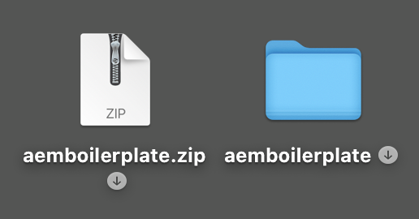
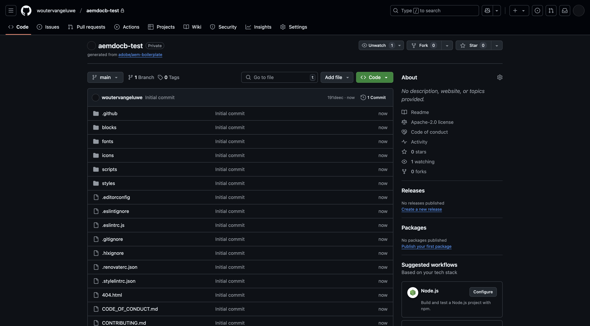
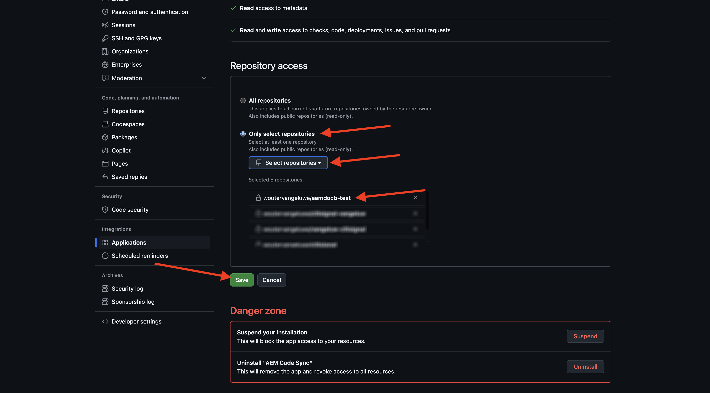
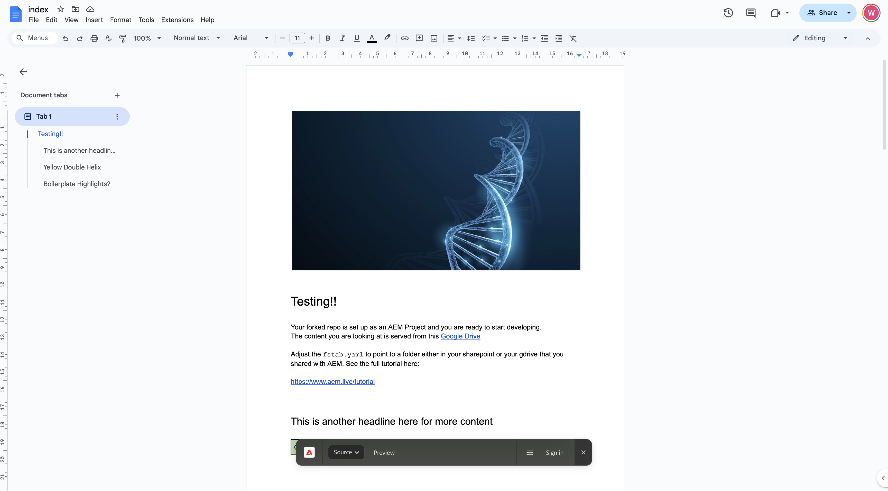
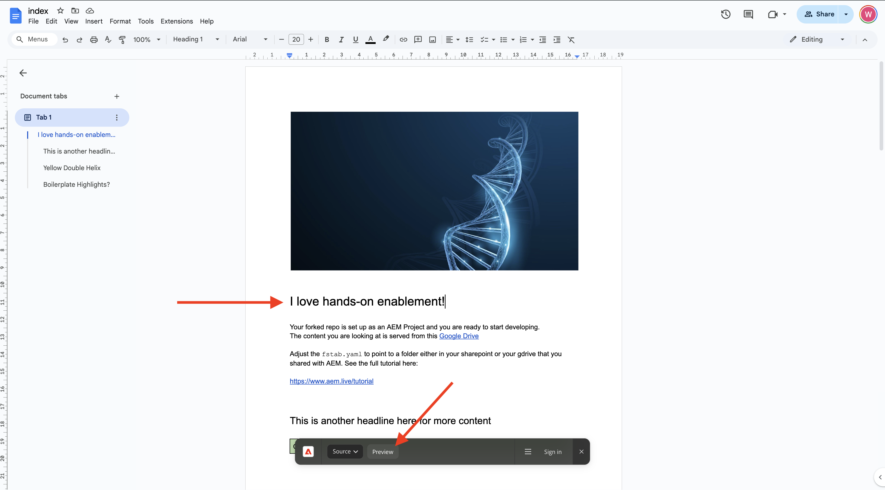

# 2.1.2 Crear un sitio web basado en documentos

Mientras espera a que se cree su programa de Cloud Manager, tiene tiempo suficiente para configurar su primer sitio web de creación basada en documentos. El siguiente ejercicio se basa en el [Tutorial para desarrolladores de aem.live](https://www.aem.live/developer/tutorial){target="_blank"}. Siga los pasos a continuación para empezar.

## 2.1.2.1 Configurar la unidad de Google

Vaya a [https://drive.google.com](https://drive.google.com){target="_blank"}. Haga clic en **+ Nueva** y luego haga clic en **Nueva carpeta**.

Asigne un nombre a la carpeta `aemdocb-test`. Haga clic en **Crear**.

Descargue el archivo [aemboilerplate.zip](./../../../assets/aem/aemboilerplate.zip){target="_blank"} y extráigalo en su equipo.

Verá 3 archivos en esa carpeta. Copie esos archivos en la nueva carpeta de Google Drive.

Ahora debe convertir estos archivos en un archivo nativo de Google. Para ello, abra cada archivo y vaya a **Archivo** > **Guardar como Google Docs**.

Debe hacer esto para los 3 archivos y después verá 6 archivos en la carpeta de Google Drive.

Luego tiene esto en su carpeta.

Para que funcione la demostración de creación basada en documentos, ahora debe compartir la carpeta de Google Drive con la dirección de correo electrónico **helix@adobe.com**. Haz clic en el nombre de tu carpeta, haz clic en **Compartir** y luego haz clic en **Compartir** de nuevo.

Escriba la dirección de correo electrónico **helix@adobe.com** y haga clic en **Enviar**.

A continuación, copie y anote la dirección URL de la carpeta Google Drive tal como la necesitará en el siguiente ejercicio. Haz clic en el nombre de tu carpeta, haz clic en **Compartir** y luego haz clic en **Copiar vínculo**.

`https://drive.google.com/drive/folders/1PNIOFeptIfszSebawT-Y_bwB4_anQWk5?usp=drive_link`

Debe quitar el parámetro de cadena de consulta `?usp=drive_link` para que la dirección URL tenga el aspecto siguiente:

`https://drive.google.com/drive/folders/1PNIOFeptIfszSebawT-Y_bwB4_anQWk5`

## 2.1.2.2 Configurar el repositorio de GitHub

Vaya a [https://github.com](https://github.com){target="_blank"}. Haga clic en **Iniciar sesión**.

Introduzca sus credenciales. Haga clic en **Iniciar sesión**.

Cuando haya iniciado sesión, verá su panel de GitHub.

Vaya a [https://github.com/adobe/aem-boilerplate](https://github.com/adobe/aem-boilerplate){target="_blank"}. Entonces verá esto... Haga clic en **Usar esta plantilla** y luego haga clic en **Crear un nuevo repositorio**.

Para el **nombre del repositorio**, use `aemdocb-test`. Establezca la visibilidad en **Privado**. Haga clic en **Crear repositorio**.

Después de un par de segundos, se crea el repositorio.

A continuación, ve a [https://github.com/apps/aem-code-sync](https://github.com/apps/aem-code-sync){target="_blank"}. Haga clic en **Configurar**.

Haga clic en su cuenta de GitHub.

Haga clic en **Seleccionar solo repositorios** y, a continuación, agregue el repositorio que acaba de crear. A continuación, haga clic en **Instalar**.

Luego recibirás esta confirmación.

## 2.1.2.3 Actualizar archivo fstab.yaml

En su repositorio de GitHub, haga clic para abrir el archivo `fstab.yaml`.

Haga clic en el icono **editar**.

Ahora necesita actualizar el valor del campo **url** en la línea 2.

AEM Debe reemplazar el valor actual por la URL de su entorno específico de GitHub CS en combinación con la configuración de su repositorio de GitHub.

Este es el valor actual de la dirección URL: `https://drive.google.com/drive/u/0/folders/1MGzOt7ubUh3gu7zhZIPb7R7dyRzG371j`.

Reemplace ese valor por la dirección URL que copió de la carpeta de Google Drive, `https://drive.google.com/drive/folders/1PNIOFeptIfszSebawT-Y_bwB4_anQWk5`. Haga clic en **Confirmar cambios...**.

Haga clic en **Confirmar cambios**.

## 2.1.2.4 Extensión del AEM Sidekick de instalación

Vaya a [https://chromewebstore.google.com/detail/aem-sidekick/ccfggkjabjahcjoljmgmklhpaccedipo](https://chromewebstore.google.com/detail/aem-sidekick/ccfggkjabjahcjoljmgmklhpaccedipo){target="_blank"}. Haga clic en **Agregar a Chrome**.

Anclar la extensión **AEM Sidekick**.

## 2.1.2.5 Previsualizar y Publish su sitio web basado en documentos

Vuelva a la carpeta de Google Drive. En la barra de tareas, haga clic en la extensión **AEM Sidekick**. A continuación, verá una ventana emergente de barra AEM Sidekick en la carpeta.

Seleccione los 3 archivos de la carpeta Google Drive. Haga clic en **Vista previa**.

Vuelva a hacer clic en **Vista previa**.

Haga clic en para cerrar la ventana emergente de diálogo verde.

Vuelva a seleccionar los tres archivos de la carpeta Google Drive. Ahora, haz clic en **Publish**.

Haga clic en **Publish**.

Haga clic en para cerrar de nuevo el cuadro de diálogo verde. Ahora, selecciona el archivo **index**, haz clic en **Copiar URL** y luego haz clic en **Copiar URL de Live**.

La dirección URL que se copió tendrá el siguiente aspecto: `https://main--aemdocb-test--woutervangeluwe.aem.live/`.

En la URL anterior:

- **main** hace referencia a la rama de su repositorio de GitHub
- **aemdocb-test** hace referencia al nombre del repositorio de GitHub
- **woutervangeluwe** hace referencia al nombre de cuenta de usuario de GitHub
- AEM **.live** hace referencia al entorno en vivo de su instancia de
- AEM Puede reemplazar **.live** por **.page** para abrir el entorno de vista previa de su instancia de

Abra una nueva ventana del explorador y vaya a la dirección URL.

## 2.1.2.6 Realice un cambio y publíquelo

Vuelva a la unidad de Google y abra el filtro **index** en Google.

Reemplace el texto **Testing** por cualquier otro texto de su elección. Haga clic en **Vista previa**.

Se abrirá la versión de vista previa del sitio web. Revise el cambio y haga clic en **Publish**.

A continuación, verá la versión activa del sitio web.

El ejercicio anterior era una buena manera de empezar y experimentar la creación basada en documentos. Ahora puede continuar con el siguiente ejercicio, en el que configurará su propio sitio web de demostración con CitiSignal como marca de demostración.

AEM Siguiente paso: [2.1.3 Configuración de su entorno de CS de la](./ex3.md){target="_blank"}

[Volver al módulo 2.1](./aemcs.md){target="_blank"}

[Volver a todos los módulos](./../../../overview.md){target="_blank"}
