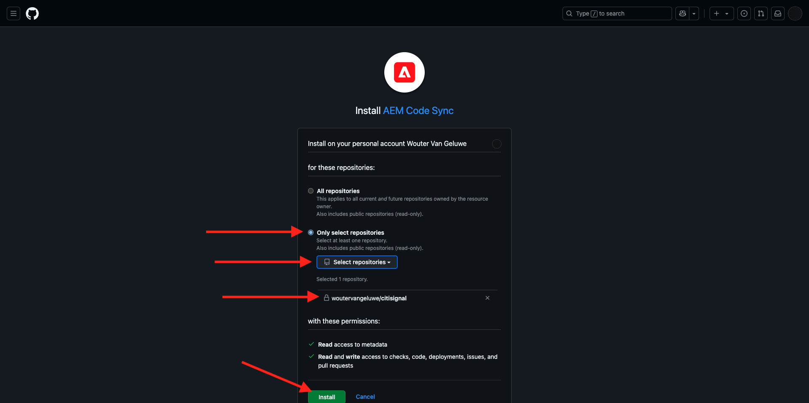
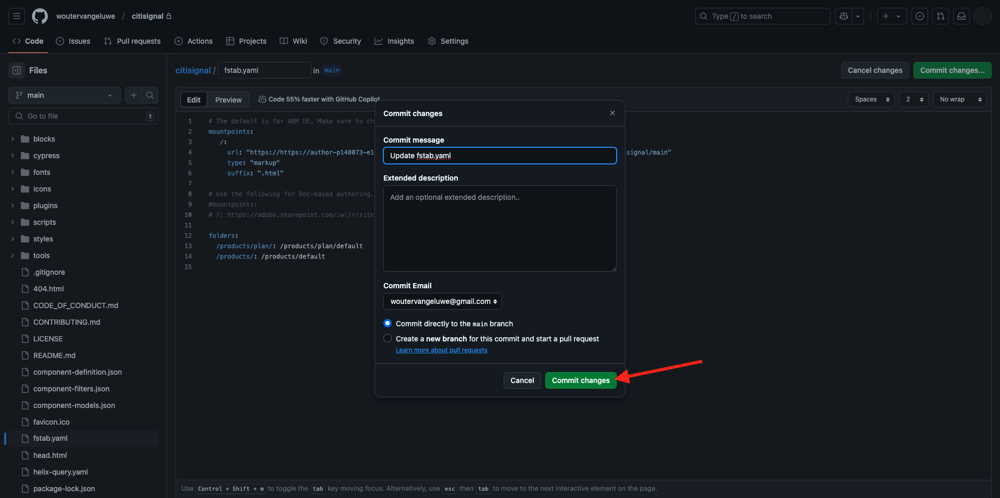
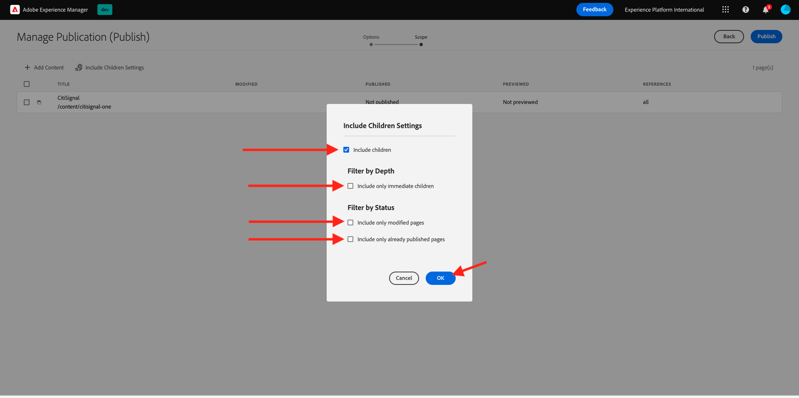
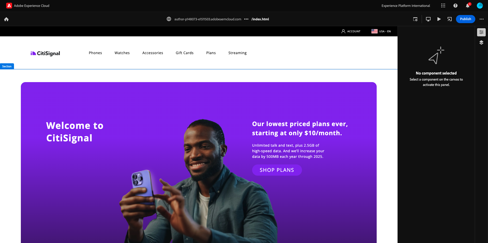

# AEM 2.1.3 Configuración del entorno de CS de la

## 2.1.3.1 Configurar el repositorio de GitHub

Vaya a [https://github.com](https://github.com){target="_blank"}. Haga clic en **Iniciar sesión**.

Introduzca sus credenciales. Haga clic en **Iniciar sesión**.

Cuando haya iniciado sesión, verá su panel de GitHub.

Vaya a [https://github.com/AdobeDevXSC/citisignal-one](https://github.com/AdobeDevXSC/citisignal-one){target="_blank"}. Entonces verá esto... Haga clic en **Usar esta plantilla** y luego haga clic en **Crear un nuevo repositorio**.

Para el **nombre del repositorio**, use `citisignal`. Establezca la visibilidad en **Privado**. Haga clic en **Crear repositorio**.

Después de un par de segundos, se crea el repositorio.

A continuación, ve a [https://github.com/apps/aem-code-sync](https://github.com/apps/aem-code-sync){target="_blank"}. Haga clic en **Configurar**.

Haga clic en su cuenta de GitHub.

Haga clic en **Seleccionar solo repositorios** y, a continuación, agregue el repositorio que acaba de crear. A continuación, haga clic en **Instalar**.

Luego recibirás esta confirmación.

## 2.1.3.2 Actualizar archivo fstab.yaml

En su repositorio de GitHub, haga clic para abrir el archivo `fstab.yaml`.

Haga clic en el icono **editar**.

Ahora necesita actualizar el valor del campo **url** en la línea 4.

AEM Debe reemplazar el valor actual por la URL de su entorno específico de GitHub CS en combinación con la configuración de su repositorio de GitHub.

Este es el valor actual de la dirección URL: `https://author-p131639-e1282833.adobeaemcloud.com/bin/franklin.delivery/adobedevxsc/citisignal-one/main`.

Hay tres partes de la dirección URL que deben actualizarse

`https://XXX/bin/franklin.delivery/YYY/ZZZ/main`

AEM XXX debe ser reemplazado por la URL de su entorno de autor de CS de.

AAAA debe reemplazarse por su cuenta de usuario de GitHub.

ZZZ debe reemplazarse por el nombre del repositorio de GitHub que utilizó en el ejercicio anterior.

AEM Puede encontrar la URL del entorno de autor de CS de la en [https://my.cloudmanager.adobe.com](https://my.cloudmanager.adobe.com){target="_blank"}. Haga clic en **Programa** para abrirlo.

A continuación, haga clic en los 3 puntos **...** en la ficha **Entornos** y haga clic en **Ver detalles**.

A continuación, verá los detalles del entorno, incluida la dirección URL del entorno **Autor**. Copie la dirección URL.

XXX = `author-p148073-e1511503.adobeaemcloud.com`

Para el nombre de cuenta de usuario de GitHub, puede encontrarlo fácilmente en la URL de su explorador. En este ejemplo, el nombre de cuenta de usuario es `woutervangeluwe`.

AAAA = `woutervangeluwe`

Para el nombre del repositorio de GitHub, también puede encontrarlo en la ventana del explorador que ha abierto en GitHub. En este caso, el nombre del repositorio es `citisignal`.

ZZZ = `citisignal`

Estos tres valores combinados dan lugar a esta nueva dirección URL que debe configurarse en el archivo `fstab.yaml`.

`https://author-p148073-e1511503.adobeaemcloud.com/bin/franklin.delivery/woutervangeluwe/citisignal/main`

Haga clic en **Confirmar cambios...**.

Haga clic en **Confirmar cambios**.

Se ha actualizado el archivo `fstab.yaml`.

## 2.1.3.3 Carga de recursos de CitiSignal

Vaya a [https://my.cloudmanager.adobe.com](https://my.cloudmanager.adobe.com){target="_blank"}. Haga clic en **Programa** para abrirlo.

A continuación, haga clic en la dirección URL del entorno de Author.

Haga clic en **Iniciar sesión con el Adobe**.

A continuación, verá su entorno de Author.

La dirección URL será similar a la siguiente: `https://author-p148073-e1511503.adobeaemcloud.com/ui#/aem/aem/start.html?appId=aemshell`

Ahora necesita tener acceso al entorno **CRX AEM Package Manager** de la aplicación de. Para ello, elimine `ui#/aem/aem/start.html?appId=aemshell` de la dirección URL y reemplácelo por `crx/packmgr`, lo que significa que la dirección URL debería tener este aspecto ahora:
`https://author-p148073-e1511503.adobeaemcloud.com/crx/packmgr`.
Pulse **Intro** para cargar el entorno del administrador de paquetes

A continuación, haga clic en **Cargar paquete**.

Haga clic en **Examinar** para localizar el paquete que desea cargar.

El paquete que se va a cargar se llama **citisignal-assets.zip** y se puede descargar aquí: [https://tech-insiders.s3.us-west-2.amazonaws.com/one-adobe/citisignal-assets.zip](https://tech-insiders.s3.us-west-2.amazonaws.com/one-adobe/citisignal-assets.zip){target="_blank"}.

Seleccione el paquete y haga clic en **Abrir**.

A continuación, haga clic en **Aceptar**.

A continuación, se carga el paquete.

A continuación, haga clic en **Instalar** en el paquete que acaba de cargar.

Haga clic en **Instalar**.

Después de un par de minutos, el paquete se instalará.

Ahora puede cerrar esta ventana.

## 2.1.3.4 Recursos de Publish CitiSignal

Vaya a [https://my.cloudmanager.adobe.com](https://my.cloudmanager.adobe.com){target="_blank"}. Haga clic en **Programa** para abrirlo.

A continuación, haga clic en la dirección URL del entorno de Author.

Haga clic en **Iniciar sesión con el Adobe**.

A continuación, verá su entorno de Author. Haga clic en **Sitios**.

Haga clic en **Archivos**.

Haga clic para seleccionar la carpeta **CitiSignal** y luego haga clic en **Administrar publicación**.

Haga clic en **Next**.

Haga clic en **Publish**.

Sus recursos se han publicado.

## 2.1.3.5 Creación del sitio web de CitiSignal

Vaya a [https://my.cloudmanager.adobe.com](https://my.cloudmanager.adobe.com){target="_blank"}. Haga clic en **Programa** para abrirlo.

A continuación, haga clic en la dirección URL del entorno de Author.

Haga clic en **Iniciar sesión con el Adobe**.

A continuación, verá su entorno de Author. Haga clic en **Sitios**.

Haga clic en **Crear** y luego en **Sitio a partir de la plantilla**.

Haga clic en **Importar**.

Ahora debe importar una plantilla preconfigurada para el sitio. Puede descargar la plantilla [aquí](./../../../assets/aem/citisignal-edge-delivery-services-template-0.0.4.zip){target="_blank"}. Guarde el archivo en el escritorio.

A continuación, seleccione el archivo `citisignal-edge-delivery-services-template-0.0.4.zip` y haga clic en **Abrir**.

Entonces verá esto... Haga clic para seleccionar la plantilla que acaba de subir y luego haga clic en **Siguiente**.

Ahora debe completar algunos detalles.

- Título del sitio: usar **CitiSignal**
- Nombre del sitio: usar **citisignal-one**
- URL de GitHub: copie la URL del repositorio de GitHub que estaba utilizando antes

Entonces, tendrás esto. Haga clic en **Crear**.

Su sitio se está creando. Esto puede tardar un par de minutos. Haga clic en **Aceptar**.

Actualice la pantalla después de un par de minutos y verá el sitio web de CitiSignal recién creado.

## 2.1.3.6 Sitio web de Publish CitiSignal

A continuación, haga clic en la casilla de verificación que hay delante de **CitiSignal**. A continuación, haga clic en **Administrar publicación**.

Haga clic en **Next**.

Haga clic en **Incluir configuración secundaria**.

Haga clic para seleccionar la casilla de verificación **Incluir elementos secundarios** y, a continuación, haga clic para anular la selección de las demás casillas de verificación. Haga clic en **Aceptar**.

Haga clic en **Publish**.

Luego te enviarán de vuelta aquí. Vaya a **CitiSignal** > **us** > **en**. Haga clic en la casilla de verificación que hay delante de **index** y, a continuación, haga clic en **Editar**.

Su sitio web se abrirá en el **Editor universal**.

Ahora podrá acceder a su sitio web yendo a `main--citisignal--XXX.aem.page/us/en` y/o `main--citisignal--XXX.aem.live/us/en`, después de reemplazar XXX por su cuenta de usuario de GitHub, que en este ejemplo es `woutervangeluwe`.

En este ejemplo, la dirección URL completa se convierte en lo siguiente:
`https://main--citisignal--woutervangeluwe.aem.page/us/en` o `https://main--citisignal--woutervangeluwe.aem.live/us/en`.

Puede llevar algún tiempo antes de que todos los recursos se muestren correctamente, ya que primero deben publicarse.

A continuación, verá esto:

Después de un par de minutos, los recursos se cargarán correctamente.

## 2.1.3.7 Rendimiento de la página de prueba

Vaya a [https://pagespeed.web.dev/](https://pagespeed.web.dev/){target="_blank"}. Escriba su dirección URL y haga clic en **Analizar**.

A continuación, verá que el sitio web, tanto en una visualización móvil como de escritorio, obtiene una puntuación alta:

**Móvil**:

**Escritorio**:

Paso siguiente: [2.1.4 Configuración de un bloque personalizado](./ex4.md){target="_blank"}

[Volver al módulo 2.1](./aemcs.md){target="_blank"}

[Volver a todos los módulos](./../../../overview.md){target="_blank"}
