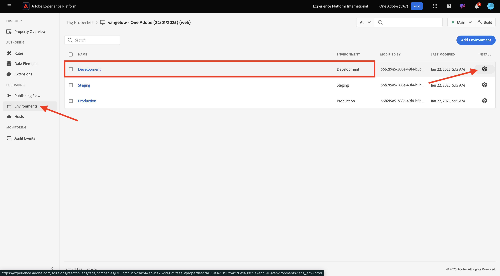
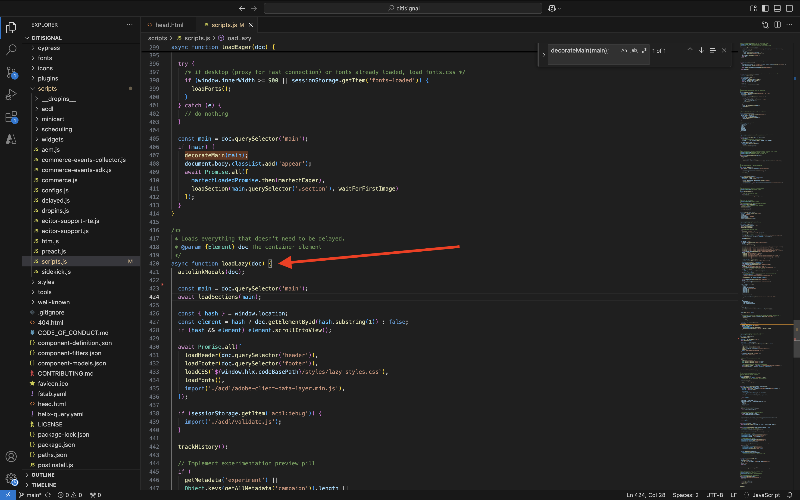
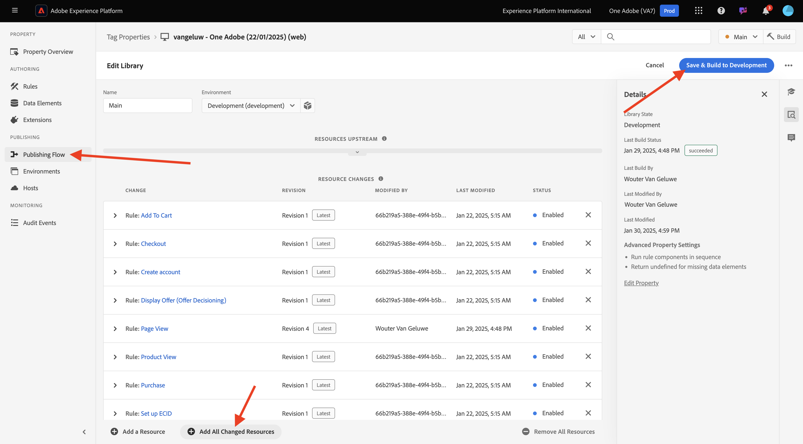
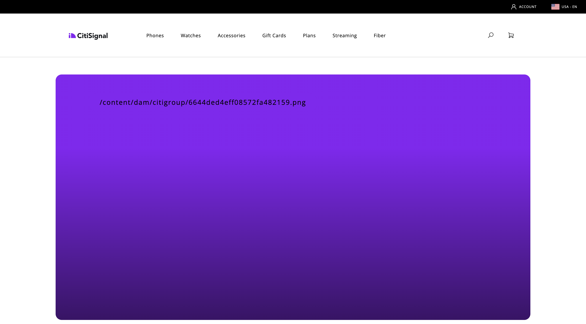
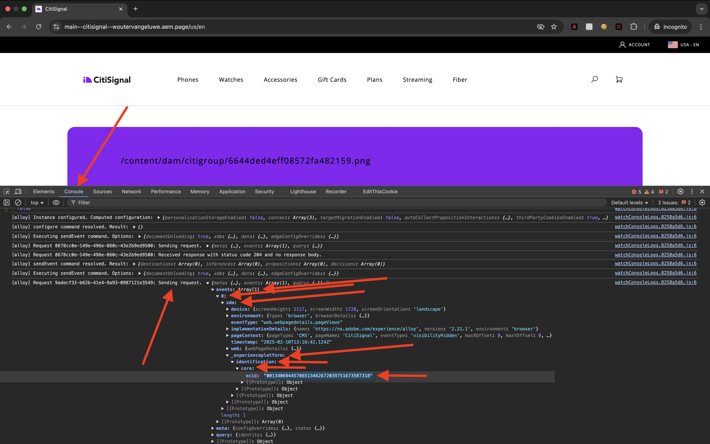

# 2.1.6 Complemento AEM Edge Delivery Services MarTech

El complemento AEM MarTech le ayuda a configurar rápidamente una pila MarTech completa para su proyecto de AEM.

>[!NOTE]
>
>Actualmente, este complemento está disponible para los clientes de en colaboración con AEM Engineering a través de proyectos de innovación conjunta. Puede encontrar más información en [https://github.com/adobe-rnd/aem-martech](https://github.com/adobe-rnd/aem-martech).

## 2.1.6.1 Añadir el complemento a su repositorio

Vaya a la carpeta que esté usando para su repositorio de **citisignal** GitHub. Haga clic con el botón derecho en el nombre de la carpeta y seleccione **Nuevo terminal en la carpeta**.

{zoomable="yes"}

Entonces verá esto... Pegue el siguiente comando y pulse **enter**.

```
git subtree add --squash --prefix plugins/martech https://github.com/adobe/aem-martech main
```

Entonces debería ver esto.

{zoomable="yes"}

Vaya a la carpeta que esté usando para el repositorio de **citisignal** GitHub y abra la carpeta **plugins**. Ahora debería ver una carpeta llamada **martech**.

{zoomable="yes"}

## 2.1.6.2.head.html

En Visual Studio Code, abra el archivo **head.html**. Copie el siguiente código y péguelo en el archivo **head.html**.

```javascript
<link rel="preload" as="script" crossorigin="anonymous" href="/plugins/martech/src/index.js"/>
<link rel="preload" as="script" crossorigin="anonymous" href="/plugins/martech/src/alloy.min.js"/>
<link rel="preconnect" href="https://edge.adobedc.net"/>
<!-- change to adobedc.demdex.net if you enable third party cookies -->
```

Guarde los cambios.

{zoomable="yes"}

## 2.1.6.3 scripts.js

En Visual Studio Code, vaya a la carpeta **scripts** y abra el archivo **scripts.js**. Copie el siguiente código y péguelo en el archivo **scripts.js**, en los scripts de importación existentes.

```javascript
import {
  initMartech,
  updateUserConsent,
  martechEager,
  martechLazy,
  martechDelayed,
} from '../plugins/martech/src/index.js';
```

Guarde los cambios.

{zoomable="yes"}

En Visual Studio Code, en el archivo **scripts.js**, busque el siguiente código:

```javascript
const AUDIENCES = {
  mobile: () => window.innerWidth < 600,
  desktop: () => window.innerWidth >= 600,
  // define your custom audiences here as needed
};
```

En **const AUDIENCES = {...};**, pegue el siguiente código:

```javascript
  const isConsentGiven = true;
  const martechLoadedPromise = initMartech(
    // The WebSDK config
    // Documentation: https://experienceleague.adobe.com/en/docs/experience-platform/web-sdk/commands/configure/overview#configure-js
    {
      datastreamId: "XXX",
      orgId: "XXX",
      defaultConsent: 'in',
      onBeforeEventSend: (payload) => {
        // set custom Target params 
        // see doc at https://experienceleague.adobe.com/en/docs/platform-learn/migrate-target-to-websdk/send-parameters#parameter-mapping-summary
        payload.data.__adobe.target ||= {};

        // set custom Analytics params
        // see doc at https://experienceleague.adobe.com/en/docs/analytics/implementation/aep-edge/data-var-mapping
        payload.data.__adobe.analytics ||= {};
      },

      // set custom datastream overrides
      // see doc at:
      // - https://experienceleague.adobe.com/en/docs/experience-platform/web-sdk/commands/datastream-overrides
      // - https://experienceleague.adobe.com/en/docs/experience-platform/datastreams/overrides
      edgeConfigOverrides: {
        // Override the datastream id
        // datastreamId: '...'

        // Override AEP event datasets
        // com_adobe_experience_platform: {
        //   datasets: {
        //     event: {
        //       datasetId: '...'
        //     }
        //   }
        // },

        // Override the Analytics report suites
        // com_adobe_analytics: {
        //   reportSuites: ['...']
        // },

        // Override the Target property token
        // com_adobe_target: {
        //   propertyToken: '...'
        // }
      },
    },
    // The library config
    {
      launchUrls: ["XXX"],
      personalization: !!getMetadata('target') && isConsentGiven,
    },
  );
```

{zoomable="yes"}

Hay un par de variables que debe reemplazar en el código anterior, por las variables de su propio entorno:

- `datastreamId: "XXX"`
- `orgId: "XXX"`
- `launchUrls: ["XXX"]`

Puede encontrar estas variables siguiendo estas instrucciones:

### datastreamId

Vaya a [https://platform.adobe.com/](https://platform.adobe.com/) y luego a **Datastreams** en el menú de la izquierda. Asegúrese de que se encuentra en la zona protegida correcta, que debería ser `--aepSandboxName--`. Busque la secuencia de datos creada en la sección Introducción de este tutorial, que debe llamarse `--aepUserLdap-- - One Adobe Datastream`. Haga clic en el icono **copiar** para copiar el **ID de secuencia de datos** y pegarlo en Visual Studio Code, en el archivo **scripts.js**, reemplazando el valor de marcador de posición `XXX` junto a `datastreamId:`.

{zoomable="yes"}

### orgId

Vaya a [https://platform.adobe.com/](https://platform.adobe.com/) y luego a **Consultas** en el menú de la izquierda. En **Credenciales**, encontrará la **ID de organización de IMS** como **Nombre de usuario**. Haga clic en el icono **copiar** para copiar la **ID de organización de IMS** y pegarla en Visual Studio Code, en el archivo **scripts.js**, reemplazando el valor de marcador de posición `XXX` junto a `orgId:`.

{zoomable="yes"}

### launchUrls

Vaya a [https://platform.adobe.com/](https://platform.adobe.com/) y luego a **Etiquetas** en el menú de la izquierda. Busque su propiedad usando su LDAP, que debería ser `--aepUserLdap--`. Abra la propiedad web.

{zoomable="yes"}

En el menú de la izquierda, ve a **Entornos** y luego haz clic en el icono **Instalar** para el entorno **Desarrollo**.

{zoomable="yes"}

Encontrará la dirección URL que necesita, pero está dentro de una etiqueta de HTML `<script></script>`. Solo debe copiar la parte que comienza a las `https` hasta `.min.js`.

{zoomable="yes"}

La dirección URL tiene el siguiente aspecto: `https://assets.adobedtm.com/b754ed1bed61/b9f7c7c484de/launch-5fcd90e5b482-development.min.js`. Asegúrese de que no se copie ningún otro texto, ya que esto provocaría errores. En Visual Studio Code, en el archivo **scripts.js**, reemplace el valor de marcador de posición `XXX` en la matriz `launchUrls:`.

Ahora tiene las tres variables que necesita. El archivo `scripts.js` debería tener un aspecto similar al siguiente:

{zoomable="yes"}

A continuación, busque este bloque de código:

```javascript
const main = doc.querySelector('main');
  if (main) {
    decorateMain(main);
    document.body.classList.add('appear');
    await loadSection(main.querySelector('.section'), waitForFirstImage);
  }
```

{zoomable="yes"}

Sustitúyalo por este bloque de código:

```javascript
const main = doc.querySelector('main');
  if (main) {
    decorateMain(main);
    document.body.classList.add('appear');
    await Promise.all([
      martechLoadedPromise.then(martechEager),
      loadSection(main.querySelector('.section'), waitForFirstImage);
    ]);
  }
```

{zoomable="yes"}

A continuación, busque y desplácese hacia abajo hasta `async function loadLazy(doc) {`.

{zoomable="yes"}

En la línea `autolinkModals(doc);`, agregue esta línea de código:

```javascript
await martechLazy();
```

{zoomable="yes"}

A continuación, busque y desplácese hacia abajo hasta la línea `function loadDelayed() {`.

{zoomable="yes"}

Agregue este bloque de código bajo la línea `// load anything that can be postponed to the latest here`.

```javascript
window.setTimeout(() => {
    martechDelayed();
    return import('./delayed.js');
  }, 3000);
```

{zoomable="yes"}

A continuación, busque y vaya a la línea que contiene `window.adobeDataLayer.push`.

{zoomable="yes"}

Verá que el objeto `pageContext` se define de esta manera. Ahora necesita agregar dos objetos bajo `pageContext`.

```javascript
	pageContext: {
      pageType,
      pageName: document.title,
      eventType: 'visibilityHidden',
      maxXOffset: 0,
      maxYOffset: 0,
      minXOffset: 0,
      minYOffset: 0,
    }
```

Este es el código que debe añadirse:

```javascript
	,
    _experienceplatform: {
      identification:{
        core:{
          ecid: sessionStorage.getItem("com.adobe.reactor.dataElements.ECID")
        }
      }
    },
    web: {
      webPageDetails:{
        name: document.title,
        URL: window.location.href
      }
    }
```

**window.adobeDataLayer.push** debería tener un aspecto similar al siguiente:

```javascript
  window.adobeDataLayer.push({
    pageContext: {
      pageType,
      pageName: document.title,
      eventType: 'visibilityHidden',
      maxXOffset: 0,
      maxYOffset: 0,
      minXOffset: 0,
      minYOffset: 0,
    },
    _experienceplatform: {
      identification:{
        core:{
          ecid: sessionStorage.getItem("com.adobe.reactor.dataElements.ECID")
        }
      }
    },
    web: {
      webPageDetails:{
        name: document.title,
        URL: window.location.href
      }
    }
  });
```

{zoomable="yes"}

Ahora ha realizado todos los cambios necesarios en el archivo **scripts.js**.

Abra el cliente de GitHub Desktop y confirme los cambios.

{zoomable="yes"}

Haga clic en **Origen push** para insertar los cambios en el repositorio de GitHub.

{zoomable="yes"}

## 2.1.6.4 Extensión ACDL en la propiedad Etiquetas

Para que el complemento AEM Edge Delivery Services MarTech funcione correctamente, debe añadir la extensión de para

Vaya a [https://experience.adobe.com/#/data-collection/](https://experience.adobe.com/#/data-collection/). Busque y, a continuación, abra la propiedad Etiquetas para la Web, que se denomina `--aepUserLdap-- - One Adobe (DD/MM/YYYY)`.

{zoomable="yes"}

Vaya a **Extensions**, para **Catalog**. Haga clic en la extensión **Capa de datos del cliente de Adobe** y luego haga clic en **Instalar**.

{zoomable="yes"}

Entonces debería ver esto. No hay necesidad de cambiar nada en este momento. Haga clic en **Guardar en biblioteca**.

{zoomable="yes"}

A continuación, la extensión se agrega a la propiedad Etiquetas.

{zoomable="yes"}

Vaya a **Flujo de publicación** y abra su biblioteca **Principal**. Haga clic en **Agregar todos los recursos modificados** y, a continuación, haga clic en **Guardar y generar en desarrollo**.

{zoomable="yes"}

Los cambios se han implementado.

## 2.1.6.5 Envío de datos a Adobe Experience Platform Edge Network

Ahora podrá ver los cambios en su sitio web yendo a `main--citisignal--XXX.aem.page/us/en` y/o `main--citisignal--XXX.aem.live/us/en`, después de reemplazar XXX por su cuenta de usuario de GitHub, que en este ejemplo es `woutervangeluwe`.

En este ejemplo, la dirección URL completa se convierte en lo siguiente:
`https://main--citisignal--woutervangeluwe.aem.page/us/en` o `https://main--citisignal--woutervangeluwe.aem.live/us/en`.

>[!NOTE]
>
>Considere la posibilidad de abrir una página web de incógnito para asegurarse de que está empezando la recopilación de datos con un perfil nuevo y limpio. Esto facilita la depuración y la resolución de problemas.

{zoomable="yes"}

En Chrome, abra **Herramientas para desarrolladores**. Para ello, vaya a **Más herramientas** > **Herramientas para desarrolladores**.

{zoomable="yes"}

En la vista **Consola**, verá varias líneas que comienzan con `[alloy]`. Eche un vistazo a las solicitudes, una de ellas debería tener un aspecto similar al siguiente y tener el cuerpo de la solicitud tal como se indica en la imagen.

`[alloy] Request 55a9ddbc-0521-4ba3-b527-3da2cb35328a: Sending request.`

Abra la carga útil, explore en profundidad el campo `events[0].xdm._experienceplatform.identification.core.ecid` y copie el ECID.

{zoomable="yes"}

## 2.1.6.6 Ver el perfil del cliente en Adobe Experience Platform

Inicie sesión en Adobe Experience Platform desde esta dirección URL: [https://experience.adobe.com/platform](https://experience.adobe.com/platform).

Después de iniciar sesión, llegará a la página principal de Adobe Experience Platform.

{zoomable="yes"}

Antes de continuar, debe seleccionar una **zona protegida**. La zona protegida que se va a seleccionar se denomina ``--aepSandboxName--``. Después de seleccionar la zona protegida adecuada, verá que la pantalla cambia y ahora está en la zona protegida dedicada.

{zoomable="yes"}

En el menú de la izquierda, ve a **Cliente** > **Perfiles** > **Examinar**. Seleccione el **área de nombres de identidad** de **ECID** y, a continuación, pase el **ECID** que copió en el paso anterior. Haga clic en **Ver**. A continuación, debería ver un perfil que se muestra en la lista. Haga clic en él para abrirlo.

{zoomable="yes"}

Verá la descripción general del **Tablero de perfil**, que muestra el ECID. A continuación, ve a **Eventos**.

{zoomable="yes"}

En **Eventos**, verá varios Eventos de experiencia, incluido un evento con eventType **web.webpagedetails.pageViews**. Haga clic en **Ver JSON** para ver todos los eventos que se recopilaron.

{zoomable="yes"}

En la vista **JSON**, verifique el evento con eventType **web.webpagedetails.pageViews** para ver cosas como **Nombre de página** y **URL de página**.

{zoomable="yes"}

Ahora ha completado este ejercicio.

Siguiente paso: [Resumen y beneficios](./summary.md){target="_blank"}

[Volver al módulo 2.1](./aemcs.md){target="_blank"}

[Volver a todos los módulos](./../../../overview.md){target="_blank"}
