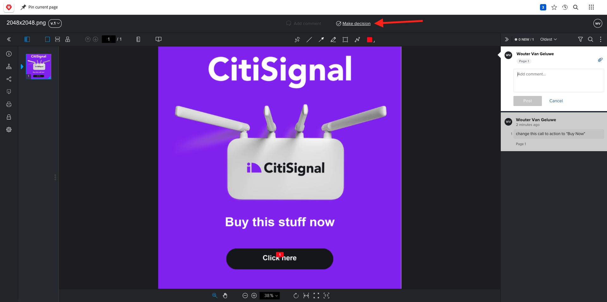
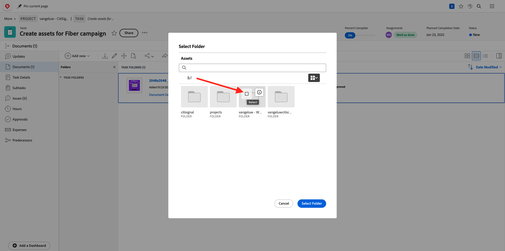
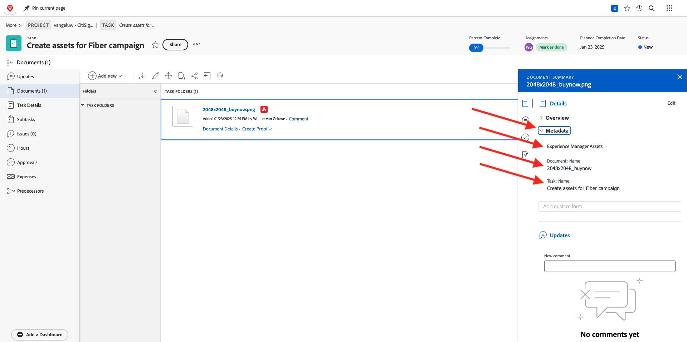

# 2.2.2 Revisión con Workfront

## 2.2.2.1 Crear un nuevo flujo de aprobación

Vaya a [https://experienceplatform.my.workfront.com/](https://experienceplatform.my.workfront.com/){target="_blank"}.

Haga clic en el icono de 9 puntos **hamburguesa** y seleccione **Revisión**.

Vaya a **Flujos de trabajo**, haga clic en **+ Nuevo** y, a continuación, seleccione **Nueva plantilla**.

Establezca **Template name** en `--aepUserLdap-- - Approval Workflow` y establezca el **Propietario de la plantilla** en usted mismo.

Desplácese hacia abajo y en **Fases** > **Fase 1**, agregue **Wouter Van Geluwe** con la **Función** de **Revisor y aprobador**.

Haga clic en **Crear**.

El flujo de trabajo básico de aprobación ya está listo para su uso.

## 2.2.2.2 Crear un nuevo proyecto

En la página de inicio de Workfront, haga clic en **Nuevo** en la ficha **Mis proyectos**. Seleccionar **proyecto en blanco**.

Entonces debería ver esto. Cambie el nombre a `--aepUserLdap-- - CitiSignal Fiber Launch`.

El proyecto se ha creado.

## 2.2.2.3 Crear una nueva tarea

Escriba este nombre para la tarea: **Crear recursos para la campaña de fibra**. Haga clic en **Crear tarea**.

Entonces debería ver esto.

## 2.2.2.4 Agregar un nuevo documento a su tarea para pasar por el flujo de aprobación

Haga clic en **+ Agregar nuevo** y luego seleccione **Documento**.

Descarga [este archivo](./images/2048x2048.png) en tu escritorio.

{width="50px" align="left"}

Seleccione el archivo **2048x2048.png** y haga clic en **Abrir**.

Entonces deberías tener esto. Haga clic en **Crear revisión** y luego elija **Revisión avanzada**.

En la ventana **nueva prueba**, seleccione la plantilla de flujo de trabajo que creó anteriormente, que debe llamarse `--aepuserLdap-- - Approval Workflow`. Haga clic en **Crear revisión**.

Luego volverás a estar en tu tarea. Haga clic en el botón **Asignar a** y seleccione **Asignármelo**.

Haga clic en **Guardar**.

Haga clic en **Trabajar en ello**.

Haga clic en **Abrir revisión**

Ahora puede revisar la revisión. Seleccione **Agregar comentario** para agregar un comentario que requiera que se cambie el documento.

Escriba su comentario y haga clic en **Publicar**. Haga clic en **Cerrar**.

A continuación, debe cambiar su función de **Revisor** a **Revisor y aprobador**. Para ello, vuelva a su tarea y haga clic en **Flujo de trabajo de revisión**.

Cambia tu rol de **Revisor** a **Revisor y aprobador**.

Vuelva a la tarea y abra la prueba de nuevo. Ahora verá un nuevo botón, **Tomar decisión**. Haga clic en ella.

Seleccione **Cambios necesarios** y haga clic en **tomar decisión**.

Entonces deberías estar de vuelta aquí. Ahora necesita cargar una segunda imagen que tenga en cuenta los comentarios proporcionados.

Descarga [este archivo](./images/2048x2048_buynow.png) en tu escritorio.

{width="50px" align="left"}

En la vista de tareas, seleccione el archivo de imagen anterior que no se aprobó. A continuación, haga clic en **+ Agregar nuevo**, seleccione **Versión** y después seleccione **Documento**.

Seleccione el archivo **2048x2048_buynow.png** y haga clic en **Abrir**.

Entonces deberías tener esto. Haga clic en **Crear revisión** y luego seleccione de nuevo **Revisión avanzada**.

Entonces verá esto... La **plantilla de flujo de trabajo** se preseleccionó ya que Workfront supone que el flujo de trabajo de aprobación anterior sigue siendo válido. Haga clic en **Crear revisión**.

Seleccione **Abrir revisión**.

Ahora puede ver dos versiones del archivo una al lado de la otra.

Haga clic en **Tomar decisión**, seleccione **Aprobado** y haga clic en **Tomar decisión** de nuevo.

Cierre la previsualización de prueba.

A continuación, volverá a la vista de tareas con un recurso aprobado. Este recurso ahora debe compartirse con los AEM Assets.

Haga clic en el icono **Compartir flecha** y seleccione la integración de AEM Assets, que debe llamarse `--aepUserLdap-- - Citi Signal AEM`.

Haga doble clic en la carpeta que creó anteriormente, que debe tener el nombre `--aepUserLdap-- - Workfront Assets`.

Haga clic en **Seleccionar carpeta**.

Después de 1-2 minutos, el documento se publicará en AEM Assets. AEM Verá un icono de junto al nombre del documento.

Haga clic en **Abrir resumen**.

Vaya a **Metadatos**, debería ver lo siguiente:

Vaya a **Información general** y haga clic en **+ Agregar** para agregar una descripción.

Escriba su descripción. La configuración de la prueba y del documento ha finalizado.

## 2.2.2.5 Ver el archivo en AEM Assets

Vaya a la carpeta en AEM Assets, que se llama `--aepUserLdap - Workfront Assets`.

Haga clic en los 3 puntos debajo de la imagen y seleccione **Detalles**.

A continuación, verá el formulario de metadatos que creó anteriormente, con los valores que se han rellenado automáticamente con la integración entre Workfront y los AEM Assets.

[Volver al módulo 2.2](./workfront.md){target="_blank"}

[Volver a todos los módulos](./../../../overview.md){target="_blank"}
