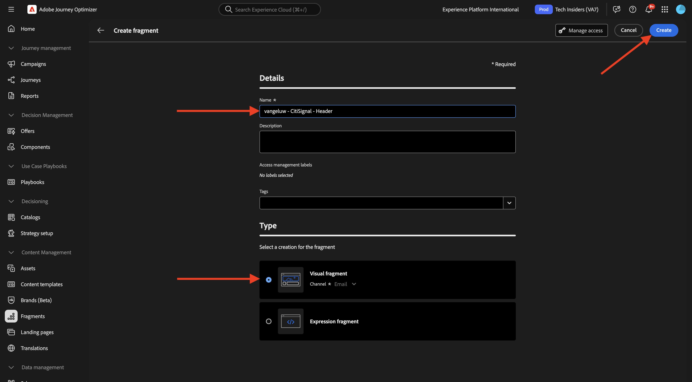
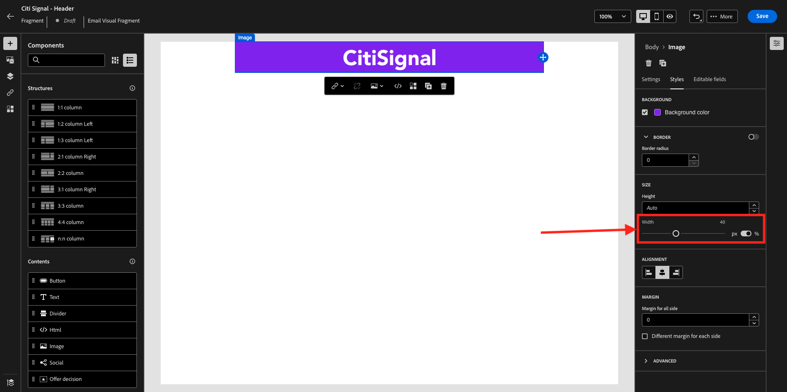
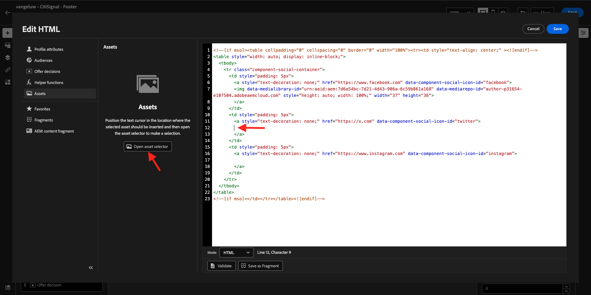
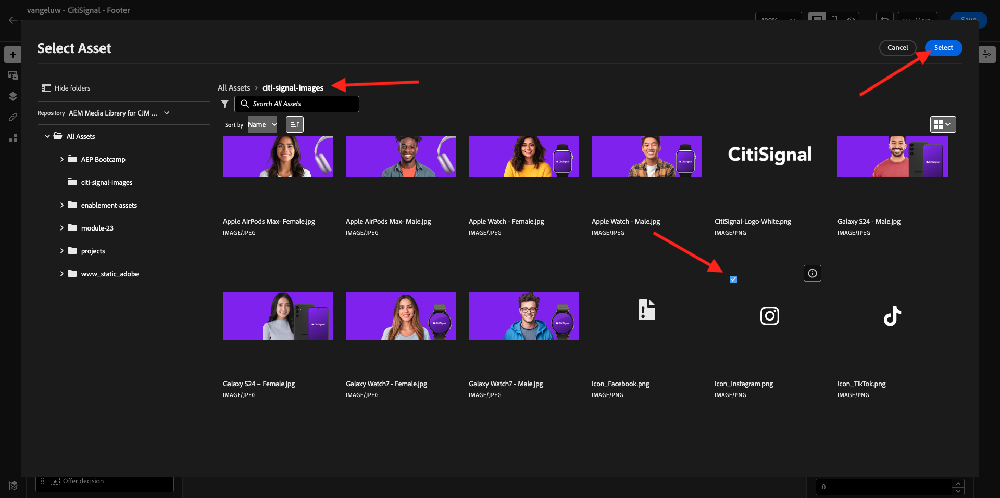
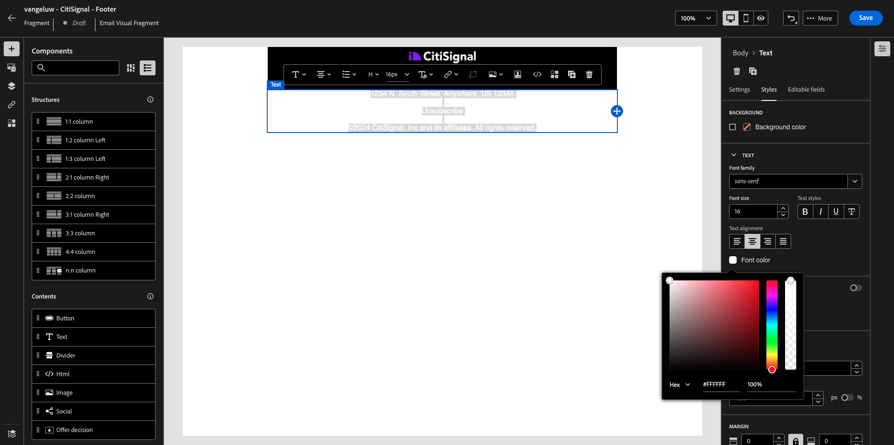

# 3.1.2 Crear fragmentos para usarlos en el mensaje

En este ejercicio, configurará dos fragmentos, uno para un encabezado reutilizable y otro para un pie de página reutilizable.

Inicie sesión en Adobe Journey Optimizer en [Adobe Experience Cloud](https://experience.adobe.com). Haga clic en **Journey Optimizer**.


Se le redirigirá a la vista **Inicio** en Journey Optimizer. Primero, asegúrese de que está usando la zona protegida correcta. La zona protegida que se va a usar se llama `--aepSandboxName--`.


## 3.1.2.1 Crear el fragmento de encabezado

En el menú de la izquierda, haga clic en **Fragmentos**. Un fragmento es un componente reutilizable dentro de Journey Optimizer, que evita la duplicación y facilita los cambios futuros que deberían afectar a todos los mensajes, como los cambios en un encabezado o pie de página de un mensaje de correo electrónico.

Haga clic en **Crear fragmento**.


Escriba el nombre `--aepUserLdap-- - CitiSignal - Header` y seleccione **Tipo: Fragmento visual**. Haga clic en **Crear**.



Entonces verá esto... En el menú de la izquierda, encontrará los componentes de estructura que puede utilizar para definir la estructura del correo electrónico (filas y columnas).

Arrastre y suelte una columna **1:1** del menú en el lienzo. Este será el marcador de posición de la imagen del logotipo.


A continuación, puede utilizar Componentes de contenido para añadir contenido dentro de estos bloques. Arrastre y suelte un componente **Image** en la primera celda de la primera fila. Haga clic en **Examinar**.


A continuación, verá una ventana emergente que muestra la biblioteca multimedia de AEM Assets. Vaya a la carpeta **citi-signal-images**, haga clic para seleccionar la imagen **CitiSignal-Logo-White.png** y haga clic en **Seleccionar**.

>[!NOTE]
>
>Si no ves las imágenes de Citi Signal en tu biblioteca de AEM Assets, puedes encontrarlas [aquí](./../../../../assets/ajo/CitiSignal-images.zip). Descárguelas en su escritorio, cree la carpeta **citi-signal-images** y cargue todas las imágenes de esa carpeta.


Entonces verá esto... La imagen es blanca y aún no se muestra. Ahora debe definir un color de fondo para que la imagen se muestre correctamente. Haga clic en **Estilos** y luego haga clic en el cuadro **Color de fondo**.


En la ventana emergente, cambie el código de color **Hex** a **#8821F4** y, a continuación, cambie el enfoque haciendo clic en el campo **100%**. Luego verá el nuevo color aplicado a la imagen.


La imagen también es un poco demasiado grande en este momento. Cambiemos la anchura deslizando el conmutador **Width** a **40%**.



El fragmento de encabezado ya está listo. Haz clic en **Guardar** y luego haz clic en la flecha para volver a la pantalla anterior.


El fragmento debe publicarse para poder utilizarse. Haga clic en **Publicar**.


Después de un par de minutos, verás que el estado de tu fragmento ha cambiado a **Activo**.
A continuación, debe crear un nuevo fragmento para el pie de página de los mensajes de correo electrónico. Haga clic en **Crear fragmento**.


## 3.1.2.2 Crear el fragmento Pie de página

Haga clic en **Crear fragmento**.


Escriba el nombre `--aepUserLdap-- - CitiSignal - Footer` y seleccione **Tipo: Fragmento visual**. Haga clic en **Crear**.


Entonces verá esto... En el menú de la izquierda, encontrará los componentes de estructura que puede utilizar para definir la estructura del correo electrónico (filas y columnas).

Arrastre y suelte una columna **1:1** del menú en el lienzo. Este será el marcador de posición para el contenido del pie de página.


A continuación, puede utilizar Componentes de contenido para añadir contenido dentro de estos bloques. Arrastre y suelte un componente **HTML** en la primera celda de la primera fila. Haga clic en el componente para seleccionarlo y, a continuación, haga clic en el icono **&lt;/>** para editar el código fuente de HTML.


Entonces verá esto...


Copie el siguiente fragmento de código de HTML y péguelo en la ventana **Editar HTML** de Journey Optimizer.

```html
<!--[if mso]><table cellpadding="0" cellspacing="0" border="0" width="100%"><tr><td style="text-align: center;" ><![endif]-->
<table style="width: auto; display: inline-block;">
  <tbody>
    <tr class="component-social-container">
      <td style="padding: 5px">
        <a style="text-decoration: none;" href="https://www.facebook.com" data-component-social-icon-id="facebook">
        
        </a>
      </td>
      <td style="padding: 5px">
        <a style="text-decoration: none;" href="https://x.com" data-component-social-icon-id="twitter">
        
        </a>
      </td>
      <td style="padding: 5px">
        <a style="text-decoration: none;" href="https://www.instagram.com" data-component-social-icon-id="instagram">
         
        </a>
      </td>
    </tr>
  </tbody>
</table>
<!--[if mso]></td></tr></table><![endif]-->
```

Entonces, tendrás esto. En las líneas 7, 12 y 17, ahora debe insertar un archivo de imagen con los recursos de la biblioteca de AEM Assets.


Asegúrese de que el cursor se encuentra en la línea 7 y luego haga clic en **Assets** en el menú de la izquierda. Haga clic en **Abrir selector de recursos** para seleccionar la imagen.


Abra la carpeta **citi-signal-images** y haga clic para seleccionar la imagen **Icon_Facebook.png**. Haga clic en **Seleccionar**.


Asegúrese de que el cursor se encuentra en la línea 12 y luego haga clic en **Abrir selector de recursos** para seleccionar la imagen.



Abra la carpeta **citi-signal-images** y haga clic para seleccionar la imagen **Icon_X.png**. Haga clic en **Seleccionar**.


Asegúrese de que el cursor se encuentra en la línea 17 y, a continuación, haga clic en **Abrir selector de recursos** para seleccionar la imagen.


Abra la carpeta **citi-signal-images** y haga clic para seleccionar la imagen **Icon_Instagram.png**. Haga clic en **Seleccionar**.



Entonces verá esto... Haga clic en **Guardar**.


Luego volverás a estar en el editor. Los iconos aún no están visibles porque el fondo y los archivos de imagen están todos en blanco. Para cambiar el color de fondo, ve a **Estilos** y haz clic en la casilla de verificación **Color de fondo**.


Cambie el código de color **Hex** a **#000000**.


Cambie la alineación para que esté centrada.


Vamos a agregar otras partes al pie de página. Arrastre y suelte un componente **Image** sobre el componente de HTML que acaba de crear. Haga clic en **Examinar**.


Haga clic para seleccionar el archivo de imagen **`CitiSignal_Footer_Logo.png`** y haga clic en **Seleccionar**.


Vaya a **Estilos** y haga clic en la casilla de verificación **Color de fondo**; cambiémosla a negro otra vez. Cambie el código de color **Hex** a **#000000**.


Cambie la anchura a **20%** y compruebe que la alineación esté centrada.


A continuación, arrastre y suelte un componente **Text** en el componente de HTML que creó. Haga clic en **Examinar**.


Copie y pegue el texto siguiente reemplazando el texto del marcador de posición.

```
1234 N. South Street, Anywhere, US 12345

Unsubscribe

©2024 CitiSignal, Inc and its affiliates. All rights reserved.
```

Establezca la **alineación del texto** en el centro.


Cambiar **color de fuente** a blanco, **#FFFFFF**.



Cambiar el **color de fondo** a negro, **#000000**.


Seleccione el texto **Cancelar la suscripción** en el pie de página y haga clic en el icono **Vínculo** de la barra de menús. Establezca **Type** en **Exclusión/baja externa** y establezca la dirección URL en **https://aepdemo.net/unsubscribe.html** (no se permite tener una dirección URL en blanco para el vínculo de cancelación de suscripción).


Entonces, tendrás esto. El pie de página ya está listo. Haz clic en **Guardar** y luego haz clic en la flecha para volver a la página anterior.


Haga clic en **Publicar** para publicar el pie de página y utilizarlo en un mensaje de correo electrónico.


Después de un par de minutos, verás que el estado del pie de página ha cambiado a **Activo**.


Ya ha terminado este ejercicio.

## Pasos siguientes

Ir a [3.1.3 Crear tu recorrido y mensaje de correo electrónico](./ex3.md){target="_blank"}

Volver a [Adobe Journey Optimizer: Orchestration](./journey-orchestration-create-account.md){target="_blank"}

Volver a [Todos los módulos](./../../../../overview.md){target="_blank"}
