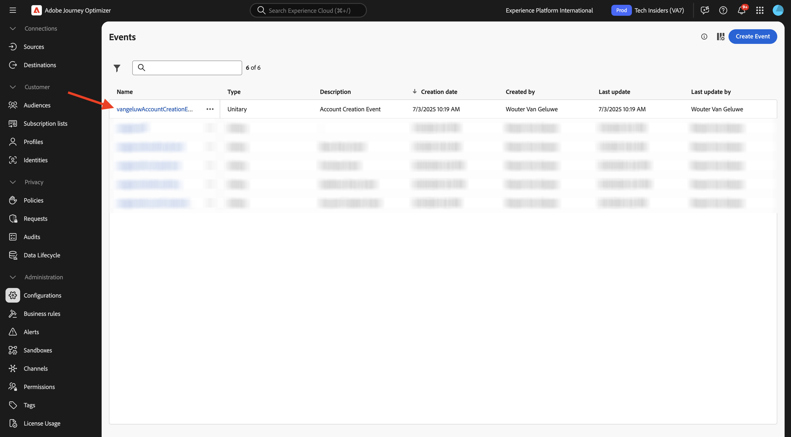
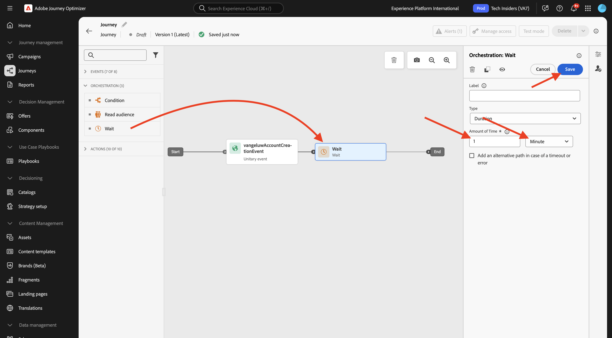
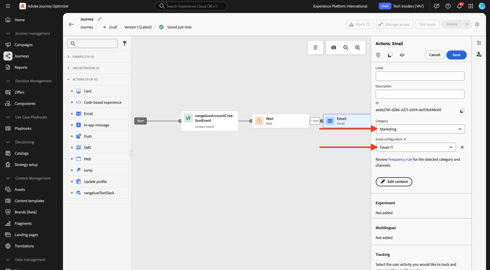
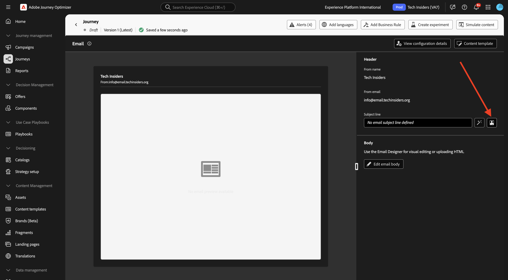
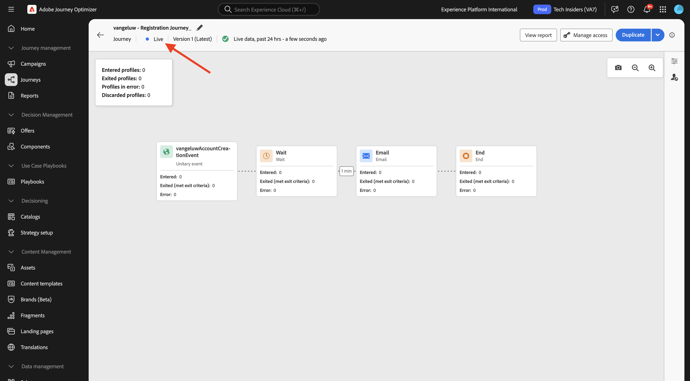

# 3.1.3 Crear el recorrido y el mensaje de correo electrónico

En este ejercicio, configurará el recorrido y el mensaje que debe activarse cuando alguien cree una cuenta en el sitio web de demostración.

Inicie sesión en Adobe Journey Optimizer en [Adobe Experience Cloud](https://experience.adobe.com). Haga clic en **Journey Optimizer**.


Se le redirigirá a la vista **Inicio** en Journey Optimizer. Primero, asegúrese de que está usando la zona protegida correcta. La zona protegida que se va a usar se llama `--aepSandboxName--`.


## 3.1.3.1 Crear su Recorrido

En el menú de la izquierda, haga clic en **Recorridos**. A continuación, haga clic en **Crear Recorrido** para crear un nuevo recorrido.


A continuación, verá una pantalla de recorrido vacía.


En el ejercicio anterior creó un nuevo **evento**. Le puso este nombre a `--aepUserLdap--AccountCreationEvent`. Este fue el resultado de la creación del Evento:



Ahora debe tomar este evento como inicio de este Recorrido. Para ello, vaya al lado izquierdo de la pantalla y busque el evento en la lista de eventos.


Seleccione el evento, arrástrelo y suéltelo en el lienzo de recorrido. El recorrido ahora tiene este aspecto:


Como segundo paso en el recorrido, debe agregar un breve paso **Wait**. Vaya al lado izquierdo de la pantalla a la sección **Orchestration** para encontrarlo. Utilizará atributos de perfil y debe asegurarse de que se rellenan en el Perfil del cliente en tiempo real.


Su recorrido ahora tiene este aspecto. En el lado derecho de la pantalla debe configurar el tiempo de espera. Configúrelo en 1 minuto. Esto le dará tiempo suficiente para que los atributos de perfil estén disponibles después de que se active el evento. Haga clic en **Guardar** para guardar los cambios.



Como tercer paso del recorrido, debes agregar una acción **Correo electrónico**. Vaya al lado izquierdo de la pantalla a **Actions**, seleccione la acción **Email** y arrástrela y suéltela en el segundo nodo del recorrido. Ahora puede ver esto.


Establece **Category** en **Marketing** y selecciona una configuración de correo electrónico que te permita enviar correo electrónico. En este caso, la configuración de correo electrónico que se debe seleccionar es **Email-TI**.



## 3.1.3.2 Crear su mensaje

Para crear tu mensaje, haz clic en **Editar contenido**.


Ahora puede ver esto.


Haga clic en el icono **Abrir diálogo de personalización**.



Escriba el texto `Hi `. A continuación, debe traer el token de personalización para el campo **Nombre** que se almacena en `profile.person.name.firstName`. En el menú de la izquierda, navegue hasta encontrar el campo **Persona > Nombre completo > Nombre** y haga clic en el icono **+**. A continuación, verá aparecer el token de personalización en el campo de texto.


A continuación, agregue el texto **, ¡gracias por registrarse!**. Haga clic en **Guardar**.


Ahora puede empezar a configurar el cuerpo del correo electrónico. Haga clic en **Editar cuerpo del correo electrónico**.


Antes de empezar a crear el contenido del mensaje en sí, es aconsejable pensar en el contenido del mensaje. Parte del contenido del mensaje es exclusivo del mensaje, pero otras partes son componentes estándar que probablemente sean los mismos para cada correo electrónico que envíe a los clientes.

En el ejercicio anterior, ya creó estos componentes estándar como fragmentos en Journey Optimizer, a los que ahora puede hacer referencia en este mensaje y en todos los demás mensajes futuros que va a crear.

En la siguiente pantalla, se le solicitarán tres métodos diferentes para proporcionar el contenido del correo electrónico:

- **Diseñe desde cero**: Comience con un lienzo en blanco y utilice el editor de WYSIWYG para arrastrar y soltar los componentes de estructura y contenido y así crear visualmente el contenido del correo electrónico.
- **Codifique usted mismo**: cree su propia plantilla de correo electrónico codificándola con HTML
- **Importar HTML**: importe una plantilla de HTML existente que podrá editar.

Haga clic en **Diseñar desde cero**.


En el menú de la izquierda, encontrará los componentes de estructura que puede utilizar para definir la estructura del correo electrónico (filas y columnas).


También encontrará **Fragmentos** en el menú de la izquierda, donde verá los fragmentos que creó anteriormente.


Para poder agregar el encabezado y el pie de página al lienzo, debe agregar dos estructuras al correo electrónico. Haga clic en el icono **+** del menú de la izquierda y arrastre 2 componentes de la columna **1:1** al lienzo.


En el menú de la izquierda, vuelva a **Fragmentos**. Arrastre y suelte el fragmento de encabezado en el primer componente y el fragmento de pie de página en el segundo componente. Entonces verá esto...


Haga clic en el icono **+** en el menú de la izquierda y arrastre y suelte 2 componentes más de la columna **1:1** en el lienzo, entre el encabezado y el pie de página.


Arrastre y suelte un componente **Image** en el primer componente **1:1 column**. Haga clic en **Examinar**.


En la carpeta **citi-signal-images**. Seleccione la imagen **`welcome_email_image.png`** y haga clic en **Seleccionar**.


A continuación, tendrá esto:


A continuación, vaya a **Contenido** y arrastre y suelte un componente **Texto** en el componente de estructura en la cuarta fila.


Seleccione el texto predeterminado **Escriba el texto aquí.** como lo haría con cualquier editor de texto. Escribe **Bienvenido a la familia,** en su lugar. En la barra de herramientas, haga clic en el icono **Agregar personalización**.


A continuación, debe traer el token de personalización **First name** que se almacena en `profile.person.name.firstName`. En el menú, busque el elemento **Person**, explore en profundidad el elemento **Nombre completo** y, a continuación, haga clic en el icono **+** para agregar el campo Nombre al editor de expresiones.

Haga clic en **Guardar**.


Ahora notará cómo se ha agregado el campo de personalización al texto.


En el mismo campo de texto, presione **Enter** dos veces para agregar dos líneas y copie y pegue el siguiente texto:

```
Welcome aboard! We're thrilled to have you join the CitiSignal family. 
As a valued member of our community, you're now poised to experience top-notch telecommunications services that cater to your every need.

At CitiSignal, we understand that staying connected is more than just a convenience - it's a necessity. Whether you're browsing the web, streaming your favourite content, or keeping in touch with loved ones, we're here to ensure you have the best tools and resources at your fingertips.
```


Establezca la **alineación del texto** en el centro y asegúrese de ajustar el aspecto del mensaje para que se ajuste a sus propias necesidades. Cuando hayas terminado, haz clic en **Guardar**.


La última comprobación que debes realizar para asegurarte de que el correo electrónico esté listo es previsualizarlo, haz clic en el botón **Simular contenido**.


Para poder simular el mensaje de correo electrónico, debe añadir un perfil de prueba. Haga clic en **Administrar perfiles de prueba**.


Seleccione el área de nombres **email** haciendo clic en el icono situado junto al campo **Introducir área de nombres de identidad**.

En la lista de áreas de nombres de identidad, seleccione el área de nombres **Email**. En el campo **Valor de identidad**, escriba la dirección de correo electrónico de un perfil anterior que utilizó en un ejercicio anterior y que ya está almacenado en Adobe Experience Platform. Haga clic en **Agregar perfil**. Volver a la pantalla anterior.


A continuación, verá su mensaje de correo electrónico, ahora simulado para este perfil de cliente. Ahora puede validar la personalización en la línea de asunto y en el cuerpo y enviar un correo electrónico de prueba si lo desea.

Haga clic en **Cerrar** para cerrar la vista previa.


Haga clic en **Guardar** para guardar el mensaje y vuelva al panel de mensajes haciendo clic en la **flecha** junto al texto de la línea de asunto, en la esquina superior izquierda.


Haga clic en la **flecha** para regresar a su recorrido.


## 3.1.3.3 Publicar su recorrido

Haga clic en **Guardar**.


Aún necesitas darle un nombre a tu recorrido. Para ello, haga clic en el icono **Propiedades** en la parte superior derecha de la pantalla.


A continuación, puede introducir el nombre del recorrido aquí. Use `--aepUserLdap-- - Registration Journey`. Haga clic en **Guardar**.


Ahora puede publicar su recorrido haciendo clic en **Publicar**.


Vuelva a hacer clic en **Publicar**.


Después de un par de minutos, el estado de tu recorrido cambiará a **Activo** y verás un panel en tiempo real del rendimiento de tu recorrido.



Ya ha terminado este ejercicio.

## Pasos siguientes

Vaya a [3.1.4 Actualizar la propiedad de recopilación de datos y probar el recorrido](./ex4.md){target="_blank"}

Volver a [Adobe Journey Optimizer: Orchestration](./journey-orchestration-create-account.md){target="_blank"}

Volver a [Todos los módulos](./../../../../overview.md){target="_blank"}
