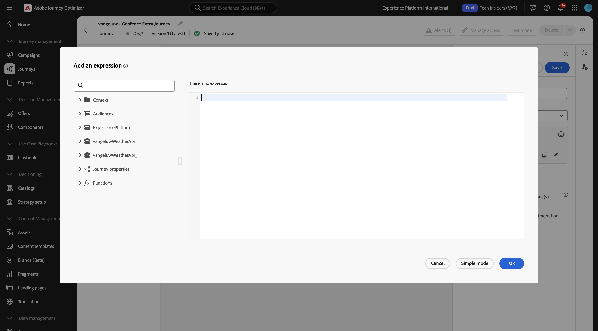
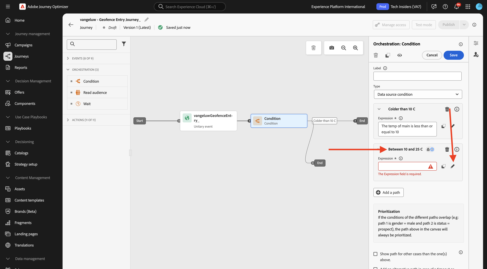

# 3.2.4 Crear el recorrido y los mensajes

En este ejercicio, creará un recorrido y varios mensajes de texto utilizando Adobe Journey Optimizer.

Para este caso de uso, el objetivo es enviar diferentes mensajes en función de las condiciones meteorológicas de la ubicación de su cliente. Se han definido 3 escenarios:

- Más frío que 10° Celsius
- Entre 10° y 25° Celsius
- Más caliente que 25° Celsius

Para estas 3 condiciones, deberá definir 3 mensajes en Adobe Journey Optimizer.

## 3.2.4.1 Creación de un recorrido

Inicie sesión en Adobe Journey Optimizer en [Adobe Experience Cloud](https://experience.adobe.com). Haga clic en **Journey Optimizer**.


Se le redirigirá a la vista **Inicio** en Journey Optimizer. Primero, asegúrese de que está usando la zona protegida correcta. La zona protegida que se va a usar se llama `--aepSandboxName--`. Estará en la vista **Inicio** de su zona protegida `--aepSandboxName--`.


En el menú de la izquierda, ve a **Recorridos** y haz clic en **Crear Recorrido** para comenzar a crear tu Recorrido.


Deberías ponerle nombre a tu recorrido.

Como nombre del recorrido, use `--aepUserLdap-- - Geofence Entry Journey`. No se deben configurar otros valores en este momento. Haga clic en **Guardar**.


En la parte izquierda de la pantalla, echa un vistazo a **Eventos**. Debería ver el evento creado anteriormente en esa lista. Selecciónelo y, a continuación, arrástrelo y suéltelo en el lienzo de recorrido. Tu recorrido se ve así. Haga clic en **Guardar**.


A continuación, haga clic en **Orquestación**. Ahora verá las funcionalidades de **Orchestration** disponibles. Seleccione **Condición** y arrástrela y suéltela en el lienzo de Recorrido.


Ahora debe configurar tres rutas para esta condición:

- Hace más frío que 10° Celsius
- Está entre 10° y 25° Celsius
- Hace más calor que 25° Celsius

Vamos a definir la primera condición.

### Condición 1: más frío que 10° Celsius

Haga clic en **Condición**.  Haga clic en **Ruta1** y edite el nombre de la ruta a **Más antigua que 10°C**. Haga clic en el icono **Editar** para ver la expresión de Path1.


Verá una pantalla de **Editor simple** vacía. La consulta será un poco más avanzada, por lo que necesitará el **Modo avanzado**. Haga clic en **Modo avanzado**.


Verá el **Editor avanzado** que permite la entrada de código.



Seleccione el siguiente código y péguelo en el **Editor avanzado**.

`#{--aepUserLdap--WeatherApi.--aepUserLdap--WeatherByCity.main.temp} <= 10`

Entonces verá esto...


Para recuperar la temperatura como parte de esta condición, debe proporcionar la ciudad en la que se encuentra el cliente actualmente.
La **ciudad** debe estar vinculada al parámetro dinámico `q`, tal como lo vio anteriormente en la Documentación de la API de tiempo abierto.

Haga clic en el campo **valor dinámico: q** como se indica en la captura de pantalla.


Luego necesita encontrar el campo que contiene la ciudad actual del cliente en una de las fuentes de datos disponibles, en este caso, debe encontrarlo en **Contexto**.


Para encontrar el campo, vaya a `--aepUserLdap--GeofenceEntry.placeContext.geo.city`.

Al hacer clic en ese campo o en **+**, se agregará como el valor dinámico del parámetro `q`. Este campo lo rellenará, por ejemplo, el servicio de geolocalización que haya implementado en su aplicación móvil. En este caso, simulará esto utilizando la propiedad de recopilación de datos del sitio web de demostración. Haga clic en **Aceptar**.


### Condición 2: entre 10° y 25° Celsius

Después de haber agregado la primera condición, verá esta pantalla. Haga clic en **Agregar una ruta**.


Haga doble clic en **Ruta1** y edite el nombre de ruta de acceso a **Entre 10 y 25 °C**. Haga clic en el icono **Editar** para la expresión de esta ruta.



Verá una pantalla de **Editor simple** vacía. La consulta será un poco más avanzada, por lo que necesitará el **Modo avanzado**. Haga clic en **Modo avanzado**.


Verá el **Editor avanzado** que permite la entrada de código.


Seleccione el siguiente código y péguelo en el **Editor avanzado**.

`#{--aepUserLdap--WeatherApi.--aepUserLdap--WeatherByCity.main.temp} > 10 and #{--aepUserLdap--WeatherApi.--aepUserLdap--WeatherByCity.main.temp} <= 25`

Entonces verá esto...


Para recuperar la temperatura como parte de esta condición, debe proporcionar la ciudad en la que se encuentra el cliente actualmente.
La **ciudad** debe estar vinculada al parámetro dinámico **q**, tal como lo vio anteriormente en la Documentación de la API de clima abierto.

Haga clic en el campo **valor dinámico: q** como se indica en la captura de pantalla.


A continuación, debe buscar el campo que contiene la ciudad actual del cliente en una de las fuentes de datos disponibles.


Para encontrar el campo, vaya a `--aepUserLdap--GeofenceEntry.placeContext.geo.city`. Al hacer clic en ese campo, se agregará como el valor dinámico para el parámetro **q**. Este campo lo rellenará, por ejemplo, el servicio de geolocalización que haya implementado en su aplicación móvil. En este caso, simulará esto utilizando la propiedad de recopilación de datos del sitio web de demostración. Haga clic en **Aceptar**.


A continuación, agregará la tercera condición.

### Condición 3: Más cálido que 25° Celsius

Después de haber agregado la segunda condición, verá esta pantalla. Haga clic en **Agregar una ruta**.


Haga doble clic en Ruta1 para cambiar el nombre a **Más cálido que 25 C**.
A continuación, haga clic en el icono **Edit** para la expresión de esta ruta.


Verá una pantalla de **Editor simple** vacía. La consulta será un poco más avanzada, por lo que necesitará el **Modo avanzado**. Haga clic en **Modo avanzado**.


Verá el **Editor avanzado** que permite la entrada de código.


Seleccione el siguiente código y péguelo en el **Editor avanzado**.

`#{--aepUserLdap--WeatherApi.--aepUserLdap--WeatherByCity.main.temp} > 25`

Entonces verá esto...


Para recuperar la temperatura como parte de esta condición, debe proporcionar la ciudad en la que se encuentra el cliente actualmente.
La **ciudad** debe estar vinculada al parámetro dinámico **q**, tal como lo vio anteriormente en la Documentación de la API de clima abierto.

Haga clic en el campo **valor dinámico: q** como se indica en la captura de pantalla.


A continuación, debe buscar el campo que contiene la ciudad actual del cliente en una de las fuentes de datos disponibles.


Para encontrar el campo, vaya a ```--aepUserLdap--GeofenceEntry.placeContext.geo.city```. Al hacer clic en ese campo, se agregará como el valor dinámico para el parámetro **q**. Este campo lo rellenará, por ejemplo, el servicio de geolocalización que haya implementado en su aplicación móvil. En este caso, simulará esto utilizando la propiedad de recopilación de datos del sitio web de demostración. Haga clic en **Aceptar**.


Ahora tiene tres rutas configuradas. Haga clic en **Guardar**.


Como este es un recorrido para fines de aprendizaje, ahora configurará un par de acciones para mostrar la variedad de opciones que tienen los especialistas en marketing para enviar mensajes.

## 3.2.4.2 Envío de mensajes para ruta: inferior a 10° Celsius

Para cada uno de los contextos de temperatura, intentará enviar un mensaje de texto a un cliente. Para este ejercicio, debe enviar un mensaje real a un canal de Slack en lugar de a un número de teléfono móvil.

Centrémonos en la ruta de acceso **anterior a 10 °C**.


En el menú de la izquierda, vuelva a **Actions**, seleccione la acción `--aepUserLdap--TextSlack` y arrástrela y suéltela después de la acción **Message**.


Vaya a **Parámetros de acción** y haga clic en el icono **Editar** del parámetro `textToSlack`.


En la ventana emergente, haga clic en **Modo avanzado**.


Seleccione el siguiente código, cópielo y péguelo en el **Editor de modo avanzado**. Haga clic en **Ok**.

`"Brrrr..." + #{ExperiencePlatform.ProfileFieldGroup.profile.person.name.firstName} + ",  it's cold and freezing outside. Get comfortable at home with a 20% discount on a Disney+ subscription!"`


Verá la acción completada. Haga clic en **Guardar**.


Esta ruta del recorrido ya está lista.

## 3.2.4.3 Enviar mensajes para ruta: entre 10° y 25° Celsius

Para cada uno de los contextos de temperatura, intentará enviar un mensaje a su cliente. Para este ejercicio, debe enviar un mensaje real a un canal de Slack en lugar de a un número de teléfono móvil.

Centrémonos en la ruta **entre 10 y 25 °C**.


En el menú de la izquierda, vuelva a **Actions**, seleccione la acción `--aepUserLdap--TextSlack` y arrástrela y suéltela después de la acción **Message**.


Vaya a **Parámetros de acción** y haga clic en el icono **Editar** del parámetro `textToSlack`.


En la ventana emergente, haga clic en **Modo avanzado**.


Seleccione el siguiente código, cópielo y péguelo en el **Editor de modo avanzado**. Haga clic en **Ok**.

`"What nice weather for the time of year, " + #{ExperiencePlatform.ProfileFieldGroup.profile.person.name.firstName} + " 20% discount on Apple AirPods so you can go for a walk and listen to your favorite podcast!"`


Verá la acción completada. Haga clic en **Ok**.


Esta ruta del recorrido ya está lista.

## 3.2.4.4 Enviar mensajes para ruta: Más cálido que 25° Celsius

Para cada uno de los contextos de temperatura, intentará enviar un mensaje a su cliente. Para este ejercicio, debe enviar un mensaje real a un canal de Slack en lugar de a un número de teléfono móvil.

Centrémonos en una ruta de acceso de **más cálida que los 25 °C**.


En el menú de la izquierda, vuelva a **Actions**, seleccione la acción `--aepUserLdap--TextSlack` y arrástrela y suéltela después de la acción **Messages**.


Vaya a **Parámetros de acción** y haga clic en el icono **Editar** del parámetro `textToSlack`.


En la ventana emergente, haga clic en **Modo avanzado**.


Seleccione el siguiente código, cópielo y péguelo en el **Editor de modo avanzado**. Haga clic en **Ok**.

`"So warm, " + #{ExperiencePlatform.ProfileFieldGroup.profile.person.name.firstName} + "! 20% discount on adding 10GB of extra data so you can get online at the beach!"`


Verá la acción completada. Haga clic en **Guardar**.


Esta ruta del recorrido ya está lista.

## 3.2.4.5 Publicación del recorrido

El recorrido está ahora completamente configurado. Haga clic en **Publicar**.


Vuelva a hacer clic en **Publicar**.


El recorrido se ha publicado.


## Pasos siguientes

Ir a [3.2.5 Déclencheur tu recorrido](./ex5.md){target="_blank"}

Volver a [Adobe Journey Optimizer: fuentes de datos externas y acciones personalizadas](journey-orchestration-external-weather-api-sms.md){target="_blank"}

Volver a [Todos los módulos](./../../../../overview.md){target="_blank"}
