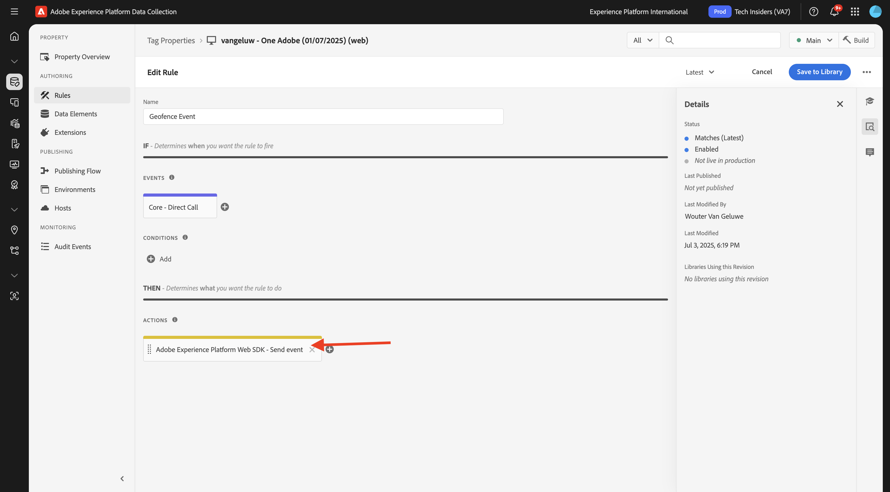
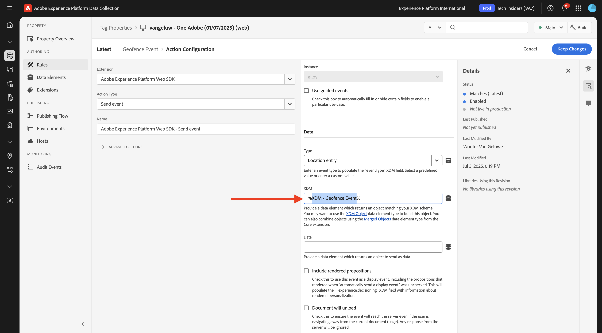
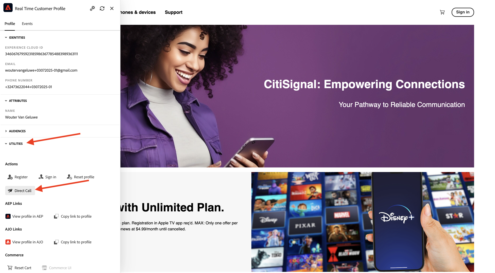

# 3.2.5 Déclencheur de su recorrido

En este ejercicio, probará y almacenará en déclencheur el recorrido que configuró en este módulo.

## 3.2.5.1 Actualice la configuración del evento de geovalla

Vaya a [Recopilación de datos de Adobe Experience Platform](https://experience.adobe.com/launch/) y seleccione **Etiquetas**.

Esta es la página de Propiedades de recopilación de datos de Adobe Experience Platform que vio antes.

En **Introducción**, Sistema de demostración creó propiedades de etiquetas para usted: una para el sitio web y otra para la aplicación móvil. Encuéntralos buscando `--aepUserLdap--` en el cuadro **[!UICONTROL Buscar]**. Haga clic para abrir la propiedad **Web**.

Entonces verá esto...

En el menú de la izquierda, ve a **Reglas** y busca la regla **Evento de geoperímetro**. Haga clic en la regla **Evento de geoperímetro** para abrirla.

A continuación, verá los detalles de esta regla. Haga clic para abrir la acción **Adobe Experience Platform Web SDK - Enviar evento**.

Verá que, cuando se active esta acción, se utilizará un elemento de datos específico para definir la estructura de datos XDM. Debe actualizar ese elemento de datos y definir el **ID de evento** del evento que configuró en el [Ejercicio 3.2.1](./ex1.md).

Ahora necesita actualizar el elemento de datos **XDM - Evento de geoperímetro**. Para ello, vaya a **Elementos de datos**. Busque **XDM - Evento de geoperímetro** y haga clic para abrir ese elemento de datos.

A continuación, verá esto:

Vaya al campo `_experience.campaign.orchestration.eventID`. Elimine el valor actual y pegue su eventID allí.

Como recordatorio, el ID de evento se puede encontrar en Adobe Journey Optimizer en **Configuraciones > Eventos** y encontrará el ID de evento en la carga útil de ejemplo del evento, que tiene este aspecto: `"eventID": "209a2eecb641e20a517909e186a559ced155384a26429a557eb259e5a470bca7"`.

A continuación, debe definir la ciudad en este elemento de datos. Vaya a **placeContext > ubicación geográfica > ciudad** y escriba la ciudad que desee. A continuación, haga clic en **Guardar** o **Guardar en biblioteca**.

Finalmente, debe publicar los cambios. Vaya a **Flujo de publicación** en el menú de la izquierda y haga clic en **Hombre** para abrir la biblioteca.

Haga clic en **Agregar todos los recursos modificados** y, a continuación, haga clic en **Guardar y generar en desarrollo**.

## 3.2.5.2 Déclencheur su recorrido

Vaya a [https://dsn.adobe.com](https://dsn.adobe.com). Después de iniciar sesión con su Adobe ID, verá esto. Haga clic en los 3 puntos **...** del proyecto del sitio web y, a continuación, haga clic en **Ejecutar** para abrirlo.

A continuación, verá cómo se abre el sitio web de demostración. Seleccione la URL y cópiela en el portapapeles.

Abra una nueva ventana del explorador de incógnito.

Pegue la dirección URL del sitio web de demostración, que copió en el paso anterior. Luego se le pedirá que inicie sesión con su Adobe ID.

Seleccione el tipo de cuenta y complete el proceso de inicio de sesión.

Luego verá el sitio web cargado en una ventana de incógnito del explorador. Para cada ejercicio, deberá utilizar una ventana nueva del explorador de incógnito para cargar la URL del sitio web de demostración.

Haga clic en el icono del logotipo de Adobe, en la esquina superior izquierda de la pantalla, para abrir el Visor de perfiles.

Abra el panel Visualizador de perfiles y vaya a Perfil del cliente en tiempo real. En el panel Visor de perfiles, debería ver todos los datos personales que se muestran, como los identificadores de correo electrónico y teléfono que acaba de agregar.

En el panel Visor de perfiles, haga clic en **UTILIDADES** y, a continuación, seleccione **Llamada directa**.

>[!NOTE]
>
>Si no tienes la opción en el panel Visor de perfiles para enviar un evento de llamada directa, puedes enviar uno manualmente abriendo la vista de desarrollador del navegador y yendo a la **consola**, y luego pegar y enviar este comando: `_satellite.track('geofenceevent')`.

Escriba `geofenceevent` y haga clic en **Enviar**.

Unos segundos más tarde, verá el mensaje de Adobe Journey Optimizer en el canal de Slack.

## Pasos siguientes

Ir a [Resumen y beneficios](./summary.md){target="_blank"}

Volver a [Adobe Journey Optimizer: fuentes de datos externas y acciones personalizadas](journey-orchestration-external-weather-api-sms.md){target="_blank"}

Volver a [Todos los módulos](./../../../../overview.md){target="_blank"}
