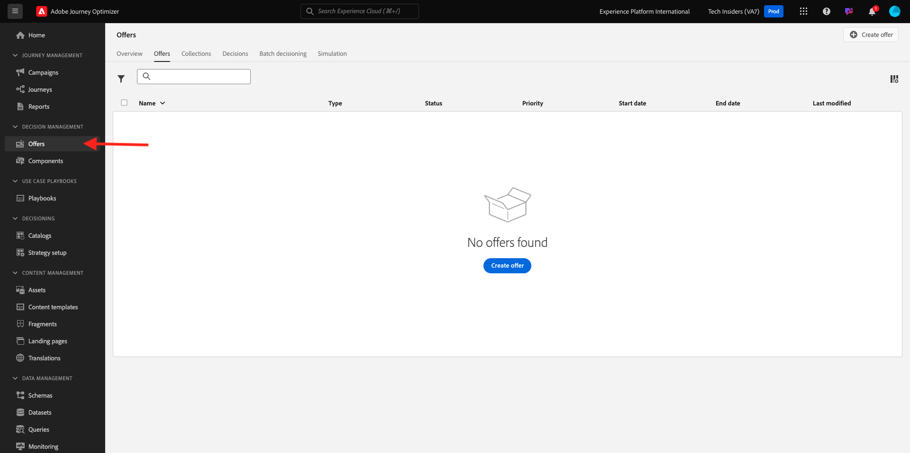
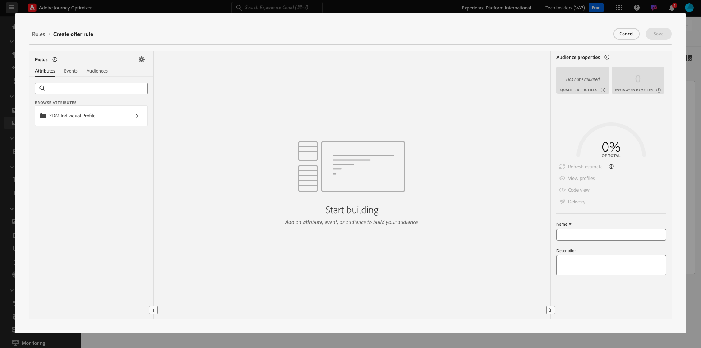
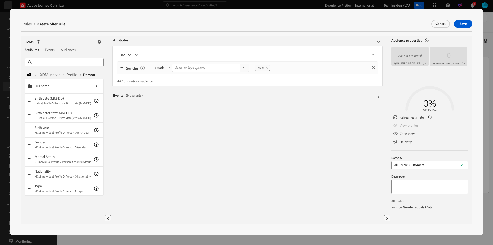

# 3.3.1 Offer Decisioning 101

## 3.3.1.1 Terminología

Para comprender mejor Offer Decisioning, le recomendamos encarecidamente que lea la [descripción general](https://experienceleague.adobe.com/docs/journey-optimizer/using/offer-decisioniong/get-started-decision/starting-offer-decisioning.html?lang=en) sobre cómo funciona el servicio de aplicaciones de Offer Decisioning con Adobe Experience Platform.

Al trabajar con Offer Decisioning, debe comprender los siguientes conceptos:

| Término | Explicación |
| ------------------------- | -------------------------------------------------------------------------------------------------------------------------------------------------------------------------------------------------------------------------------------------------------- |
| **Oferta** | Una oferta es un mensaje de marketing que puede tener reglas asociadas que especifican quién puede ver la oferta. Una oferta tiene un estado: borrador, aprobado o archivado. |
| **Ubicación** | La combinación de ubicación (o tipo de canal) y contexto (o tipo de contenido) en el que aparece una oferta para un usuario final. En la práctica, es la combinación de texto, HTML, imagen, JSON en canales móviles, web, sociales, de mensajería instantánea y no digitales. |
| **Regla** | La lógica que define y controla la idoneidad de los usuarios finales para una oferta. |
| **Oferta personalizada** | Un mensaje de marketing personalizable basado en reglas de elegibilidad y restricciones. |
| **Oferta de reserva** | La oferta predeterminada se muestra cuando un usuario final no cumple los requisitos para ninguna de las ofertas de la colección utilizada. |
| **Límite** | Se utiliza en una definición de oferta para definir cuántas veces se puede presentar una oferta en total y a un usuario específico. |
| **Prioridad** | Level para determinar la clasificación de prioridad a partir de un conjunto de resultados de ofertas. |
| **Colección** | Se utiliza para filtrar un subconjunto de ofertas de la lista de ofertas personalizadas para acelerar el proceso de toma de decisiones de oferta. |
| **Decisión** | Una combinación de un conjunto de ofertas, ubicación y perfil para la que el experto en marketing desea que el motor de decisión proporcione la mejor oferta. |
| **AEM Assets Essentials** | Una experiencia universal y centralizada para almacenar, buscar y seleccionar recursos en las soluciones de Adobe Experience Cloud y Adobe Experience Platform. |

{style="table-layout:auto"}

## 3.3.1.2 Offer Decisioning

Inicie sesión en Adobe Journey Optimizer en [Adobe Experience Cloud](https://experience.adobe.com). Haga clic en **Journey Optimizer**.

Se le redirigirá a la vista **Inicio** en Journey Optimizer. Primero, asegúrese de que está usando la zona protegida correcta. La zona protegida que se va a usar se llama `--aepSandboxName--`. Estará en la vista **Inicio** de su zona protegida `--aepSandboxName--`.

En el menú de la izquierda, haga clic en **Ofertas**. Ahora verá el menú Ofertas, que contiene elementos como Ofertas, Colecciones y Decisiones.

Haga clic en **Componentes**. Ahora verá cosas como Ubicaciones, Calificador de colección, Reglas y Clasificaciones.

## 3.3.1.3 Ubicaciones

Ir a **Ubicaciones**.

En la pestaña **Ubicaciones** puede definir las ubicaciones de sus ofertas. Al definir una decisión, la ubicación define dónde aparecerá la oferta resultante (Tipo de canal) y en qué forma (Tipo de contenido).

Si no ve ninguna ubicación en su entorno, créela como se indica a continuación y en la captura de pantalla.

| Nombre | Tipo de canal | Tipo de contenido |
| ---------------------- | ------------ | ------------ |
| **No digital - Texto** | No digital | Texto |
| **Web - JSON** | Web | JSON |
| **Web - HTML** | Web | HTML |
| **Web - Texto** | Web | Texto |
| **Web - Imagen** | Web | Imagen |
| **Correo electrónico: JSON** | Correo electrónico | JSON |
| **Correo electrónico: HTML** | Correo electrónico | HTML |
| **Correo electrónico - Texto** | Correo electrónico | Texto |
| **Correo electrónico: imagen** | Correo electrónico | Imagen |

{style="table-layout:auto"}

**Nota**: no cambie nada a las ubicaciones que ya están disponibles.

Haga clic en cualquier ubicación para visualizar su configuración.

Ahora verá todos los campos de la Ubicación:

- **Nombre** de la ubicación
- **ID. de ubicación**
- **Tipo de canal** para la ubicación
- **Tipo de contenido** de la ubicación, que puede ser **Texto**, **HTML**, **Imagen** o **JSON**
- **Descripción** campo que permite agregar una descripción adicional para la ubicación

## 3.3.1.4 Normas de decisión

Una regla (también llamada regla de elegibilidad) es el equivalente de una **audiencia**. Una regla es, de hecho, una audiencia con la única diferencia de que se puede utilizar una regla con una oferta para proporcionar la mejor oferta a un perfil en Adobe Experience Platform.

Como ya sabe cómo definir audiencias en función de los módulos de habilitación anteriores, volvamos rápidamente al entorno de segmentación:

Ir a **Reglas**. Haga clic en **+ Crear regla**.

A continuación, verá la interfaz de creación de audiencias de Adobe Experience Platform.

Ahora puede acceder a todos los campos que forman parte del esquema de unión para el perfil del cliente en tiempo real y puede crear cualquier regla.

También es bueno saber que simplemente puede reutilizar audiencias ya definidas en Adobe Experience Platform, yendo a **Audiencias** > ``--aepTenantId--``.

A continuación, verá esto:

Si lo desea, ahora puede configurar sus propias reglas. Para este ejercicio, necesitará dos reglas:

- todos: clientes hombres
- todos: mujeres clientes

Si estas reglas aún no existen, por favor, créelas. Si ya existen, utilice esas reglas y no cree nuevas reglas.

El atributo que se usa para generar la regla es **XDM Individual Profile** > **Person** > **Gender**.

Por ejemplo, esta es la definición de regla para la regla **all - Clientes masculinos**:

Por ejemplo, esta es la definición de regla para la regla **all - Female Customers**:

## 3.3.1.5 Ofertas

Vaya a **Ofertas** y seleccione **Ofertas**. Haga clic en **+ Crear oferta**.

Entonces verá esta ventana emergente.

No cree ninguna oferta ahora: lo hará en el siguiente ejercicio.

Ahora puede ver que hay dos tipos de ofertas:

- Ofertas personalizadas
- Ofertas de reserva

Una oferta personalizada es contenido específico que debe mostrarse en una situación específica. Una oferta personalizada está diseñada específicamente para ofrecer una experiencia personal y contextual si se cumplen unos criterios específicos.

Una oferta de reserva es una oferta que se muestra si no se cumplen los criterios de Ofertas personalizadas.

## 3.3.1.6 Decisiones

Una decisión combina ubicaciones, una colección de ofertas personalizadas y una oferta de reserva que el motor de Offer Decisioning utilizará en última instancia para encontrar la mejor oferta para un perfil específico, en función de cada una de las características de oferta personalizadas individuales como prioridad, restricción de elegibilidad y límite total/de usuario.

Para configurar su **Decisión**, haga clic en **Decisiones**.

En el siguiente ejercicio, configurará sus propias ofertas y decisiones.

## Pasos siguientes

Vaya a [3.3.2 Configurar sus ofertas y decisión](./ex2.md){target="_blank"}

Volver a [Offer Decisioning](offer-decisioning.md){target="_blank"}

Volver a [Todos los módulos](./../../../../overview.md){target="_blank"}
