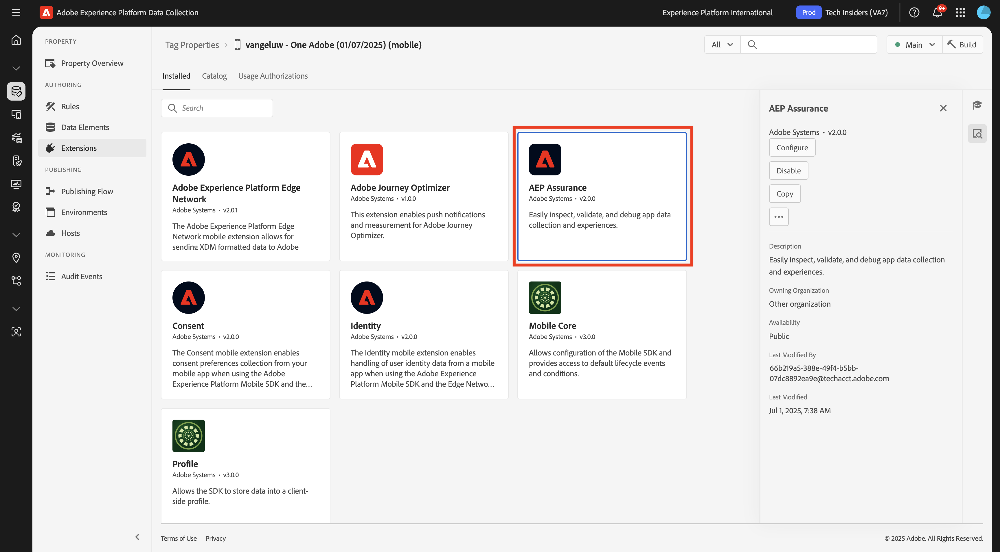
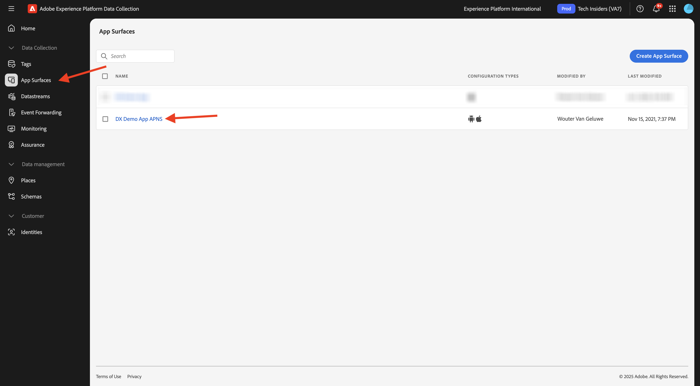
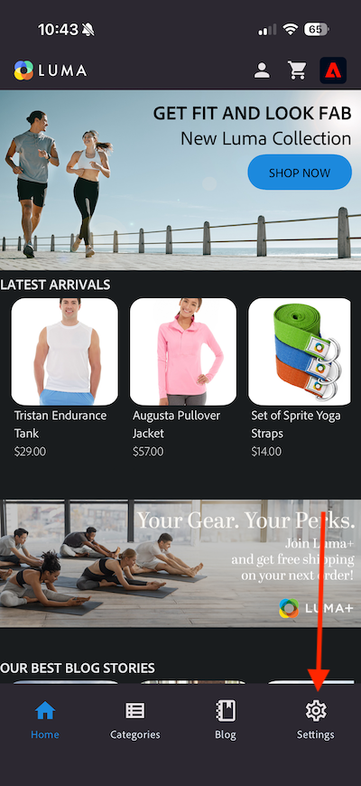

# 3.3.1 Introducción a las notificaciones push

Para utilizar las notificaciones push con Adobe Journey Optimizer, hay que comprobar y conocer varias opciones de configuración.

Estos son todos los ajustes que se deben verificar:

- Conjuntos de datos y esquemas en Adobe Experience Platform
- Flujo de datos para dispositivos móviles
- Propiedad de recopilación de datos para dispositivos móviles
- Superficie de aplicación para certificados push
- Prueba de la configuración push con AEP Assurance

Revisemos estos uno por uno.

Inicie sesión en Adobe Journey Optimizer en [Adobe Experience Cloud](https://experience.adobe.com). Haga clic en **Journey Optimizer**.

Se le redirigirá a la vista **Inicio** en Journey Optimizer. Primero, asegúrese de que está usando la zona protegida correcta. La zona protegida que se va a usar se llama `--aepSandboxName--`. Estará en la vista **Inicio** de su zona protegida `--aepSandboxName--`.

## 3.3.1.1 conjunto de datos push

Adobe Journey Optimizer utiliza conjuntos de datos para almacenar elementos como los tokens push de dispositivos móviles o las interacciones con mensajes push (como: mensaje enviado, mensaje abierto, etc.) en un conjunto de datos en Adobe Journey Optimizer.

Puede encontrar estos conjuntos de datos en **Conjuntos de datos** en el menú de la izquierda de la pantalla. Para mostrar los conjuntos de datos del sistema, haga clic en el icono **Habilitar filtros**.

Habilite la opción para **System** y busque **AJO**. A continuación, verá los conjuntos de datos utilizados para las notificaciones push.

## 3.3.1.2 flujo de datos para dispositivos móviles

Vaya a [https://experience.adobe.com/#/data-collection/](https://experience.adobe.com/#/data-collection/).

En el menú de la izquierda, ve a **Datastreams** y busca la secuencia de datos que creaste en [Introducción](./../../../../modules/getting-started/gettingstarted/ex2.md), que se llama `--aepUserLdap-- - One Adobe Datastream (Mobile)`. Haga clic en para abrirlo.

Haga clic en **Editar** en el servicio **Adobe Experience Platform**.

A continuación, verá la configuración del flujo de datos que se definió y en qué conjuntos de datos se almacenarán los eventos y atributos de perfil.

También debe habilitar las siguientes opciones si aún no están habilitadas:

- **Toma de decisiones sobre ofertas**
- **Destinos de personalización**
- **Adobe Journey Optimizer**

Haga clic en **Guardar**.

## 3.3.1.3 Revisar la propiedad de recopilación de datos para dispositivos móviles

Vaya a [https://experience.adobe.com/#/data-collection/](https://experience.adobe.com/#/data-collection/), a **Etiquetas**. Como parte del módulo [Introducción](./../../../../modules/getting-started/gettingstarted/ex1.md), se crearon las propiedades de Etiquetas de recopilación de datos.

Ya ha estado utilizando estas propiedades de etiquetas de recopilación de datos como parte de módulos anteriores.

Haga clic para abrir la propiedad Recopilación de datos para dispositivos móviles.

En su propiedad de recopilación de datos, vaya a **Extensiones**. A continuación, verá las distintas extensiones necesarias para la aplicación móvil. Haga clic para seleccionar la extensión **Adobe Experience Platform Edge Network** y luego seleccione **Configurar**.

A continuación, verá que el flujo de datos para móviles está vinculado aquí. A continuación, haga clic en **Cancelar** para volver a la descripción general de las extensiones.

Entonces volverás a estar aquí de nuevo. Verá la extensión de **AEP Assurance**. AEP Assurance le ayuda a inspeccionar, probar, simular y validar el modo en que recopila datos o sirve las experiencias en su aplicación móvil. Puede leer más sobre AEP Assurance aquí: [https://experienceleague.adobe.com/en/docs/experience-platform/assurance/home](https://experienceleague.adobe.com/es/docs/experience-platform/assurance/home).

A continuación, haga clic en **Configurar** para abrir la extensión **Adobe Journey Optimizer**. Esta extensión permite las notificaciones push y la medición para Adobe Journey Optimizer.

Luego verá que aquí es donde se vincula el conjunto de datos para el seguimiento de eventos push. No es necesario realizar ningún cambio en la propiedad de recopilación de datos. Haga clic en **Cancelar** para volver a la pantalla anterior.

## 3.3.1.4 Revisar la configuración de la superficie de la aplicación

Vaya a [https://experience.adobe.com/#/data-collection/](https://experience.adobe.com/#/data-collection/). En el menú de la izquierda, ve a **Superficies de aplicación** y abre la Superficie de aplicación para **APNS de aplicación de demostración DX**.

A continuación, verá la superficie de aplicación configurada para iOS y Android.

## 3.3.1.5: probar la configuración de notificaciones push mediante AEP Assurance.

Ya instaló la aplicación móvil **DX Demo** como parte del módulo **Introducción**. Una vez que la aplicación esté instalada, la encontrarás en la pantalla de inicio del dispositivo. Haga clic en el icono para abrir la aplicación.

Después de iniciar sesión, verá una notificación que solicita su permiso para enviar notificaciones. Enviaremos notificaciones como parte del tutorial, así que haz clic en **Permitir**.

A continuación, verá la página principal de la aplicación. Vaya a **Configuración**.

En la configuración, verá que actualmente hay un **Proyecto público** cargado en la aplicación. Haga clic en **Proyecto personalizado**.

Ahora puede cargar un proyecto personalizado. Haga clic en el código QR para cargar fácilmente el proyecto.

Después de pasar por la sección **Introducción**, obtuviste este resultado. Haga clic para abrir el **proyecto de venta minorista móvil** que se creó para usted.

En caso de que hayas cerrado accidentalmente la ventana de tu navegador, o para futuras sesiones de demostración o habilitación, también puedes acceder a tu proyecto de sitio web yendo a [https://dsn.adobe.com/projects](https://dsn.adobe.com/projects). Después de iniciar sesión con su Adobe ID, verá esto. Haga clic en el proyecto de la aplicación móvil para abrirlo.

A continuación, haga clic en **Ejecutar**.

A continuación, verá esta ventana emergente, que contiene un código QR. Escanee este código QR desde la aplicación móvil.

Verá el identificador de proyecto en la aplicación, tras lo cual podrá hacer clic en **Cambiar**.

La aplicación ya está lista para utilizarse.

Ahora necesita escanear un código QR para conectar su dispositivo móvil a su sesión de Assurance.

Para iniciar una sesión de AEP Assurance, ve a [https://experience.adobe.com/#/data-collection/](https://experience.adobe.com/#/data-collection/). Haga clic en **Assurance** en el menú de la izquierda. A continuación, haga clic en **Crear sesión**.

Seleccione **Conexión de vínculo profundo** y luego haga clic en **Iniciar**.

Rellene los valores:

- Nombre de sesión: `--aepUserLdap-- - Push Debugging`
- URL básica: `dxdemo://default`

Haga clic en **Next**.

Luego verá un código QR en la pantalla, que debe escanear con su dispositivo iOS.

En su dispositivo móvil, abra la aplicación de la cámara y escanee el código QR que muestra Assurance.

A continuación, verá una pantalla emergente en la que se le pedirá que introduzca el código PIN. Copie el código PIN de la pantalla de AEP Assurance y haga clic en **Conectar**.

Entonces verá esto...

En Assurance, ahora verá que hay un dispositivo cliente conectado a la sesión de Assurance. A continuación, haga clic en **Configurar**.

Desplácese hacia abajo hasta **Depuración push**. Haga clic en el icono **+** y, a continuación, haga clic en **Guardar**.

Vaya a **Depuración push**. Deberías ver esto.

Alguna explicación:

- La primera columna, **Cliente**, muestra los identificadores disponibles en su dispositivo iOS. Verá un ECID y un token push.
- La segunda columna muestra las **credenciales y configuración de App Store**
- La segunda columna muestra información de **Perfil**, con información adicional sobre la plataforma en la que se encuentra el token push (APNS o APNSandbox). Si hace clic en el botón **Inspeccionar perfil**, se le redirigirá a Adobe Experience Platform y verá el perfil del cliente en tiempo real completo.

Para probar la configuración push, ve al botón **Enviar configuración push de prueba**. Haga clic en **Enviar notificación push de prueba**

Debe asegurarse de que la aplicación **DX Demo** no esté abierta cuando haga clic en el botón **Enviar notificación push**. Si la aplicación está abierta, es posible que la notificación push se reciba en segundo plano y no sea visible.

Verá una notificación push como esta en su dispositivo móvil.

Si ha recibido la notificación push, significa que la configuración es correcta y funciona correctamente y ahora puede crear un recorrido real que envíe un mensaje push desde Journey Optimizer.

## Pasos siguientes

Ir a [3.3.2 Configuración de un recorrido con mensajes push](./ex2.md){target="_blank"}

Volver a [Adobe Journey Optimizer: mensajes push y en la aplicación](ajopushinapp.md){target="_blank"}

Volver a [Todos los módulos](./../../../../overview.md){target="_blank"}
