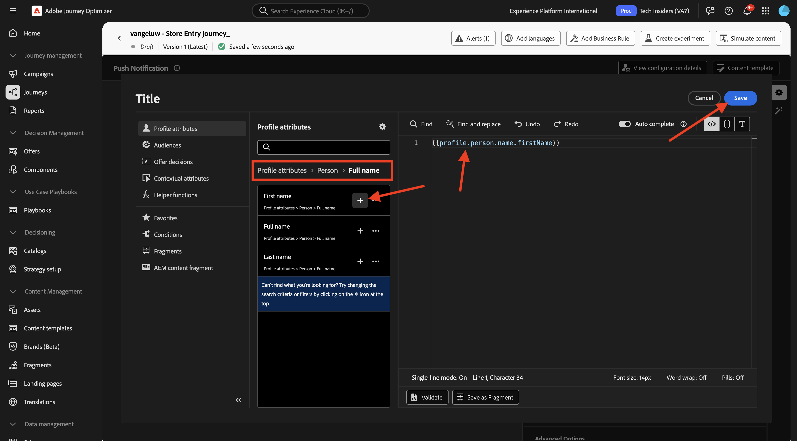

# 3.3.2 Configuración de un recorrido con mensajes push

Inicie sesión en Adobe Journey Optimizer en [Adobe Experience Cloud](https://experience.adobe.com). Haga clic en **Journey Optimizer**.

Se le redirigirá a la vista **Inicio** en Journey Optimizer. Primero, asegúrese de que está usando la zona protegida correcta. La zona protegida que se va a usar se llama `--aepSandboxName--`. Estará en la vista **Inicio** de su zona protegida `--aepSandboxName--`.

## 3.3.2.1 Crear un nuevo evento

En el menú de la izquierda, ve a **Configuraciones** y haz clic en **Administrar** en **Eventos**.

En la pantalla **Eventos**, verá una vista similar a esta. Haga clic en **Crear evento**.

A continuación, verá una configuración de evento vacía.
En primer lugar, asigne al evento un Nombre como este: `--aepUserLdap--StoreEntryEvent` y establezca la descripción en `Store Entry Event`.
A continuación se muestra la selección **Tipo de evento**. Seleccione **Unitario**.
A continuación se muestra la selección **Tipo de ID de evento**. Seleccione **Sistema generado**.

A continuación se muestra la selección Esquema. Se ha preparado un esquema para este ejercicio. Use el esquema `Demo System - Event Schema for Mobile App (Global v1.1) v.1`.

Después de seleccionar el esquema, verá una serie de campos seleccionados en la sección **Carga útil**. Compruebe que el campo **Namespace** esté establecido en **ECID**. El evento está ahora completamente configurado.

Haga clic en **Guardar**.

El evento se ha configurado y guardado. Vuelve a hacer clic en el evento para abrir de nuevo la pantalla **Editar evento**.

Pase el ratón sobre el campo **Carga útil** y haga clic en el icono **Ver carga útil**.

Ahora verá un ejemplo de la carga útil esperada.

Su evento tiene un identificador de evento de orquestación único, que puede encontrar desplazándose hacia abajo en esa carga hasta que vea `_experience.campaign.orchestration.eventID`.

El ID de evento es lo que debe enviarse a Adobe Experience Platform para almacenar en déclencheur el Recorrido que va a generar en el siguiente paso. Escriba este eventID, tal como lo necesitará en el paso siguiente.
`"eventID": "aa895251f76831e6440f169f1bb9d2a4388f0696d8e2782cfab192a275817dfa"`

Haga clic en **Ok**.

Haga clic en **Cancelar**.

## 3.3.2.2 Crear un recorrido

En el menú de la izquierda, ve a **Recorridos** y haz clic en **Crear Recorrido**.

Entonces verá esto... Asigne un nombre al recorrido: `--aepUserLdap-- - Store Entry journey`. Haga clic en **Guardar**.

En primer lugar, debe agregar el evento como punto de partida del recorrido. Busque el evento `--aepUserLdap--StoreEntryEvent`, arrástrelo y suéltelo en el lienzo. Haga clic en **Guardar**.

A continuación, en **Acciones**, busque la acción **Push**. Arrastre y suelte la acción **Push** en el lienzo.

Establezca **Category** en **Marketing** y seleccione una superficie push que le permita enviar notificaciones push. En este caso, la superficie de correo electrónico que se va a seleccionar es **Push-iOS-Android**.

>[!NOTE]
>
>Debe existir un canal en Journey Optimizer que esté usando la **superficie de aplicación** tal como se revisó anteriormente.

El siguiente paso es crear el mensaje. Para ello, haga clic en **Editar contenido**.

Entonces verá esto... Haga clic en el icono **personalización** para el campo **Título**.

Entonces verá esto... Ahora puede seleccionar cualquier atributo de perfil directamente desde el Perfil del cliente en tiempo real.

Busque el campo **Nombre** y, a continuación, haga clic en el icono **+** situado junto al campo **Nombre**. Verá el token de personalización del nombre que se está agregando: **{{profile.person.name.firstName}}**.

A continuación, agregue el texto **, ¡bienvenido a nuestra tienda!** detrás de **{{profile.person.name.firstName}}**.

Haga clic en **Guardar**.

Ahora tiene esto. Haga clic en el icono **personalización** para el campo **Cuerpo**.

Escriba este texto **Haga clic aquí para obtener un descuento del 10% al comprar hoy.** y haga clic en **Guardar**.

Entonces, tendrás esto. Haga clic en la flecha de la esquina superior izquierda para volver al recorrido.

Haga clic en **Guardar** para cerrar la acción de inserción.

Haga clic en **Publicar**.

Vuelva a hacer clic en **Publicar**.

El recorrido se ha publicado.

## 3.3.2.3 Actualizar la propiedad de recopilación de datos para dispositivos móviles

En **Introducción**, Sistema de demostración creó propiedades de etiquetas para usted: una para el sitio web y otra para la aplicación móvil. Encuéntralos buscando `--aepUserLdap--` en el cuadro **Buscar**. Haga clic para abrir la propiedad **Mobile**.

Entonces debería ver esto.

En el menú de la izquierda, ve a **Reglas** y haz clic para abrir la regla **Entrada de ubicación**.

Entonces debería ver esto. Haga clic en la acción **Núcleo móvil: adjuntar datos**.

Entonces debería ver esto.

Pegue el eventID del evento `--aepUserLdap--StoreEntryEvent` en la ventana **Carga JSON**. Haga clic en **Conservar cambios**.

Haga clic en **Guardar** o en **Guardar en biblioteca**.

Vaya a **Flujo de publicación** y haga clic para abrir la biblioteca **Principal**.

Haga clic en **Agregar todos los recursos modificados** y, a continuación, haga clic en **Guardar y generar en desarrollo**.

## 3.3.2.4: probar el recorrido y el mensaje push

Abra la aplicación **DSN Mobile**.

Vaya a la página **Localizador de tiendas**.

Haga clic en **Simular entrada de punto de interés**.

Después de un par de segundos, verá aparecer la notificación push.

## Pasos siguientes

Ir a [3.3.3 Configurar una campaña con mensajes en la aplicación](./ex3.md){target="_blank"}

Volver a [Adobe Journey Optimizer: mensajes push y en la aplicación](ajopushinapp.md){target="_blank"}

Volver a [Todos los módulos](./../../../../overview.md){target="_blank"}