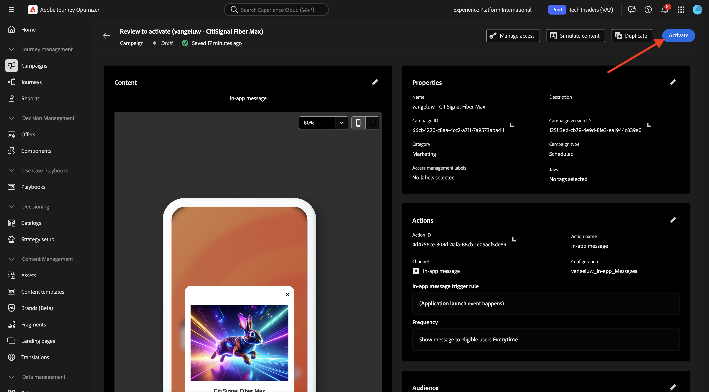
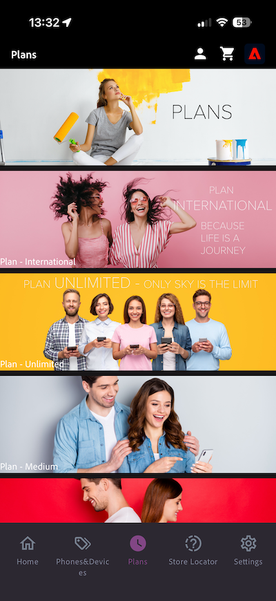

# 3.3.3 Configuración de una campaña con mensajes en la aplicación

Inicie sesión en Adobe Journey Optimizer en [Adobe Experience Cloud](https://experience.adobe.com). Haga clic en **Journey Optimizer**.

Se le redirigirá a la vista **Inicio** en Journey Optimizer. Primero, asegúrese de que está usando la zona protegida correcta. La zona protegida que se va a usar se llama `--aepSandboxName--`. Estará en la vista **Inicio** de su zona protegida `--aepSandboxName--`.

## 3.3.3.1 Configuración del canal de mensajes en la aplicación

En el menú de la izquierda, ve a **Canales** y luego selecciona **Configuraciones de canal**. Haga clic en **Crear configuración de canal**.

Escriba el nombre: `--aepUserLdap--_In-app_Messages`, seleccione el canal **Mensajería en la aplicación** y, a continuación, habilite las plataformas **Web**, **iOS** y **Android**.

Desplácese hacia abajo y debería ver esto.

Asegúrese de que **Single page** esté habilitado.

Para **Web**, escriba la dirección URL del sitio web que se creó anteriormente como parte del módulo **Introducción**, que tiene este aspecto: `https://dsn.adobe.com/web/--aepUserLdap---XXXX`. No olvides cambiar el **XXXX** por el código único de tu sitio web.

Para **iOS** y **Android**, ingrese `com.adobe.dsn.dxdemo`.

Desplácese hacia arriba y haga clic en **Enviar**.

La configuración del canal ya está lista para utilizarse.

## 3.3.3.2 Configurar una campaña programada para mensajes en la aplicación

En el menú de la izquierda, ve a **Campañas** y luego haz clic en **Crear campaña**.

Seleccione **Programado - Marketing** y haga clic en **Crear**.

Escriba el nombre `--aepUserLdap-- - CitiSignal Fiber Max` y haga clic en **Acciones**.

Haga clic en **+ Agregar acción** y luego seleccione **Mensaje en la aplicación**.

Seleccione la configuración del canal de mensajes en la aplicación que creó en el paso anterior, que se llama: `--aepUserLdap--_In-app_Messages`. Haga clic en **Editar contenido**.

Entonces debería ver esto. Haga clic en **Modal**.

Haga clic en **Cambiar diseño**.

Haga clic en el icono **URL de medios** para seleccionar recursos de los AEM Assets.

Vaya a la carpeta **citisignal-images** y seleccione el archivo de imagen **neon-rabbit.jpg**. Haga clic en **Seleccionar**.

Para el texto **Header**, use: `CitiSignal Fiber Max`.
Para el texto **Body**, use: `Conquer lag with Fiber Max`.

Establezca el **botón #1 texto** en: `Go to Plans`.
Establezca **target** en `com.adobe.dsn.dxdemo://plans`.

Haga clic en **Revisar para activar**.

Haga clic en **Activar**.

El estado de la campaña ahora se establece en **Activando**. La campaña puede tardar un par de minutos en estar activa.

Una vez que el estado haya cambiado a **Activo**, puede probar la campaña.

## 3.3.3.3: probar la campaña de mensajería en la aplicación en dispositivos móviles

En el dispositivo móvil, abra la aplicación. Después de iniciar la aplicación, debería ver el nuevo mensaje en la aplicación. Haga clic en el botón **Ir a Planes**.

Luego se le redirigirá a la página **Planes**.

## Pasos siguientes

Ir a [Resumen y beneficios](./summary.md){target="_blank"}

Volver a [Adobe Journey Optimizer: mensajes push y en la aplicación](ajopushinapp.md){target="_blank"}

Volver a [Todos los módulos](./../../../../overview.md){target="_blank"}
