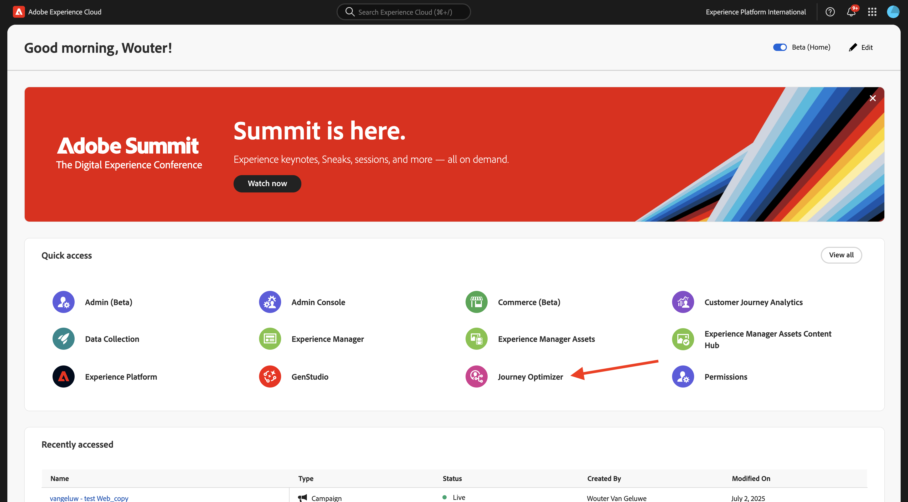
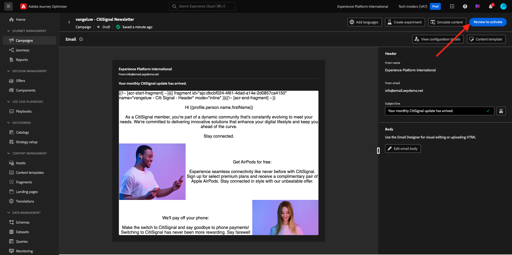

# 3.4.2 Configuración de una campaña

Inicie sesión en Adobe Journey Optimizer en [Adobe Experience Cloud](https://experience.adobe.com). Haga clic en **Journey Optimizer**.



Se le redirigirá a la vista **Inicio** en Journey Optimizer. Primero, asegúrese de que está usando la zona protegida correcta. La zona protegida que se va a usar se llama `--aepSandboxName--`. Estará en la vista **Inicio** de su zona protegida `--aepSandboxName--`.


## 3.4.2.1 Crear audiencia

Antes de crear la campaña, debe definir la audiencia que debe recibir la campaña. Para crear una audiencia, ve a **Audiencias** en el menú de la izquierda. Allí verá todas las audiencias creadas anteriormente.

Haga clic en **+ Crear audiencia**.


Seleccione **Generar regla** y haga clic en **Crear**.


Seleccione el campo **Perfil individual XDM > Correo electrónico personal > Dirección** y agréguelo al lienzo. Establezca la condición de regla en **exists**.

Para evitar enviar correos electrónicos a otros usuarios en su entorno de aprendizaje compartido, también puede agregar un filtro como **Nombre es igual a -su nombre-**.

Establezca el nombre de su audiencia en `--aepUserLdap-- - All customers with email` y haga clic en **Publicar**.


La audiencia ahora se ha publicado y puede utilizarse en una campaña.

## 3.4.2.2 Creación de una campaña de newsletter

Ahora creará una campaña. A diferencia del recorrido basado en eventos del ejercicio anterior, que se basa en eventos de experiencia entrantes o entradas o salidas de audiencia para almacenar en déclencheur un recorrido para un cliente específico, las campañas se dirigen a una audiencia completa una vez con contenido único como boletines informativos, promociones únicas o información genérica, o periódicamente con contenido similar enviado de forma regular como, por ejemplo, campañas de cumpleaños y recordatorios.

En el menú, ve a **Campañas** y haz clic en **Crear campaña**.


Seleccione **Programado - Marketing** y haga clic en **Crear**.


En la pantalla de creación de campañas, configure lo siguiente:

- **Nombre**: `--aepUserLdap-- - CitiSignal Newsletter`.
- **Descripción**: Boletín mensual
- **Tipo de identidad**: cambiar a Correo electrónico

Haga clic en **Seleccionar audiencia**.


Para la **audiencia**, seleccione la audiencia que creó en el paso anterior, `--aepUserLdap-- - All customers with email`. Haga clic en **Guardar**.


Para la **acción**, seleccione **correo electrónico** y una **configuración de correo electrónico** existente. Editará el contenido en un par de minutos.


Para el **horario**, elige **En una fecha y hora específicas** y establece una hora de elección.


Ahora puede empezar a crear el propio mensaje de correo electrónico. Desplácese un poco hacia arriba y haga clic en **Editar contenido**.


Entonces verá esto... Para la **línea de asunto**, use esto: `Your monthly CitiSignal update has arrived.`. A continuación, haga clic en **Editar cuerpo del correo electrónico**.


Elija **Diseño desde cero**.


Entonces verá esto... En el menú de la izquierda, encontrará los componentes de estructura que puede utilizar para definir la estructura del correo electrónico (filas y columnas).

Arrastrar y soltar 3 veces una columna **1:1** en el lienzo, 1 vez una columna 1:2 izquierda y 1 vez una columna 2:1 derecha que debería proporcionarle esta estructura:


En el menú de la izquierda, ve a **Fragmentos**. Arrastre el encabezado que creó anteriormente en [ejercicio 3.1.2.1](./../ajob2c-1/ex2.md) al primer componente del lienzo. Arrastre el pie de página creado anteriormente en [ejercicio 3.1.2.2](./../ajob2c-1/ex2.md) al último componente del lienzo.


Haga clic en el icono **+** en el menú de la izquierda. Vaya a **Contenido** para empezar a agregar contenido al lienzo.


Arrastre y suelte un componente **Text** en la segunda fila.


Seleccione el texto predeterminado en ese componente **Escriba el texto aquí.** y reemplácelo por el siguiente texto. Cambie la alineación a **Alineación central**.

```javascript
Hi {{profile.person.name.firstName}}

As a CitiSignal member, you're part of a dynamic community that's constantly evolving to meet your needs. We're committed to delivering innovative solutions that enhance your digital lifestyle and keep you ahead of the curve.

Stay connected.
```


Arrastre y suelte un componente **Image** en la tercera y cuarta fila. Haz clic en **Examinar** en la tercera fila.


Abra la carpeta **citi-signal-images**, haga clic para seleccionar la imagen **Offer_AirPods.jpg** y haga clic en **Seleccionar**.


Haga clic en **Examinar** en el marcador de posición de la imagen de la cuarta fila.


Abra la carpeta **citi-signal-images**, haga clic para seleccionar la imagen **Offer_Phone.jpg** y haga clic en **Seleccionar**.


Arrastre y suelte un componente **Text** en la tercera y cuarta fila.


Seleccione el texto predeterminado en el componente de la tercera fila **Escriba el texto aquí.** y reemplácelo por el siguiente texto.

```javascript
Get AirPods for free:

Experience seamless connectivity like never before with CitiSignal. Sign up for select premium plans and receive a complimentary pair of Apple AirPods. Stay connected in style with our unbeatable offer.
```

Seleccione el texto predeterminado en el componente de la cuarta fila **Escriba el texto aquí.** y reemplácelo por el siguiente texto.

```javascript
We'll pay off your phone:

Make the switch to CitiSignal and say goodbye to phone payments! Switching to CitiSignal has never been more rewarding. Say farewell to hefty phone bills as we help pay off your phone, up to 800$!
```


El correo electrónico básico de la newsletter ya está listo. Haga clic en **Guardar**.


Vuelva al panel de campañas haciendo clic en la **flecha** junto al texto de la línea de asunto en la esquina superior izquierda.


Haga clic en **Revisar para activar**.



Entonces puede obtener este error. Si es así, es posible que tenga que esperar hasta 24 horas hasta que se haya evaluado la audiencia y luego intentar activar la campaña de nuevo. También es posible que tenga que actualizar la programación de la campaña para que se ejecute más adelante.

Haga clic en **Activar**.


Una vez activada, la campaña se programará para ejecutarse.


La campaña está activada. El mensaje de correo electrónico de la newsletter se enviará según lo definido en la programación y la campaña se detendrá en cuanto se haya enviado el último correo electrónico.

También debería recibir el correo electrónico en la dirección que utilizó para el perfil de demostración que creó anteriormente.


Ha terminado este ejercicio.

## Pasos siguientes

Ir a [3.4.3 Aplicar personalización basada en segmentos en un mensaje de correo electrónico](./ex3.md){target="_blank"}

Volver a [Adobe Journey Optimizer](journeyoptimizer.md){target="_blank"}

Volver a [Todos los módulos](./../../../../overview.md){target="_blank"}
