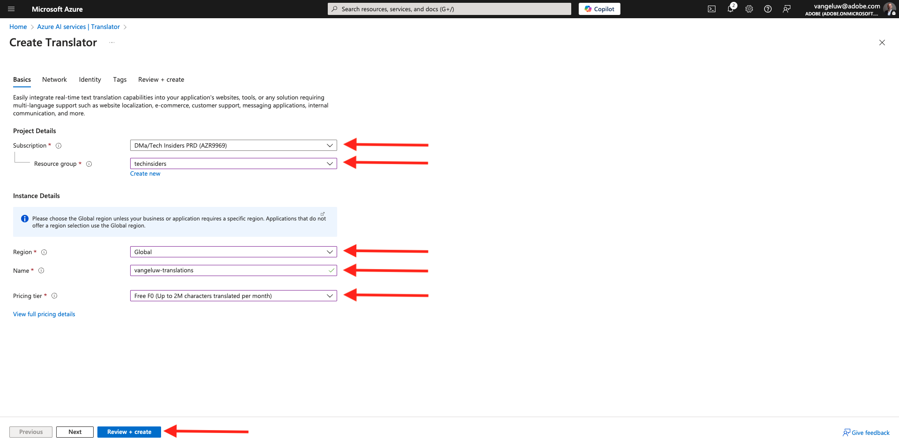
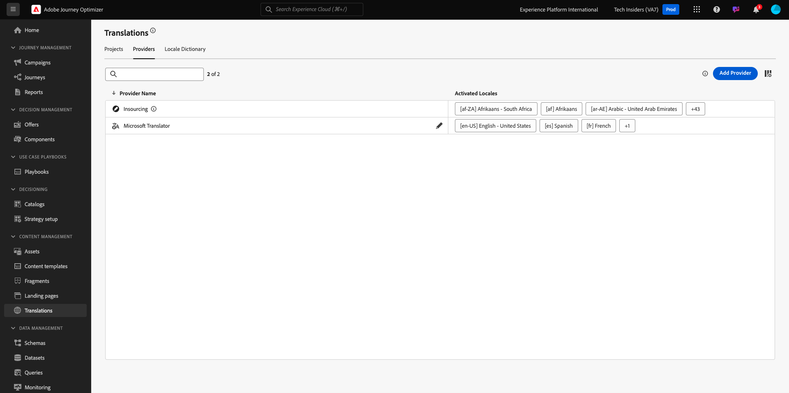
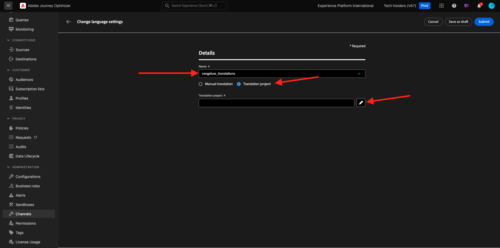

# 3.5.1 Proveedor de traducciones

## 3.5.1.1 Configuración de Microsoft Azure Translator

Vaya a [https://portal.azure.com/#home](https://portal.azure.com/#home).

En la barra de búsqueda, escriba `translators`. A continuación, haga clic en **+ Crear**.

Seleccione **Crear traductor**.

Elija su **ID de suscripción** y **grupo de recursos**.
Establezca **Región** en **Global**.
Establezca **Nivel de precios** en **F0** gratis.

Seleccione **Revisar + crear**.

Seleccione **Crear**.

Seleccione **Ir al recurso**.

En el menú de la izquierda, vaya a **Administración de recursos** > **Claves y extremo**. Haga clic en para copiar la clave.

## 3.5.1.2 Diccionario local

Vaya a [https://experience.adobe.com/](https://experience.adobe.com/). Haga clic en **Journey Optimizer**.

En el menú de la izquierda, ve a **Traducciones** y luego a **Diccionario local**. Si ve este mensaje, haga clic en **Agregar configuraciones regionales predeterminadas**.

Entonces debería ver esto.

## 3.5.1.3 Configuración del proveedor de traducciones en AJO

Vaya a [https://experience.adobe.com/](https://experience.adobe.com/). Haga clic en **Journey Optimizer**.

En el menú de la izquierda, ve a **Traducciones** y luego a **Proveedores**. Haga clic en **Agregar proveedor**.

En **Proveedores**, seleccione **Microsoft Translator**. Marque la casilla de verificación para habilitar el uso del proveedor de traducción. Pegue la clave copiada de los traductores de Microsoft Azure. A continuación, haga clic en **Validar credenciales**.

Las credenciales se deben validar correctamente. Si es así, desplácese hacia abajo para seleccionar los idiomas para la traducción.

Asegúrese de seleccionar `[en-US] English`, `[es] Spanish`, `[fr] French`, `[nl] Dutch`.

Desplácese hacia arriba y haga clic en **Guardar**.

Su **proveedor de traducciones** ya está listo para usarse.

## 3.5.1.4 Configurar el proyecto de traducciones

Vaya a [https://experience.adobe.com/](https://experience.adobe.com/). Haga clic en **Journey Optimizer**.

En el menú de la izquierda, ve a **Traducciones** y luego a **Diccionario local**. Si ve este mensaje, haga clic en **Crear proyecto**.

Escriba el nombre `--aepUserLdap-- - Translations`, establezca la configuración regional de **Source** en `[en-US] English - United States` y marque las casillas de verificación para habilitar **Publicar automáticamente traducciones aprobadas** y **Habilitar el flujo de trabajo de revisión**. A continuación, haga clic en **+ Agregar configuración regional**.

Busque `fr`, active la casilla de verificación de `[fr] French` y luego active la casilla de verificación de **Microsoft Translator**. Haga clic en **+ Agregar configuración regional**.

Busque `es`, active la casilla de verificación de `[es] Spanish` y luego active la casilla de verificación de **Microsoft Translator**. Haga clic en **+ Agregar configuración regional**.

Busque `nl`, active la casilla de verificación de `[nl] Spanish` y luego active la casilla de verificación de **Microsoft Translator**. Haga clic en **+ Agregar configuración regional**.

Haga clic en **Guardar**.

Su proyecto **Traducciones** ya está listo para usarse.

## 3.5.1.5 Configuración de idioma

Vaya a **Canales** > **Configuración general** > **Configuración de idioma**. Haga clic en **Crear configuración de idioma**.

Use el nombre `--aepUserLdap--_translations`. Seleccione **proyecto de traducción**. A continuación, haga clic en el icono **editar**.

Seleccione el proyecto de traducciones que creó en el paso anterior. Haga clic en **Seleccionar**.

Entonces debería ver esto. Establezca la **preferencia de reserva** en **Inglés - Estados Unidos**. Haga clic para seleccionar **Seleccionar atributo preferido del idioma del perfil**, que decidirá qué campo del perfil del cliente se utilizará para cargar las traducciones. A continuación, haga clic en el icono **edit** para seleccionar qué campo se utilizará.

Escriba **idioma preferido** en la barra de búsqueda y luego seleccione el campo **Idioma preferido**.

Haga clic en el icono **edit** tanto para **inglés - Estados Unidos** como para **holandés** para revisar su configuración.

Esta es la configuración para **Inglés - Estados Unidos**. Haga clic en **Cancelar**.

Haga clic para ver la configuración de **Dutch**. Haga clic en **Cancelar**.

Desplácese hacia arriba y haga clic en **Enviar**.

La configuración de idioma ya está establecida.

Ha terminado este ejercicio.

## Pasos siguientes

Vaya a [3.5.2 y cree su campaña](./ex2.md)

Volver a [Adobe Journey Optimizer: servicios de traducción](./ajotranslationsvcs.md){target="_blank"}

Volver a [Todos los módulos](./../../../../overview.md){target="_blank"}
