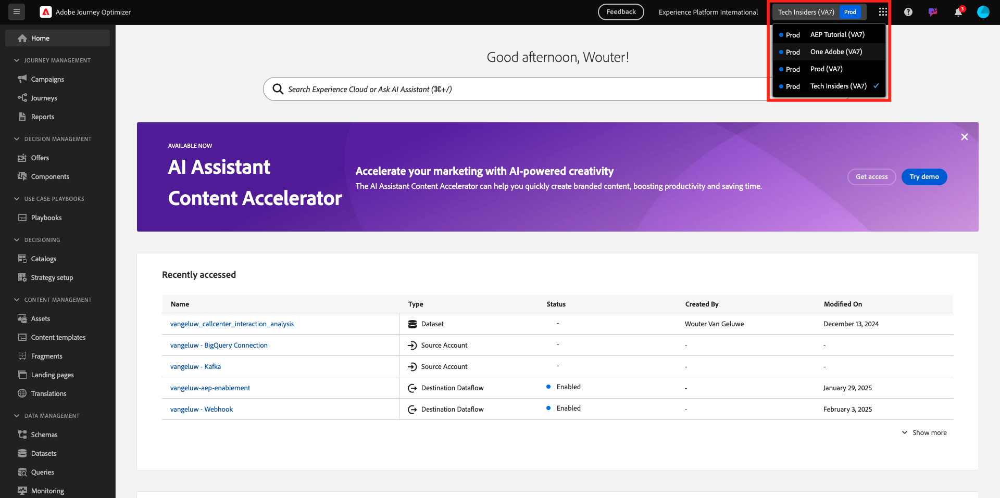
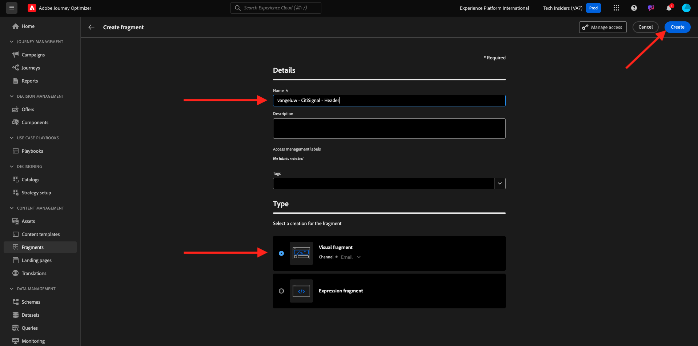
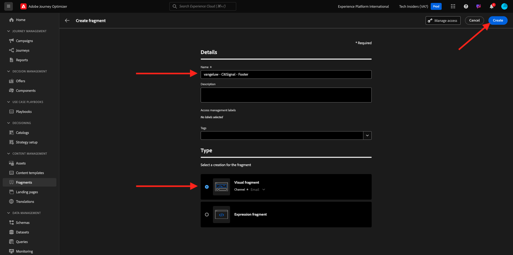
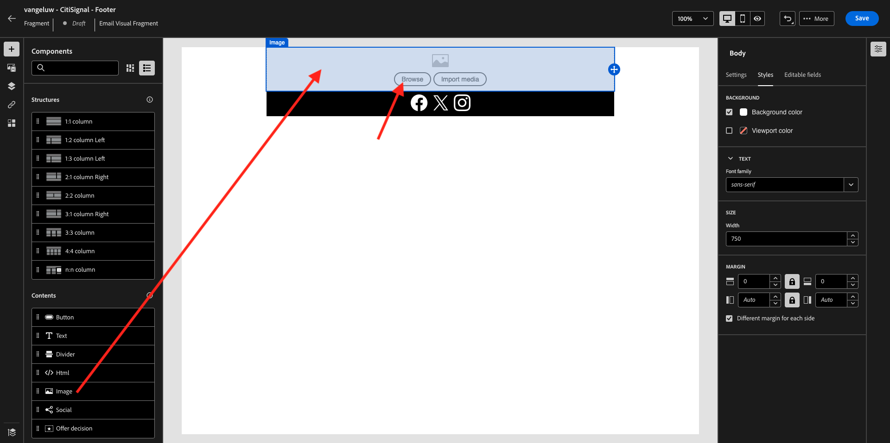
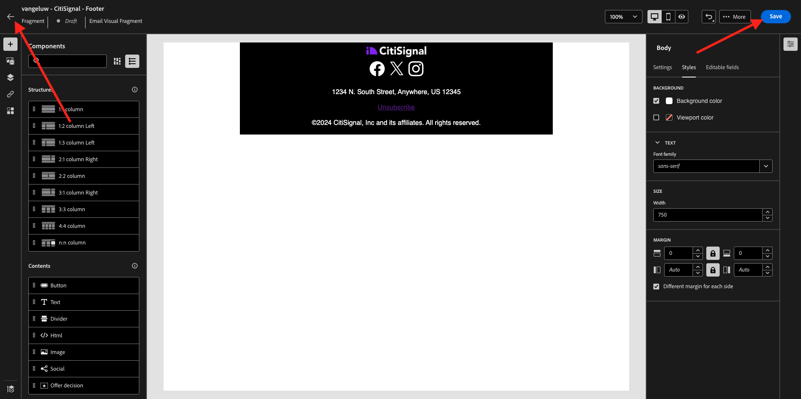
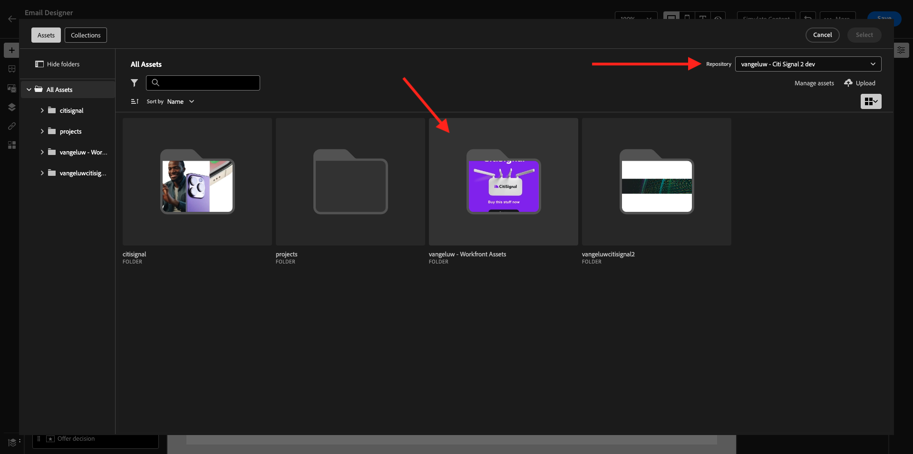
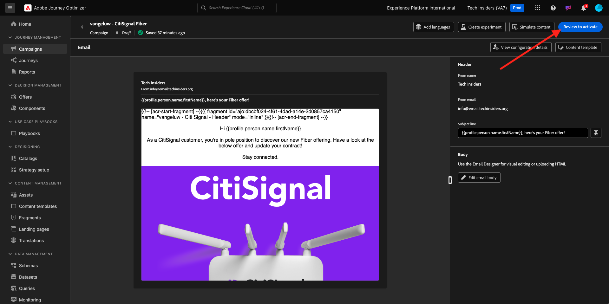

# 3.5.2 Creación de la campaña

Vaya a [https://experience.adobe.com/](https://experience.adobe.com/). Haga clic en **Journey Optimizer**.


Se le redirigirá a la vista **Inicio** en Journey Optimizer. Primero, asegúrese de que está usando la zona protegida correcta. La zona protegida que se va a usar se llama `--aepSandboxName--`.



>[!NOTE]
>
>Si ya ha creado los fragmentos Encabezado y Pie de página como parte del ejercicio [ejercicio 3.1.2.1](./../ajob2c-1/ex2.md) y el [ejercicio 3.1.2.2](./../ajob2c-1/ex2.md), vaya al ejercicio 3.5.2.3 Crear campaña de fibra. No vuelva a crear los fragmentos Encabezado y Pie de página.

## 3.5.2.1 Crear el fragmento de encabezado

En el menú de la izquierda, haga clic en **Fragmentos**. Un fragmento es un componente reutilizable dentro de Journey Optimizer, que evita la duplicación y facilita los cambios futuros que deberían afectar a todos los mensajes, como los cambios en un encabezado o pie de página de un mensaje de correo electrónico.

Haga clic en **Crear fragmento**.


Escriba el nombre `--aepUserLdap-- - CitiSignal - Header` y seleccione **Tipo: Fragmento visual**. Haga clic en **Crear**.



Entonces verá esto... En el menú de la izquierda, encontrará los componentes de estructura que puede utilizar para definir la estructura del correo electrónico (filas y columnas).

Arrastre y suelte una columna **1:1** del menú en el lienzo. Este será el marcador de posición de la imagen del logotipo.


A continuación, puede utilizar Componentes de contenido para añadir contenido dentro de estos bloques. Arrastre y suelte un componente **Image** en la primera celda de la primera fila. Haga clic en **Examinar**.


A continuación, verá una ventana emergente que muestra la biblioteca multimedia de AEM Assets. Vaya a la carpeta **citi-signal-images**, haga clic para seleccionar la imagen **CitiSignal-Logo-White.png** y haga clic en **Seleccionar**.

>[!NOTE]
>
>Si no ves las imágenes de Citi Signal en tu biblioteca de AEM Assets, puedes encontrarlas [aquí](./../../../../assets/ajo/CitiSignal-images.zip). Descárguelas en su escritorio, cree la carpeta **citi-signal-images** y cargue todas las imágenes de esa carpeta.


Entonces verá esto... La imagen es blanca y aún no se muestra. Ahora debe definir un color de fondo para que la imagen se muestre correctamente. Haga clic en **Estilos** y luego haga clic en el cuadro **Color de fondo**.


En la ventana emergente, cambie el código de color **Hex** a **#8821F4** y, a continuación, cambie el enfoque haciendo clic en el campo **100%**. Luego verá el nuevo color aplicado a la imagen.


La imagen también es un poco demasiado grande en este momento. Cambiemos la anchura deslizando el conmutador **Width** a **40%**.


El fragmento de encabezado ya está listo. Haz clic en **Guardar** y luego haz clic en la flecha para volver a la pantalla anterior.


El fragmento debe publicarse para poder utilizarse. Haga clic en **Publicar**.


Después de un par de minutos, verás que el estado de tu fragmento ha cambiado a **Activo**.
A continuación, debe crear un nuevo fragmento para el pie de página de los mensajes de correo electrónico. Haga clic en **Crear fragmento**.


## 3.5.2.2 Crear el fragmento Pie de página

Haga clic en **Crear fragmento**.


Escriba el nombre `--aepUserLdap-- - CitiSignal - Footer` y seleccione **Tipo: Fragmento visual**. Haga clic en **Crear**.



Entonces verá esto... En el menú de la izquierda, encontrará los componentes de estructura que puede utilizar para definir la estructura del correo electrónico (filas y columnas).

Arrastre y suelte una columna **1:1** del menú en el lienzo. Este será el marcador de posición para el contenido del pie de página.


A continuación, puede utilizar Componentes de contenido para añadir contenido dentro de estos bloques. Arrastre y suelte un componente **HTML** en la primera celda de la primera fila. Haga clic en el componente para seleccionarlo y, a continuación, haga clic en el icono **&lt;/>** para editar el código fuente de HTML.


Entonces verá esto...


Copie el siguiente fragmento de código de HTML y péguelo en la ventana **Editar HTML** de Journey Optimizer.

```html
<!--[if mso]><table cellpadding="0" cellspacing="0" border="0" width="100%"><tr><td style="text-align: center;" ><![endif]-->
<table style="width: auto; display: inline-block;">
  <tbody>
    <tr class="component-social-container">
      <td style="padding: 5px">
        <a style="text-decoration: none;" href="https://www.facebook.com" data-component-social-icon-id="facebook">
        
        </a>
      </td>
      <td style="padding: 5px">
        <a style="text-decoration: none;" href="https://x.com" data-component-social-icon-id="twitter">
        
        </a>
      </td>
      <td style="padding: 5px">
        <a style="text-decoration: none;" href="https://www.instagram.com" data-component-social-icon-id="instagram">
         
        </a>
      </td>
    </tr>
  </tbody>
</table>
<!--[if mso]></td></tr></table><![endif]-->
```

Entonces, tendrás esto. En las líneas 7, 12 y 17, ahora debe insertar un archivo de imagen con los recursos de la biblioteca de AEM Assets.


Asegúrese de que el cursor se encuentra en la línea 7 y luego haga clic en **Assets** en el menú de la izquierda. Haga clic en **Abrir selector de recursos** para seleccionar la imagen.


Abra la carpeta **citi-signal-images** y haga clic para seleccionar la imagen **Icon_Facebook.png**. Haga clic en **Seleccionar**.


Asegúrese de que el cursor se encuentra en la línea 12 y luego haga clic en **Abrir selector de recursos** para seleccionar la imagen.


Abra la carpeta **citi-signal-images** y haga clic para seleccionar la imagen **Icon_X.png**. Haga clic en **Seleccionar**.


Asegúrese de que el cursor se encuentra en la línea 17 y, a continuación, haga clic en **Abrir selector de recursos** para seleccionar la imagen.


Abra la carpeta **citi-signal-images** y haga clic para seleccionar la imagen **Icon_Instagram.png**. Haga clic en **Seleccionar**.


Entonces verá esto... Haga clic en **Guardar**.


Luego volverás a estar en el editor. Los iconos aún no están visibles porque el fondo y los archivos de imagen están todos en blanco. Para cambiar el color de fondo, ve a **Estilos** y haz clic en la casilla de verificación **Color de fondo**.


Cambie el código de color **Hex** a **#000000**.


Cambie la alineación para que esté centrada.


Vamos a agregar otras partes al pie de página. Arrastre y suelte un componente **Image** sobre el componente de HTML que acaba de crear. Haga clic en **Examinar**.



Haga clic para seleccionar el archivo de imagen **`CitiSignal_Footer_Logo.png`** y haga clic en **Seleccionar**.


Vaya a **Estilos** y haga clic en la casilla de verificación **Color de fondo**; cambiémosla a negro otra vez. Cambie el código de color **Hex** a **#000000**.


Cambie la anchura a **20%** y compruebe que la alineación esté centrada.


A continuación, arrastre y suelte un componente **Text** en el componente de HTML que creó. Haga clic en **Examinar**.


Copie y pegue el texto siguiente reemplazando el texto del marcador de posición.

```
1234 N. South Street, Anywhere, US 12345

Unsubscribe

©2024 CitiSignal, Inc and its affiliates. All rights reserved.
```

Establezca la **alineación del texto** en el centro.


Cambiar **color de fuente** a blanco, **#FFFFFF**.


Cambiar el **color de fondo** a negro, **#000000**.


Seleccione el texto **Cancelar la suscripción** en el pie de página y haga clic en el icono **Vínculo** de la barra de menús. Establezca **Type** en **Exclusión/baja externa** y establezca la dirección URL en **https://aepdemo.net/unsubscribe.html** (no se permite tener una dirección URL en blanco para el vínculo de cancelación de suscripción).


Entonces, tendrás esto. El pie de página ya está listo. Haz clic en **Guardar** y luego haz clic en la flecha para volver a la página anterior.



Haga clic en **Publicar** para publicar el pie de página y utilizarlo en un mensaje de correo electrónico.


Después de un par de minutos, verás que el estado del pie de página ha cambiado a **Activo**.


## 3.5.2.3 Creación de una campaña de fibra

Ahora creará una campaña. A diferencia del recorrido basado en eventos del ejercicio anterior, que se basa en eventos de experiencia entrantes o entradas o salidas de audiencia para almacenar en déclencheur un recorrido para un cliente específico, las campañas se dirigen a una audiencia completa una vez con contenido único como boletines informativos, promociones únicas o información genérica, o periódicamente con contenido similar enviado de forma regular como, por ejemplo, campañas de cumpleaños y recordatorios.

En el menú, ve a **Campañas** y haz clic en **Crear campaña**.


Seleccione **Programado - Marketing** y haga clic en **Crear**.


En la pantalla de creación de campañas, configure lo siguiente:

- **Nombre**: `--aepUserLdap-- - CitiSignal Fiber`.
- **Descripción**: campaña de fibra
- **Tipo de identidad**: cambiar a Correo electrónico


Desplácese hacia abajo hasta **Acción**. Para la **acción**, seleccione **correo electrónico**.


A continuación, seleccione una **configuración de correo electrónico** existente. Editará el contenido en un par de minutos.


Desplácese hasta **Audiencia**. Haga clic en **Seleccionar audiencia**.


Para la **audiencia**, seleccione la audiencia que creó en [1.3.3 Crear una composición federada](./../../datacollection/dc1.3/ex3.md), que se denomina `--aepUserLdap-- - CitiSignal Eligible for Fiber`. Haga clic en **Guardar**.


Desplácese hacia abajo hasta **Programar**. Para el **horario**, elige **En una fecha y hora específicas** y establece una hora de elección.


Ahora puede empezar a crear el propio mensaje de correo electrónico. Desplácese hacia arriba y haga clic en **Editar contenido**.


Entonces verá esto... Para la **línea de asunto**, use esto:

```
{{profile.person.name.firstName}}, here's your Fiber offer!
```

A continuación, haga clic en **Editar cuerpo del correo electrónico**.


Elija **Diseño desde cero**.


Entonces verá esto... En el menú de la izquierda, encontrará los componentes de estructura que puede utilizar para definir la estructura del correo electrónico (filas y columnas).

Arrastrar y soltar 4 veces una columna **1:1** en el lienzo, lo que debería proporcionarle esta estructura:


En el menú de la izquierda, ve a **Fragmentos**. Arrastre el encabezado que creó anteriormente al primer componente del lienzo. Arrastre el pie de página creado anteriormente hasta el último componente del lienzo.


Haga clic en el icono **+** en el menú de la izquierda. Vaya a **Contenido** para empezar a agregar contenido al lienzo.


Arrastre y suelte un componente **Text** en la segunda fila.


Seleccione el texto predeterminado en ese componente **Escriba el texto aquí.** y reemplácelo por el siguiente texto. Cambie la alineación a **Alineación central**.

```javascript
Hi {{profile.person.name.firstName}}

As a CitiSignal customer, you're in pole position to discover our new Fiber offering. Have a look at the below offer and update your contract!

Stay connected.
```


Arrastre y suelte un componente **Image** en la tercera fila. Haga clic en **Examinar**.


Seleccione el repositorio de AEM Assets que creó como parte de módulos anteriores. Ese repositorio debe llamarse `--aepUserLdap-- - Citi Signal dev`. Haga clic para abrir la carpeta `--aepUserLdap-- - Workfront Assets`.



Haga clic para seleccionar la imagen **2048x2048_buynow.png** y luego haga clic en **Seleccionar**.


El correo electrónico básico de la newsletter ya está listo. Haga clic en **Guardar**.


Vuelva al panel de campañas haciendo clic en la **flecha** junto al texto de la línea de asunto en la esquina superior izquierda.


Haga clic en **Revisar para activar**.



Entonces puede obtener este error. Si es así, es posible que tenga que esperar hasta 24 horas hasta que se haya evaluado la audiencia y luego intentar activar la campaña de nuevo. También es posible que tenga que actualizar la programación de la campaña para que se ejecute más adelante.


Haga clic en **Activar**.


Una vez activada, la campaña se programará para ejecutarse.


Ha terminado este ejercicio.

## Pasos siguientes

Ir a [3.5.3 Agregar idiomas a tu correo electrónico](./ex3.md)

Volver a [Adobe Journey Optimizer: servicios de traducción](./ajotranslationsvcs.md){target="_blank"}

Volver a [Todos los módulos](./../../../../overview.md){target="_blank"}
