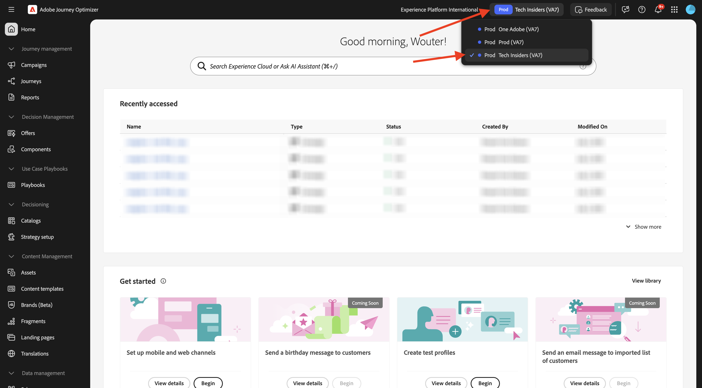
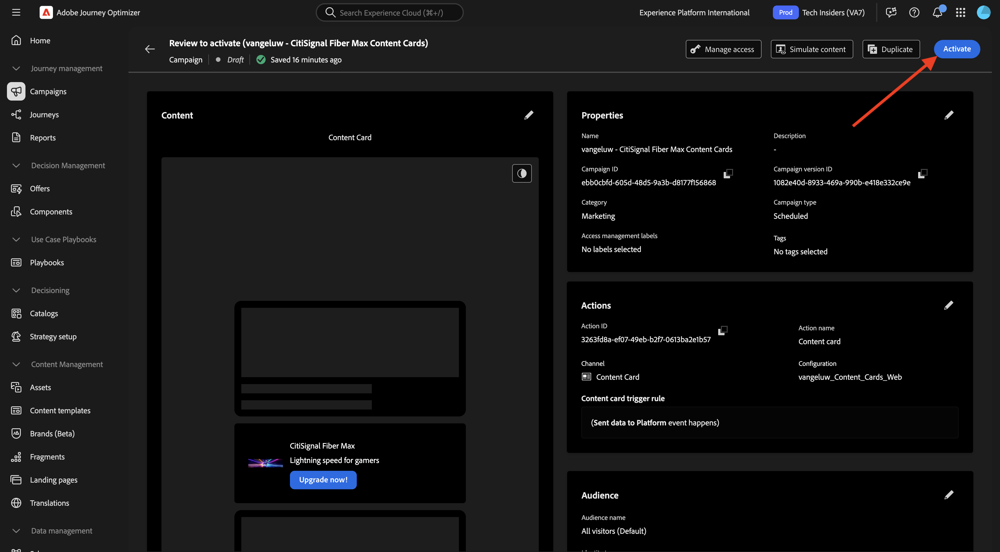

# 3.6.1 Tarjetas de contenido

Inicie sesión en Adobe Journey Optimizer en [Adobe Experience Cloud](https://experience.adobe.com). Haga clic en **Journey Optimizer**.


Se le redirigirá a la vista **Inicio** en Journey Optimizer. Primero, asegúrese de que está usando la zona protegida correcta. La zona protegida que se va a usar se llama `--aepSandboxName--`. Estará en la vista **Inicio** de su zona protegida `--aepSandboxName--`.



## Configuración de canal de tarjetas de contenido 3.6.1.1

En el menú de la izquierda, ve a **Canales** y luego selecciona **Configuraciones de canal**. Haga clic en **Crear configuración de canal**.


Escriba el nombre: `--aepUserLdap--_Content_Cards_Web`, seleccione el canal **Tarjetas de contenido** y, a continuación, habilite la plataforma **Web**.


Desplácese hacia abajo y asegúrese de que la opción **Una sola página** esté habilitada.

Escriba la dirección URL del sitio web creado anteriormente como parte del módulo **Introducción**, que tiene el siguiente aspecto: `https://dsn.adobe.com/web/--aepUserLdap---XXXX`. No olvides cambiar el **XXXX** por el código único de tu sitio web.

>[!IMPORTANT]
>
>La referencia anterior a la URL del sitio web de demostración de CitiSignal `https://dsn.adobe.com/web/--aepUserLdap---XXXX` debe cambiarse a la URL real. Para encontrar la dirección URL, ve a tu proyecto de sitio web en [https://dsn.adobe.com/](https://dsn.adobe.com/).

Establezca el campo **Ubicación en la página** en `CitiSignalContentCardContainer`.


Desplácese hacia arriba y haga clic en **Enviar**.


La configuración del canal ya está lista para utilizarse.


## 3.6.1.2 Configurar una campaña programada para las tarjetas de contenido

En el menú de la izquierda, ve a **Campañas** y luego haz clic en **Crear campaña**.


Seleccione **Programado - Marketing** y haga clic en **Crear**.


Escriba el nombre `--aepUserLdap-- - CitiSignal Fiber Max Content Cards` y haga clic en **Acciones**.


Haga clic en **+ Agregar acción** y luego seleccione **Tarjeta de contenido**.


Seleccione la configuración de canal de tarjetas de contenido que creó en el paso anterior, que se llama: `--aepUserLdap--_Content_Cards_Web`.

A continuación, haga clic en **Editar reglas**.


Haga clic en **X** para quitar la regla actual.


Haga clic en **+ Agregar condición**.


Seleccione la condición **Se enviaron los datos a la plataforma**. Haga clic en **Listo**


Entonces debería ver esto. Haga clic en **Editar contenido**.


Entonces debería ver esto.


Configure las siguientes opciones:

- **Título**: `CitiSignal Fiber Max`
- **Cuerpo**: `Lightning speed for gamers`
- **URL de destino**: `https://dsn.adobe.com/web/--aepUserLdap---XXXX/plans`

>[!IMPORTANT]
>
>La referencia anterior a la URL del sitio web de demostración de CitiSignal `https://dsn.adobe.com/web/--aepUserLdap---XXXX/plans` debe cambiarse a la URL real. Para encontrar la dirección URL, ve a tu proyecto de sitio web en [https://dsn.adobe.com/](https://dsn.adobe.com/).

Haga clic en el icono para cambiar la dirección URL seleccionando un recurso de los AEM Assets.


Vaya a la carpeta **citisignal-images** y seleccione el archivo **`neon_rabbit_banner.jpg`**. Haga clic en **Seleccionar**.


Entonces deberías tener esto. Haga clic en **+ botón Agregar**.


Configure las siguientes opciones para el botón:

- **Título de botón**: `Upgrade now!`
- **Evento de interacción**: `click`
- **Destino**: `https://dsn.adobe.com/web/--aepUserLdap---XXXX/plans`

>[!IMPORTANT]
>
>La referencia anterior a la URL del sitio web de demostración de CitiSignal `https://dsn.adobe.com/web/--aepUserLdap---XXXX/plans` debe cambiarse a la URL real. Para encontrar la dirección URL, ve a tu proyecto de sitio web en [https://dsn.adobe.com/](https://dsn.adobe.com/).

Haga clic en **Revisar para activar**.


Haga clic en **Activar**.



La campaña se activará, lo que puede tardar un par de minutos.


Después de un par de minutos, la campaña estará activa.


## 3.6.1.3 Actualizar el sitio web de DSN

Para mostrar la tarjeta de contenido en el sitio web, debe realizar un cambio en el diseño de la página principal del sitio web de demostración de CitiSignal.

Vaya a [https://dsn.adobe.com/](https://dsn.adobe.com/). Haz clic en los **3 puntos** de tu sitio web y haz clic en **Editar**.


Haga clic para seleccionar la página **Inicio**. Haga clic en **Editar contenido**.


Pase el ratón sobre la imagen a pantalla completa y haga clic en el botón **+**.


Vaya a **General**, seleccione **Banner** y haga clic en **Agregar**.


Haga clic en para seleccionar el titular recién creado. Vaya a **Estilo** e introduzca `CitiSignalContentCardContainer` en el campo **Clases CSS personalizadas**.


Ir a **Alineación**. Establezca el campo **Alignment** en `left` y establezca el campo **Vertical Alignment** en `middle`.

Haga clic en el icono **X** para cerrar la ventana de diálogo.


Se han realizado los cambios en el diseño del sitio web.

Si abre el sitio en una nueva ventana del explorador ahora, debería tener este aspecto. el área gris es el titular recién creado, pero aún no tiene ningún contenido.


Para asegurarse de que el contenido se carga dinámicamente en el banner recién creado, es necesario realizar un cambio en la propiedad Etiquetas de recopilación de datos.

## 3.6.1.4: actualizar la propiedad de etiquetas de recopilación de datos

Vaya a [https://experience.adobe.com/#/data-collection/](https://experience.adobe.com/#/data-collection/), a **Etiquetas**. Como parte del módulo [Introducción](./../../../../modules/getting-started/gettingstarted/ex1.md), se crearon las propiedades de Etiquetas de recopilación de datos.

Ya ha estado utilizando estas propiedades de etiquetas de recopilación de datos como parte de módulos anteriores.

Haga clic para abrir la propiedad Recopilación de datos para la web.


En el menú de la izquierda, ve a **Reglas** y haz clic para abrir la regla **Vista de página**.


Haga clic en la acción **Enviar evento de experiencia &quot;Vista de página&quot;**.


Como parte de la regla **Vista de página**, es necesario solicitar las instrucciones de personalización de Edge para una superficie específica. La superficie es el titular que configuró en el paso anterior. Para ello, desplácese hacia abajo hasta **Personalization** e introduzca `web://dsn.adobe.com/web/--aepUserLdap---XXXX#CitiSignalContentCardContainer` en **Superficies**.

>[!IMPORTANT]
>
>La referencia anterior a la URL del sitio web de demostración de CitiSignal `web://dsn.adobe.com/web/--aepUserLdap---XXXX#CitiSignalContentCardContainer` debe cambiarse a la URL real. Para encontrar la dirección URL, ve a tu proyecto de sitio web en [https://dsn.adobe.com/](https://dsn.adobe.com/).

Haga clic en **Conservar cambios**.


Haga clic en **Guardar** o en **Guardar en biblioteca**.


En el menú de la izquierda, ve a **Reglas** y haz clic en **Agregar regla**.


Escriba el nombre: `Display AJO Content Cards`. Haga clic en **+ Agregar** para agregar un nuevo evento.


Seleccione la **extensión**: **Adobe Experience Platform Web SDK** y, a continuación, seleccione **Tipo de evento**: **Suscribir elementos del conjunto de reglas**.

En **Esquemas**, seleccione **Tarjeta de contenido**.

En **Superficies**, escriba `web://dsn.adobe.com/web/--aepUserLdap---XXXX#CitiSignalContentCardContainer`

>[!IMPORTANT]
>
>La referencia anterior a la URL del sitio web de demostración de CitiSignal `web://dsn.adobe.com/web/--aepUserLdap---XXXX#CitiSignalContentCardContainer` debe cambiarse a la URL real. Para encontrar la dirección URL, ve a tu proyecto de sitio web en [https://dsn.adobe.com/](https://dsn.adobe.com/).

Haga clic en **Conservar cambios**.


Entonces debería ver esto. Haga clic en **+ Agregar** para agregar una acción nueva.


Seleccione la **extensión**: **Core** y seleccione el **Tipo de acción**: **Código personalizado**.

Habilite la casilla de verificación para **Idioma**: **JavaScript** y luego haga clic en **Abrir editor**.


A continuación, debería ver una ventana de editor vacía.


Pegue el siguiente código en el editor y haga clic en **Guardar**.

```javascript
if (!Array.isArray(event.propositions)) {
  console.log("No personalization content");
  return;
}

console.log(">>> Content Card response from Edge: ", event.propositions);

event.propositions.forEach(function (payload) {
  payload.items.forEach(function (item) {
    if (!item.data || !item.data.content || item.data.content === "undefined") {
      return;
    }
    console.log(">>> Content Card response from Edge: ", item);
    const { content } = item.data;
    const { title, body, image, buttons } = content;
    const titleValue = title.content;
    const description = body.content;
    const imageUrl = image.url;
    const buttonLabel = buttons[0]?.text.content;
    const buttonLink = buttons[0]?.actionUrl;
    const html = `<div  class="Banner Banner--alignment-left Banner--verticalAlignment-left hero-banner ContentCardContainer"  oxygen-component-id="cmp-0"  oxygen-component="Banner"  role="presentation"  style="color: rgb(255, 255, 255); height: 60%;">  <div class="Image" role="presentation">      </div>  <div class="Banner__content">    <div class="Title Title--alignment-left Title--textAlignment-left">      <div class="Title__content" role="presentation">        <strong class="Title__pretitle">${titleValue}</strong>        <h2>${description}</h2>      </div>    </div>    <div class="Button Button--alignment-left Button--variant-cta">              <button          class="Dniwja_spectrum-Button Dniwja_spectrum-BaseButton Dniwja_i18nFontFamily Dniwja_spectrum-FocusRing Dniwja_spectrum-FocusRing-ring"          type="button"          data-variant="accent"          data-style="fill"          onclick="window.open('${buttonLink}')"       style="color:#FFFFFF;padding: 12px 28px;font-size: 24px;font-family: adobe-clean;font-weight: bolder;" >          <span            id="react-aria5848951631-49"            class="Dniwja_spectrum-Button-label"            >${buttonLabel}</span          >        </button>            </div>  </div></div>`;
    if (document.querySelector(".CitiSignalContentCardContainer")) {
      const contentCardContainer = document.querySelector(
        ".CitiSignalContentCardContainer"
      );
      contentCardContainer.innerHTML = html;
      contentCardContainer.style.height = "60%";
    }
  });
});
```


Haga clic en **Conservar cambios**.


Haga clic en **Guardar** o en **Guardar en biblioteca**.


En el menú de la izquierda, ve a **Flujo de publicación** y haz clic para abrir la biblioteca **Principal**.


Haga clic en **Agregar todos los recursos modificados** y, a continuación, haga clic en **Guardar y generar en desarrollo**.


## 3.6.1.5 Probar la tarjeta de contenido en el sitio web

Vaya a [https://dsn.adobe.com](https://dsn.adobe.com). Después de iniciar sesión con su Adobe ID, verá esto. Haga clic en los 3 puntos **...** del proyecto del sitio web y, a continuación, haga clic en **Ejecutar** para abrirlo.


A continuación, verá cómo se abre el sitio web de demostración. Seleccione la URL y cópiela en el portapapeles.


Abra una nueva ventana del explorador de incógnito.


Pegue la dirección URL del sitio web de demostración, que copió en el paso anterior. Luego se le pedirá que inicie sesión con su Adobe ID.


Seleccione el tipo de cuenta y complete el proceso de inicio de sesión.


Ahora debería ver el sitio web de CitiSignal que se está cargando, y la tarjeta de contenido que configuró debería mostrarse en lugar del área gris vacía que tenía antes.


## Pasos siguientes

Ir a [3.6.2 páginas de aterrizaje](./ex2.md)

Volver a [Adobe Journey Optimizer: administración de contenido](./ajocontent.md){target="_blank"}

Volver a [Todos los módulos](./../../../../overview.md){target="_blank"}
