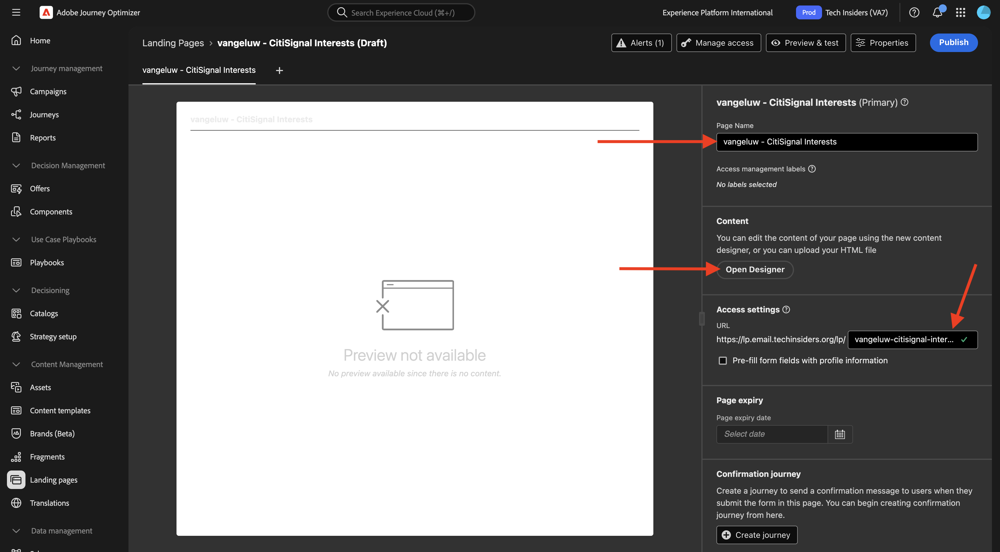
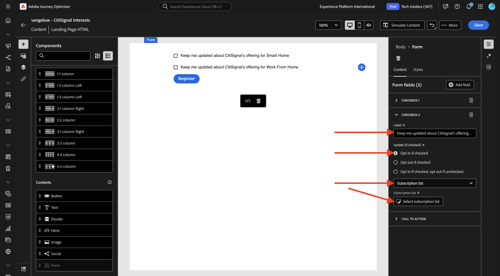
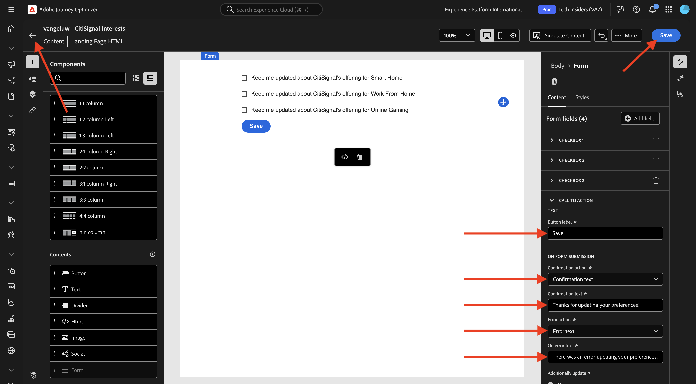
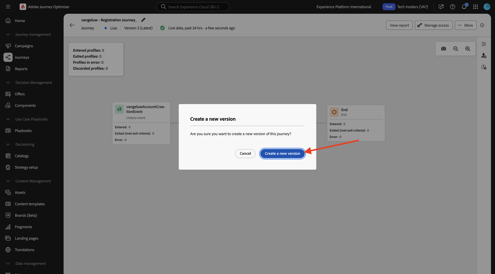
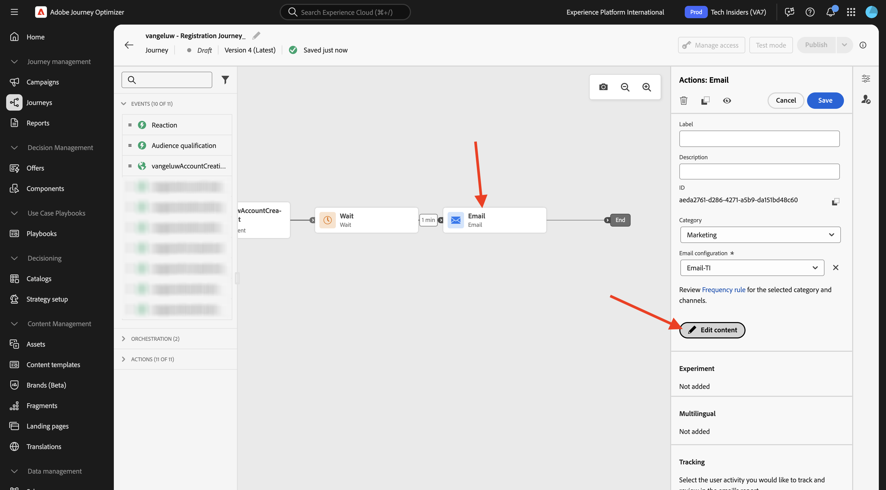
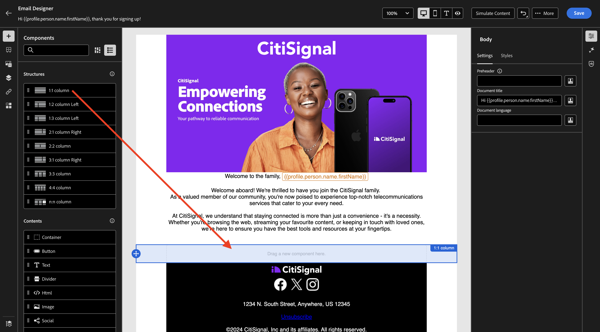
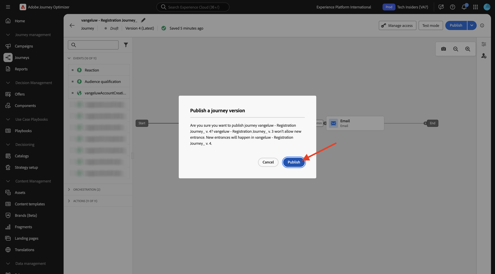
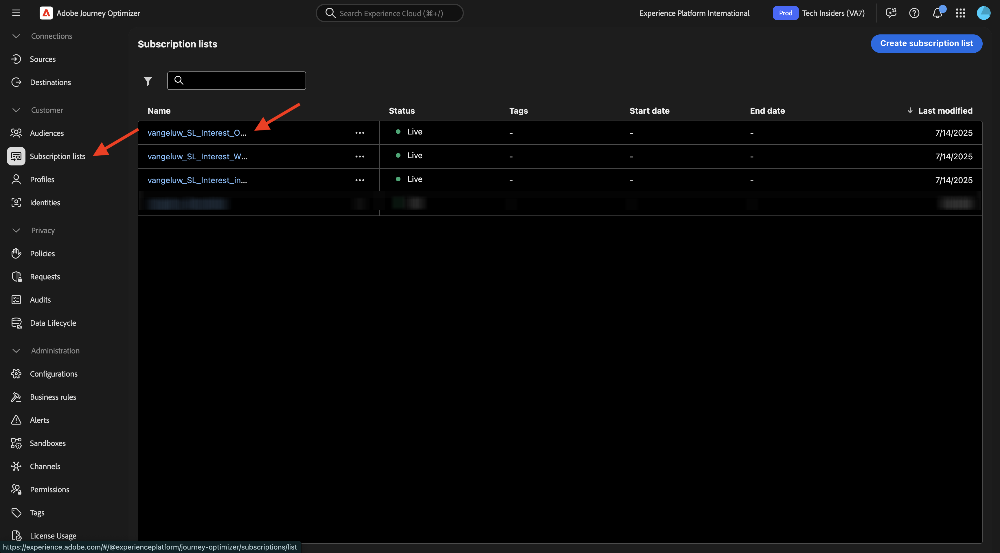

# 3.6.2 Páginas de destino

Inicie sesión en Adobe Journey Optimizer en [Adobe Experience Cloud](https://experience.adobe.com). Haga clic en **Journey Optimizer**.

Se le redirigirá a la vista **Inicio** en Journey Optimizer. Primero, asegúrese de que está usando la zona protegida correcta. La zona protegida que se va a usar se llama `--aepSandboxName--`. Estará en la vista **Inicio** de su zona protegida `--aepSandboxName--`.

## 3.6.2.1 listas de suscripción

Las páginas de aterrizaje de Adobe Journey Optimizer funcionan junto con **Listas de suscripción**. Para configurar páginas de aterrizaje, primero debe configurar **Listas de suscripción**.

CitiSignal desea preguntar a sus clientes acerca de su interés en los siguientes dominios:

- Inicio inteligente
- Trabajar desde inicio
- Juegos en línea

Una vez que un cliente ha indicado su interés en cualquiera de estos dominios, ese cliente debe añadirse a una lista específica para que pueda segmentarse con contenido específico posteriormente como parte de próximas campañas.

Ahora creará 3 listas de suscripción.

En el menú de la izquierda, ve a **Listas de suscripción**. Haga clic en **Crear lista de suscripción**.

Para **Title**, use: `--aepUserLdap--_SL_Interest_in_Smart_Home`.
Para **Descripción**, use: `Interest in Smart Home`.

Haga clic en **Enviar**.

Haga clic en **Crear lista de suscripción** para crear otra lista.

Para **Title**, use: `--aepUserLdap--_SL_Interest_WFH`.
Para **Descripción**, use: `Interest in Work From Home`.

Haga clic en **Enviar**.

Haga clic en **Crear lista de suscripción** para crear otra lista.

Para **Title**, use: `--aepUserLdap--_SL_Interest_Online_Gaming`.
Para **Descripción**, use: `Interest in Online Gaming`.

Haga clic en **Enviar**.

Ahora ha creado las 3 listas que necesita.

## 3.6.2.2 ajuste preestablecido de página de aterrizaje

Para utilizar páginas de aterrizaje en Adobe Journey Optimizer, se debe crear un ajuste preestablecido.

En el menú de la izquierda, ve a **Administración** > **Canales** y luego selecciona **Ajustes preestablecidos de página de aterrizaje**.

Haga clic en **Crear ajuste preestablecido de página de aterrizaje**.

Para el campo **Nombre**, use: `--aepUserLdap-- - CitiSignal LP` y seleccione el subdominio que está disponible en su instancia.

>[!NOTE]
>
>Si no ve un subdominio en su instancia, póngase en contacto con el administrador de AJO para añadir uno.

Haga clic en **Enviar**.

Se ha creado el ajuste preestablecido de la página de aterrizaje.

## 3.6.2.3 página de aterrizaje

Ahora puede crear su página de aterrizaje. En el menú de la izquierda, ve a **Administración de contenido** > **Páginas de destino**.

Haga clic en **Crear página de aterrizaje**.

Para el campo **Título**, use: `vangeluw - CitiSignal Interests`. A continuación, seleccione el **ajuste preestablecido de página de aterrizaje** que configuró en el paso anterior.

Haga clic en **Crear**.

Entonces debería ver esto.

Cambie el campo **Nombre de página** por `--aepUserLdap-- - CitiSignal Interests`.

Escriba este nombre personalizado en **Configuración de acceso**: `--aepUserLdap---citisignal-interests`.

Haga clic en **Abrir Designer**.

Seleccione **Diseño desde cero**.

Entonces debería ver esto.

Agregue un componente de estructura **1:1 column** al lienzo.

Agregue un componente de contenido **Form** al lienzo.

Actualice el campo **Label** para **Checkbox 1** a `Keep me updated about CitiSignal's offering for Smart Home`.

Asegúrese de que la casilla de verificación **Adhesión si está marcada** esté habilitada y que **Lista de suscripción** esté seleccionada.

A continuación, haga clic en **Seleccionar lista de suscripción**.

A continuación, seleccione la lista `--aepUserLdap--_SL_Interest_in_Smart_Home` y haga clic en **Seleccionar**.

Haga clic en **+ Agregar campo** y luego seleccione **Casilla de verificación**.

Entonces debería ver esto.

Actualice el campo **Label** para **Checkbox 2** a `Keep me updated about CitiSignal's offering for Work From Home`.

Asegúrese de que la casilla de verificación **Adhesión si está marcada** esté habilitada y que **Lista de suscripción** esté seleccionada.

A continuación, haga clic en **Seleccionar lista de suscripción**.

A continuación, seleccione la lista `--aepUserLdap--_SL_Interest_WFH` y haga clic en **Seleccionar**.

Haga clic en **+ Agregar campo** y luego seleccione **Casilla de verificación**.

Entonces debería ver esto.

Actualice el campo **Label** para **Checkbox 3** a `Keep me updated about CitiSignal's offering for Online Gaming`.

Asegúrese de que la casilla de verificación **Adhesión si está marcada** esté habilitada y que **Lista de suscripción** esté seleccionada.

A continuación, haga clic en **Seleccionar lista de suscripción**.

A continuación, seleccione la lista `--aepUserLdap--_SL_Interest_Online_Gaming` y haga clic en **Seleccionar**.

Entonces debería ver esto.

Vaya al campo de formulario **CALL TO ACTION**.

Actualice los campos siguientes:

- **Texto** - Etiqueta de botón: `Save`.
- **Acción de confirmación**: seleccione **Texto de confirmación**.
- **Texto de confirmación**: uso: `Thanks for updating your preferences!`
- **Acción de error**: seleccione **Texto de error**.
- **En texto de error**: use: `There was an error updating your preferences.`

Haga clic en **Guardar** y, a continuación, haga clic en la flecha de la esquina superior izquierda para volver a la pantalla anterior.

Haga clic en **Publicar**.

Vuelva a hacer clic en **Publicar**.

La página de aterrizaje ahora se ha publicado y se puede utilizar en un mensaje de correo electrónico.

## 3.6.2.4 Incluir página de aterrizaje en el correo electrónico

En el ejercicio 3.1 creó un recorrido denominado `--aepUserLdap-- - Registration Journey`.

Ahora debe actualizar el mensaje de correo electrónico en ese recorrido para incluir el vínculo a la página de aterrizaje.

En el menú de la izquierda, vaya a **Recorridos** y haga clic para abrir el recorrido `--aepUserLdap-- - Registration Journey`.

Haga clic en **Más...** y, a continuación, seleccione **Crear una nueva versión**.

Haga clic en **Crear una nueva versión**.

Haga clic para seleccionar la acción **Correo electrónico** y, a continuación, seleccione **Editar contenido**.

Haga clic en **Editar cuerpo del correo electrónico**.

Entonces deberías ver algo como esto. Agregue un nuevo componente de estructura **1:1 column** al lienzo.

Agregue un nuevo componente de contenido **Texto** en el componente de estructura recién creado.

Pegue el siguiente texto en el componente de contenido **Text**.

`Would you like to hear from us about Smart Home news? Do you work from home and would you like to hear our tips? Or are you an avid online gamer and do you want to receive our game reviews? Click here to update your preferences and interests!`

Defina un estilo para el texto y seleccione la palabra `here`. Haga clic en el icono **vínculo**.

Establezca el **Tipo** del vínculo en **Página de aterrizaje** y establezca el campo **Destino** en **En blanco**.

Haga clic en el icono **editar** para seleccionar la página de aterrizaje que desea vincular.

Seleccione la página de aterrizaje `--aepUserLdap-- - CitiSignal Interests`. Haga clic en **Seleccionar**.

Entonces debería ver esto. Haga clic en **Guardar**.

Haga clic en la flecha de la esquina superior izquierda para volver a la pantalla anterior.

Haga clic en la flecha de la esquina superior izquierda para volver a la pantalla anterior.

Haga clic en **Guardar**.

Haga clic en **Publicar**.

Vuelva a hacer clic en **Publicar**.

Los cambios se han publicado y puede probar el recorrido.

## 3.6.2.5: probar el recorrido y la página de aterrizaje

Vaya a [https://dsn.adobe.com](https://dsn.adobe.com). Después de iniciar sesión con su Adobe ID, verá esto. Haga clic en los 3 puntos **...** del proyecto del sitio web y, a continuación, haga clic en **Ejecutar** para abrirlo.

A continuación, verá cómo se abre el sitio web de demostración. Seleccione la URL y cópiela en el portapapeles.

Abra una nueva ventana del explorador de incógnito.

Pegue la dirección URL del sitio web de demostración, que copió en el paso anterior. Luego se le pedirá que inicie sesión con su Adobe ID.

Seleccione el tipo de cuenta y complete el proceso de inicio de sesión.

Luego verá el sitio web cargado en una ventana de incógnito del explorador. Para cada ejercicio, deberá utilizar una ventana nueva del explorador de incógnito para cargar la URL del sitio web de demostración. Ir a **Iniciar sesión**

Haga clic en **CREAR UNA CUENTA**. Complete sus datos y haga clic en **Registrarse**.

Ahora se le redirigirá a la página principal. Abra el panel Visualizador de perfiles y vaya a Perfil del cliente en tiempo real. En el panel Visor de perfiles, debería ver todos los datos personales que se muestran, como los identificadores de correo electrónico y teléfono que acaba de agregar.

1 minuto después de crear la cuenta, Adobe Journey Optimizer le enviará un correo electrónico para crearla.

Haga clic en el vínculo del correo electrónico para actualizar las preferencias.

A continuación, debería ver el formulario que ha creado. Habilite algunas casillas y haga clic en **Guardar**.

A continuación, debería ver un mensaje de confirmación.

## Informes de lista de suscripción de 3.6.2.6

Para ver los informes disponibles en las listas de suscripción, vaya a **Listas de suscripción** en el menú de la izquierda y haga clic para abrir una de las listas de suscripción configuradas anteriormente.

Haga clic en **Informe**.

A continuación, debería ver la descripción general de la lista, con la cantidad de personas que se han suscrito o dado de baja de la misma.

## Pasos siguientes

Ir a [3.6.3 AJO y GenStudio for Performance Marketing](./ex3.md)

Volver a [Adobe Journey Optimizer: administración de contenido](./ajocontent.md){target="_blank"}

Volver a [Todos los módulos](./../../../../overview.md){target="_blank"}
